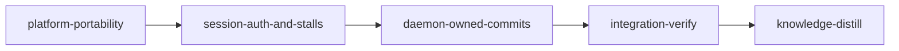

# Plan: Fix the six open GitHub issues (#19 to #24)

## Overview

Six issues are open on `cosmix/loom`, all filed on 2026-10-05 and 2026-10-06 against loom 1.1.1
(`ff3fe947`) on macOS 27. Each was investigated against the tree at `ff3fe947` by its own Opus
agent; the reports are summarised under "Root causes". Five break a first run on macOS outright.
The sixth (#22) blocks every operator who requires signed commits, on Linux too.

| Issue | Symptom | Root cause at `ff3fe947` | Stage |
| --- | --- | --- | --- |
| #21 | `loom run` prints its banner; the daemon never comes up | Daemon is a double `fork()` of a process that has already run threads (`run_bounded` reader threads); the grandchild touches CoreFoundation (reqwest's system-proxy lookup in the quota poller) and objc aborts it. The success byte is sent before the crash, so `loom run` exits 0 | `platform-portability` |
| #23 | Completion ends `verified_pending_ack` / `daemon_transport` | Every client joins `orchestrator.sock` onto the worktree's `.loom/work` symlink spelling; past 103 bytes (107 on Linux) the connect fails `InvalidInput` before the syscall, which is classified as a hard error, not "unreachable". The completion broker has its own copy of the connect | `platform-portability` |
| #24 | No review round is ever recorded; `loom subagents watch` exits 1 | BSD `wc -c` left-pads, and five hook sites test the raw value against `^[0-9]+$`; the same bug blocks every codex forward on macOS. Separately, the sandbox's `sysctl-read` allowlist has no `kern.bootsessionuuid` | `platform-portability` |
| #19 | Stage sessions start "Not logged in" | `USER`/`LOGNAME` are stripped twice: by `STAGE_HOST_ENV_ALLOWLIST` (native spawner and every tmux server) and by the wrapper's `env -i` list. The claude CLI finds its Keychain login by `$USER`. Loom's own Keychain probe runs in the daemon's environment, so it passes | `session-auth-and-stalls` |
| #20 | A stalled stage stays `executing` for hours with only a log line | Stall-recovery exhaustion `eprintln!`s and leaves the stage `Executing` with its agent alive, and the escalated latch then suppresses every later event. `stall_recoveries` is never reset. A session that never heartbeats is never reported | `session-auth-and-stalls` |
| #22 | A signed-commit operator commits every stage by hand | `~/.gnupg` is a mandatory read denial in every session sandbox (Linux too), and the session is the only party told to commit. Loom's own merge commits are unsigned even with `commit.gpgsign=true` (`commit-tree` without `-S`) | `daemon-owned-commits` |

An outside contributor's PR #25 (five commits on `ff3fe947`, open against `main`) fixes parts
of #19, #20, #21, #23 and #24. The operator chose to finish the work on that branch: loom runs this
plan on `fix/macos-review-round-recording`, and pushing the merged result updates PR #25 (no new
PR). "PR #25" below records its review and what each stage keeps, replaces or deletes.

## Goals and non-goals

- Every issue is fixed at its root cause, with a test that fails at `ff3fe947` and a
  behavioural contract wherever a public surface carries the behaviour.
- Every stage starts from PR #25's tree. Its kept work is not redone, and each PR change this
  plan replaces is deleted, never left beside its replacement.
- Signed commits: every stage session commits through a relayed `loom stage commit`; the daemon
  makes the commit outside the sandbox with the operator's git configuration, so a signing
  operator's commits are signed, and loom's merge commits are signed as well. The `~/.gnupg`
  read denial stays.
- macOS behaviour (BSD `wc`, `stat`, `date`) is exercised on Linux CI through a shim directory;
  the hook test suite joins CI in both modes.
- Non-goals: no macOS CI runner (the operator chose Linux plus shims); no forwarding of proxy,
  CA or `CLAUDE_CONFIG_DIR` variables to sessions (recorded as a concern by knowledge-distill);
  no "next loom command" banner (the existing desktop notification plus `loom status` cover
  it); `(stale)` keeps its fixed 300 s threshold. No backwards compatibility or migration code
  (the project is unreleased).

## Decisions this plan settles

The operator settled 1, 9, 10 and 11 when asked, and on 2026-10-06, after PR #25, kept 4 and 12
over the PR's alternatives. The rest follow the investigators' recommendations. YAML is
authoritative where it and the prose differ.

1. **#22: one commit path.** Every stage, knowledge and merge session commits with
   `loom stage commit <stage-id> -m "<message>"` and then waits with
   `loom request status <id> --wait 90`, in its own Bash call (90 s stays under the Bash tool's
   default 120 s timeout). No session runs `git commit`. Completing a stage does
   not commit on the session's behalf: completion evidence binds HEAD, and merge sessions never
   complete.
   - **Commit before complete.** The commit is applied asynchronously, so a session that runs
     `loom stage complete` before its commit applied would bind the old HEAD, and C2 would then
     refuse the late commit because the stage is no longer `Executing`. The daemon's completion
     handler (`verify_evidence_bindings` in `loom/src/daemon/server/completion_evidence.rs`)
     therefore refuses while the stage worktree's index differs from HEAD:
     `staged changes are not committed: run loom stage commit and wait for it with loom request status <id> --wait 90`.
   - **Merge resolvers never commit through git.** They merge with
     `git merge --no-commit --no-ff <target>`, and never run `git merge --continue` or a bare
     `git merge <target>`, because both commit inside the sandbox. The `git commit` block in
     `commit-filter.sh` does not see either command, so every merge surface states the rule:
     `signals/merge.rs` (task text and failure section) and the `Landing::Conflict` text in
     `inbox_drain/merge_resolved.rs`.
2. **#22: the daemon commits with plumbing only.** It never reads the worktree and never runs
   repository hooks on the host. It runs `commit-tree` (with `-S` when
   `git config --type=bool commit.gpgsign` is true) and then a compare-and-swap `update-ref`.
   It refuses:
   - a HEAD other than the one the session saw, or a tree other than the one it wrote;
   - a staged path under `.loom/`, `.work/` or `.worktrees/`, or a gitlink;
   - the wrong branch;
   - a non-owner session, or a session kind the matrix refuses;
   - a `MERGE_HEAD` from anything but a merge session.

   The session runs `pre-commit` and `commit-msg` itself, inside its sandbox, with
   `git hook run`, then `git write-tree`. Staged paths are not checked against the stage's
   `files:`. Conventional Commit types stay doctrine.

   Three further rules:
   - **The daemon validates the message too.** A session can write a relay ticket without going
     through the CLI (`loom/src/relay/emit.rs`). So `commit_staged` calls the same pinned
     `loom::git::stage_commit::validate_commit_message`: non-empty, at most 16 KiB, no NUL, no AI
     attribution. U1 calls it as well and keeps no copy of its own.
   - **The state-path check ignores ASCII case.** `.LOOM/work/x` is refused like `.loom/work/x`,
     as `is_control_path` (`loom/src/git/merge/control_paths.rs`) already does, because a
     case-insensitive filesystem resolves both names to one directory.
   - **The Merge scope allows the target's own gitlinks and state paths.** It refuses a gitlink or
     state path only when the new tree's entry differs from both HEAD's tree and MERGE_HEAD's
     tree, so a submodule bump made on the target still merges.
3. **#22: a signing failure stops the stage where the operator can fix it.** Signing runs with a
   30 s bound. Every failure leaves the ref unmoved. What happens next depends on the commit:
   - **A Stage-scope or Knowledge-scope relayed commit.** The request is refused with
     `signing failed: <stderr tail>`. The stage is blocked through `handle_block_stage`, the
     transition the inbox drain applies for a relayed block
     (`loom/src/orchestrator/core/inbox_drain/apply.rs`), with the remedy and `loom stage retry`.
     `handle_block_stage` reports a refused transition as `Ok(Response::Error { .. })` as well as
     `Err` (`loom/src/daemon/server/control_block.rs`). Either one means the block failed, and the
     settle reason then says so instead of claiming a block. `park_refused_relay` is not used: it
     skips every stage with a contract freeze.
   - **A Merge-scope relayed commit**, from a merge session. No block is attempted:
     - `MergeBlocked -> Blocked` is not a legal edge (`loom/src/models/stage/transitions.rs`).
     - Blocking a `MergeConflict` stage is legal, but block retirement leaves a merge resolver
       alive (`verdict_retirement_tests.rs`), so the resolver would keep writing.
     - `loom stage retry` would re-run the whole stage rather than the merge.

     Instead the handler holds the merge for the operator through a new `InboxHost` method,
     `hold_merge_for_signing(stage_id, detail) -> String`. The `Orchestrator` implements it with
     C4's `hold_merge_for_signing` in `merge_handler/landing.rs`, which reuses the gate-hold
     machinery of `gate_holds_merge_stage`. `stop_gated_resolvers` kills the resolver and retires it
     only on proof of death (`merge_writer_retirement_unproven`). Its note describes the in-progress
     merge left in the worktree (`in_progress_merge_note`) and the manual merge steps. Then
     `route_merge_stage_to_review` moves the stage to `NeedsHumanReview` with the remedy: fix
     signing, then `loom stage human-review <id> --approve`. The request settles `Refused` with the
     signer text and the hold's outcome. The spawn loop considers only
     `MergeConflict`/`MergeBlocked`, so no further resolver starts and no resolver-spawn loop
     follows.
   - **Loom's own merge commit** (`commit_merge`). It is reached two ways, and both route a
     `CommitTreeError { signing: true }` anywhere in the error chain to `NeedsHumanReview` with the
     remedy, so no resolver is spawned and nothing is retried every tick. The operator fixes signing
     and approves:
     - **The landing** (`land_stage_merge`, reached from the clean-merge settle, the blocked retry
       and the resolver exit). It calls `route_to_human_review` and returns `Landing::Held`.
     - **The first auto-merge** (`attempt_auto_merge`, then the `Err` arm of
       `apply_auto_merge_outcome` in `merge_handler/auto_merge_outcome.rs`). Today that arm
       records `MergeBlocked` with an `InfrastructureError` (`persist_merge_blocked`), and the next
       spawn pass lands the merge again, which is a second signing attempt. With this plan it calls
       `route_to_human_review` instead. Every other error keeps `persist_merge_blocked`.
   - **The daemon's plan-completion commit** (`loom/src/fs/plan_lifecycle/commit.rs`). It runs
     through `run_git_with_env_within` with `SigningEnv::env_pairs()` and `SIGN_TIMEOUT`, because
     Decision 9 removes `GNUPGHOME` and `SSH_AUTH_SOCK` from the daemon's own environment.

   **The probe.** `loom run` refuses to start when `commit.gpgsign` is true and a probe signature
   fails. The probe signs an empty-tree `commit-tree -S`, and it runs twice:
   1. In the operator's environment, from the operator's terminal. `GPG_TTY` is set from
      `ttyname(stdin)` when stdin is a terminal and `GPG_TTY` is unset, so a terminal pinentry can
      prompt and the agent caches the passphrase.
   2. Under the daemon's exact environment: `env_clear()`, the daemon allowlist pairs
      (`daemon_environment_pairs()`), and the captured `SigningEnv`. It refuses when this run reads
      a different `commit.gpgsign` or fails to sign.

   `XDG_CONFIG_HOME` and `GIT_CONFIG_GLOBAL` join the daemon allowlist. They are locations, not
   credentials, and without them the daemon can read a different global git config than the
   operator. With `gpg.format` openpgp, a passing probe prints the gpg-agent cache caveat:
   `default-cache-ttl` is 600 s and `max-cache-ttl` 7200 s by default, so raise both or sign with
   an ssh-agent key.

   **Tick cost (accepted).** The inbox drain runs on the orchestrator tick thread
   (`orchestrator/core/run.rs`). One commit can hold the tick for up to 30 s of signing, plus up to
   10 s on the merge lock for a Knowledge scope. That is the same class of cost as the synchronous
   merges already on that thread (120 s bound). Integration-verify's architecture review checks
   the worst case.
4. **#21: the daemon is re-executed, never forked.** `loom run` spawns
   `current_exe() run --daemon-child <absolute work root>`, a hidden flag:
   - the process gets an allowlisted environment, null stdin, and stdout plus stderr on one
     pipe; it calls `setsid` itself;
   - the parent reads `0x01` as "ready" and `0x02` as "output now goes to orchestrator.log";
     any other bytes are diagnostics;
   - the deadline is 10 s and the post-ready grace is 1 s;
   - on the deadline, the parent sends SIGTERM and reaps the child;
   - once `try_wait` reports an exit, the parent reads the pipe to EOF before it builds the
     error, so text written just before the exit is kept; it keeps at most the last 64 KiB of
     diagnostic text;
   - failure exits 1, naming the child's exit status or signal and its captured text, plus the
     log tail once `0x02` was seen.

   The fork path is deleted on every platform. `RUST_LOG`, `SCCACHE_DIR`, `SCCACHE_CACHE_SIZE`,
   `LOOM_SCCACHE`, `RUSTC_WRAPPER` and `LOOM_HOME` join the daemon allowlist. The daemon reads
   the last three (`build_cache.rs`, `user_config/mod.rs`), and today they are silently dropped.
   PR #25's `commands/run/objc_fork_safety.rs` is deleted with the fork. It re-executes every
   macOS `loom run` with `OBJC_DISABLE_INITIALIZE_FORK_SAFETY=YES`, which only silences objc's
   abort in the forked grandchild. The fork after threads stays, and so does the ready byte
   written before the grandchild can die.
5. **#23: every client dials the resolved state root.** New `loom/src/daemon/socket.rs` holds:
   - `SOCKET_FILE`, `SUN_PATH_MAX = 104` (portable), `socket_path_fits`;
   - `socket_path(work_dir)`, which canonicalizes `work_dir` and falls back to the spelling it
     was given;
   - `socket_path_problem(work_dir)`.

   A path past the limit classifies as `DaemonReach::Unreachable`; other `InvalidInput` errors
   stay errors. The completion broker uses `crate::daemon::send_request`; its private connect
   is deleted. Completion is never spooled.
   - PR #25 already resolves the work dir in a `pub(crate)` `socket_path` in `rpc.rs`, with the
     semantics above, and the completion broker's connect calls it. W2 moves that function into
     `socket.rs`. It also replaces the PR's arm that maps every `InvalidInput` connect error to
     `Unreachable` with a `socket_path_fits` check before the connect.
   - `loom run` refuses a work root whose socket path does not fit, in `prepare_background_run`,
     immediately after `work_dir.load()?` and before `mark_plan_in_progress`. A refusal therefore
     never leaves the plan marked in progress. `loom run --foreground` binds no socket and is not
     refused.
   - `loom init` warns about it from `create_or_adopt_work_dir` (`commands/init/execute.rs`),
     after the directory exists, so the ledgered `execute` (110 lines) does not grow.
6. **#24: portable shell helpers live in `loom-hooks/_lifecycle.sh`.**
   - PR #25 strips whitespace inline at the five `wc -c` sites (`| tr -d "[:space:]"`). That
     form stays, and any other padded-`wc` site uses it (never `$(( ))`).
   - `loom_lifecycle_sha256` uses `sha256sum`, else `shasum -a 256`. Every bare `sha256sum`
     goes through it.
   - The BSD epoch fallback accepts fractional seconds.
   - A skipped `loom-code-reviewer` stop writes one row to
     `.loom/work/subagents/<stage>/stop-skips.jsonl` (replacing PR #25's free-text
     `hook-skips.log`), schema
     `{"ts":"<UTC>","agent_id":"<id>","agent_type":"loom-code-reviewer","reason":"<code>"}` (W3
     writes it, W4 reads it). `loom stage review status` and the review
     gate's failure message print "N reviewer spawns, M rounds, K stop events not harvested"
     with the recorded reasons.
   - The BSD shims cover every BSD form the hook scripts and their tests use: `stat -f '%Lp'`
     (mode) besides `%d %i %u %z %m`, `date [-u] -r EPOCH +FMT`, and `date -j [-u] -f FMT VALUE
     +OUTFMT`, with `-u` accepted anywhere among the options.
7. **#24: boot ID from the session environment.** The daemon computes the boot ID when it
   writes a session wrapper and exports it as `LOOM_BOOT_ID`. `loom::process::boot_id` resolves
   a UUID-shaped `LOOM_BOOT_ID` first, then the OS source (`/proc/sys/kernel/random/boot_id`,
   `sysctl kern.bootsessionuuid`). PR #25's `kern.boottime` fallback in `lease.rs` is deleted:
   macOS recomputes `kern.boottime` when the wall clock is stepped, and a lease written under one
   source and read under the other looks like another boot.
8. **#19: `USER` and `LOGNAME` reach the agent at both layers.**
   - PR #25 added both names to the wrapper's literal list only. `apply_stage_environment`
     still clears them in `spawn_in_terminal` and the tmux server commands before the wrapper
     runs, so on those paths the wrapper finds both unset.
   - One constant, `AGENT_SESSION_ENV_NAMES`, generates the wrapper's forwarding list.
   - `USER` and `LOGNAME` join `STAGE_HOST_ENV_ALLOWLIST`.
   - New `loom/src/claude/auth.rs` runs `claude auth status --json` under exactly the
     environment a stage gets. `loom run` refuses a definite `NotLoggedIn` and warns on
     `Unknown`.
   - Remote Control eligibility uses the same probe. The Keychain and credentials-file
     heuristics are deleted.
9. **Signing environment (operator).** `GNUPGHOME` and `SSH_AUTH_SOCK` reach the orchestrating
   process only to be captured into a private `SigningEnv`, before any thread exists, and are then
   removed from its process environment. They are passed only to the signing git invocation and
   never reach a session or an ordinary git call. Both orchestrating entries do this through one
   function, `crate::git::signing::take_from_process()` (capture, `install`, remove both):
   - the daemon child, as the first statement of `daemon_child::execute`;
   - `loom run --foreground`, as the first statement of `foreground::execute`
     (`commands/run/foreground.rs`), because that process runs the orchestrator itself.
     `main.rs` spawns no thread before dispatch.

   The startup probe runs after the foreground capture, so it adds the signing variables back on
   its own `Command`s from `signing::current()`: the installed `SigningEnv` when
   `take_from_process` ran, otherwise `SigningEnv::capture_from_process()`. That gives the same
   result in both modes.
10. **CI (operator).** `loom-hooks/tests/run-all.sh` runs in the `hook-syntax` CI job twice:
    plain, and with `LOOM_HOOK_TEST_BSD=1`, which puts `loom-hooks/tests/bsd-shims/` (padded
    `wc`, BSD `stat`, BSD `date`) first on PATH. No macOS runner.
11. **Lanes (operator).** `platform-portability` and `daemon-owned-commits` list
    `["claude", "codex"]`; `session-auth-and-stalls` lists `["claude"]`.
12. **#20: stalls park in `NeedsHumanReview`.**
    - **Exhausted stall recovery.** Takes the agents down, writes the stall handoff, and parks
      the stage. The reason names the session, the silence, the budget, the last activity, the
      recovery count and the last pane line, then a blank line, `Last pane lines:` and the pane
      tail (`review_notes`, the web view's field, is derived from `review_reason`). The existing
      transition announcement sends the desktop notification (`loom/src/orchestrator/notify.rs`).
    - **A session that never worked.** That is, a stage session with no tool heartbeat since
      SessionStart and no context tokens recorded (SessionStart also fires on compaction and
      resume, so `context_tokens == 0` guards a session that compacted), or with no heartbeat at
      all past `created_at` plus its budget. It escalates at 1x its budget,
      captures its pane tail, runs the auth probe, and parks:
      - with the login remedy when the probe says `NotLoggedIn`;
      - with the never-worked reason otherwise.

      Neither charges `stall_recoveries` or re-queues. Never-worked covers `SessionType::Stage`
      sessions only. Contract, Knowledge, Merge, BaseConflict and Adjudication sessions keep
      today's handling.
    - **The park's log line.** `force_status_with_reason` logs its `reason` at ERROR level
      (`models/stage/methods.rs`), so the park passes the short reason `"stall park"`. The full
      text, pane tail included, lives only in `review_reason`, so agent-controlled pane lines
      never reach `orchestrator.log` at ERROR level.
    - **Reset.** `human-review --approve`, `stage reset` and `stage retry` reset
      `stall_recoveries` to 0.
    - **`loom run`** prints `loom status --live`, `loom status --web` and the absolute
      `orchestrator.log` path, replacing PR #25's `print_log_location` line.
    - **PR #25's STALLED marker is retired.** The PR leaves an exhausted stage `Executing` with
      its agent alive and marks it STALLED in `loom status`, the TUI and the web view. The park
      makes that marker redundant, so `StallExhaustion`, `Stage.stall_exhausted`,
      `StageSummary.stalled_after_recoveries`, the STALLED attention entry and graph hint,
      `leave_stalled_stage`, `stall_reason`, `stall_takeover_command` and
      `notify_stall_recovery_exhausted` are deleted. The PR's non-blocking desktop notifier stays
      and carries the park's notification.

## PR #25

The plan reviewed `fix/macos-review-round-recording` at `11859505` on 2026-10-06. It is five
commits on `ff3fe947`, 854 lines added and 287 removed across 42 files.

**Linux gate at the PR head**, run on the host in a detached worktree under the reviewing
session's sandbox:

- `cargo build --all-targets`, `cargo clippy --all-targets -- -D warnings`,
  `cargo fmt --all -- --check` and `cargo test --test maintainability` all pass.
- `cargo test --all-targets --no-fail-fast`: 7,070 lib tests pass and 1 fails
  (`tmux::tests_spawn::a_failed_spawn_aborts_...`); 8 integration tests fail
  (`hooks_subagent_verify_guard` ×7, `relay_e2e::relay_memory_note_flows_end_to_end`).
- The same 9 tests fail at `ff3fe947` in the same setup (7,057 lib tests pass there), so they
  come from the review sandbox, and the PR introduces none of them. The host baseline below has
  none of them.
- `loom-hooks/tests/run-all.sh`: 94 passed and 1 failed (`loom-control-complete: Knowledge
  sessions are pinned, heredoc prose is data`, "no trusted loom binary was found"). It fails
  the same way at `ff3fe947` in that setup.

**Findings**, each owned by a stage:

1. **#19 is only half fixed (E1).** `USER` and `LOGNAME` were added to the wrapper's `env -i`
   list only. `apply_stage_environment` (`STAGE_HOST_ENV_ALLOWLIST`, which has neither name)
   runs first, in `native/spawner.rs` `spawn_in_terminal` and the tmux server commands
   (`terminal/tmux/mod.rs`). On those paths the wrapper finds both unset. The new test renders
   the list with `USER` already set, so it cannot see the gap.
2. **#21 is not fixed at its cause (W1).** The fork after threads stays.
   `OBJC_DISABLE_INITIALIZE_FORK_SAFETY=YES` only silences objc's abort. The ready byte is still
   written before the grandchild can die, so `loom run` can still exit 0 for a dead daemon. The
   author did not reproduce the fix end to end.
3. **#23: `try_send_request` maps every `InvalidInput` connect error to `Unreachable` (W2).**
   That includes errors other than an over-long path, such as an interior NUL. The TUI, web,
   repair and review-observer clients still dial the unresolved spelling. The PR body says an
   over-long completion is spooled, but the completion broker keeps its own connect and fails
   instead.
4. **#24: `kern.boottime` is not a stable boot identity (W4, W5).** macOS recomputes it when the
   wall clock is stepped. A lease written under the UUID and read under the fallback also
   looks like another boot, which the author lists as a follow-up.
5. **#24: some shell sites remain (W3).** A bare `sha256sum` remains in `subagent-stop.sh`'s
   prerequisite check and in `teammate-idle.sh`, and BSD `date`/`stat` forms are untested. The
   author reports 9 hook-suite failures on macOS with the PR applied. The skip log is free text
   that nothing reads.
6. **#20 leaves the stage `Executing` with its agent alive (E2, E3).** It only adds a STALLED
   marker. `stall_recoveries` never resets, and a session that never heartbeats, such as a
   logged-out one, is never reported. The notification fires before the guarded stage update.
7. **The maintainability ledger rises (E3).** The PR raises two entries, `types.rs` 696 to 700
   and `defaults.rs` `default` 76 to 77, against the ratchet's only-down rule. Retiring the
   marker lowers both.

**Kept as is:** the five `wc -c` strips, the resolved `socket_path` semantics and the
`rpc_tests.rs` split, the lease test's canonicalized TempDir, the non-blocking notifier, the
`heartbeat_facts` judge-heartbeat move and the `write_row_hints` helper, and the wrapper's
`USER`/`LOGNAME`. `common.md` "Base: PR #25" has the per-file table workers read.

## Before `loom run`

- The operator commits this plan, its briefs (`doc/plans/briefs/open-issues-19-24/`) and the
  knowledge correction in `doc/loom/knowledge/mistakes/doctrine-and-acceptance.md` on
  `fix-macos-issues`, then replays the plan commits onto PR #25's branch before `loom init`. A
  stage worktree is cut from `HEAD`, so an uncommitted brief is missing there
  (`mistakes/verification-harness.md`, "Untracked Plan and Worker Briefs Leave a Worktree Stage
  Blind").

  ```bash
  gh pr checkout 25                              # fix/macos-review-round-recording, tracking the contributor's fork
  git merge-base --is-ancestor 11859505 HEAD     # the reviewed head; if this fails the PR moved: re-review first
  git cherry-pick ff3fe947..fix-macos-issues     # db9c7b9f and the plan-update commit; docs only
  ```

  Every code stage's `before_stage` repeats the ancestor check, so a run started on the wrong
  branch stops at its first spawn.

- Loom merges every stage into the branch checked out at `loom init`:
  `fix/macos-review-round-recording`. After knowledge-distill the operator pushes that branch.
  PR #25 allows maintainer edits, so the push updates the PR, and no new PR is opened. The PR
  description is then rewritten to name what the plan replaced (see "PR #25").
- `~/.cargo/advisory-db` and `~/.bun/install/cache` exist on this host (checked 2026-10-06). The
  operator runs `cargo audit` once in `loom/` on the host first, so `cargo audit --no-fetch` in
  `platform-portability` reads a fresh database. It runs there only: `loom plan verify` flags a
  `cargo` command in integration-verify's `working_dir: "."` that has no `--manifest-path`,
  `cargo audit` has no such flag, and no stage of this plan changes `Cargo.lock`.

## Sibling plans

These sibling plans share files with this one. Checked against the tree on 2026-10-06:

- **Already executed.** `IN_PROGRESS-PLAN-source-graph-mechanism`,
  `PLAN-merge-off-main-checkout`, `PLAN-loom-state-confinement` and `PLAN-codex-model-fallback`.
  This plan consumes only symbols they left in the tree, and none of them depends on what this
  plan deletes: `socket_limit.rs`, the fork path, the Keychain heuristics or `SystemBootClock`'s
  OS variants.
- **Pending, and run only after this plan merges.** Whoever runs them re-anchors their briefs on
  symbols:
  - `PLAN-web-host-graft-followthrough` (workers M, R and C). This plan's C3 changes the
    commit-rule calls in `orchestrator/signals/cache.rs` and lowers its ledger rows. W1 shifts
    `cli/dispatch.rs`, so that plan's line anchors (`cli/dispatch.rs:322`, `cache.rs:189`) are
    stale.
  - `PLAN-model-router-hooks` (router-core). W1 adds the hidden `--daemon-child` flag to
    `cli/types.rs`, which is 391 lines, so router-core splits `types.rs` before adding
    `RouterCommands`. E1 restructures `remote_control.rs`, which router-core reads as its
    config-struct precedent.
  - `PLAN-adopt-ecc-best-practices` and `PLAN-secure-distilled-loom-v2` have no loom YAML yet.
    The first has a check, "try `git commit --no-verify` and verify it's blocked", that passes
    trivially once C3 blocks every session `git commit`. Their YAML must use
    `loom stage commit`.

## HAZARD: this plan runs on the installed binary

Every stage runs under the loom binary installed before the plan (built from `ff3fe947`, on
Linux). The bugs this plan fixes are macOS-only or signing-only, so the plan's own run is not
affected by them. The hooks a stage session runs are the installed copies under
`~/.claude/hooks/loom/`; the tests drive the repository copies. `daemon-owned-commits` changes
the commit doctrine, but its own session (and the two bookends after it) still follow the
installed doctrine and commit with `git commit`. That is expected: the new path ships with the
binary built from this plan.

Two more consequences of running on the installed binary:

- **The knowledge checker is the installed one.** Knowledge-distill's
  `loom knowledge check --strict` runs the installed checker, which predates W4's regex fix. It
  reads a backticked `AGENTS.md.template` as a broken reference to `AGENTS.md`, which this
  repository does not have. Knowledge text written by this plan therefore names AGENTS.md.template,
  AGENTS.md and the codex home's AGENTS.md without backticks, as
  `mistakes/doctrine-and-acceptance.md` "Changelog skipped..." does.
  `loom knowledge check --write-baseline` may only remove lines. Diff `check-baseline.txt`
  before committing: an added line is a knowledge defect to fix, never a baseline entry.
- **In-session runs see variables that acceptance runs do not.** Every stage session's Bash
  environment carries `LOOM_STAGE_ID` and `LOOM_SESSION_ID`, which the wrapper exports.
  Acceptance commands run with `STAGE_HOST_ENV_ALLOWLIST`, which drops every `LOOM_*`. A test
  that runs a hook script must therefore remove both variables itself. Otherwise it passes under
  acceptance and fails when the main agent runs it in-session.

## Knowledge bootstrap: skipped

The tier-1 files describe this codebase. `loom knowledge check --strict --baseline
doc/loom/knowledge/check-baseline.txt` failed at `ff3fe947` on one issue: the checker's source-path
regex reads `` `AGENTS.md.template` `` as a reference to `AGENTS.md`. That was corrected on
2026-10-06, before this plan, by unquoting the two mentions in
`mistakes/doctrine-and-acceptance.md`, and the check now exits 0. The checker defect itself is
fixed in `platform-portability` (W4). The seams each stage changes are covered by the topics
its brief quotes.

## Execution diagram



The three code stages run in sequence because each edits files the next one edits (Q2 below).

## Stage necessity

- **platform-portability.** Q1: `session-auth-and-stalls` adds startup checks to
  `run_startup_preflights` in `loom/src/commands/run/mod.rs`, which this stage restructures for
  the re-executed daemon. `daemon-owned-commits` forwards the signing variables through
  `daemon/server/launch.rs`, which this stage creates. Q4: merged with
  `session-auth-and-stalls`, the work is six workers, a daemon state-machine change and two
  process-lifecycle redesigns, past 500,000 tokens in one session.
- **session-auth-and-stalls.** Q2 on `platform-portability` (`commands/run/mod.rs`,
  `process/mod.rs`, `daemon/server/environment.rs`, `loom/maintainability-baseline.txt`).
- **daemon-owned-commits.** Q2:
  - with `platform-portability`: `daemon/server/environment.rs`, `daemon/server/launch.rs`,
    `commands/run/daemon_child.rs`, `loom-hooks/tests/run-all.sh`, the maintainability ledger;
  - with `session-auth-and-stalls`: `commands/run/mod.rs` (the signing probe joins
    `run_startup_preflights`).

  Q4: the relay kind, daemon handler, signing, CLI and the doctrine sweep fill one session.

## Gate conventions (every code stage)

- **`working_dir: "loom"`.** Loom runs each contract as `cargo test <name> -- --exact` from
  `working_dir`.
  - YAML paths are package-relative; paths outside the package are written `../loom-hooks/...`,
    `../skills/...`, `../CLAUDE.md.template`, `../.github/...`.
  - Prose paths are repository-relative.
- **Warm-up.** `cargo build --all-targets` is the first acceptance entry. The main agent starts
  it in the background before briefing, and runs every acceptance command once in-session
  before `loom stage complete` (each acceptance command has a 300 s cap).
- **The full suite** (`cargo test --all-targets --no-fail-fast`) runs once, in
  integration-verify, as `mistakes/ci-toolchain-and-cargo.md` ("The Same Suite Ran Once Per
  Stage, Per Check, Per Judge") prescribes. `loom plan verify` warns on a full-suite criterion in a
  standard stage. A standard stage runs module filters and named `--exact` tests, plus build,
  clippy, fmt, rustdoc with warnings denied, and `cargo test --test maintainability`.
  - The filters cover every module whose tests reach code the stage changes, beyond the stage's
    own modules. For example, `daemon-owned-commits` changes `commit_merge`, so it also runs the
    other modules and targets whose tests merge: `orchestrator::auto_merge`,
    `orchestrator::progressive_merge`, `--test merge_off_checkout` and `--test phantom_merge`.
  - Every module filter named here selected at least one test at `ff3fe947` (see Baseline);
    `orchestrator::core::loop_recovery` selects zero and is never used.
  - pre-push's other steps: `cargo audit --no-fetch` runs once, in platform-portability (no stage
    of this plan changes `Cargo.lock`). Its contention step (`scripts/flake-check.sh`) runs in
    integration-verify.
- **Workers do not run `cargo fmt`.** They share one crate mid-wave. After the last wave the
  main agent runs `cargo fmt --all` once, then the acceptance commands.
- **Ledgered units are measured after `cargo fmt --all`.** rustfmt (default width 100, no
  `rustfmt.toml`) wraps any line longer than 100 columns, and any call whose arguments exceed 60
  columns. So a worker's pre-format `wc -l` is not the measure. The briefs keep every edited line
  inside a ledgered function under both widths, for example with a short `const` argument. The
  main agent re-measures each ledgered unit it touched after formatting.
- **`loom stage complete` runs in the background.** The acceptance cache keys on `HEAD` plus
  `git status` (`verify/criteria/cache.rs`), so the commit invalidates the in-session passes, and
  `loom stage complete` re-runs every criterion. Measured warm on the host, that is about 440 s
  for platform-portability and about 650 s for integration-verify. Start it with the Bash tool's
  `run_in_background` and wait for its exit; a foreground call hits the tool's 600 s ceiling.
- **Test-integrity event ids are checkout-relative**, because they are built from
  `git ls-tree --full-tree` paths: `TI-edit-loom/src/...` and
  `TI-ratchet-loom/maintainability-baseline.txt`. Copy each id from
  `loom stage review integrity <stage-id>`. One `dispute-integrity` reason is capped at 500
  characters.
- **Contracts** live in one integration-test file per stage, `tests/<stage>_contracts.rs`.
  - Top-level `#[test]` functions, so each `test` value is the function name. Cargo discovers
    the file, so no harness file is needed.
  - A contract that spawns the loom binary does so only through `helpers::loom_cmd()`, declared
    as `#[path = "integration/helpers.rs"] #[allow(dead_code)] mod helpers;` (as
    `tests/map_cli.rs` does). `tests/integration/binary_spawn_guard.rs` fails any other spawn.
  - **Mutation check.** Before the final review round, the main agent applies the
    implementation each contract's `rejects:` names (or reverts the key line), confirms the
    contract fails, restores the tree, and records
    `loom memory note "mutation: <id> red under <mutation>"`.
- **Sockets.** No contract binds or dials a Unix socket: a Linux stage sandbox denies `AF_UNIX`
  socket creation, so such a contract would pass at the freeze for the wrong reason. Connect
  behaviour is proven by in-crate tests guarded with
  `process::sandbox_probe::skip_unless(unix_socket_bindable)` (`loom/src/daemon/rpc.rs` tests),
  which skip inside a stage sandbox that denies `AF_UNIX` and run unskipped on the host (pre-push)
  and in CI.
  This is a recorded trade: the behavioural proof of #23's connect fix is
  `socket_path` / `socket_path_problem` plus those in-crate tests.
- **The maintainability ledger** (`loom/maintainability-baseline.txt`, a ratchet file) is
  exact.
  - Units a stage changes or lowers: `remote_control.rs` (598), `lifecycle.rs` `start` (99
    at the base; PR #25 lowered it from 100) and `run_server` (133),
    `orchestrator/signals/cache.rs` (524), and the two PR #25 raised, which
    session-auth-and-stalls lowers again by retiring its stall marker: `models/stage/types.rs`
    (700, was 696) and `models/stage/defaults.rs` `default` (77, was 76).
  - Units a stage edits that must not grow: `commands/init/execute.rs` `execute` (110),
    `completions/dynamic/mod.rs` `complete_after_subcommand` (56), and in `cache.rs`
    `generate_knowledge_stable_prefix` (66) and `generate_knowledge_distill_stable_prefix` (74).
  - `cli/dispatch.rs` `dispatch` (73) is touched by no brief.
  - The main agent, never a worker, updates the ledger after the last wave so that
    `cargo test --test maintainability` passes.
  - It then files ONE `dispute-integrity` for `TI-ratchet-loom/maintainability-baseline.txt`
    after the final review round, with the reason "tightening only: <entries> lowered or
    removed by the refactors this plan prescribes".
  - A ledger line may only go down or disappear. A file this plan grows past 400 lines, or a
    function past 50, is split instead.
- **Test-integrity.** Existing assertion lines in test files are never edited (a `TI-edit`
  event); new assertions go in new lines or new tests. A moved test file keeps its assertion
  lines verbatim.
- **Anchors** are symbols; line numbers in this plan and the briefs were read at `ff3fe947`,
  except where a brief says it re-read them at PR #25's head (`11859505`). PR #25 shifted lines
  in every file it touched; `common.md` "Base: PR #25" lists them.
- **Test-integrity base.** Each stage's base includes PR #25, so assertion lines the PR added
  are existing lines: removing or changing one raises a `TI-edit` event like any other.
- **Artifacts.** Each code stage declares, under `artifacts:`, the new Rust files it creates:
  modules, contract files and end-to-end tests. Each file is declared once, by the stage that
  creates it, as a package-relative path.
  - The artifact check refuses a file containing `TODO`, `FIXME`, `todo!` or `unimplemented!`
    (`verify/goal_backward/artifacts.rs`), so none of these files carries that text.
  - Hook and documentation outputs lie outside `working_dir: "loom"`, and the schema refuses a
    `..` artifact path. They are covered by acceptance instead: both hook-suite runs, the
    `stop-skips.jsonl` grep, and the doctrine greps.

## Baseline evidence

Measured on the host at `ff3fe947` on 2026-10-06, not under a stage sandbox. PR #25's own gate
run is under "PR #25". The PR adds 13 lib tests and removes no filter's last test, so every
filter below still selects at least one test at the base.

- **Gate commands.**
  - `cargo build --all-targets`: exit 0.
  - `cargo clippy --all-targets -- -D warnings`: exit 0.
  - `cargo fmt --all -- --check`: exit 0.
  - `loom knowledge check --strict --baseline doc/loom/knowledge/check-baseline.txt`: exit 0
    after the correction above.
- **Full suite** (`cargo test --all-targets --no-fail-fast`, 1 min 11 s): 7,689 passed and 1
  failed.
  - The failure was `commands::status::web::tests::errors::a_silent_client_is_answered_with_a_408`
    (an empty response), while six investigation agents were loading the machine.
  - The test passed 3 of 3 runs alone.
  - `scripts/flake-check.sh --runs 10 'commands::status::web::tests::errors::'` passed under
    load 8.
  - `platform-portability` owns the diagnosis (W4).
- **Hook scripts.**
  - `bash loom-hooks/tests/run-all.sh`: 95 passed, 0 failed (it has never run in CI).
  - `./scripts/check-hook-syntax.sh`: 147 scripts parse.
  - The investigator reproduced #24 on Linux: a `wc` function that pads to 8 columns makes
    `loom-hooks/tests/subagent-stop-review-harvest.sh` fail ("should invoke the delegate once,
    got 0").
- **Tests each module filter selects** (`cargo test --lib <filter> -- --list`):

  | Filter | Tests | Filter | Tests |
  | --- | --- | --- | --- |
  | `daemon::` | 157 | `commands::run::` | 60 |
  | `control_complete` | 12 | `commands::repair::` | 46 |
  | `commands::status::` | 436 | `commands::init::` | 47 |
  | `verify::review::` | 24 | `process::` | 26 |
  | `commands::subagents::` | 126 | `orchestrator::terminal::` | 236 |
  | `cli::` | 11 | `claude::` | 24 |
  | `remote_control` | 31 | `orchestrator::core::event_handler` | 67 |
  | `orchestrator::monitor::` | 101 | `commands::stage::state` | 10 |
  | `commands::stage::human_review` | 9 | `commands::stage::skip_retry` | 3 |
  | `relay::` | 138 | `orchestrator::core::inbox_drain` | 32 |
  | `git::` | 389 | `commands::request` | 8 |
  | `orchestrator::signals::` | 234 | `completions::` | 104 |
  | `fs::knowledge::` | 137 | `quota::` | 123 |
  | `commands::hook::` | 207 | `commands::stage::` | 221 |
  | `commands::stage::review_status` | 3 | `commands::status::web::tests::errors::` | 9 |
  | `orchestrator::core::merge_handler` | 84 | `fs::plan_lifecycle` | 27 |

  The integration targets select `--test worker_evidence` 8, `--test codex_evidence` 20,
  `--test maintainability` 8 and `--test integration hooks_commit_filter` 32. The eight filters in
  the last four rows, and the `hooks_commit_filter` count, were measured at `db9c7b9f`
  (2026-10-06), the plan's own commit, which changed no code. So were the filters
  `daemon-owned-commits` runs because its tests merge: `orchestrator::auto_merge` 4,
  `orchestrator::progressive_merge` 6, `--test merge_off_checkout` 3 and `--test phantom_merge` 7.
- **`claude auth status --json`** (claude 2.1.291), captured on 2026-10-06:
  - Logged in: exit 0, keys `analyticsDisabled, apiProvider, authMethod, configDirectory, email,
    loggedIn, orgId, orgName, projectsDirectory, subscriptionType`, with `loggedIn: true` and
    `authMethod: "claude.ai"`.
  - With an empty `HOME`: exit 1 and
    `{"loggedIn": false, "authMethod": "none", "apiProvider": "firstParty", "analyticsDisabled": false, "projectsDirectory": "<HOME>/.claude/projects", "configDirectory": "<HOME>/.claude"}`.
  - The probe parses only `loggedIn` and `authMethod`, and never logs `email`, `orgId` or
    `orgName`.

## Stages

### 1. platform-portability (#21, #23, #24)

Fixes the three bugs that stop a macOS run at the daemon, at completion and at the review gate,
and the boot-ID denial, and puts BSD tool behaviour under test.

PR #25 did part of this stage, and the briefs start from its tree:

- **Kept.** The five inline `wc -c` strips, the resolved `socket_path` (W2 moves it), the
  `rpc_tests.rs` split with its two new tests, and the lease test's canonicalized TempDir.
- **Replaced or deleted.** W1 deletes `objc_fork_safety.rs`. W2 replaces the blanket
  `InvalidInput` arm. W3 replaces `hook-skips.log` with `stop-skips.jsonl`. W4 deletes the
  `kern.boottime` fallback, and W5 does not port it.

Every worker reads `doc/plans/briefs/open-issues-19-24/common.md`, then its own brief. The
crate does not compile between the start and the end of the wave (W1 calls W2's socket API and
W4 calls W5's boot-ID API), so no worker runs `cargo` except where its brief names one check.
Wave: W1, W2, W3 and W4 (background, one message) plus W5 (codex, foreground, same message).
After all return the main agent runs `cargo fmt --all`, updates the ledger, routes any compile
error to a fresh worker of the owning territory, then runs the gate.

| Worker | Role | Tier | Files owned | Shared context | Brief path |
| ------ | ---- | ---- | ----------- | -------------- | ---------- |
| W1 | Daemon re-exec launch and readiness (#21) | opus | src/daemon/server/lifecycle.rs; src/daemon/server/lifecycle/socket_limit.rs; src/daemon/server/lifecycle/tests.rs; src/daemon/server/launch.rs; src/daemon/server/launch/tests.rs; src/daemon/server/environment.rs; src/daemon/server/mod.rs; src/daemon/mod.rs; src/commands/run/mod.rs; src/commands/run/daemon_child.rs; src/commands/run/objc_fork_safety.rs; src/cli/types.rs; src/cli/dispatch.rs; src/main.rs; src/orchestrator/terminal/native/detection.rs; src/fs/tmux_tmpdir.rs | common.md; W2 socket API | doc/plans/briefs/open-issues-19-24/platform-portability/w1-daemon-launch.md |
| W2 | Socket path resolution and classification (#23) | sonnet | src/daemon/socket.rs; src/daemon/rpc.rs; src/daemon/rpc_tests.rs; src/commands/stage/control_complete.rs; src/commands/stage/tests/control_complete.rs; src/daemon/server/core.rs; src/daemon/server/shutdown.rs; src/commands/status/ui/tui/daemon_client.rs; src/commands/status/web/broadcast.rs; src/commands/repair/daemon_checks.rs; src/verify/review/observer.rs; src/commands/init/execute.rs; src/commands/init/execute/tests.rs; src/commands/status/ui/tui/app.rs | common.md | doc/plans/briefs/open-issues-19-24/platform-portability/w2-socket-path.md |
| W3 | Portable hooks, BSD shims, CI (#24 shell) | sonnet | ../loom-hooks/_lifecycle.sh; ../loom-hooks/codex-forward-result.sh; ../loom-hooks/codex-forward-guard.sh; ../loom-hooks/subagent-stop.sh; ../loom-hooks/teammate-idle.sh; ../loom-hooks/tests/bsd-shims/wc; ../loom-hooks/tests/bsd-shims/stat; ../loom-hooks/tests/bsd-shims/date; ../loom-hooks/tests/_bsd_path.sh; ../loom-hooks/tests/run-all.sh; ../loom-hooks/tests/subagent-stop-review-harvest.sh; ../loom-hooks/tests/subagent-stop-heartbeat-lock.sh; tests/worker_evidence.rs; tests/worker_evidence/support.rs; tests/worker_evidence/setup.rs; tests/codex_evidence/fixture_runtime.rs; tests/codex_evidence/happy_path.rs; ../.github/workflows/ci.yml | common.md | doc/plans/briefs/open-issues-19-24/platform-portability/w3-hook-portability.md |
| W4 | Boot ID consumers, review-gate hint, checker regex, web flake (#24 Rust) | sonnet | src/commands/subagents/wait/lease.rs; src/commands/subagents/wait/lease_boot_tests.rs; src/commands/subagents/wait/mod.rs; src/orchestrator/terminal/native/wrapper/host_env.rs; src/orchestrator/terminal/native/launch/host.rs; src/commands/stage/review_status.rs; src/verify/review/gate.rs; src/verify/review/gate_tests.rs; src/fs/knowledge/chunker/references.rs; src/commands/status/web/head.rs; src/commands/status/web/tests/errors.rs; src/commands/status/web/mod.rs; src/commands/status/web/connection.rs; src/commands/status/web/unserved.rs; src/orchestrator/terminal/native/tests_wrapper_env.rs; src/completions/dynamic/commands.rs | common.md; W5 boot-ID API | doc/plans/briefs/open-issues-19-24/platform-portability/w4-boot-id-and-review-hint.md |
| W5 | Boot-ID resolver unit (#24) | codex terra | src/process/boot_id.rs | common.md | doc/plans/briefs/open-issues-19-24/platform-portability/w5-boot-id-unit.md |

The main agent also adds `pub mod boot_id;` to `loom/src/process/mod.rs` as its single foundation
line before the wave. Neither W4 nor W5 touches that file.

W5 is a `loom-codex-forwarder` unit:

- spawned in the FOREGROUND with `--model gpt-5.6-terra --effort xhigh` and an explicit Bash
  timeout of 600000 ms;
- one file with its inline tests, three steps;
- no `git`, and no `.loom/` path.

When W5 returns, the main agent checks `git status --short` (only `src/process/boot_id.rs`
changed) and reads the file. W5 returns while W1 to W4 are still writing, so the crate does not
compile yet: the main agent runs `cargo test --lib process::boot_id` only after the whole wave has
returned, and never routes a mid-wave compile error.

**Contract surface** (the contract session writes `tests/platform_portability_contracts.rs`
from this, before any code):

- **`loom::daemon::socket_path(work_dir: &Path) -> PathBuf`.**
  - Returns `work_dir.canonicalize()`, joined with `"orchestrator.sock"`, when canonicalization
    succeeds.
  - Otherwise returns the given spelling joined with `"orchestrator.sock"`.
- **`loom::daemon::socket_path_problem(work_dir: &Path) -> Option<String>`.**
  - Returns `None` when `socket_path(work_dir)` is shorter than `loom::daemon::SUN_PATH_MAX`
    (104) bytes.
  - Otherwise returns a message containing the byte count, the text `104` and the path.
  - Also re-exported: `loom::daemon::SOCKET_FILE: &str`.
- **`loom::daemon::await_ready`.**
  - Signature: `await_ready(child: &mut std::process::Child, reader: std::io::PipeReader,
    log_path: &Path, timing: loom::daemon::ReadyTiming) -> anyhow::Result<()>`, with
    `ReadyTiming { pub deadline: Duration, pub grace: Duration }`.
  - The child's stdout and stderr are the writer half of one `std::io::pipe()`.
  - Byte `0x01` means ready, and byte `0x02` means output now goes to `log_path`. Any other
    bytes are diagnostic text, kept for the error.
  - Returns `Ok` only when `0x01` arrived and the child is still alive at the end of `grace`.
  - Otherwise returns an error whose text names the exit status or the signal (as `SIGABRT`,
    `SIGKILL`, and so on). The error also carries the diagnostic text, and the last 20 lines
    of `log_path` when `0x02` was seen.
  - At the deadline, the child is sent SIGTERM and reaped, and the error contains
    `did not become ready`.
- **`loom::process::boot_id`.**
  - `BOOT_ID_ENV: &str = "LOOM_BOOT_ID"`.
  - `resolve_boot_id(env_value: Option<&str>, os_boot_id: impl FnOnce() -> anyhow::Result<String>)
    -> anyhow::Result<String>`. It returns the trimmed env value when it is UUID-shaped (8-4-4-4-12
    hex digits, either case) without calling `os_boot_id`; otherwise it returns `os_boot_id()`.
  - `os_boot_id() -> anyhow::Result<String>`.
  - `current_boot_id() -> anyhow::Result<String>`.
- **`loom-hooks/_lifecycle.sh` functions.** They are sourced under `bash` with a TempDir
  `bin/` first on `PATH`. That directory holds a `wc` script that runs the real `wc` and
  re-emits every count right-aligned in 8 columns, as BSD `wc` does.
  - `loom_lifecycle_resolve_start <work> <stage> <parent> <loom_session> <agent>
    <expected_type> <observed> <hook>` must still resolve a single exact start row in
    `<work>/subagents/<stage>/starts.jsonl`.
  - The row fixture is copied from `loom-hooks/tests/subagent-stop-review-harvest.sh`.
  - The TempDir path is canonicalized first (`pwd -P`, as that script does at its top), because
    `loom_lifecycle_plain_path` refuses any symlinked component, and a macOS TempDir lives under
    the `/var` symlink.

**Risk checklist walk:**

| Area | Coverage |
| --- | --- |
| Filesystem paths and symlinks | `socket-path-resolves-the-worktree-spelling` |
| Configuration | `socket-problem-measures-the-resolved-path`, `boot-id-prefers-the-session-variable` |
| Lifecycle | `ready-then-abort-is-a-launch-failure`; named tests `launch::tests::a_silent_child_times_out_and_is_reaped` and `launch::tests::an_early_exit_reports_status_and_text` |
| Process I/O | the same `await_ready` tests (pipe reader; after an exit the pipe is read to EOF; diagnostic text capped at the last 64 KiB) |
| External data (BSD tool output) | `padded-wc-resolves-the-start-row`; both run-all modes |
| Reachability | wiring on `launch::spawn_daemon(` in `lifecycle.rs` and `daemon_child::execute(` in `commands/run/mod.rs`; wiring on `socket_path_fits(` in `daemon/rpc.rs` (the bare `socket_path(` already matches there at HEAD, through the private fn this stage deletes) plus the negative grep `fn socket_path` in `rpc.rs`; wiring on `current_boot_id(` in `lease.rs` and `os_boot_id(` in `launch/host.rs`; wiring on `harvest_hint(` in `commands/stage/review_status.rs` plus the grep `stop-skips.jsonl` in `loom-hooks/subagent-stop.sh` or `_lifecycle.sh` (the stop-skips ledger is written and read); the BSD hook-suite run must print `BSD tool shims active` |
| Untrusted input | `LOOM_BOOT_ID` is shape-checked; a forged value only interrupts its own caller's wait, so no contract |

### 2. session-auth-and-stalls (#19, #20)

Makes stage sessions logged in on macOS, refuses to start a run whose sessions cannot log in,
and turns silent stalls into a parked stage with a reason, a remedy and a desktop notification.

PR #25 did part of this stage as well:

- **Kept.** E1 keeps the wrapper's `USER`/`LOGNAME` and its test, and adds the host layer.
  The non-blocking notifier also stays.
- **Replaced or deleted.** E1 folds `print_log_location` into `guidance.rs`. E2 replaces
  `leave_stalled_stage` with the park. E3 deletes the rest of the STALLED marker (Decision 12),
  which lowers the two ledger entries the PR raised.

Wave 1: E1, E2 and E3 in one message.

- E2 calls E1's `claude::auth::stage_auth_status` and E3's `orchestrator::terminal::session_tail`
  through the pinned signatures in the common brief.
- No worker runs `cargo` beyond the one check its brief names.
- Then the main agent runs `cargo fmt --all`, updates the ledger, and runs the gate.

| Worker | Role | Tier | Files owned | Shared context | Brief path |
| ------ | ---- | ---- | ----------- | -------------- | ---------- |
| E1 | Agent environment, auth probe, startup refusal, Remote Control, run guidance (#19, #20 C) | sonnet | src/process/environment.rs; src/process/mod.rs; src/orchestrator/terminal/native/wrapper/script_text.rs; src/orchestrator/terminal/native/wrapper.rs; src/orchestrator/terminal/native/wrapper/tests_exec_env.rs; src/claude.rs; src/claude/auth.rs; src/claude/auth_tests.rs; src/commands/run/mod.rs; src/commands/run/auth_preflight.rs; src/commands/run/guidance.rs; src/remote_control.rs; src/remote_control_tests.rs; src/quota/credentials.rs; src/daemon/server/environment.rs | common.md | doc/plans/briefs/open-issues-19-24/session-auth-and-stalls/e1-environment-and-auth.md |
| E2 | Stall parking and never-worked fail-fast (#20 A, B) | opus | src/orchestrator/core/event_handler/recover_hung.rs; src/orchestrator/core/event_handler/recover_hung_tests.rs; src/orchestrator/core/event_handler/recover_hung_park_tests.rs; src/orchestrator/core/event_handler.rs; src/orchestrator/core/loop_recovery/mod.rs; src/orchestrator/core/loop_recovery/park.rs; src/orchestrator/core/heartbeat_apply.rs; src/orchestrator/monitor/hung_latch.rs; src/orchestrator/monitor/never_worked.rs; src/orchestrator/monitor/events.rs; src/orchestrator/monitor/mod.rs; src/orchestrator/monitor/tests/mod.rs; src/orchestrator/monitor/tests/never_worked.rs; src/orchestrator/monitor/tests/judge_stall.rs | common.md; E1 auth API; E3 tail API | doc/plans/briefs/open-issues-19-24/session-auth-and-stalls/e2-stall-parking.md |
| E3 | Pane tail, stall-counter resets, PR #25 stall-marker retirement (#20) | sonnet | src/orchestrator/terminal/session_tail.rs; src/orchestrator/terminal/mod.rs; src/orchestrator/terminal/tmux/capture.rs; src/orchestrator/terminal/tmux/mod.rs; src/orchestrator/terminal/tmux/tests.rs; src/commands/stage/state.rs; src/commands/stage/state_tests.rs; src/commands/stage/human_review.rs; src/commands/stage/human_review_tests.rs; src/commands/stage/skip_retry.rs; src/models/stage/stall.rs; src/models/stage/mod.rs; src/models/stage/types.rs; src/models/stage/defaults.rs; src/commands/status/data/mod.rs; src/commands/status/data/heartbeat_facts.rs; src/commands/status/data/heartbeat_facts_tests.rs; src/commands/status/data/collector.rs; src/commands/status/data/sanitize.rs; src/commands/status/render/attention_model.rs; src/commands/status/render/attention_model_tests.rs; src/commands/status/render/attention_tests.rs; src/commands/status/render/graph.rs; src/commands/status/render/graph_tests.rs; src/commands/status/ui/tui/ledger/rows.rs; src/commands/status/ui/tui/ledger/tests.rs; src/commands/status/ui/tui/state_tests.rs; src/commands/status/web/model.rs; src/commands/status/web/model_tests_stages.rs; src/daemon/wire_tests.rs; tests/stage_exits_contracts.rs; src/orchestrator/core/mod.rs; src/orchestrator/notify.rs | common.md | doc/plans/briefs/open-issues-19-24/session-auth-and-stalls/e3-pane-tail-and-resets.md |

**Contract surface** (`tests/session_auth_and_stalls_contracts.rs`):

- **`loom::process::agent_session_environment_from`.**
  - Signature: `agent_session_environment_from<I, K, V>(source: I) -> Vec<(OsString, OsString)>`,
    where `I: IntoIterator<Item = (K, V)>`, `K: Into<OsString>` and `V: Into<OsString>`.
  - It is the pure mirror of the wrapper's forwarding loop. It keeps each name in
    `loom::process::AGENT_SESSION_ENV_NAMES` that has a non-empty value, plus `HOME`, and
    `PATH` (defaulting to `/usr/bin:/bin`).
  - It drops everything else.
- **`loom::process::apply_stage_environment_from(command: &mut std::process::Command,
  source: I)`.** The existing function is made `pub` and re-exported. It clears the
  environment and copies `STAGE_HOST_ENV_ALLOWLIST` names from `source`.
- **`loom::claude::auth`.**
  - `parse_auth_status(stdout: &str, exit_success: bool) -> AuthProbe`, with
    `pub enum AuthProbe { LoggedIn { method: String }, NotLoggedIn, Unknown(String) }`.
  - `loggedIn: false` gives `NotLoggedIn` whatever the exit status.
  - `loggedIn: true` gives `LoggedIn` with `authMethod`.
  - Unparseable output gives `Unknown`.
  - Also `stage_auth_status(claude_path: &Path) -> AuthProbe`, which runs
    `<claude_path> auth status --json` with `env_clear()` plus
    `agent_session_environment_from(std::env::vars_os())`, bounded at 30 s.
- **Stage persistence.**
  - Write: `loom::fs::work_dir::WorkDir::new(tmp)?` then `.initialize()?`, then
    `loom::verify::transitions::save_stage(&stage, wd.root())?`.
  - Read back: `loom::verify::transitions::load_stage(id, wd.root())?`.
  - `loom::models::stage::Stage { id, name, status: StageStatus::NeedsHumanReview,
    stall_recoveries: 2, ..Stage::default() }`.
  - The binary is driven with `helpers::loom_cmd().current_dir(tmp).args(["stage",
    "human-review", id, "--approve"])`.

**Risk checklist walk:**

| Area | Coverage |
| --- | --- |
| Configuration propagation | `agent-environment-keeps-user-and-logname`, `stage-host-layer-keeps-user` |
| External data | `logged-out-status-is-not-logged-in` (fixture from the captured output above); named test `claude::auth::tests::unparseable_output_is_unknown` (unparseable stdout is `Unknown` with either exit status, so a parser that maps every non-zero exit to `NotLoggedIn` fails) |
| Lifecycle | `approve-resets-stall-recoveries`. Named `--exact` in acceptance: exhaustion parks and takes the agent down; never-worked parks without a charge; the auth probe routes the reason; a Stage session with no heartbeat past its budget is reported hung (`monitor::tests::never_worked`); `stage reset`, `stage retry` and `human-review --approve` reset the counter (`state_tests`, `human_review::tests`); `loom run` refuses a definite `NotLoggedIn` (`auth_preflight::tests::not_logged_in_refuses_the_run`) |
| Reachability | wiring on `auth_preflight::` in `commands/run/mod.rs`, `stage_auth_status(` and `session_tail(` in `recover_hung.rs`, `stage_auth_status(` in `remote_control.rs`, `silence_without_heartbeat(` in `monitor/hung_latch.rs`, `capture_pane_tail(` in `terminal/session_tail.rs`, and `AGENT_SESSION_ENV_NAMES` in `script_text.rs` (every park test injects its probes, so only the wiring proves the production closures are real) |
| Untrusted input | `claude auth status` output is parsed for two keys only; `email`, `orgId` and `orgName` are never stored or printed (named test `claude::auth::tests::probe_output_never_carries_identity`) |

### 3. daemon-owned-commits (#22)

Moves every session commit to a relayed `loom stage commit` that the daemon applies outside the
sandbox, signs daemon commits and merge commits when the operator signs, and rewrites the commit
doctrine on every surface.

Wave 1 runs C1, C2, C3 and C4 in the background and U1 and U2 as codex in the foreground, all in
one message. Wave 2 is C5 (below).

- Pinned interfaces between them are in the common brief.
- The crate does not compile until all six return.
- Then the main agent runs `cargo fmt --all`, routes compile errors to a fresh worker of the
  owning territory, and confirms `cargo build --all-targets` passes.

Wave 2 is C5 alone (sonnet, background), once the crate compiles: the end-to-end commit test.
It drives every wave-1 piece across its boundaries, so it cannot be written before they exist.
After C5 returns, the main agent updates the ledger and runs the gate.

| Worker | Role | Tier | Files owned | Shared context | Brief path |
| ------ | ---- | ---- | ----------- | -------------- | ---------- |
| C1 | Git commit core, signing, merge signing, signing probe, signing-environment capture | opus | src/git/stage_commit.rs; src/git/stage_commit/tests.rs; src/git/stage_commit/checks.rs; src/git/signing.rs; src/git/signing/tests.rs; src/git/mod.rs; src/git/runner.rs; src/git/merge/tree.rs; src/daemon/server/environment.rs; src/daemon/server/launch.rs; src/commands/run/daemon_child.rs; src/commands/run/foreground.rs; src/commands/run/mod.rs; src/commands/run/signing_preflight.rs | common.md | doc/plans/briefs/open-issues-19-24/daemon-owned-commits/c1-commit-core-and-signing.md |
| C2 | Commit relay kind, daemon handler, CLI wiring | opus | src/relay/kind.rs; src/relay/payload.rs; src/relay/matrix.rs; src/relay/tests_matrix.rs; src/orchestrator/core/inbox_drain.rs; src/orchestrator/core/inbox_drain/apply.rs; src/orchestrator/core/inbox_drain/commit.rs; src/orchestrator/core/inbox_drain/commit_tests.rs; src/orchestrator/core/inbox_drain/tests_matrix.rs; src/commands/hook/relay.rs; src/cli/types_stage.rs; src/cli/dispatch_stage.rs; src/cli/types_ops.rs; src/cli/dispatch.rs; src/commands/stage/mod.rs; src/completions/dynamic/mod.rs; src/relay/mod.rs; src/orchestrator/core/inbox_drain/test_support.rs; src/completions/dynamic/tests/tests_commands.rs; src/orchestrator/core/inbox_drain/merge_resolved.rs; src/daemon/server/completion_evidence.rs; src/daemon/server/control_complete_tests.rs | common.md; U1, U2 signatures | doc/plans/briefs/open-issues-19-24/daemon-owned-commits/c2-relay-and-handler.md |
| C3 | Commit doctrine and hooks | sonnet | src/orchestrator/signals/helpers.rs; src/orchestrator/signals/cache.rs; src/orchestrator/signals/merge.rs; src/orchestrator/signals/format/helpers.rs; src/orchestrator/signals/format/codex.rs; src/orchestrator/signals/tests_commit_timing.rs; src/orchestrator/signals/tests_doctrine.rs; ../CLAUDE.md.template; ../AGENTS.md.template; ../skills/loom-orchestration/SKILL.md; ../loom-hooks/_subagent-preamble.txt; ../loom-hooks/commit-filter.sh; ../loom-hooks/commit-guard.sh; ../loom-hooks/post-tool-use.sh; ../loom-hooks/loom-relay.sh; ../loom-hooks/tests/commit-filter-session-git-commit.sh; ../loom-hooks/tests/post-tool-use-commit-reminder-tokenized.sh; ../loom-hooks/tests/loom-relay-kinds.sh; ../loom-hooks/tests/run-all.sh; tests/integration/hooks_commit_filter.rs | common.md | doc/plans/briefs/open-issues-19-24/daemon-owned-commits/c3-doctrine-and-hooks.md |
| C4 | Signing consumers: merge landing, first auto-merge, relayed merge hold, plan-completion commit | sonnet | src/orchestrator/core/merge_handler/landing.rs; src/orchestrator/core/merge_handler/landing_tests.rs; src/orchestrator/core/merge_handler/landing_signing_tests.rs; src/orchestrator/core/merge_handler/auto_merge_outcome.rs; src/fs/plan_lifecycle/commit.rs | common.md; C1 signing API | doc/plans/briefs/open-issues-19-24/daemon-owned-commits/c4-signing-consumers.md |
| U1 | `loom stage commit` command module | codex terra | src/commands/stage/commit.rs; src/commands/stage/commit/tests.rs | common.md | doc/plans/briefs/open-issues-19-24/daemon-owned-commits/u1-stage-commit-command.md |
| U2 | `loom request status --wait` | codex terra | src/commands/request/status.rs; src/commands/request/status/wait_tests.rs | common.md | doc/plans/briefs/open-issues-19-24/daemon-owned-commits/u2-request-wait.md |
| C5 | End-to-end commit test (wave 2) | sonnet | tests/integration/relay_commit_e2e.rs; tests/integration/mod.rs | common.md; the C5 amendment in the stage YAML | the C5 amendment line in the stage YAML (no brief file) |

U1 and U2 are `loom-codex-forwarder` units:

- spawned in the FOREGROUND with `--model gpt-5.6-terra --effort xhigh` and an explicit Bash
  timeout of 600000 ms;
- each is one file plus its test file, at most three steps. The 400-line limit counts test lines
  (`tests/maintainability/scanner.rs`), and `status.rs` is already 229 lines, so U1 puts its tests
  in `src/commands/stage/commit/tests.rs` (`#[cfg(test)] mod tests;` in `commit.rs`) and U2 puts
  its new tests in `src/commands/request/status/wait_tests.rs` (`#[cfg(test)] mod wait_tests;` at
  the end of `status.rs`);
- no `git`, and no `.loom/` path.

The main agent checks `git status --short` after each. U1 and U2 return while the Claude workers
are still writing, so their tests run only after the whole wave has returned.
Hook files over 400 lines that C3 edits (`commit-filter.sh` 494, `commit-guard.sh` 649) must not
grow. A new sourced hook file would need registering in `loom/src/fs/permissions/constants.rs`
(`LOOM_HOOKS`), outside C3's row, so C3 trims or reuses existing code instead and reports if it
cannot.

**Contract surface** (`tests/daemon_owned_commits_contracts.rs`; every test builds its own git
repository in a TempDir with `GIT_CONFIG_GLOBAL` and `GIT_CONFIG_SYSTEM` pointed at missing
files, `GIT_CONFIG_NOSYSTEM=1`, and `user.name`/`user.email` set locally, as
`src/verify/impact_tests_tests.rs` does). `commit_staged` and `commit_merge` run git through
loom's runner, which inherits the test process's environment and so the host's global git
config. Every contract repository therefore also sets, repo-locally:

- `commit.gpgsign=false`, except in the two signing tests, which set it to `true`;
- `gpg.format=openpgp`. A global `gpg.format=ssh` would otherwise bypass the fake signer.
- `core.hooksPath=<absolute path of .git/hooks>`. A global `core.hooksPath` would otherwise make
  `planted_hooks_never_run` pass against a porcelain implementation.

The refusal contracts assert that `refs/heads/loom/s1` is unmoved, and `planted_hooks_never_run`
asserts `Ok(id)` with `refs/heads/loom/s1 == id`.

- **`loom::git::stage_commit::CommitRequest`:** `{ pub message: String, pub expected_head:
  String, pub expected_tree: String }`.
- **`loom::git::stage_commit::CommitScope`:** `StageBranch { stage_id: String }`,
  `Knowledge { target_branch: String, prefix: PathBuf }`, `Merge { stage_id: String }`.
- **`loom::git::stage_commit::commit_staged`:**
  - Signature: `commit_staged(repo: &Path, scope: &CommitScope, request: &CommitRequest) ->
    Result<String, CommitRefusal>`.
  - Returns the new commit id.
  - `CommitRefusal` implements `Display`.
  - It signs (`-S`) when `git -C repo config --type=bool commit.gpgsign` is true, using
    `loom::git::signing::installed()`.
  - It never runs a repository hook (`core.hooksPath=/dev/null`).
- **`loom::git::merge::commit_merge(repo, tree, [p1, p2], message) -> Result<String>`** is
  unchanged in signature. It signs under the same rule.
- **A fake signer.** `gpg.program` is set repo-locally to a TempDir script. The script:
  1. reads its stdin to EOF (`cat >/dev/null`), because a signer that never reads fails on a
     large payload;
  2. appends its argv to a log file;
  3. prints `\n[GNUPG:] SIG_CREATED D 1 8 00 0 FAKE\n` on stderr, the file descriptor git passes
     as `--status-fd=2`;
  4. prints an ASCII-armored block on stdout.

  That is enough for git 2.53 to write a `gpgsig` header. The bare text `[GNUPG:] SIG_CREATED`
  with nothing after it makes git fail with "gpg failed to sign the data".
- **`loom::relay::RequestKind::Commit`:**
  - `is_control()` is true.
  - `loom::relay::verdict(loom::models::session::SessionType::Contract, RequestKind::Commit)`
    is `MatrixVerdict::Refuse`.

**Risk checklist walk:**

| Area | Coverage |
| --- | --- |
| Untrusted input / filesystem paths | `staged-state-path-is-refused` |
| Configuration propagation | `stage-commit-is-signed-when-gpgsign`, `merge-commit-is-signed-when-gpgsign` |
| Lifecycle and concurrency | `moved-head-is-refused` |
| Trust boundary / process | `planted-hooks-never-run` |
| Reachability | `commit-kind-is-control-and-refused-for-contract`; integration-verify wiring test on `loom stage commit --help`; wiring on `RequestPayload::Commit(` in `inbox_drain/apply.rs` (it dispatches on `RequestPayload`; the literal `RequestKind::Commit` never appears there), `commit_staged(` in `inbox_drain/commit.rs`, `signing_preflight::require_signing(` in `commands/run/mod.rs`, `CommitTreeError` in `merge_handler/landing.rs`, `run_git_with_env_within(` in `fs/plan_lifecycle/commit.rs`, `signing_failure(` in `merge_handler/auto_merge_outcome.rs`, `hold_merge_for_signing(` in `inbox_drain.rs`, `take_from_process(` in `commands/run/daemon_child.rs` and `commands/run/foreground.rs`, `status::execute(id, session, wait)` in `cli/dispatch.rs`, and `refuse_uncommitted_index(` in `daemon/server/completion_evidence.rs` |
| Signing failure routes | named tests: a merge-session signing failure holds the stage from both `MergeConflict` and `MergeBlocked` without blocking it; the hold stops a tracked resolver and the spawn pass starts none; loom's own merge-commit signing failure holds the stage without a resolver, at the landing and at the first auto-merge; the plan-completion commit signs; completion refuses a staged but uncommitted change |
| Cross-boundary flow | `relay_commit_e2e::a_relayed_stage_commit_flows_end_to_end` (C5, below) |

**End-to-end commit test (C5, wave 2).** `tests/integration/relay_commit_e2e.rs`, registered with
`pub mod relay_commit_e2e;` in `tests/integration/mod.rs`, copies the fixture of
`tests/integration/relay_e2e.rs`: a session scratch dir, a pid entry, a running Stage session, an
Executing stage owned by it, the real `loom-relay.sh` hook, and `Orchestrator::drain_session_inboxes`.
The stage worktree is a registered `git worktree` at `.worktrees/<stage>` on `loom/<stage>`, with
`stage.worktree` set. Its repository has the contract repositories' isolation: the three
`GIT_CONFIG_*` variables on every command C5 spawns, and repo-locally `commit.gpgsign`,
`gpg.format=openpgp` and `core.hooksPath`. The drain runs in the test process, which inherits the
host's global git config. The test is `a_relayed_stage_commit_flows_end_to_end`:

1. Stage `a.txt` and record HEAD and `git write-tree`.
2. Run `loom stage commit <stage> -m "test(e2e): commit a.txt"` through `helpers::loom_cmd()` in
   the worktree with the session's environment.
3. Relay its output through the hook, then drain once.
4. Run `loom request status <id> --wait 5` through `helpers::loom_cmd()`.

It asserts:

- the ledger's last row for the id is Applied;
- the printed id equals the new tip of `refs/heads/loom/<stage>`;
- that commit's tree equals the recorded tree, and its only parent is the recorded HEAD.

A second test, `a_relayed_commit_is_signed_when_gpgsign`, sets `commit.gpgsign=true` and
`gpg.program` to a local copy of the contract surface's fake signer, then asserts a `gpgsig` header
(`git cat-file commit <id>`). No socket is opened: the relay and the ledger are files.

### Integration verification

Full suite and lints with zero tolerance, both hook-suite modes, the flake filters, parallel
code review (security on the commit handler, the signing environment and the daemon launch;
architecture on the stall parking and the readiness protocol; test coverage with contract
mutation spot-checks), every pending reviewer suggestion weighed, and wiring tests that drive
the built binary.

No acceptance criterion starts a daemon: a Linux stage sandbox cannot bind `AF_UNIX`. After the
plan merges, the operator smoke-tests on the host:

- `loom init` then `loom run` on a scratch repository: it prints the follow guidance, and
  `loom status` shows the daemon running. This is the only proof that the daemon child writes
  `0x02` and then `0x01` on its ready fd: no in-stage test covers it. No stage can gate the
  production re-exec, because every stage sandbox denies `AF_UNIX`. A test for the CI host would
  need a daemon fixture the tree does not have: an initialised plan, a run that launches no
  agent, and a CI host that passes this plan's login and sandbox startup checks. Knowledge-distill
  records the gap as a concern.
- `loom stop`.
- A deep scratch path, where `loom run` refuses with the socket-path message.
- With `commit.gpgsign=true` and a working signer, a one-stage scratch plan: the stage's commit
  and loom's merge commit both carry a `gpgsig` header (`git cat-file commit <id>`).

The reporter is asked to confirm #19, #21, #23 and #24 on macOS.

### Knowledge distillation

Applies every `stale-knowledge:` memory first. Then it rewrites the sections the investigators
found stale, records the new mistakes, and updates the README: signed commits and
`loom stage commit`, the `loom run` startup checks, and stall parking.

---

<!-- loom METADATA -->

```yaml
loom:
  version: 2
  ratchet_files:
    - loom/maintainability-baseline.txt
    - doc/loom/knowledge/check-baseline.txt
  provision:
    - working_dir: "web"
      command: "test ! -e .npmrc && test ! -L .npmrc && bun install --frozen-lockfile --ignore-scripts --backend=copyfile --config=/dev/null"
  sandbox:
    enabled: true
    auto_allow: true
    filesystem:
      deny_read: ["~/.ssh/**", "~/.aws/**", "~/.config/gcloud/**", "~/.gnupg/**"]
      allow_write:
        - "~/.cargo/advisory-db..lock"
    network:
      allowed_domains: ["crates.io", "index.crates.io", "static.crates.io", "registry.npmjs.org"]
      allow_local_binding: false
      allow_unix_sockets: []
  stages:
    - id: platform-portability
      name: "Platform portability: daemon launch, socket path, portable hooks, boot ID"
      summary: "loom run re-executes the daemon instead of forking it and reports a daemon that dies at startup; every client reaches the daemon through the short resolved socket path; hooks stop rejecting BSD wc output, so review rounds and codex forwards are recorded on macOS; subagent waits work inside the macOS sandbox."
      stage_type: standard
      skills: ["loom-rust", "loom-ci-cd"]
      implementers: ["claude", "codex"]
      subagent_timeout_secs: 900
      working_dir: "loom"
      dependencies: []
      description: |
        Implement stage 1 of doc/plans/PLAN-open-issues-19-24.md ("platform-portability"; Decisions 4-7 and 10).
        Use parallel subagents and skills to maximize performance.
        Every worker first reads doc/plans/briefs/open-issues-19-24/common.md, then its own brief. Spawn every Claude worker BY AGENT TYPE (W1 loom-senior-software-engineer; W2, W3, W4 loom-software-engineer) in the background with the fixed prompt plus "Your brief: <path>. Read it in full before anything else." Territories are DISJOINT. Workers NEVER spawn subagents.
        BASE (PR #25): the worktree starts from PR #25's branch, which already did part of this stage; common.md "Base: PR #25" lists what each worker keeps, replaces or deletes. W1 deletes src/commands/run/objc_fork_safety.rs, its mod line and its call in execute_background, and replaces the PR's pub(crate) use rpc::socket_path; in src/daemon/mod.rs with the socket re-export. W2 moves the PR's socket_path out of rpc.rs, replaces its InvalidInput-to-Unreachable arm with the socket_path_fits( pre-check, and appends to the PR's src/daemon/rpc_tests.rs. W3 keeps the PR's inline wc -c strips (no loom_lifecycle_file_bytes helper) and replaces its hook-skips.log writer and test block with stop-skips.jsonl. W4 deletes the PR's kern.boottime fallback and macos_boot_tests in lease.rs; W5 ports kern.bootsessionuuid only. Leave the PR's print_log_location in src/commands/run/mod.rs to session-auth-and-stalls.
        FOUNDATION (main agent, before the wave): add pub mod boot_id; to src/process/mod.rs (one line; neither W4 nor W5 owns that file).
        WAVE: W1, W2, W3, W4 in the background and W5 in the FOREGROUND, all in ONE message. W5 is a loom-codex-forwarder unit: --model gpt-5.6-terra --effort xhigh, explicit Bash timeout 600000 ms; it never runs git and never touches a .loom/ path; when it returns, check git status --short (only src/process/boot_id.rs changed) and read the file; run cargo test --lib process::boot_id only after the WHOLE wave returns (W5 returns while the crate cannot compile; never route a mid-wave compile error). Wait for the Claude workers with one background loom subagents watch.
        The crate does not compile mid-wave (W1 calls W2's socket API and W4 calls W5's boot-ID API); no worker runs cargo beyond the one check its brief names.
        AFTER THE WAVE: cargo fmt --all once; re-measure every ledgered unit a worker touched AFTER formatting (rustfmt wraps lines over 100 columns and calls whose arguments exceed 60), then update loom/maintainability-baseline.txt so cargo test --test maintainability passes (entries only go down or disappear; src/commands/init/execute.rs execute stays at 110); route any compile error to a fresh worker of the owning territory; run every acceptance command once.
        AMENDMENTS (pressure test 2026-10-06; binding; the briefs carry the same text, and where a brief still differs these lines win; quote the matching lines into each worker's spawn prompt):
        - W1: the socket-path refusal sits in prepare_background_run immediately after work_dir.load()? and before plan_inputs::mark_plan_in_progress, never in run_startup_preflights. await_ready reads the pipe to EOF once try_wait reports an exit (an early exit's last text is kept) and keeps at most the last 64 KiB of diagnostic text. Split a pure daemon_command(exe, work_root, config, env, terminal: Option<&str>) from spawn_daemon (which passes detect_terminal().ok() mapped to display_name()); the command test passes Some("kitty") and never calls detect_terminal (headless CI has no terminal emulator). The daemon allowlist also gains LOOM_SCCACHE, RUSTC_WRAPPER and LOOM_HOME (the daemon reads them: build_cache.rs, user_config/mod.rs). Rewrite the stale comments citing the deleted environment::apply (cli/dispatch.rs) and socket_limit.rs (lifecycle/tests.rs); report commands/stage/complete_cache.rs:6 (no owner).
        - W2: the loom init warning is called from create_or_adopt_work_dir in src/commands/init/execute.rs, after the directory exists; execute (ledgered at 110) must not grow by a single line. W1, not W2, places the run refusal (prepare_background_run). rpc.rs keeps no fn socket_path of its own and calls socket_path_fits( before connecting.
        - W3: the stat shim also translates %Lp to %a (tests/read-guard-session-ledgers.sh:50 and tests/session-start-heartbeat-escaping.sh:48 fall back to stat -f '%Lp'); the date shim accepts -u anywhere among its options and supports [-u] -r EPOCH +FMT (_read_ledger.sh:245 runs date -u -r) and -j [-u] -f FORMAT VALUE +OUTFMT (Task 2's +hh:mm branch runs date -j -f without -u). Before finishing, rg 'stat -f' and 'date -[jur]' across loom-hooks/**/*.sh: every form found must be supported. Anchor subagent-stop.sh skip sites by their loom_debug message, never by line number (the brief's numbers drifted by 1-4 lines).
        - W4: step 16 moves spawn_connection out of src/commands/status/web/mod.rs (398 lines) into the new src/commands/status/web/unserved.rs together with answer_unserved and an inline loopback test guarded by skip_without_loopback; mod.rs keeps `mod unserved;` plus the call. Also make complete_flags in src/completions/dynamic/commands.rs skip hidden args (.filter(|arg| !arg.is_hide_set()), as the subcommand and value completers already do) with an inline test that loom run's completions never offer --daemon-child.
        - common.md: loom stage contracts show prints the freeze record (frozen paths and hashes), not the contract source; read the frozen file itself.

        | Worker | Role | Tier | Files owned | Shared context | Brief path |
        | ------ | ---- | ---- | ----------- | -------------- | ---------- |
        | W1 | Daemon re-exec launch and readiness | opus | src/daemon/server/lifecycle.rs; src/daemon/server/lifecycle/socket_limit.rs; src/daemon/server/lifecycle/tests.rs; src/daemon/server/launch.rs; src/daemon/server/launch/tests.rs; src/daemon/server/environment.rs; src/daemon/server/mod.rs; src/daemon/mod.rs; src/commands/run/mod.rs; src/commands/run/daemon_child.rs; src/commands/run/objc_fork_safety.rs; src/cli/types.rs; src/cli/dispatch.rs; src/main.rs; src/orchestrator/terminal/native/detection.rs; src/fs/tmux_tmpdir.rs | common.md | doc/plans/briefs/open-issues-19-24/platform-portability/w1-daemon-launch.md |
        | W2 | Socket path resolution and classification | sonnet | src/daemon/socket.rs; src/daemon/rpc.rs; src/daemon/rpc_tests.rs; src/commands/stage/control_complete.rs; src/commands/stage/tests/control_complete.rs; src/daemon/server/core.rs; src/daemon/server/shutdown.rs; src/commands/status/ui/tui/daemon_client.rs; src/commands/status/web/broadcast.rs; src/commands/repair/daemon_checks.rs; src/verify/review/observer.rs; src/commands/init/execute.rs; src/commands/init/execute/tests.rs; src/commands/status/ui/tui/app.rs | common.md | doc/plans/briefs/open-issues-19-24/platform-portability/w2-socket-path.md |
        | W3 | Portable hooks, BSD shims, CI | sonnet | ../loom-hooks/_lifecycle.sh; ../loom-hooks/codex-forward-result.sh; ../loom-hooks/codex-forward-guard.sh; ../loom-hooks/subagent-stop.sh; ../loom-hooks/teammate-idle.sh; ../loom-hooks/tests/bsd-shims/wc; ../loom-hooks/tests/bsd-shims/stat; ../loom-hooks/tests/bsd-shims/date; ../loom-hooks/tests/_bsd_path.sh; ../loom-hooks/tests/run-all.sh; ../loom-hooks/tests/subagent-stop-review-harvest.sh; ../loom-hooks/tests/subagent-stop-heartbeat-lock.sh; tests/worker_evidence.rs; tests/worker_evidence/support.rs; tests/worker_evidence/setup.rs; tests/codex_evidence/fixture_runtime.rs; tests/codex_evidence/happy_path.rs; ../.github/workflows/ci.yml | common.md | doc/plans/briefs/open-issues-19-24/platform-portability/w3-hook-portability.md |
        | W4 | Boot ID consumers, review-gate hint, checker regex, web flake | sonnet | src/commands/subagents/wait/lease.rs; src/commands/subagents/wait/lease_boot_tests.rs; src/commands/subagents/wait/mod.rs; src/orchestrator/terminal/native/wrapper/host_env.rs; src/orchestrator/terminal/native/launch/host.rs; src/commands/stage/review_status.rs; src/verify/review/gate.rs; src/verify/review/gate_tests.rs; src/fs/knowledge/chunker/references.rs; src/commands/status/web/head.rs; src/commands/status/web/tests/errors.rs; src/commands/status/web/mod.rs; src/commands/status/web/connection.rs; src/commands/status/web/unserved.rs; src/orchestrator/terminal/native/tests_wrapper_env.rs; src/completions/dynamic/commands.rs | common.md | doc/plans/briefs/open-issues-19-24/platform-portability/w4-boot-id-and-review-hint.md |
        | W5 | Boot-ID resolver unit | codex terra | src/process/boot_id.rs | common.md | doc/plans/briefs/open-issues-19-24/platform-portability/w5-boot-id-unit.md |

        CONTRACT SURFACE (the contract session writes tests/platform_portability_contracts.rs from this, before any code; top-level #[test] fns, so each contract's test value is its fn name; no contract binds or dials a unix socket):
        - loom::daemon::socket_path(work_dir: &Path) -> PathBuf: work_dir.canonicalize() joined with "orchestrator.sock" when canonicalisation succeeds, else the given spelling joined with it. loom::daemon::SOCKET_FILE: &str = "orchestrator.sock"; loom::daemon::SUN_PATH_MAX: usize = 104.
        - loom::daemon::socket_path_problem(work_dir: &Path) -> Option<String>: None when socket_path(work_dir) is shorter than SUN_PATH_MAX bytes; otherwise Some(message) containing the byte count, the text "104" and the path.
        - loom::daemon::await_ready(child: &mut std::process::Child, reader: std::io::PipeReader, log_path: &Path, timing: loom::daemon::ReadyTiming) -> anyhow::Result<()>; ReadyTiming { pub deadline: std::time::Duration, pub grace: std::time::Duration }. The child's stdout and stderr are the writer half of one std::io::pipe(). Byte 0x01 = ready; byte 0x02 = output now goes to log_path; any other bytes are diagnostic text kept for the error. Ok only when 0x01 arrived and the child is still alive at the end of grace; otherwise an error whose text names the exit status or the signal by name (SIGABRT, SIGKILL, ...), carries the diagnostic text, and carries the last 20 lines of log_path when 0x02 was seen. At the deadline the child is sent SIGTERM and reaped, and the error contains "did not become ready".
        - loom::process::boot_id::{BOOT_ID_ENV, resolve_boot_id, os_boot_id, current_boot_id}: BOOT_ID_ENV = "LOOM_BOOT_ID"; resolve_boot_id(env_value: Option<&str>, os_boot_id: impl FnOnce() -> anyhow::Result<String>) -> anyhow::Result<String> returns the trimmed env value when it is UUID-shaped (8-4-4-4-12 hex digits, either case) without calling the closure, and otherwise returns the closure's result.
        - loom-hooks/_lifecycle.sh, sourced under bash (path: Path::new(env!("CARGO_MANIFEST_DIR")).join("../loom-hooks/_lifecycle.sh")) with the TempDir path canonicalized first (std::fs::canonicalize; loom_lifecycle_plain_path refuses a symlinked component such as macOS /var) and a TempDir bin/ first on PATH holding an executable wc script that runs the real wc (found via command -v before PATH is changed) and re-emits every count right-aligned in 8 columns, as BSD wc does: loom_lifecycle_resolve_start <work> <stage> <parent> <loom_session> <agent> <expected_type> <observed> <hook> resolves the one exact start row in <work>/subagents/<stage>/starts.jsonl (exit 0). Build the row exactly as loom-hooks/tests/subagent-stop-review-harvest.sh builds its start row.
        GATE: run every acceptance command once in-session before loom stage complete (each has a 300 s cap). cargo audit --no-fetch reads ~/.cargo/advisory-db (only its lock file is writable). After the commit, loom stage complete re-runs every criterion (the acceptance cache keys on HEAD; about 440 s here): start it with run_in_background and wait for its exit.
        CONTRACTS: before the final review round, prove each contract red by mutation (apply its rejects implementation, confirm it fails, restore) and record loom memory note "mutation: <id> red under <mutation>". padded-wc-resolves-the-start-row already holds at the base (PR #25's strip); its mutation removes | tr -d "[:space:]" from loom_lifecycle_resolve_start.
        EXPECTED INTEGRITY EVENTS: TI-ratchet-loom/maintainability-baseline.txt, and TI-edit-loom-hooks/tests/subagent-stop-review-harvest.sh if loom raises it (W3 rewrites the assertions PR #25 added there, which checked hook-skips.log, to check stop-skips.jsonl). File ONE dispute-integrity covering every event after the final review round, reason "tightening only: lifecycle.rs start removed and run_server lowered by the re-exec refactor" plus, when raised, "the PR #25 skip-log assertions now check the stop-skips.jsonl ledger that replaced hook-skips.log".
        MEMORY: record mistakes, decisions and surprises via loom memory immediately (subagents too), including every stale knowledge claim as loom memory note "stale-knowledge: <file>#<heading> claims X; the tree does Y"; never loom knowledge in this stage; never Claude Code auto-memory.
      before_stage:
        - command: "git merge-base --is-ancestor 1185950589931fd30329a54a0ace9b2301ab964e HEAD"
          exit_code: 0
          description: "BEFORE: the worktree carries PR #25 at its reviewed head (loom init ran on its branch)"
      after_stage:
        - command: "cargo test --test platform_portability_contracts"
          exit_code: 0
          description: "AFTER: every frozen contract of this stage passes"
      acceptance:
        - "cargo build --all-targets"
        - "cargo clippy --all-targets -- -D warnings"
        - "cargo fmt --all -- --check"
        - "RUSTDOCFLAGS='-D warnings' cargo doc --workspace --all-features --no-deps"
        - "cargo audit --no-fetch"
        - "cargo test --test maintainability"
        - "cargo test --lib daemon::"
        - "cargo test --lib commands::run::"
        - "cargo test --lib control_complete"
        - "cargo test --lib commands::repair::"
        - "cargo test --lib commands::status::"
        - "cargo test --lib commands::init::"
        - "cargo test --lib verify::review::"
        - "cargo test --lib process::"
        - "cargo test --lib commands::subagents::"
        - "cargo test --lib orchestrator::terminal::"
        - "cargo test --lib cli::"
        - "cargo test --lib fs::knowledge::"
        - "cargo test --lib daemon::server::launch::tests::a_silent_child_times_out_and_is_reaped -- --exact"
        - "cargo test --lib daemon::server::launch::tests::an_early_exit_reports_status_and_text -- --exact"
        - "cargo test --test worker_evidence"
        - "cargo test --test codex_evidence"
        - "bash ../loom-hooks/tests/run-all.sh"
        - "bash -c 'set -o pipefail; LOOM_HOOK_TEST_BSD=1 bash ../loom-hooks/tests/run-all.sh 2>&1 | rg --passthru -F \"BSD tool shims active\"'"
        - "../scripts/check-hook-syntax.sh"
        - "../scripts/flake-check.sh --runs 20 commands::status::web::tests::errors::"
        - "cargo test --lib commands::stage::review_status"
        - "cargo test --lib completions::"
        - "rg -q -F 'stop-skips.jsonl' ../loom-hooks/subagent-stop.sh ../loom-hooks/_lifecycle.sh"
        - command: "rg -q -F 'fork()' src/daemon"
          exit_code: 1
        - command: "rg -q -F 'UnixStream::connect' src/commands/stage"
          exit_code: 1
        - command: "rg -q -F 'fn socket_path' src/daemon/rpc.rs"
          exit_code: 1
        - command: "rg -q -F 'kern.bootsessionuuid' src/commands/subagents"
          exit_code: 1
        - command: "rg -q -F 'sha256sum' ../loom-hooks/subagent-stop.sh ../loom-hooks/teammate-idle.sh"
          exit_code: 1
        - 'rg -q -F "LOOM_HOOK_TEST_BSD=1" ../.github/workflows/ci.yml'
        - command: "rg -q -F 'OBJC_DISABLE_INITIALIZE_FORK_SAFETY' src"
          exit_code: 1
        - command: "rg -q -F 'kern.boottime' src"
          exit_code: 1
        - command: "rg -q -F 'hook-skips.log' ../loom-hooks"
          exit_code: 1
      files:
        - "src/**"
        - "tests/**"
        - "maintainability-baseline.txt"
        - "../loom-hooks/**"
        - "../.github/workflows/ci.yml"
      artifacts:
        - "src/daemon/socket.rs"
        - "src/daemon/server/launch.rs"
        - "src/commands/run/daemon_child.rs"
        - "src/process/boot_id.rs"
        - "src/commands/status/web/unserved.rs"
        - "tests/platform_portability_contracts.rs"
      wiring:
        - source: "src/commands/stage/review_status.rs"
          pattern: "harvest_hint("
          literal: true
          description: "loom stage review status prints the reviewer-spawn hint built from starts.jsonl and stop-skips.jsonl"
        - source: "src/daemon/server/lifecycle.rs"
          pattern: "launch::spawn_daemon("
          literal: true
          description: "DaemonServer::start launches the daemon through the re-exec path"
        - source: "src/commands/run/mod.rs"
          pattern: "daemon_child::execute("
          literal: true
          description: "loom run --daemon-child dispatches to the daemon child entry"
        - source: "src/commands/run/mod.rs"
          pattern: "socket_path_problem("
          literal: true
          description: "loom run refuses, before spawning the daemon, a work root whose socket path does not fit"
        - source: "src/daemon/rpc.rs"
          pattern: "socket_path_fits("
          literal: true
          description: "the RPC client classifies an over-long resolved socket path as unreachable (the bare socket_path( already matches at HEAD through the private fn this stage deletes)"
        - source: "src/commands/subagents/wait/lease.rs"
          pattern: "current_boot_id("
          literal: true
          description: "the wait lease reads the boot ID through the session-variable resolver"
        - source: "src/orchestrator/terminal/native/launch/host.rs"
          pattern: "os_boot_id("
          literal: true
          description: "the daemon computes the boot ID for the session wrapper"
      contracts:
        - id: socket-path-resolves-the-worktree-spelling
          file: tests/platform_portability_contracts.rs
          test: socket_path_resolves_the_worktree_spelling
          scenario: "creates TempDir r with a real directory r/.loom/work and a symlink r/.worktrees/<80 'a' characters>/.loom/work pointing at it, then calls loom::daemon::socket_path on the symlink spelling"
          rejects: "a socket_path that joins orchestrator.sock onto the worktree spelling without resolving the symlink, giving a path past the sun_path limit"
        - id: socket-problem-measures-the-resolved-path
          file: tests/platform_portability_contracts.rs
          test: socket_problem_measures_the_resolved_path
          scenario: "with the same symlinked worktree spelling whose resolved socket path is short, calls socket_path_problem and expects None; with a real directory chain whose own socket path is 120 bytes, expects Some naming the byte count and 104"
          rejects: "a check that measures the given spelling, so every long stage id is refused although its resolved path fits"
        - id: ready-then-abort-is-a-launch-failure
          file: tests/platform_portability_contracts.rs
          test: ready_then_abort_is_a_launch_failure
          scenario: "spawns /bin/sh -c that runs ulimit -c 0 (no core file on CI), writes byte 0x02, appends boom to $LOG, writes byte 0x01, then kill -ABRT $$, with stdout and stderr on one std::io::pipe writer, and calls await_ready with deadline 5 s and grace 500 ms"
          rejects: "an await_ready that returns Ok as soon as the ready byte arrives without watching the child through the grace window, so the #21 crash still exits 0"
        - id: boot-id-prefers-the-session-variable
          file: tests/platform_portability_contracts.rs
          test: boot_id_prefers_the_session_variable
          scenario: "calls resolve_boot_id(Some(\"3F2B1C4D-0A1B-4C2D-8E3F-123456789ABC\"), closure that panics)"
          rejects: "a resolver that ignores LOOM_BOOT_ID and calls the OS source, which the macOS sandbox denies"
        - id: padded-wc-resolves-the-start-row
          file: tests/platform_portability_contracts.rs
          test: padded_wc_resolves_the_start_row
          scenario: "canonicalizes the TempDir, sources loom-hooks/_lifecycle.sh with a BSD-style padding wc first on PATH and calls loom_lifecycle_resolve_start against a starts.jsonl holding one exact start row"
          rejects: "a hook that tests the raw wc -c output against ^[0-9]+$, so every macOS reviewer stop is skipped"

    - id: session-auth-and-stalls
      name: "Session login and stall handling"
      summary: "Stage sessions keep USER and LOGNAME, so the claude CLI finds the macOS Keychain login; loom run refuses to start when stage sessions would not be logged in; a stalled or never-working session parks its stage in needs-human-review with the reason, the pane tail and a desktop notification instead of sitting in executing."
      stage_type: standard
      skills: ["loom-rust"]
      implementers: ["claude"]
      subagent_timeout_secs: 600
      working_dir: "loom"
      dependencies: ["platform-portability"]
      description: |
        Implement stage 2 of doc/plans/PLAN-open-issues-19-24.md ("session-auth-and-stalls"; Decisions 8 and 12).
        Use parallel subagents and skills to maximize performance.
        Every worker first reads doc/plans/briefs/open-issues-19-24/common.md, then its own brief. Spawn every worker BY AGENT TYPE (E1, E3 loom-software-engineer; E2 loom-senior-software-engineer) with the fixed prompt plus "Your brief: <path>. Read it in full before anything else." Territories are DISJOINT. Workers NEVER spawn subagents.
        BASE (PR #25): common.md "Base: PR #25" lists what the PR left in this stage's files. E1 generates the wrapper list (which already carries the PR's USER and LOGNAME) from AGENT_SESSION_ENV_NAMES, adds the host layer the PR missed, and folds the PR's print_log_location into guidance.rs. E2's park replaces the PR's leave_stalled_stage and deletes stall_reason, stall_takeover_command and their event_handler.rs re-export. E3 deletes the rest of the PR's STALLED marker (Decision 12): StallExhaustion, Stage.stall_exhausted, StageSummary.stalled_after_recoveries, the STALLED attention arm and graph hint, the core/mod.rs re-export and notify_stall_recovery_exhausted; the PR's non-blocking notifier stays.
        WAVE: E1, E2, E3 in ONE message; wait with one background loom subagents watch. E2 calls E1's crate::claude::auth::stage_auth_status and E3's crate::orchestrator::terminal::session_tail through the signatures pinned in common.md; the crate does not compile mid-wave.
        AFTER THE WAVE: cargo fmt --all once; update loom/maintainability-baseline.txt (src/remote_control.rs drops below 400 lines when E1 moves its tests to src/remote_control_tests.rs, so its file entry is removed; the src/models/stage/types.rs file entry (700) and the src/models/stage/defaults.rs default entry (77), which PR #25 raised, drop to their measured values once E3 retires the stall marker); route compile errors to a fresh worker of the owning territory; run every acceptance command once.
        AMENDMENTS (pressure test 2026-10-06; binding; the briefs carry the same text, and where a brief still differs these lines win; quote the matching lines into each worker's spawn prompt):
        - E1: platform-portability placed the socket-path refusal in prepare_background_run, not run_startup_preflights. parse_auth_status maps unparseable stdout to Unknown whatever the exit status: test claude::auth::tests::unparseable_output_is_unknown asserts both exit_success true and false. Split fn require_login_with(stage: AuthProbe, operator: impl FnOnce() -> AuthProbe) -> Result<()> out of require_stage_login (its production wrapper) and add the test commands::run::auth_preflight::tests::not_logged_in_refuses_the_run (a stage NotLoggedIn gives Err naming claude /login). require_stage_login seeds the OnceLock behind remote_control's cached stage probe, so loom run probes once. Add a crate-private stage_auth_status_from(path, source) that takes the environment source; stage_auth_status wraps it with std::env::vars_os(), and the probe test passes an explicit environment instead of mutating USER. Rewrite the stale remote_control.rs module doc ("auth-eligibility heuristic").
        - E2: delete a_stage_agent_without_a_heartbeat_still_emits_nothing from src/orchestrator/monitor/tests/judge_stall.rs (from its doc comment "The stage-agent path is untouched" through its closing brace; edit no other line): it pins the no-heartbeat silence #20 B removes, and never_worked.rs a_session_with_no_heartbeat_past_its_budget_is_reported_hung pins the replacement. Never-worked covers SessionType::Stage only. There is no StallProbes::production constructor (a constructor cannot return references to closures it creates, and a closure borrowing self.config.work_dir conflicts with &mut self): in on_session_hung write let work_dir = self.config.work_dir.clone(); let login = || crate::claude::find_claude_path().ok().map(|p| stage_auth_status(&p)); let tail = |s: &Session| session_tail(s, &work_dir, 40); self.on_session_hung_with(report, &StallProbes { login: &login, tail: &tail }). The park calls stage.force_status_with_reason(StageStatus::NeedsHumanReview, "stall park") (that reason is logged at ERROR); the full text, pane tail included, goes only to review_reason. Test fixtures build heartbeats with Heartbeat::new("test-stage".to_string(), session.id.clone()).
        - E3: the native tail reads read_log_tail(path, lines.saturating_mul(4).max(lines)) and then keeps the last `lines` non-empty lines (read_log_tail cuts raw lines, blanks included).

        | Worker | Role | Tier | Files owned | Shared context | Brief path |
        | ------ | ---- | ---- | ----------- | -------------- | ---------- |
        | E1 | Agent environment, auth probe, startup refusal, Remote Control, run guidance | sonnet | src/process/environment.rs; src/process/mod.rs; src/orchestrator/terminal/native/wrapper/script_text.rs; src/orchestrator/terminal/native/wrapper.rs; src/orchestrator/terminal/native/wrapper/tests_exec_env.rs; src/claude.rs; src/claude/auth.rs; src/claude/auth_tests.rs; src/commands/run/mod.rs; src/commands/run/auth_preflight.rs; src/commands/run/guidance.rs; src/remote_control.rs; src/remote_control_tests.rs; src/quota/credentials.rs; src/daemon/server/environment.rs | common.md | doc/plans/briefs/open-issues-19-24/session-auth-and-stalls/e1-environment-and-auth.md |
        | E2 | Stall parking and never-worked fail-fast | opus | src/orchestrator/core/event_handler/recover_hung.rs; src/orchestrator/core/event_handler/recover_hung_tests.rs; src/orchestrator/core/event_handler/recover_hung_park_tests.rs; src/orchestrator/core/event_handler.rs; src/orchestrator/core/loop_recovery/mod.rs; src/orchestrator/core/loop_recovery/park.rs; src/orchestrator/core/heartbeat_apply.rs; src/orchestrator/monitor/hung_latch.rs; src/orchestrator/monitor/never_worked.rs; src/orchestrator/monitor/events.rs; src/orchestrator/monitor/mod.rs; src/orchestrator/monitor/tests/mod.rs; src/orchestrator/monitor/tests/never_worked.rs; src/orchestrator/monitor/tests/judge_stall.rs | common.md | doc/plans/briefs/open-issues-19-24/session-auth-and-stalls/e2-stall-parking.md |
        | E3 | Pane tail, stall-counter resets, PR #25 stall-marker retirement | sonnet | src/orchestrator/terminal/session_tail.rs; src/orchestrator/terminal/mod.rs; src/orchestrator/terminal/tmux/capture.rs; src/orchestrator/terminal/tmux/mod.rs; src/orchestrator/terminal/tmux/tests.rs; src/commands/stage/state.rs; src/commands/stage/state_tests.rs; src/commands/stage/human_review.rs; src/commands/stage/human_review_tests.rs; src/commands/stage/skip_retry.rs; src/models/stage/stall.rs; src/models/stage/mod.rs; src/models/stage/types.rs; src/models/stage/defaults.rs; src/commands/status/data/mod.rs; src/commands/status/data/heartbeat_facts.rs; src/commands/status/data/heartbeat_facts_tests.rs; src/commands/status/data/collector.rs; src/commands/status/data/sanitize.rs; src/commands/status/render/attention_model.rs; src/commands/status/render/attention_model_tests.rs; src/commands/status/render/attention_tests.rs; src/commands/status/render/graph.rs; src/commands/status/render/graph_tests.rs; src/commands/status/ui/tui/ledger/rows.rs; src/commands/status/ui/tui/ledger/tests.rs; src/commands/status/ui/tui/state_tests.rs; src/commands/status/web/model.rs; src/commands/status/web/model_tests_stages.rs; src/daemon/wire_tests.rs; tests/stage_exits_contracts.rs; src/orchestrator/core/mod.rs; src/orchestrator/notify.rs | common.md | doc/plans/briefs/open-issues-19-24/session-auth-and-stalls/e3-pane-tail-and-resets.md |

        CONTRACT SURFACE (tests/session_auth_and_stalls_contracts.rs; top-level #[test] fns):
        - loom::process::AGENT_SESSION_ENV_NAMES: &[&str] (the wrapper's forwarding list, including "USER" and "LOGNAME"); loom::process::agent_session_environment_from<I, K, V>(source: I) -> Vec<(std::ffi::OsString, std::ffi::OsString)> where I: IntoIterator<Item = (K, V)>, K: Into<OsString>, V: Into<OsString>: keeps HOME, PATH (default "/usr/bin:/bin" when absent) and every AGENT_SESSION_ENV_NAMES name with a non-empty value; drops everything else.
        - loom::process::apply_stage_environment_from<I, K, V>(command: &mut std::process::Command, source: I) with the same bounds (today a private fn in src/process/environment.rs; made pub and re-exported): clears the command's environment and copies the STAGE_HOST_ENV_ALLOWLIST names from source.
        - loom::claude::auth::{AuthProbe, parse_auth_status, stage_auth_status}: pub enum AuthProbe { LoggedIn { method: String }, NotLoggedIn, Unknown(String) } (Debug, PartialEq, Eq); parse_auth_status(stdout: &str, exit_success: bool) -> AuthProbe: "loggedIn": false gives NotLoggedIn whatever the exit status; "loggedIn": true gives LoggedIn { method } from "authMethod"; anything unparseable gives Unknown. Logged-out output captured from claude 2.1.291 with an empty HOME (exit 1): {"loggedIn": false, "authMethod": "none", "apiProvider": "firstParty", "analyticsDisabled": false, "projectsDirectory": "/home/u/.claude/projects", "configDirectory": "/home/u/.claude"}.
        - Stage files: loom::fs::work_dir::WorkDir::new(tmp)? then .initialize()?; loom::verify::transitions::save_stage(&stage, wd.root())? and load_stage(id, wd.root())?; loom::models::stage::Stage { id, name, status: loom::models::stage::StageStatus::NeedsHumanReview, stall_recoveries: 2, ..Stage::default() }. Spawn the binary only through helpers::loom_cmd(), declared as #[path = "integration/helpers.rs"] #[allow(dead_code)] mod helpers; exactly as tests/map_cli.rs does, with current_dir(tmp) and args ["stage", "human-review", id, "--approve"].
        GATE: run every acceptance command once in-session before loom stage complete (each has a 300 s cap). After the commit, loom stage complete re-runs every criterion (the acceptance cache keys on HEAD): start it with run_in_background and wait for its exit.
        CONTRACTS: before the final review round, prove each contract red by mutation and record loom memory note "mutation: <id> red under <mutation>".
        EXPECTED INTEGRITY EVENTS (ids are checkout-relative; copy them from loom stage review integrity session-auth-and-stalls): TI-ratchet-loom/maintainability-baseline.txt (src/remote_control.rs file entry removed after moving its tests out; types.rs and defaults.rs default lowered by retiring PR #25's stall marker), TI-edit-loom/src/orchestrator/core/event_handler/recover_hung_tests.rs (the_third_stall_leaves_the_stage_for_an_operator asserted the stage stays Executing with its agent alive and, since PR #25, a stall_exhausted record, the behaviour #20 removes; PR #25's the_takeover_line_names_the_stage_its_recoveries_and_its_silence tested the deleted stall_reason and stall_takeover_command; recover_hung_park_tests.rs pins the replacement), TI-edit-loom/src/commands/status/render/attention_model_tests.rs, TI-edit-loom/src/commands/status/render/graph_tests.rs and TI-edit-loom/src/commands/status/data/heartbeat_facts_tests.rs (PR #25 tests of the STALLED marker Decision 12 retires; the file heartbeat_facts_tests.rs is deleted) and TI-edit-loom/src/orchestrator/monitor/tests/judge_stall.rs (a_stage_agent_without_a_heartbeat_still_emits_nothing asserted that a Stage session silent past its budget with no heartbeat emits nothing, the behaviour #20 B removes; monitor/tests/never_worked.rs pins the replacement). Moving the inline tests of src/remote_control.rs or src/commands/stage/human_review.rs raises no event (neither file matches a test-file glob; the deleted tests are tests of deleted functions: keychain_probe_argv_is_exact, eligible_rejects_disqualifying_env_var). File ONE dispute-integrity covering every event after the final review round, naming each event's reason in at most 500 characters in total.
        MEMORY: record mistakes, decisions and surprises via loom memory immediately (subagents too), including stale knowledge as loom memory note "stale-knowledge: ..."; never loom knowledge in this stage; never Claude Code auto-memory.
      before_stage:
        - command: "git merge-base --is-ancestor 1185950589931fd30329a54a0ace9b2301ab964e HEAD"
          exit_code: 0
          description: "BEFORE: the worktree carries PR #25 at its reviewed head (loom init ran on its branch)"
      after_stage:
        - command: "cargo test --test session_auth_and_stalls_contracts"
          exit_code: 0
          description: "AFTER: every frozen contract of this stage passes"
      acceptance:
        - "cargo build --all-targets"
        - "cargo clippy --all-targets -- -D warnings"
        - "cargo fmt --all -- --check"
        - "RUSTDOCFLAGS='-D warnings' cargo doc --workspace --all-features --no-deps"
        - "cargo test --test maintainability"
        - "cargo test --lib process::"
        - "cargo test --lib claude::"
        - "cargo test --lib remote_control"
        - "cargo test --lib commands::run::"
        - "cargo test --lib daemon::"
        - "cargo test --lib orchestrator::terminal::"
        - "cargo test --lib orchestrator::core::event_handler"
        - "cargo test --lib orchestrator::monitor::"
        - "cargo test --lib commands::stage::state"
        - "cargo test --lib commands::status::"
        - "cargo test --lib models::stage"
        - "cargo test --lib orchestrator::notify"
        - "cargo test --test stage_exits_contracts"
        - "cargo test --lib commands::stage::human_review"
        - "cargo test --lib commands::stage::skip_retry"
        - "cargo test --lib quota::"
        - "cargo test --lib orchestrator::core::event_handler::recover_hung_park_tests::exhausted_stall_parks_the_stage_and_takes_the_agent_down -- --exact"
        - "cargo test --lib orchestrator::core::event_handler::recover_hung_park_tests::never_worked_session_parks_without_a_recovery_charge -- --exact"
        - "cargo test --lib orchestrator::core::event_handler::recover_hung_park_tests::not_logged_in_session_parks_with_the_login_remedy -- --exact"
        - "cargo test --lib orchestrator::terminal::native::wrapper::tests_exec_env::wrapper_exec_environment_keeps_user_and_drops_secrets -- --exact"
        - "cargo test --lib claude::auth::tests::probe_output_never_carries_identity -- --exact"
        - "cargo test --lib claude::auth::tests::unparseable_output_is_unknown -- --exact"
        - "cargo test --lib commands::run::auth_preflight::tests::not_logged_in_refuses_the_run -- --exact"
        - "cargo test --lib orchestrator::monitor::tests::never_worked::a_session_with_no_heartbeat_past_its_budget_is_reported_hung -- --exact"
        - "cargo test --lib commands::stage::state::state_tests::reset_clears_the_stall_recovery_counter -- --exact"
        - "cargo test --lib commands::stage::state::state_tests::retry_delta_clears_the_stall_recovery_counter -- --exact"
        - "cargo test --lib commands::stage::human_review::tests::test_human_review_approve_resets_stall_recoveries -- --exact"
        - command: "rg -q -F 'Leaving it exactly where it is' src"
          exit_code: 1
        - command: "rg -q -F 'macos_keychain_has_credentials' src"
          exit_code: 1
        - command: "rg -q -F 'stall_exhausted' src"
          exit_code: 1
        - command: "rg -q -F 'stalled_after_recoveries' src tests"
          exit_code: 1
        - command: "rg -q -F 'print_log_location' src"
          exit_code: 1
        - 'rg -q -F "\"USER\"" src/process/environment.rs'
      files:
        - "src/**"
        - "tests/**"
        - "maintainability-baseline.txt"
      artifacts:
        - "src/claude/auth.rs"
        - "src/commands/run/auth_preflight.rs"
        - "src/commands/run/guidance.rs"
        - "src/orchestrator/monitor/never_worked.rs"
        - "src/orchestrator/terminal/session_tail.rs"
        - "tests/session_auth_and_stalls_contracts.rs"
      wiring:
        - source: "src/commands/run/mod.rs"
          pattern: "auth_preflight::"
          literal: true
          description: "loom run runs the stage-environment login probe at startup"
        - source: "src/orchestrator/core/event_handler/recover_hung.rs"
          pattern: "stage_auth_status("
          literal: true
          description: "a never-worked session is probed for login before it is parked"
        - source: "src/remote_control.rs"
          pattern: "stage_auth_status("
          literal: true
          description: "Remote Control eligibility uses the stage-environment probe"
        - source: "src/orchestrator/terminal/native/wrapper/script_text.rs"
          pattern: "AGENT_SESSION_ENV_NAMES"
          literal: true
          description: "the wrapper's forwarding list is generated from the shared constant"
        - source: "src/commands/run/mod.rs"
          pattern: "guidance::"
          literal: true
          description: "loom run prints where to follow progress and the orchestrator log"
        - source: "src/orchestrator/core/event_handler/recover_hung.rs"
          pattern: "session_tail("
          literal: true
          description: "the production park reads the real pane tail (every park test injects its own)"
        - source: "src/orchestrator/monitor/hung_latch.rs"
          pattern: "silence_without_heartbeat("
          literal: true
          description: "a Stage session with no heartbeat past its budget is reported hung"
        - source: "src/orchestrator/terminal/session_tail.rs"
          pattern: "capture_pane_tail("
          literal: true
          description: "session_tail reads a tmux session's pane through the capture helper"
      contracts:
        - id: agent-environment-keeps-user-and-logname
          file: tests/session_auth_and_stalls_contracts.rs
          test: agent_environment_keeps_user_and_logname
          scenario: "calls agent_session_environment_from with HOME, PATH, USER=alice, LOGNAME=alice, GITHUB_TOKEN=canary and ANTHROPIC_API_KEY=canary"
          rejects: "an agent environment that forwards HOME and PATH and the terminal names only, so the claude CLI cannot find its macOS Keychain login"
        - id: stage-host-layer-keeps-user
          file: tests/session_auth_and_stalls_contracts.rs
          test: stage_host_layer_keeps_user
          scenario: "builds Command::new(\"env\"), calls apply_stage_environment_from with PATH, HOME, USER=alice, LOGNAME=alice and GITHUB_TOKEN=canary, runs it and reads stdout"
          rejects: "a fix that adds USER to the wrapper's list only, while the tmux server and native spawner still clear it away"
        - id: logged-out-status-is-not-logged-in
          file: tests/session_auth_and_stalls_contracts.rs
          test: logged_out_status_is_not_logged_in
          scenario: "calls parse_auth_status with the captured logged-out JSON and exit_success false"
          rejects: "a probe that maps a non-zero exit to Unknown, so loom run warns and starts sessions that cannot log in"
        - id: approve-resets-stall-recoveries
          file: tests/session_auth_and_stalls_contracts.rs
          test: approve_resets_stall_recoveries
          scenario: "saves a NeedsHumanReview stage with stall_recoveries 2 in a TempDir work dir, runs loom stage human-review <id> --approve through helpers::loom_cmd(), then loads the stage"
          rejects: "an approve that re-queues the stage but keeps stall_recoveries at 2, so the fresh session's first stall exhausts recovery at once"

    - id: daemon-owned-commits
      name: "Daemon-owned commits and signing"
      summary: "Stage, knowledge and merge sessions commit with loom stage commit, which the daemon applies outside the sandbox with the operator's git configuration, so signed-commit operators run unattended; loom's merge commits are signed too, and loom run refuses to start when signing would fail."
      stage_type: standard
      skills: ["loom-rust"]
      implementers: ["claude", "codex"]
      subagent_timeout_secs: 900
      working_dir: "loom"
      dependencies: ["session-auth-and-stalls"]
      description: |
        Implement stage 3 of doc/plans/PLAN-open-issues-19-24.md ("daemon-owned-commits"; Decisions 1-3, 9).
        Use parallel subagents and skills to maximize performance.
        Every worker first reads doc/plans/briefs/open-issues-19-24/common.md, then its own brief. Spawn every Claude worker BY AGENT TYPE (C1, C2 loom-senior-software-engineer; C3, C4 loom-software-engineer) in the background with the fixed prompt plus "Your brief: <path>. Read it in full before anything else." Territories are DISJOINT. Workers NEVER spawn subagents.
        WAVE: C1, C2, C3, C4 in the background and U1, U2 in the FOREGROUND, all in ONE message. U1 and U2 are loom-codex-forwarder units: --model gpt-5.6-terra --effort xhigh, explicit Bash timeout 600000 ms; they never run git and never touch a .loom/ path; after each returns, check git status --short; run their tests only after the whole wave returns (they return while the crate cannot compile). Wait for the Claude workers with one background loom subagents watch. The crate does not compile until all six return.
        AFTER WAVE 1: cargo fmt --all once; route compile errors to a fresh worker of the owning territory until cargo build --all-targets passes. WAVE 2: spawn C5 (loom-software-engineer, background; its brief is the C5 amendment line below, quoted in full, plus common.md) and wait with one background loom subagents watch.
        AFTER WAVE 2: cargo fmt --all again (C5's new file); re-measure every ledgered unit a worker touched AFTER formatting (complete_after_subcommand 56, generate_knowledge_stable_prefix 66, generate_knowledge_distill_stable_prefix 74 must not grow), then update loom/maintainability-baseline.txt (src/orchestrator/signals/cache.rs may only go down: C3 moves code out rather than grow it); route compile errors to a fresh worker of the owning territory; run every acceptance command once.
        INSTALLED DOCTRINE: this stage's own session still follows the installed doctrine and commits with git commit; the new path ships with the binary built from this plan.
        AMENDMENTS (pressure test 2026-10-06; binding; the briefs carry the same text, and where a brief still differs these lines win; quote the matching lines into each worker's spawn prompt; Decisions 1-3 in the plan prose carry the reasons):
        - C1: signing.rs also exports pub const SIGN_TIMEOUT: Duration (30 s) and impl SigningEnv { pub fn env_pairs(&self) -> Vec<(&'static str, &OsStr)> } (GNUPGHOME and SSH_AUTH_SOCK when set) for C4. commit_merge keeps CommitTreeError downcastable in the anyhow chain (anyhow::Error::from, no string conversion): C4 matches it in the merge landing. stage_commit.rs exports pub fn validate_commit_message(message: &str) -> Result<(), String> (non-empty after trim, at most 16 KiB, no NUL, and U1's AI-attribution rules moved here) and commit_staged step 1 calls it. The state-path check compares the first component with eq_ignore_ascii_case (test refuses_a_staged_state_path_in_another_case, .LOOM/work/x). For a Merge scope a gitlink or state path is refused only when its entry in the new tree differs from both HEAD's tree and MERGE_HEAD's tree (test merge_scope_accepts_the_targets_gitlink). The daemon allowlist (daemon/server/environment.rs) also gains XDG_CONFIG_HOME and GIT_CONFIG_GLOBAL, and the module exports pub(crate) fn daemon_environment_pairs() -> Vec<(OsString, OsString)> (the allowlisted subset of the current process environment, exactly what the daemon child receives). require_signing, when commit.gpgsign is true: (1) probes in the operator's environment, setting GPG_TTY on that one Command from nix::unistd::ttyname(stdin) when stdin is a terminal and GPG_TTY is unset; (2) re-reads commit.gpgsign and probes again under env_clear() + daemon_environment_pairs() + the captured SigningEnv, and refuses when that run reads a different commit.gpgsign or fails to sign (split require_signing_with(repo_root, operator: &[(OsString, OsString)], daemon: &[(OsString, OsString)]) out of require_signing so a test passes both environments explicitly and mutates no process variable; test the_daemon_environment_reads_the_same_gpgsign_as_the_operator: an operator source that enables gpgsign only through GIT_CONFIG_COUNT/GIT_CONFIG_KEY_0/GIT_CONFIG_VALUE_0, which the allowlist drops, is refused); (3) with gpg.format openpgp or unset, prints after a pass: "gpg-agent forgets a cached passphrase 600 s after its last use (default-cache-ttl; at most max-cache-ttl, 7200 s): raise both in gpg-agent.conf or sign with an ssh-agent key, or stages block at their first commit." fake_signer also sets gpg.format=openpgp repo-locally, reads stdin to EOF first, and prints "\n[GNUPG:] SIG_CREATED D 1 8 00 0 FAKE\n" on stderr. In signing_environment_reaches_only_the_signing_call the default SigningEnv leaves the signer the test process's own GNUPGHOME: assert equality with std::env::var_os("GNUPGHOME"), not an empty value. The brief's claim that std::env::remove_var is unsafe in this edition is wrong (loom/Cargo.toml: edition 2021); the unsafe block of commands/run/mod.rs:57-59 compiles either way, and the rule that matters is to call it before any thread exists. The merge-landing failure path is C4's, not "the existing path". FOREGROUND (replaces the brief's "loom run --foreground ... needs no capture"): signing.rs exports pub fn take_from_process() (SigningEnv::capture_from_process(), install, then std::env::remove_var of GNUPGHOME and SSH_AUTH_SOCK) and pub fn current() -> SigningEnv (a clone of the installed SigningEnv when take_from_process ran, read through the OnceLock's get(), else SigningEnv::capture_from_process()); daemon_child::execute and foreground::execute (src/commands/run/foreground.rs, now yours) each call take_from_process() as their FIRST statement (main.rs spawns no thread before dispatch; say so in a comment). require_signing adds current().env_pairs() to BOTH probe sources (operator pairs from std::env::vars_os() plus current().env_pairs(); daemon pairs from daemon_environment_pairs() plus current().env_pairs()), so the foreground run, whose process no longer carries the two variables, probes exactly as the background parent does. Keep the choice in a pure fn (current_from(installed: Option<&SigningEnv>, capture: impl FnOnce() -> SigningEnv) -> SigningEnv) and test it as git::signing::tests::the_installed_signing_environment_wins_over_the_process; no test calls take_from_process or install (process-wide state).
        - C2: the completion arm is ("stage", "complete" | "commit") => complete_stage_ids_filtered(cwd, prefix, &EXECUTING), with const EXECUTING: [&str; 1] = ["executing"]; at module level (97 columns; complete_after_subcommand stays at 56 after rustfmt). Signing refusal by scope (replaces the brief's Merge-scope bullet in task 4): a Merge-scope Signing refusal never calls handle_block_stage (MergeBlocked -> Blocked is illegal, a blocked MergeConflict stage keeps its resolver alive, and loom stage retry re-runs the whole stage); it calls a new InboxHost method fn hold_merge_for_signing(&mut self, stage_id: &str, detail: &str) -> String (declared in inbox_drain.rs; the Orchestrator impl there forwards to C4's Orchestrator::hold_merge_for_signing; FakeHost in test_support.rs records each call and returns "held for the operator") and settles Refused(format!("signing failed: {detail}; {outcome}")) with outcome the returned text; test a_merge_signing_failure_holds_for_the_operator (replaces a_merge_signing_failure_refuses_without_blocking) runs once from MergeConflict and once from MergeBlocked: the ledger outcome is Refused with the signer text, FakeHost recorded exactly one hold for the stage, the stage is never Blocked, the branch is unmoved; for StageBranch and Knowledge, handle_block_stage's Err AND Ok(Response::Error { .. }) both mean the block failed, and the settle reason then says "signing failed: <detail>; the stage could not be blocked: <why>" (tests a_merge_signing_failure_holds_for_the_operator and a_refused_block_is_not_reported_as_a_block in commit_tests.rs). In inbox_drain/merge_resolved.rs the Landing::Conflict text says to merge again with git merge --no-commit --no-ff <target>, resolve, stage, and commit through loom stage commit (never git merge --continue), and the Landing::Held text no longer asserts a control path: C4 makes a merge-commit signing failure return Held too, so it reads "routed to human review: <the stage's review_reason>" (load the stage, fall back to naming both causes, a control path or a merge-commit signing failure). The "resolve, commit" wording in commands/stage/merge.rs, commands/stage/merge_verify.rs and merge_handler/spawn_failure.rs is operator-facing and owned by no worker: report it, do not edit it. Completion guard in daemon/server/completion_evidence.rs: fn refuse_uncommitted_index(stage: &Stage, repo_root: &Path) -> Result<()>, called last in verify_evidence_bindings: when crate::git::get_worktree_path(&stage.id, repo_root) exists, run diff --cached --quiet --ignore-submodules=none HEAD through WorktreeGit::pinned(repo_root, &worktree); exit 1 bails "staged changes are not committed: run loom stage commit and wait for it with loom request status <id> --wait 90"; any other failure bails with git's stderr; test daemon::server::control_complete::tests::completion_refuses_a_staged_but_uncommitted_change in control_complete_tests.rs (build the worktree at get_worktree_path, stage a change, complete through the existing trusted-checkpoint fixture). The matrix tests live in relay::matrix::tests (matrix.rs), not relay::tests. Every doctrine and remedy string uses --wait 90.
        - C3: append_commit_timing_rules gains its add_target argument, but every call passes a short const (const FILES: &str = "<specific-files>"; const KNOWLEDGE: &str = "doc/loom/knowledge/";) so each call stays one line under rustfmt's 100-column and 60-column-argument widths; neither ledgered cache.rs function grows and cache.rs ends below 524 lines AFTER cargo fmt (the main agent measures). The rendered sentence reads "Then commit with ..." (lower-case after "Then"). Merge signal step 1 also says "(stage the resolution; never run git merge --continue, which commits)", and the failure section (merge.rs, the "commit" wording near the end of the file) names git merge --no-commit --no-ff <target> and loom stage commit. The commit-filter.sh session block (task 8c) matches commit only as git's subcommand: the first non-option word after git's global options (-C <dir>, -c <k=v>, --git-dir=..., --work-tree=..., --no-pager), through loom_tokens_cmd_argv (_common.sh), so git cat-file commit HEAD and git log --grep commit exit 0 in a session (add both cases; git -C . commit -m x still exits 2). tests/integration/hooks_commit_filter.rs: run_hook adds .env_remove("LOOM_STAGE_ID").env_remove("LOOM_SESSION_ID") (no assertion line changes; in-session runs carry both variables) and a new test blocks_git_commit_in_a_stage_session sets both and expects exit 2 on git commit -m "Fix bug in parser". The skills/loom-orchestration/SKILL.md coordinator preamble line "NEVER run git commit ... only the main agent does" gains "(the main agent commits with loom stage commit)". commit-guard.sh's message interpolates $STAGE_ID where the variable is in scope. Register the new hook test in run-all.sh beside the commit-filter-quoted-payload run_test line, not by line number. The doctrine sentence uses --wait 90.
        - C4 (new worker, sonnet, background; brief doc/plans/briefs/open-issues-19-24/daemon-owned-commits/c4-signing-consumers.md; consumes C1's pinned crate::git::signing::{CommitTreeError, SigningEnv, installed, signing_enabled, SIGN_TIMEOUT, tests::fake_signer} and crate::git::runner::run_git_with_env_within): (1) src/orchestrator/core/merge_handler/landing.rs land_stage_merge: an Err whose chain holds a CommitTreeError with signing == true (error.chain().find_map(|e| e.downcast_ref::<CommitTreeError>())) calls self.route_to_human_review(stage_id, format!("merge commit signing failed: {detail}; fix signing (gpg-agent passphrase cache, GUI pinentry or ssh-agent key), then loom stage human-review {stage_id} --approve"), None) and returns Landing::Held (no resolver spawn, no per-tick retry); every other Err keeps Landing::Failed. Test orchestrator::core::merge_handler::landing::tests::a_merge_signing_failure_holds_without_a_resolver in landing_tests.rs (fake_signer(repo, true) with commit.gpgsign=true; the stage ends NeedsHumanReview, the outcome is Held). (2) src/fs/plan_lifecycle/commit.rs commit_post_completion_changes runs its git commit through run_git_with_env_within(repo_root, &["commit", "-m", ..], &signing::installed().env_pairs(), signing::SIGN_TIMEOUT) instead of run_git_checked (still without repository hooks; the runner adds them to every call). Test fs::plan_lifecycle::commit::tests::the_plan_done_commit_signs_with_the_signing_environment in the file's inline tests (fake_signer with commit.gpgsign=true; the DONE commit carries a gpgsig header). (3) The downcast helper is pub(super) fn signing_failure(error: &anyhow::Error) -> Option<&CommitTreeError> in landing.rs (Some only when signing is true), and the reason text comes from one pub(super) fn merge_signing_reason(stage_id: &str, detail: &str) -> String used by every merge route. (4) src/orchestrator/core/merge_handler/auto_merge_outcome.rs apply_auto_merge_outcome: in the Err(error) arm, when super::landing::signing_failure(&error) is Some (the .context("Auto-merge failed") of attempt_auto_merge keeps the chain), call self.route_to_human_review(stage_id, merge_signing_reason(stage_id, &failure.detail), None) and return false instead of persist_merge_blocked; every other Err keeps persist_merge_blocked. Today that arm records MergeBlocked with an InfrastructureError, and the next spawn pass lands the merge again, which is a second signing attempt. (5) landing.rs gains pub(in crate::orchestrator::core) fn hold_merge_for_signing(&mut self, stage_id: &str, detail: &str) -> String for C2's relayed Merge-scope refusal, built like gate_holds_merge_stage (resolver_spawn.rs): let stopped = self.stop_gated_resolvers(stage_id) (it kills and retires a tracked or signalled resolver only on proof of death, and its note names the in-progress merge and the manual merge steps); reason = merge_signing_reason(..) plus ". {stopped}" when Some; self.route_merge_stage_to_review(stage_id, reason, None); return "held for the operator in needs-human-review" for ReviewRoute::Routed, else a text naming the route outcome (the stage moved on, or not saved). Tests: landing_tests.rs is 352 lines, so the two new tests go in the new file src/orchestrator/core/merge_handler/landing_signing_tests.rs, declared at the end of landing_tests.rs as #[path = "landing_signing_tests.rs"] mod signing; (one added line; a #[path] in a file is resolved from that file's directory; it reuses the parent's fixtures through super::): orchestrator::core::merge_handler::landing::tests::signing::a_first_auto_merge_signing_failure_routes_to_review (worktree_stage(), fake_signer(repo.path(), true), then orchestrator.try_auto_merge(ID) is false; the stage on disk is NeedsHumanReview, not MergeBlocked, its review_reason contains merge commit signing failed and fake signer refused, failure_info is not an InfrastructureError, main_tip is unchanged, and spawn_merge_resolution_sessions() returns 0) and orchestrator::core::merge_handler::landing::tests::signing::a_relayed_merge_signing_hold_stops_the_resolver (once for MergeConflict and once for MergeBlocked through set_status; a Session::new_merge resolver inserted in active_sessions as the_retry_keeps_the_worktree_while_a_resolver_is_tracked does; hold_merge_for_signing(ID, "fake signer refused") returns text containing held for the operator; the stage is NeedsHumanReview with a review_reason containing the resolver's session id and loom stage human-review s --approve; the resolver is no longer in active_sessions, or the reason says loom could not prove it stopped; spawn_merge_resolution_sessions() returns 0). auto_merge_outcome.rs (126 lines) and landing.rs (332 lines) stay under 400.
        - C5 (wave 2, sonnet, loom-software-engineer, background; this line is its whole brief, with common.md and doc/plans/PLAN-open-issues-19-24.md "End-to-end commit test"): own tests/integration/relay_commit_e2e.rs and the one line pub mod relay_commit_e2e; in tests/integration/mod.rs. Copy the fixture of tests/integration/relay_e2e.rs (session scratch dir, pid entry, running Stage session, Executing stage owned by it, the real loom-relay.sh hook, Orchestrator::drain_session_inboxes; spawn loom only through helpers::loom_cmd()); add a registered git worktree at .worktrees/<stage> on loom/<stage> with stage.worktree set; on every command you spawn set GIT_CONFIG_GLOBAL and GIT_CONFIG_SYSTEM to missing files and GIT_CONFIG_NOSYSTEM=1, and set repo-locally commit.gpgsign, gpg.format=openpgp and core.hooksPath=<absolute .git/hooks> (the in-process drain inherits the host's global git config). Test a_relayed_stage_commit_flows_end_to_end: stage a.txt, record HEAD and git write-tree, run loom stage commit <stage> -m "test(e2e): commit a.txt" in the worktree with the session's environment, relay its output through the hook, drain once, then run loom request status <id> --wait 5; assert the ledger's last row for the id is Applied, the printed id equals the new tip of refs/heads/loom/<stage>, that commit's tree equals the recorded tree, and its only parent is the recorded HEAD. Test a_relayed_commit_is_signed_when_gpgsign: commit.gpgsign=true and gpg.program set to a local copy of the contract surface's fake signer script; assert git cat-file commit <id> shows a gpgsig header. Remove LOOM_STAGE_ID and LOOM_SESSION_ID from every spawned command before setting the fixture's own values (the main agent runs this in-session). Open no socket. The file stays under 400 lines and contains no TODO or FIXME text. Your one check: cargo test --test integration relay_commit_e2e. Report a wave-1 defect it exposes with file and line, never edit a wave-1 file.
        - U1: tests go in src/commands/stage/commit/tests.rs (#[cfg(test)] mod tests; in commit.rs). The message check calls crate::git::stage_commit::validate_commit_message; no local copy. The stage id comes from EnvSnapshot::from_process_env().stage_id (the snapshot mode already reads, empty under cfg(test)), never std::env::var. After the hooks, normalise the message file with git stripspace (git commit -m's default whitespace cleanup) and relay the result.
        - U2: the new tests go in src/commands/request/status/wait_tests.rs (#[cfg(test)] mod wait_tests; at the end of status.rs); status.rs (229 lines today) stays under 400 counting tests.

        | Worker | Role | Tier | Files owned | Shared context | Brief path |
        | ------ | ---- | ---- | ----------- | -------------- | ---------- |
        | C1 | Git commit core, signing, merge signing, signing probe, signing-environment capture | opus | src/git/stage_commit.rs; src/git/stage_commit/tests.rs; src/git/stage_commit/checks.rs; src/git/signing.rs; src/git/signing/tests.rs; src/git/mod.rs; src/git/runner.rs; src/git/merge/tree.rs; src/daemon/server/environment.rs; src/daemon/server/launch.rs; src/commands/run/daemon_child.rs; src/commands/run/foreground.rs; src/commands/run/mod.rs; src/commands/run/signing_preflight.rs | common.md | doc/plans/briefs/open-issues-19-24/daemon-owned-commits/c1-commit-core-and-signing.md |
        | C2 | Commit relay kind, daemon handler, CLI wiring | opus | src/relay/kind.rs; src/relay/payload.rs; src/relay/matrix.rs; src/relay/tests_matrix.rs; src/orchestrator/core/inbox_drain.rs; src/orchestrator/core/inbox_drain/apply.rs; src/orchestrator/core/inbox_drain/commit.rs; src/orchestrator/core/inbox_drain/commit_tests.rs; src/orchestrator/core/inbox_drain/tests_matrix.rs; src/commands/hook/relay.rs; src/cli/types_stage.rs; src/cli/dispatch_stage.rs; src/cli/types_ops.rs; src/cli/dispatch.rs; src/commands/stage/mod.rs; src/completions/dynamic/mod.rs; src/relay/mod.rs; src/orchestrator/core/inbox_drain/test_support.rs; src/completions/dynamic/tests/tests_commands.rs; src/orchestrator/core/inbox_drain/merge_resolved.rs; src/daemon/server/completion_evidence.rs; src/daemon/server/control_complete_tests.rs | common.md | doc/plans/briefs/open-issues-19-24/daemon-owned-commits/c2-relay-and-handler.md |
        | C3 | Commit doctrine and hooks | sonnet | src/orchestrator/signals/helpers.rs; src/orchestrator/signals/cache.rs; src/orchestrator/signals/merge.rs; src/orchestrator/signals/format/helpers.rs; src/orchestrator/signals/format/codex.rs; src/orchestrator/signals/tests_commit_timing.rs; src/orchestrator/signals/tests_doctrine.rs; ../CLAUDE.md.template; ../AGENTS.md.template; ../skills/loom-orchestration/SKILL.md; ../loom-hooks/_subagent-preamble.txt; ../loom-hooks/commit-filter.sh; ../loom-hooks/commit-guard.sh; ../loom-hooks/post-tool-use.sh; ../loom-hooks/loom-relay.sh; ../loom-hooks/tests/commit-filter-session-git-commit.sh; ../loom-hooks/tests/post-tool-use-commit-reminder-tokenized.sh; ../loom-hooks/tests/loom-relay-kinds.sh; ../loom-hooks/tests/run-all.sh; tests/integration/hooks_commit_filter.rs | common.md | doc/plans/briefs/open-issues-19-24/daemon-owned-commits/c3-doctrine-and-hooks.md |
        | C4 | Signing consumers: merge landing, first auto-merge, relayed merge hold, plan-completion commit | sonnet | src/orchestrator/core/merge_handler/landing.rs; src/orchestrator/core/merge_handler/landing_tests.rs; src/orchestrator/core/merge_handler/landing_signing_tests.rs; src/orchestrator/core/merge_handler/auto_merge_outcome.rs; src/fs/plan_lifecycle/commit.rs | common.md; C1 signing API | doc/plans/briefs/open-issues-19-24/daemon-owned-commits/c4-signing-consumers.md |
        | U1 | loom stage commit command module | codex terra | src/commands/stage/commit.rs; src/commands/stage/commit/tests.rs | common.md | doc/plans/briefs/open-issues-19-24/daemon-owned-commits/u1-stage-commit-command.md |
        | U2 | loom request status --wait | codex terra | src/commands/request/status.rs; src/commands/request/status/wait_tests.rs | common.md | doc/plans/briefs/open-issues-19-24/daemon-owned-commits/u2-request-wait.md |
        | C5 | End-to-end commit test (wave 2) | sonnet | tests/integration/relay_commit_e2e.rs; tests/integration/mod.rs | common.md | the C5 amendment line above |

        CONTRACT SURFACE (tests/daemon_owned_commits_contracts.rs; top-level #[test] fns; every test builds its own git repository in a TempDir with GIT_CONFIG_GLOBAL and GIT_CONFIG_SYSTEM pointed at missing files, GIT_CONFIG_NOSYSTEM=1, and user.name/user.email set locally, as src/verify/impact_tests_tests.rs does; commit_staged and commit_merge inherit the test process's environment and so the host's global git config, so every repository also sets repo-locally commit.gpgsign=false (true in the two signing tests), gpg.format=openpgp and core.hooksPath=<absolute path of its .git/hooks>; every refusal contract asserts refs/heads/loom/s1 is unmoved; the branch under test is loom/s1, checked out):
        - loom::git::stage_commit::{CommitRequest, CommitScope, CommitRefusal, commit_staged}: pub struct CommitRequest { pub message: String, pub expected_head: String, pub expected_tree: String }; pub enum CommitScope { StageBranch { stage_id: String }, Knowledge { target_branch: String, prefix: std::path::PathBuf }, Merge { stage_id: String } }; pub fn commit_staged(repo: &Path, scope: &CommitScope, request: &CommitRequest) -> Result<String, CommitRefusal>, returning the new commit id; CommitRefusal implements Display and Debug. commit_staged checks that HEAD is refs/heads/loom/<stage_id> (StageBranch), that HEAD equals expected_head and git write-tree equals expected_tree, that no staged path is under .loom/, .work/ or .worktrees/ and none is a gitlink, then runs commit-tree (adding -S when git config --type=bool commit.gpgsign is true in repo) and a compare-and-swap update-ref; every git call runs with core.hooksPath=/dev/null; a refusal leaves the branch ref unmoved.
        - loom::git::merge::commit_merge(repo: &Path, tree: &str, parents: [&str; 2], message: &str) -> anyhow::Result<String> keeps its signature and signs under the same commit.gpgsign rule.
        - Fake signer: set gpg.program repo-locally to a TempDir script that first reads its stdin to EOF (cat >/dev/null), appends its argv to a log file, prints "[GNUPG:] SIG_CREATED D 1 8 00 0 FAKE" on a line of its own to the file descriptor given by its --status-fd argument (git passes --status-fd=2), and prints an ASCII-armored block (-----BEGIN PGP SIGNATURE----- / a base64 line / -----END PGP SIGNATURE-----) on stdout; a signed commit object then carries a gpgsig header (git cat-file commit <id>).
        - loom::relay::RequestKind::Commit with is_control() == true; loom::relay::verdict(loom::models::session::SessionType::Contract, loom::relay::RequestKind::Commit) == loom::relay::MatrixVerdict::Refuse.
        GATE: run every acceptance command once in-session before loom stage complete (each has a 300 s cap). After the commit, loom stage complete re-runs every criterion (the acceptance cache keys on HEAD): start it with run_in_background and wait for its exit.
        CONTRACTS: before the final review round, prove each contract red by mutation and record loom memory note "mutation: <id> red under <mutation>".
        EXPECTED INTEGRITY EVENTS (ids are checkout-relative; copy them from loom stage review integrity daemon-owned-commits): TI-ratchet-loom/maintainability-baseline.txt (src/orchestrator/signals/cache.rs lowered by moving commit doctrine out) and TI-edit-loom/src/completions/dynamic/tests/tests_commands.rs (test_complete_subcommands_stage_prefix asserted exactly one stage subcommand starting with "com"; loom stage commit is a second). The one-line insertion of RequestKind::Commit into the expected vec of is_control_matches_the_seven_control_kinds in src/relay/kind.rs adds a line and edits none, as do C4's mod signing; declaration at the end of landing_tests.rs and C5's pub mod relay_commit_e2e; in tests/integration/mod.rs; if any of them raises an event, include it. File ONE dispute-integrity covering every event after the final review round, naming each event's reason in at most 500 characters in total.
        MEMORY: record mistakes, decisions and surprises via loom memory immediately (subagents too), including stale knowledge as loom memory note "stale-knowledge: ..."; never loom knowledge in this stage; never Claude Code auto-memory.
      before_stage:
        - command: "git merge-base --is-ancestor 1185950589931fd30329a54a0ace9b2301ab964e HEAD"
          exit_code: 0
          description: "BEFORE: the worktree carries PR #25 at its reviewed head (loom init ran on its branch)"
      after_stage:
        - command: "cargo test --test daemon_owned_commits_contracts"
          exit_code: 0
          description: "AFTER: every frozen contract of this stage passes"
      acceptance:
        - "cargo build --all-targets"
        - "cargo clippy --all-targets -- -D warnings"
        - "cargo fmt --all -- --check"
        - "RUSTDOCFLAGS='-D warnings' cargo doc --workspace --all-features --no-deps"
        - "cargo test --test maintainability"
        - "cargo test --lib git::"
        - "cargo test --lib orchestrator::core::merge_handler"
        - "cargo test --lib orchestrator::auto_merge"
        - "cargo test --lib orchestrator::progressive_merge"
        - "cargo test --test merge_off_checkout"
        - "cargo test --test phantom_merge"
        - "cargo test --lib fs::plan_lifecycle"
        - "cargo test --test integration hooks_commit_filter"
        - "cargo test --lib orchestrator::core::merge_handler::landing::tests::a_merge_signing_failure_holds_without_a_resolver -- --exact"
        - "cargo test --lib fs::plan_lifecycle::commit::tests::the_plan_done_commit_signs_with_the_signing_environment -- --exact"
        - "cargo test --lib orchestrator::core::inbox_drain::commit_tests::a_merge_signing_failure_holds_for_the_operator -- --exact"
        - "cargo test --lib orchestrator::core::merge_handler::landing::tests::signing::a_first_auto_merge_signing_failure_routes_to_review -- --exact"
        - "cargo test --lib orchestrator::core::merge_handler::landing::tests::signing::a_relayed_merge_signing_hold_stops_the_resolver -- --exact"
        - "cargo test --lib git::signing::tests::the_installed_signing_environment_wins_over_the_process -- --exact"
        - "cargo test --test integration relay_commit_e2e"
        - "cargo test --lib daemon::server::control_complete::tests::completion_refuses_a_staged_but_uncommitted_change -- --exact"
        - "cargo test --lib commands::run::signing_preflight::tests::the_daemon_environment_reads_the_same_gpgsign_as_the_operator -- --exact"
        - "cargo test --lib relay::"
        - "cargo test --lib orchestrator::core::inbox_drain"
        - "cargo test --lib orchestrator::signals::"
        - "cargo test --lib commands::stage::"
        - "cargo test --lib commands::request"
        - "cargo test --lib commands::run::"
        - "cargo test --lib commands::hook::"
        - "cargo test --lib completions::"
        - "cargo test --lib daemon::"
        - "cargo test --lib cli::"
        - "bash ../loom-hooks/tests/run-all.sh"
        - "bash -c 'set -o pipefail; LOOM_HOOK_TEST_BSD=1 bash ../loom-hooks/tests/run-all.sh 2>&1 | rg --passthru -F \"BSD tool shims active\"'"
        - "../scripts/check-hook-syntax.sh"
        - "cd .. && bunx markdownlint-cli2 skills/loom-orchestration/SKILL.md"
        - 'rg -q -F "merge --no-commit" src/orchestrator/core/inbox_drain/merge_resolved.rs'
        - 'rg -q -F "wait 90" src/orchestrator/signals/helpers.rs'
        - 'rg -q -F "loom stage commit" src/orchestrator/signals/helpers.rs'
        - 'rg -q -F "loom stage commit" ../CLAUDE.md.template'
        - 'rg -q -F "loom stage commit" ../skills/loom-orchestration/SKILL.md'
        - 'rg -q -F "merge --no-commit" src/orchestrator/signals/merge.rs'
      files:
        - "src/**"
        - "tests/**"
        - "maintainability-baseline.txt"
        - "../loom-hooks/**"
        - "../skills/loom-orchestration/SKILL.md"
        - "../CLAUDE.md.template"
        - "../AGENTS.md.template"
      artifacts:
        - "src/git/stage_commit.rs"
        - "src/git/signing.rs"
        - "src/commands/run/signing_preflight.rs"
        - "src/orchestrator/core/inbox_drain/commit.rs"
        - "src/commands/stage/commit.rs"
        - "src/orchestrator/core/merge_handler/landing_signing_tests.rs"
        - "tests/integration/relay_commit_e2e.rs"
        - "tests/daemon_owned_commits_contracts.rs"
      wiring:
        - source: "src/orchestrator/core/merge_handler/auto_merge_outcome.rs"
          pattern: "signing_failure("
          literal: true
          description: "a signing failure in the first auto-merge routes the stage to human review instead of MergeBlocked and a second signing attempt"
        - source: "src/orchestrator/core/inbox_drain.rs"
          pattern: "hold_merge_for_signing("
          literal: true
          description: "a merge session's signing refusal stops the resolver and holds the stage for the operator"
        - source: "src/commands/run/daemon_child.rs"
          pattern: "take_from_process("
          literal: true
          description: "the daemon child captures and removes the signing variables before any thread"
        - source: "src/commands/run/foreground.rs"
          pattern: "take_from_process("
          literal: true
          description: "loom run --foreground captures and removes the signing variables before any thread"
        - source: "src/cli/dispatch.rs"
          pattern: "status::execute(id, session, wait)"
          literal: true
          description: "loom request status passes --wait to the waiting status command"
        - source: "src/orchestrator/core/inbox_drain/apply.rs"
          pattern: "RequestPayload::Commit("
          literal: true
          description: "the inbox drain dispatches commit requests (apply dispatches on RequestPayload; RequestKind never appears in apply.rs)"
        - source: "src/orchestrator/core/inbox_drain/commit.rs"
          pattern: "commit_staged("
          literal: true
          description: "the commit handler applies the request through the plumbing core"
        - source: "src/cli/dispatch_stage.rs"
          pattern: "commit::execute("
          literal: true
          description: "loom stage commit is dispatched"
        - source: "src/commands/run/mod.rs"
          pattern: "signing_preflight::require_signing("
          literal: true
          description: "loom run probes signing at startup"
        - source: "src/orchestrator/core/merge_handler/landing.rs"
          pattern: "CommitTreeError"
          literal: true
          description: "a signing failure in loom's own merge commit holds the stage for the operator instead of spawning a resolver"
        - source: "src/fs/plan_lifecycle/commit.rs"
          pattern: "run_git_with_env_within("
          literal: true
          description: "the daemon's plan-completion commit signs with the captured signing environment"
        - source: "src/daemon/server/completion_evidence.rs"
          pattern: "refuse_uncommitted_index("
          literal: true
          description: "completion refuses while staged changes are not committed"
      contracts:
        - id: staged-state-path-is-refused
          file: tests/daemon_owned_commits_contracts.rs
          test: staged_state_path_is_refused
          scenario: "force-adds .loom/work/x to the index on loom/s1, computes write-tree, calls commit_staged with StageBranch s1 and matching expected_head/expected_tree"
          rejects: "a handler that commits whatever the index holds, letting a session commit loom state onto its branch"
        - id: stage-commit-is-signed-when-gpgsign
          file: tests/daemon_owned_commits_contracts.rs
          test: stage_commit_is_signed_when_gpgsign
          scenario: "sets commit.gpgsign=true and gpg.program to the fake signer repo-locally, stages a file, calls commit_staged, then reads git cat-file commit <id> and the signer's argv log"
          rejects: "a commit-tree call without -S, so the daemon's commits are unsigned for a signing operator"
        - id: merge-commit-is-signed-when-gpgsign
          file: tests/daemon_owned_commits_contracts.rs
          test: merge_commit_is_signed_when_gpgsign
          scenario: "with the fake signer and commit.gpgsign=true, builds two parent commits and calls loom::git::merge::commit_merge with the first parent's tree"
          rejects: "a commit_merge left as commit-tree without -S, so loom's merge commits stay unsigned"
        - id: moved-head-is-refused
          file: tests/daemon_owned_commits_contracts.rs
          test: moved_head_is_refused
          scenario: "records HEAD as expected_head, makes another commit on loom/s1, stages a change, calls commit_staged with the stale expected_head"
          rejects: "a commit that parents onto the current HEAD whatever the session saw, silently committing a tree the session never reviewed"
        - id: planted-hooks-never-run
          file: tests/daemon_owned_commits_contracts.rs
          test: planted_hooks_never_run
          scenario: "sets core.hooksPath repo-locally to the absolute .git/hooks, plants executable pre-commit, commit-msg, post-commit and reference-transaction hooks there that each create a marker file, then calls commit_staged and asserts Ok(id), refs/heads/loom/s1 == id and no marker file"
          rejects: "a handler that runs git commit in the worktree on the host, executing repository-controlled hooks outside the sandbox"
        - id: commit-kind-is-control-and-refused-for-contract
          file: tests/daemon_owned_commits_contracts.rs
          test: commit_kind_is_control_and_refused_for_contract
          scenario: "checks RequestKind::Commit.is_control() and verdict(SessionType::Contract, RequestKind::Commit)"
          rejects: "a commit kind registered as a non-control kind, so a subagent's relayed commit is applied"

    - id: integration-verify
      name: "Integration verification"
      summary: "Confirms the re-executed daemon, the resolved socket path, the portable hooks, the login and stall handling, and daemon-owned signed commits are wired into the running program, and that the full suite, lints, both hook-suite modes and the docs build pass."
      stage_type: integration-verify
      skills: ["loom-rust", "loom-security-audit"]
      working_dir: "."
      dependencies: ["daemon-owned-commits"]
      description: |
        Final verification of doc/plans/PLAN-open-issues-19-24.md. Verify FUNCTIONAL INTEGRATION, not just tests passing. NEVER Claude Code auto-memory.
        Use parallel subagents and skills to maximize performance.
        CONTEXT: read the plan, loom memory show --all, and the knowledge sections the brief quotes.
        BUILD AND TEST (zero tolerance; fix every warning and failure through an engineer subagent, sonnet or opus by the rubric): the canonical gate of loom/.githooks/pre-push (the full suite, clippy with warnings denied, fmt, rustdoc with warnings denied, the markdown lint read-only, scripts/flake-check.sh with its four default filters), plus both hook-suite modes (the BSD run must print BSD tool shims active), the hook syntax check, and the web errors flake filter. pre-push's cargo audit --no-fetch ran in platform-portability, whose working_dir holds Cargo.toml (loom plan verify flags a cargo command in this stage's working_dir "." that has no --manifest-path, and cargo audit has none); no stage of this plan changes Cargo.lock. Your Bash environment carries LOOM_STAGE_ID and LOOM_SESSION_ID while acceptance runs drop every LOOM_* variable: a test that runs a hook and passes under acceptance but fails in your shell is a test that forgot to remove them, never a flake.
        CODE REVIEW: spawn parallel loom-code-reviewer subagents, each recording a loom-review block:
        - security: the commit handler and loom::git::stage_commit (plumbing only, no worktree read, no host hooks, path and branch checks, compare-and-swap, refusal leaves the ref unmoved, subagent and matrix refusals), SigningEnv (taken by take_from_process before threads in both the daemon child and loom run --foreground, removed from that process's environment, passed only to the signing call, never to a session, criteria, provision or an ordinary git call), the auth probe (identity fields never logged), the daemon-child environment allowlist, LOOM_BOOT_ID shape check.
        - architecture: the readiness protocol (0x01/0x02, grace, deadline, SIGTERM and reap, the pipe read to EOF after an exit, the 64 KiB diagnostic cap, no parent open of orchestrator.log, flock only in the child), the socket helper used by every client, stall parking against the takedown invariants (identity check, attempt time, release_session, graph status), never-worked detection against judges and subagent heartbeats, the counter resets, the commit handler's worst-case tick time (up to 30 s signing plus 10 s merge lock on the orchestrator tick thread, Decision 3), the completion guard against staged-but-uncommitted changes, and the signing-failure routes per scope (stage block; merge-session hold, which stops the resolver through stop_gated_resolvers and routes to needs-human-review; merge-landing and first-auto-merge holds; plan-completion commit), and that no route leaves a resolver-spawn loop.
        - test coverage: every contract; two stages' "mutation: <id> red" memories spot-checked by re-applying a rejects implementation and confirming the contract fails; the BSD-shim mode exercising every padded-wc site. Confirm relay_commit_e2e drives the real binary, hook, drain and loom request status --wait (no stubbed boundary). Known gap to weigh (add a test or record a concern): no in-stage test proves that the daemon child writes 0x02 and then 0x01 on its ready fd, so the operator's host smoke test is the only cover.
        - PR #25: its surviving changes sit in this plan's base, so no stage diff shows them. The architecture reviewer also reads git diff ff3fe947 11859505 -- loom/src/orchestrator/notify.rs loom/src/commands/status/data/heartbeat_facts.rs loom/src/commands/status/render/graph.rs loom/src/daemon/rpc_tests.rs loom/src/commands/subagents/wait/lease_tests.rs loom/src/orchestrator/terminal/native/wrapper loom-hooks (the notifier thread, the judge-heartbeat move, the row-hint helper, the moved rpc tests, the wrapper list, the hook strips) and reviews what survived against this plan's decisions.
        Fix or dispute every finding; never defer one.
        SUGGESTIONS: weigh every pending reviewer suggestion the signal lists; resolve each implemented one with loom memory resolve <id> --outcome implemented --reason <what changed>.
        FUNCTIONAL: every stage's wiring checks re-run on the merged tree; the wiring tests below drive the built binary. No criterion starts a daemon (a stage sandbox cannot bind AF_UNIX); the operator's host smoke test is listed in the plan.
        Run every acceptance command once in-session before loom stage complete (each has a 300 s cap). After the commit, loom stage complete re-runs every criterion (the acceptance cache keys on HEAD; about 650 s here): start it with run_in_background and wait for its exit.
        EXPECTED INTEGRITY EVENTS: none planned. Dispute any event a fix raises with one dispute-integrity, ids copied from loom stage review integrity integration-verify (checkout-relative, e.g. TI-edit-loom/src/...).
        Record discoveries to loom memory for knowledge-distill, including every knowledge file the tree now contradicts: loom memory note "stale-knowledge: <file>#<heading> claims X; the tree does Y".
      acceptance:
        - "cargo build --manifest-path loom/Cargo.toml --all-targets"
        - "cargo test --manifest-path loom/Cargo.toml --all-targets --no-fail-fast"
        - "cargo clippy --manifest-path loom/Cargo.toml --all-targets -- -D warnings"
        - "cargo fmt --manifest-path loom/Cargo.toml --all -- --check"
        - "RUSTDOCFLAGS='-D warnings' cargo doc --manifest-path loom/Cargo.toml --workspace --all-features --no-deps"
        - "git ls-files '*.md' | rg -v '^(doc/plans/|loom/tests/fixtures/)' | xargs bunx markdownlint-cli2"
        - "bash loom-hooks/tests/run-all.sh"
        - "bash -c 'set -o pipefail; LOOM_HOOK_TEST_BSD=1 bash loom-hooks/tests/run-all.sh 2>&1 | rg --passthru -F \"BSD tool shims active\"'"
        - "./scripts/check-hook-syntax.sh"
        - "scripts/flake-check.sh quota::"
        - "scripts/flake-check.sh process::"
        - "scripts/flake-check.sh verdict_apply_tests::"
        - "scripts/flake-check.sh stalled_judge_tests::"
        - "scripts/flake-check.sh --runs 20 commands::status::web::tests::errors::"
      wiring_tests:
        - name: "loom stage commit is a command"
          command: "cargo run --manifest-path loom/Cargo.toml --quiet -- stage commit --help"
          success_criteria:
            exit_code: 0
            stdout_contains: ["--message"]
        - name: "loom request status can wait"
          command: "cargo run --manifest-path loom/Cargo.toml --quiet -- request status --help"
          success_criteria:
            exit_code: 0
            stdout_contains: ["--wait"]
        - name: "the daemon-child flag stays hidden"
          command: "cargo run --manifest-path loom/Cargo.toml --quiet -- run --help"
          success_criteria:
            exit_code: 0
            stdout_not_contains: ["daemon-child"]
      files:
        - "loom/**"
        - "loom-hooks/**"
        - "skills/**"
        - "CLAUDE.md.template"
        - "AGENTS.md.template"
        - ".github/workflows/ci.yml"

    - id: knowledge-distill
      name: "Distill knowledge"
      summary: "Records what this plan changed and learned in the knowledge base (daemon re-exec, the socket path rule, portable hooks, the login probe, stall parking, daemon-owned signed commits) and updates the README."
      stage_type: knowledge-distill
      working_dir: "."
      dependencies: ["integration-verify"]
      description: |
        Curate all stage memories into permanent knowledge, and update user docs. NEVER Claude Code auto-memory.
        SINGLE-AGENT: do NOT spawn subagents. Memories are compact summaries: lean on them and keep code spot-reads narrow.
        START with loom memory pending --group (corrections, mistakes, decisions, other, suggestions). Read this plan and the knowledge sections it touches.
        CORRECTIONS FIRST: apply every stale-knowledge: memory in place with loom knowledge replace-section <file> "<heading>" "<body>", never with loom knowledge update. Read each command's output: a non-matching heading appends and says so.
        CURRENT TRUTH: rewrite these to the merged tree (the investigation found each stale at ff3fe947):
        - architecture/execution-containment.md "The Host Environment Allowlist": the list's real extent, TERMINFO*/SCCACHE_*, USER/LOGNAME with the Keychain reason, AGENT_SESSION_ENV_NAMES as the wrapper's single source.
        - concerns/sandbox-and-confinement-gaps.md "Two Diverging Copies of the Stage Environment Allowlist (2026-08-17)": a dated heading; rewrite to what remains (three lists, one constant now drives the wrapper), retitled without the date. The file has three more (2026-08-17) headings ("Confined Commands Still Reach a Live Credential Bus", "Sandbox-Widening Fields Need No Author Acknowledgement", "Uncalled Path-Escape Validators Read As Protection") and the acceptance grep fails while any remains: retitle every dated heading in the file without its date (the Edit tool, then loom knowledge sync; replace-section rewrites a body, not a heading).
        - mistakes/ci-toolchain-and-cargo.md: the claim that cargo audit cannot pass inside the agent's sandbox is wrong for cargo audit --no-fetch with a fresh local database (platform-portability runs it).
        - architecture/remote-control.md and patterns/remote-control.md: eligibility is the stage-environment auth probe.
        - concerns/codex-heartbeat-starvation.md: "SessionHung is ADVISORY ONLY" is wrong; stalls recover, exhaust and park; fix its code pointers.
        - architecture/status-data-model.md and architecture/signal-generation.md "Soft Signals": the stall park and never-worked rules; remove the history paragraphs.
        - entry-points/orchestrator-daemon-and-sessions.md "Daemon", entry-points/remote-control.md, mistakes/daemon-singleton.md pointers: launch.rs and the daemon-child argv (loom run --daemon-child keeps the pgrep 'loom run' rule valid).
        - patterns/stage-daemon-channels.md "Three Routes", architecture/core-abstractions.md, patterns/orchestrator-daemon-loop.md: every client dials daemon::socket_path; a path past sun_path is Unreachable.
        - architecture/security-and-isolation.md: completion goes through the trusted PostToolUse broker and the socket (not a relay ticket); add the commit relay kind.
        - architecture/merge-flow.md: commit_merge signs under commit.gpgsign.
        - architecture/owned-waits.md: where the boot ID comes from.
        - Wherever knowledge describes orchestrator/notify.rs (architecture/status-data-model.md among them): the desktop notifier runs bounded on its own loom-notify thread, never blocks the tick, and sends nothing under cfg(test).
        - entry-points/hooks.md SubagentStop row and architecture/hook-system.md: the portable helpers, the stop-skips ledger, the review-status hint.
        - mistakes/subagent-liveness-and-watch.md "SubagentStop Delivery Is Intermittent...": "hook logic is sound" held only for GNU tools; link the new entry.
        NEW MISTAKES (each with What happened / Why / Prevention / Fix): a readiness check run in the daemon's environment instead of the agent's, and the environment stripped at two layers (#19); stall exhaustion left a stage Executing with only a log line (#20); fork after threads with false SAFETY claims and a success byte sent before the crash (mistakes/daemon-fork-after-threads.md, #21); every client dialled the symlinked worktree spelling, and the issue blamed rpc.rs where control_complete.rs failed (#23); BSD wc padding and bare sha256sum, and the hook suite never ran in CI (mistakes/hooks-shell-portability.md, #24); the boot-ID sysctl the macOS sandbox denies (#24); loom's merge commits were unsigned under commit.gpgsign (#22); the knowledge checker read AGENTS.md.template as AGENTS.md; two stopgaps an outside PR (#25) shipped that this plan replaced: OBJC_DISABLE_INITIALIZE_FORK_SAFETY silencing the abort of a fork after threads, and kern.boottime as a boot identity (macOS recomputes it when the wall clock is stepped).
        CONVENTIONS: conventions/git-and-build-workflow.md gets the signing prerequisites (gpg-agent with a cached passphrase or a GUI pinentry; SSH signing through the agent; GNUPGHOME honoured).
        CONCERNS: record the out-of-scope items: proxy, CA and CLAUDE_CONFIG_DIR are not forwarded to sessions; (stale) uses a fixed 300 s; no macOS CI runner, so BSD behaviour is emulated; no automated test runs the production daemon re-exec (loom run spawning loom run --daemon-child, the 0x02/0x01 handshake, loom stop): stage sandboxes deny AF_UNIX and no daemon fixture exists, so the operator's host smoke test is the only cover.
        INSTALLED CHECKER: loom knowledge check here is the installed binary's, which predates W4's fix and reads a backticked AGENTS.md.template as a missing AGENTS.md: write AGENTS.md.template, AGENTS.md and the codex home's AGENTS.md WITHOUT backticks (as mistakes/doctrine-and-acceptance.md "Changelog skipped..." does). --write-baseline may only remove lines: diff doc/loom/knowledge/check-baseline.txt before committing; an added line is a knowledge defect to fix, never a baseline entry.
        Tier-route by size; INDEX.md regenerates on every write.
        README: a "Signed commits" passage under Sandbox Configuration (sessions commit with loom stage commit and wait with loom request status <id> --wait 90; the daemon signs with the operator's git configuration; the prerequisites, including gpg-agent's default-cache-ttl 600 s and max-cache-ttl 7200 s or an ssh-agent key; loom run refuses when a probe signature fails in either the operator's or the daemon's environment; a stage whose commit fails to sign is blocked (fix signing, then loom stage retry), a merge commit that fails to sign parks the stage in needs-human-review (fix signing, then approve)); the loom run startup checks (stage sessions must be logged in: claude auth status, run in the stage environment); stall handling (a stalled or never-working stage parks in needs-human-review with its reason and a desktop notification; approve after fixing the cause).
        SUGGESTIONS: record every unimplemented reviewer suggestion in concerns or its topic, then resolve it promoted, merged or discarded.
        RECEIPTS: every entry taken into knowledge gets loom memory resolve <id> --outcome promoted|merged|discarded|deferred right after the write that used it. Finish with loom memory pending --strict.
        MARKDOWN: acceptance runs the markdown lint read-only; run bunx markdownlint-cli2 --fix on the Markdown files you changed first, and fix by hand what it cannot.
        LAST, if this stage removed structural issues: loom knowledge check --write-baseline doc/loom/knowledge/check-baseline.txt
      acceptance:
        - "loom knowledge check --strict --baseline doc/loom/knowledge/check-baseline.txt"
        - "loom memory pending --strict"
        - "git ls-files '*.md' | rg -v '^(doc/plans/|loom/tests/fixtures/)' | xargs bunx markdownlint-cli2"
        - "rg -q -F 'loom stage commit' README.md"
        - "rg -q -F 'commit.gpgsign' README.md"
        - "rg -q -F 'claude auth status' README.md"
        - command: "rg -q -F 'SessionHung` is ADVISORY ONLY' doc/loom/knowledge/concerns/codex-heartbeat-starvation.md"
          exit_code: 1
        - command: "rg -q -F '(2026-08-17)' doc/loom/knowledge/concerns/sandbox-and-confinement-gaps.md"
          exit_code: 1
      files:
        - "doc/loom/knowledge/**"
        - "README.md"
```

<!-- END loom METADATA -->
