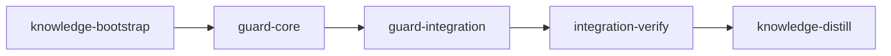

# Plan: Target Ref Guard

## Overview

A stage agent can move the target branch (normally `main`) itself, because Claude Code grants
every linked-worktree session write access to the whole git common directory. A change then
reaches the target without the merge gate. This plan adds a daemon-owned record of the last
target tip loom accepted, and a git `reference-transaction` hook that attests every move made by
a host-side git. Every move loom did not make is evaluated; one that is unattested, touches a
control path, rewrites history or carries unmerged stage work holds every merge into the target
until the operator accepts or restores it. Never auto-restore.

Loom runs on many repositories; nothing here is specific to this one. The target is whatever
`.loom/work/config.toml` `[plan] base_branch` names, the control paths are the ones
`git/merge/control_paths.rs` defines, and the hooks directory comes from the repository's own
configuration.

## Goals

- An agent cannot get a change onto the target without loom seeing and holding it.
- Operator commits, `git pull` fast-forwards and knowledge-stage commits during a run need no
  action unless they touch a control path or rewrite the target.
- Zero cost for repositories where nothing moves the target: one `rev-parse` and one small file
  read per tick; no new files in `.git` beyond one hook.
- Non-goals: the rest of G2 (other refs, objects, R's index/HEAD/`MERGE_HEAD`, `commondir`,
  daemon-owned commits). That is the withdrawn sandbox-escape-hardening plan.

## Execution Diagram



`doc/loom/knowledge/` is populated and `loom knowledge check --strict --baseline
doc/loom/knowledge/check-baseline.txt` ran clean at `066e7667` (0 issues), so knowledge-bootstrap
is small: it corrects one stale claim and records section 1's measurements before the
implementation stages read that knowledge.

## 1. Experiments (2026-10-02: bwrap 0.11.1, git 2.53.0, Linux 7.1.5)

| Id | Setup | Result |
| --- | --- | --- |
| E1 | `--ro-bind f f`; host replaces `f` by rename; sandbox writes `f` | write lands on the host. Control without the host replace: refused |
| E2 | `--ro-bind dir dir`; host replaces `dir/ref` by rename; sandbox writes it | refused |
| E3 | same bind; sandbox creates `dir/new`, renames `dir/ref` | both refused |
| E4 | same bind; host replaces the directory itself | sandbox write lands on the host |
| E5 | `--ro-bind f f`; host rewrites `f` in place (same inode) | sandbox write still refused |
| E6 | `--ro-bind f f`; host unlinks `f` | sandbox creates `f`, lands on the host |
| E7 | `strace git update-ref` | `open(main.lock, O_EXCL)`, then `rename(main.lock, main)` |
| F4a | empty loose `refs/heads/main` over `packed-refs` | `fatal: your current branch appears to be broken`, `No commits yet` |
| F4b | `update-ref` of a packed-only `main` to its current value | stays packed |
| P1 | `main` checked out in R; from worktree T: `branch -f main`, `push . HEAD:main`, `fetch . x:main`, `checkout main`, `switch main` | all refused by git; `update-ref refs/heads/main HEAD` succeeds |
| P2 | `main` checked out nowhere | `branch -f`, `push .`, `fetch .` all succeed |
| P3 | after an agent `update-ref` with `main` checked out in R | R's `git status` shows the reverse diff staged |
| R1-R4 | `git read-tree -m -u <from> <to>` in R after either move style | brings the checkout along, keeps unrelated local edits, a no-op when already in step |
| H1 | `.git/hooks/reference-transaction` appending to a ledger | fired for `update-ref`, `branch -f`, `push .`, `fetch .`, `merge --ff-only`, `commit`, `reset --hard` |
| H2 | same, with `-c core.hooksPath=/dev/null`, or a raw write of the ref file | `main` moved, no ledger line |
| H3 | same hook, git run under bwrap with `.loom` read-only, from the worktree | hook refused the update (exit 128), `main` unmoved |
| H4 | H3 with `-c core.hooksPath=/dev/null` | `main` moved, no ledger line |
| H5 | an interactive operator Claude Code session in R | can write `.loom/work` (so its commits are attested) |

What follows:

- A file deny on `refs/heads/<target>` cannot hold: git replaces refs by rename (E7, E1),
  `pack-refs`/`gc` unlinks them (E6), a packed-only target has no file and binding the absent
  path breaks the branch (F4a), and reftable repositories have no per-ref file.
- A directory deny holds against replacements inside it (E2, E3), not against replacement of the
  directory (E4). `refs/heads/` cannot be denied (stage agents commit to `refs/heads/loom/<id>`).
  The record and ledger live in `.loom/`, which every capsule denies as a directory and loom never
  replaces during a run.
- Updating the ref in place so a file deny survives loom's merges (E5) is not shipped: operator
  commits rename (E1), `gc` unlinks (E6), packed-only and reftable targets defeat it, and an
  in-place write is not atomic for concurrent readers.
- A git hook cannot be a gate (H2, H4: the agent skips it), but it is an attestation channel: only
  a host-side git can write the ledger (H1, H3), and a skipped hook leaves the move unattested.

## 2. What the code does today

- One target per run: `config.toml` `[plan] base_branch`, written by `loom init`; the daemon reads
  it once (`daemon/server/orchestrator.rs`) and resolves it with `resolve_target_branch`.
- `merge_stage` (`git/merge/mod.rs`) is the only code that advances the target for a stage. Its
  callers: daemon `try_auto_merge` and `land_stage_merge`; operator CLI `loom stage merge`,
  local `--resolved`, the progressive merge of an operator-run `loom stage complete` and
  `human-review --force-complete`. Sessions cannot reach it: it takes `MergeLock` on
  `.loom/work/merge.lock`, which their capsule write-denies.
- Daemon paths that settle a stage from ancestry alone, without `merge_stage`:
  `sync_graph_with_stage_files` (`orchestrator/core/recovery.rs`, every tick) sets
  `merged = true` when `verify_merge_succeeded(completed_commit, target)` holds; the `NoWorktree`
  outcome finalizes by ancestry; `merge_stage` returns `AlreadyUpToDate` when the branch tip is in
  the target. An agent that fast-forwards `main` to its branch therefore gets the stage marked
  merged and cleaned up today, with no gate.
- New stage worktrees start at the live target tip (`spawn_setup.rs::resolve_worktree`).
- Only `stage_type: knowledge` stages run in R (`stage_executor.rs::start_stage` dispatches them to
  `start_knowledge_stage`) and commit to the target with plain `git commit`, from inside their
  sandbox; completion marks them merged directly (`daemon/server/control_complete.rs`).
  Knowledge-distill and integration-verify stages run in worktrees and reach the target through
  `merge_stage` like every other stage. Loom's own plan commits
  (`commands/run/plan_inputs.rs::commit_rename`,
  `fs/plan_lifecycle/commit.rs::commit_post_completion_changes`, which runs `git add -u` over R and
  commits the whole index) run with hooks disabled, like all of loom's git. They and
  `merge_stage` are the only production code that moves the target (the initial bootstrap commit
  in `git/repository.rs` predates any record).
- Loom's git (`crate::git::runner`) prepends `-c core.hooksPath=/dev/null -c core.fsmonitor=false`
  and sets `LC_ALL`/`LANG` (`runner.rs::git_command`), and nothing else: git honors
  `refs/replace/*` and `info/grafts` in every `diff`, `merge-base` and ancestry test loom runs. A
  session can write both (the capsule denies only `.git/hooks`, `.git/config` and each
  `config.worktree` in the common dir: `sandbox/control_surfaces/session_denies.rs` lines 84-90).
  Measured on git 2.53: a planted `git replace X X'` makes `git diff --name-only A X` print only
  the decoy's paths; a planted `info/grafts` line makes `merge-base --is-ancestor` true for an
  unrelated commit, and `GIT_NO_REPLACE_OBJECTS=1` does not disable grafts (only
  `GIT_GRAFT_FILE=/dev/null` does). Today that lets a session make `sync_graph_with_stage_files`
  mark its stage merged without the target moving, and would let it hide a change from any
  diff-based evaluation.
- `loom clean --state` and `--all` (`commands/clean/mod.rs::clean_state_directory`) and
  `loom init --clean` (`commands/init/cleanup.rs::cleanup_work_directory`) delete `.loom/work`;
  `loom init --clean` stops the daemon and reaps live sessions before it deletes
  (`init/execute.rs::execute` calls `stop_daemon_and_prune` and `cleanup_orphaned_sessions`
  first). `loom clean` then `loom init <plan>` is the normal flow between plans, so every state
  file this plan adds lives for one plan run.
- This repository sets `core.hooksPath=loom/.githooks` (a tracked directory) in `.git/config`;
  neither `--global` nor `--system` sets it on this machine.
- `loom status`, the live TUI and the web dashboard render `scheduling_report::alerts`; a new
  alert line needs no schema or `web/dist` change.

### Sibling plans

- `PLAN-merge-off-main-checkout.md` is implemented in the tree (commit f42b4eb0: `merge_stage`,
  `MergeBlock`, `advance_target`, `PendingMerge`, `blocked_retry`). This plan consumes that
  committed surface; that plan must not be re-executed after this one (its "rewrite merge_stage"
  step would drop the guard step).
- `PLAN-web-host-graft-followthrough.md` stage `implement-host-and-context` (worker C) splits the
  `dispatch` match of `loom/src/cli/dispatch.rs` into a new `cli/dispatch_commands.rs`, owns
  `cli/mod.rs` and removes the `dispatch` ledger row. `PLAN-model-router-hooks.md` stage
  `router-core` adds `Commands::Router` to `cli/types.rs` and `cli/dispatch.rs`. guard-integration
  must not run concurrently with either stage. If either merged first, D2 re-reads
  `cli/dispatch*.rs`, `cli/types.rs` and the ledger, routes `Commands::Target` wherever
  `Commands::Worktree` routes then, and keeps `cli/types.rs` at or under 400 lines (extract
  `TargetCommands` to `cli/types_target.rs`, as planned). The dispatch wiring check uses the glob
  `src/cli/dispatch*.rs` so it holds in either order.
- `IN_PROGRESS-PLAN-source-graph-mechanism.md` stage `map-api-freshness` (worker M2) edits
  `cli/dispatch*.rs`, `cli/types_ops.rs` and `orchestrator/signals/format/brief.rs`, all inside
  guard-integration's `files:` globs. guard-integration must not run concurrently with it either.
- Ordering for all three: no two of them run at once; whichever runs second re-reads the merged
  tree. For this plan that means the `cli/dispatch*.rs` layout (D2) and every exact
  `maintainability-baseline.txt` number the briefs quote (they are the `066e7667` values; a
  worker lowers a ledger line from the line's current value in the tree, never from the brief).
- `PLAN-loom-state-confinement.md` has no pending stage this plan waits on: the `.loom/` capsule
  deny and the confinement launch harness this plan consumes are in the tree at `066e7667`.
- Every stage file this plan relies on from `DONE-PLAN-verification-v2.md`,
  `DONE-PLAN-stage-exits-and-environment.md` and `DONE-PLAN-knowledge-bootstrap-command.md` is
  implemented; their ownership tables are history, not concurrent work.
- No sibling plan consumes a name this plan adds (`TargetHeld`, `target_guard`, the hook).
  `PLAN-secure-distilled-loom-v2.md` (no executable YAML) plans to unify merge routes later; the
  knowledge update of section 7 records that every ancestry settle uses the accepted tip.

## 3. Design

### 3.1 The accepted tip

`.loom/work/target-guard.json` records, per target branch, the last tip loom accepted, any
current hold and whether attestation is required (the latch of section 3.2). Only loom on the
host writes it: `merge_stage` after its own advance (`record_advance`), the evaluation below, and
`loom target accept`. The daemon creates the entry
from the current tip at startup (trust on first use, at operator-started `loom run`);
`merge_stage` does the same when an operator CLI merge finds no entry. Every record write also
writes `.loom/work/target-guard.refs`, which tells the hook which refs to guard. Record keys are
short branch names: every public function strips a leading `refs/heads/` from `target` (an
existing caller passes `"refs/heads/main"`: `git/merge/stage_tests.rs`), and each refs line is
`ref <branch_ref(key)>`. The three files live in `.loom/work`, so they last one plan run;
`loom init --clean` and `loom clean --state|--all` refuse to delete them while the target is held
or a pending move would be held (section 3.5).

All of loom's git runs with replace refs and grafts disabled: `crate::git::runner::git_command`
sets `GIT_NO_REPLACE_OBJECTS=1` and `GIT_GRAFT_FILE=/dev/null` on every command (loom uses neither
mechanism). The evaluation below, `merged_into_accepted`, `verify_merge_succeeded` and the merge
gate's `changed_paths` all go through the runner, so a session-planted `refs/replace/*` or
`info/grafts` cannot change what they see (section 2, measured).

### 3.2 Attestation

`loom-hooks/git-reference-transaction-hook.sh`, installed as `.git/hooks/reference-transaction`
by `loom init` and at daemon startup. For each update of a guarded ref:

- `prepared`: when it can append to `.loom/work/target-guard.ledger`, it writes
  `attest <current> <new> <ref>` (the current value it reads itself, because git passes the
  all-zero id when the caller gave none). When it cannot (a sandboxed session) and
  `LOOM_SESSION_ID` is set, it refuses the update unless the move is a fast-forward touching only
  `doc/loom/knowledge/` (`stage_type: knowledge` stages commit to the target from their sandbox
  in R). With no session and no write access it allows the move without a line.
- `aborted`: it writes a matching `abort` line.
- The script exports `GIT_NO_REPLACE_OBJECTS=1` and `GIT_GRAFT_FILE=/dev/null` before its own git
  calls, like loom's runner.

The hook trusts nothing an agent controls: the ledger sits in `.loom/`, write-denied to every
session, and a session that skips the hook (`-c core.hooksPath=`, a raw ref write) leaves no line.
Attestation is on only when loom's hook is installed, `core.hooksPath` is unset at every scope
(git ignores `.git/hooks` otherwise; husky and similar set it), and the hook can find the state
directory; otherwise the guard runs without attestation and says so at startup.
`attestation_mode` reads `core.hooksPath` the way git applies it to the operator's commands: the
worktree, local, global and system scopes, each with `--includes` (a scoped `git config --get`
skips `include.path` files, measured on git 2.53), never the command scope loom's runner forces.

The hook file and `core.hooksPath` live in `.git/hooks` and `.git/config`, both denied to every
session (`session_denies.rs` lines 84-90), but `.git/config` is a file deny: once the operator's
own `git config` replaces the file by rename, a session that was already running can write it
(E1) and set `core.hooksPath`. So the record latches the mode. Each target entry carries
`attestation`, set when the entry is created and raised whenever an evaluation finds the mode
`Active`; while it is set the evaluation walks the ledger even when `attestation_mode` now reports
`Off`, so a downgrade turns every later move into an `Unattested` hold instead of silently
weakening the guard. Only `loom target accept` lowers it, to the mode current at the accept: an
explicit operator decision, kept across restarts with the record.
This repository is one where attestation is off (`core.hooksPath=loom/.githooks`, section 2), so
its record starts unlatched.

### 3.3 Evaluating a move loom did not make

For accepted tip `A` and observed tip `T`, using only the record, the ledger and pinned git:

- `T` not a descendant of `A`: hold (history rewrite).
- Control paths in `A..T`: hold, naming the paths.
- Attestation required (the mode is `Active` or the record latched it, section 3.2): walk the
  ledger's chain from `A` to `T`; a gap whose diff leaves
  `doc/loom/knowledge/`: hold (an unattested move, naming the range).
- A `refs/heads/loom/*` branch with commits in `T` but not in `A`: hold (unmerged stage work,
  the honest-mistake case, and the main signal when attestation is off).
- Otherwise accept silently and advance the record.

A hold memoises on the observed tip, so a held target costs no git work per tick; a restore
(`T == A`) clears it.

The ledger is untrusted-format input even though only the host writes it: lines whose ids are not
40 or 64 lowercase hex characters (a `ref:` value from a symref update, garbage) are skipped; an
ancestry test on a ledger value treats any git exit other than 0 as "not an ancestor" (a pruned
object must not turn every later evaluation into `Unevaluable`); the chain walk drops entries with
`from == to` (host `git gc`/`pack-refs` writes `attest X X` and `attest X 0…`) and never revisits
a tip, so it terminates on any ledger, including an operator's reset-and-recommit history.

### 3.4 What a hold does

- `merge_stage` returns `Blocked(MergeBlock::TargetHeld { target, accepted, observed })` before
  its `AlreadyUpToDate` check, for every gate mode. The stage goes `MergeBlocked` and the daemon's
  retry lands it once the hold clears.
- The ancestry-only daemon paths test against the accepted tip (`merged_into_accepted`): the
  Completed-stage settle and the phantom-merge revert (`verify_merged_true_or_revert`) in
  `sync_graph_with_stage_files`, and the `NoWorktree` finalize (`merge_handler.rs::
  verify_and_finalize_merge`). The auto-merge precheck records `TargetHeld` before the gate, the
  zero-commits route and the `NoWorktree` finalize.
- New stage worktrees start at the accepted tip, so spawns continue during a hold without
  inheriting the move. A leftover `loom/<id>` branch with no worktree is deleted and recreated
  only when it has no commits beyond that start point; measured against the live target
  instead, a target moved onto the branch's own work would count zero and delete it.
  Knowledge-stage spawns, merge-resolver spawns and blocked retries wait;
  the hold test is the first statement of `spawn_resolver_if_due` and `retry_blocked_merge_at`,
  before their live-target probes. A `TargetHeld` block is never put in the blocked-retry memo,
  so the first retry after the hold clears lands the merge.
- `loom status`, the TUI and the web dashboard show one warning alert per hold, whether or not the
  daemon runs.

### 3.5 Operator commands

- `loom target status`: accepted tip, current tip, attestation state, hold reasons, review
  commands, the accept command and the restore commands (`git update-ref refs/heads/<t> <A> <O>`,
  plus `git read-tree -m -u <O> <A>` in R when the target is checked out there).
- `loom target accept --to <commit>`: refuses inside a loom session (a guard rail; the boundary is
  the `.loom/` deny) and unless `--to` names the current tip; records it; prints
  `git read-tree -m -u <A> <O>` when R's checkout was left behind.
- `loom init --clean` and `loom clean --state|--all` refuse while the target is held or would be
  held, before they stop the daemon, reap sessions or delete anything: deleting the record would
  let the next run trust an unreviewed move. The refusal reads only the record (every target it
  holds), never `config.toml`, so a malformed config cannot block the recovery path; an
  unreadable record refuses and names the file.
- Loom attests its own plan commits only when every path of the commit's own diff
  (`<after>^..<after>`) is the plan file's old path, its new path,
  `doc/plans/REVIEW-<plan id>.md`, or under `doc/loom/knowledge/`. A wider rule (all of
  `doc/plans/`) would launder a session's edit of another pending plan, which the plan-done
  commit's `git add -u` sweeps up, onto the target; `doc/plans/` is not a control path. In
  practice the plan-rename commit runs before the daemon's first record and is not attested; the
  plan-done commit is.

### 3.6 Rejected alternatives

File or directory denies and in-place ref updates (section 1); a separate repository or detached
worktrees (changes the worktree model); a PreToolUse Bash text matcher (sees only Bash tool text;
the hook refuses every git spelling and costs agents no extra process per Bash call); trusting
loom's plan-done commit unconditionally (its `git add -u` can sweep files a knowledge agent wrote
into R); stopping all spawns during a hold (unnecessary once new stages start at the accepted
tip); recording rejected tips after a restore and blocking stage branches that carry them (a
stage agent can re-author the same content in its own commits, which reach the target only
through `merge_stage`'s gate and the stage's review, as any stage work does); re-reading the
attestation mode at each evaluation without a latch (a session can rewrite a host-replaced
`.git/config`, section 3.2).

## 4. Side effects

| Who | Effect |
| --- | --- |
| Repository where nothing moves the target | Per tick: one `rev-parse` and one small file read. One hook file in `.git/hooks`, three files in `.loom/work`. |
| Every git ref update in a loom-managed repository | The hook runs: one `git rev-parse`, then an immediate exit unless a guarded ref is in the transaction (a few milliseconds). |
| Operator commits, `git pull`, knowledge-stage commits | None, unless they touch a control path or rewrite the target. One daemon log line per accepted move. |
| Operator control-path commit, rewrite, or hand merge of a `loom/*` branch | Held; one `loom target accept --to <tip>`. Stage spawns continue; merges wait. |
| Operator moves by tools that skip git hooks (libgit2 GUIs, jj, `-c core.hooksPath=`) | Unattested, so held; one accept. |
| Repository with `core.hooksPath` set, or a foreign `reference-transaction` hook | Attestation off (announced at startup and in `loom target status`): only control paths, rewrites and stage work hold. |
| Operator sets `core.hooksPath` (husky, an `include.path`) during a run that started with attestation on | Every later move holds as unattested until one `loom target accept`, which records attestation off for the rest of the run. |
| `loom init --clean`, `loom clean --state`, `loom clean --all` while held or with a pending move that would hold | Refused until accept or restore, before anything is stopped or deleted. |
| Every git command loom runs | `GIT_NO_REPLACE_OBJECTS=1` and `GIT_GRAFT_FILE=/dev/null` in its environment: replace refs and grafts are ignored (loom uses neither). |
| This repository (`core.hooksPath=loom/.githooks` in `.git/config`) | Attestation off until the operator unsets it (operator step 3). |
| Stage agents | A git command that moves the target from a loom session is refused with an explanation. New stages start at the accepted tip, identical to today when nothing moved. |

## Stages

### knowledge-bootstrap

Runs `loom knowledge sync`, corrects `architecture/security-and-isolation.md` (the section headed
exactly "Spawn Preflight and the Merge Gate (2026-09-13)" says `loom stage merge` is "the
operator's ungated path, by design"; it
enforces the gate, see `merge-flow.md` "The merge gate"), and records the measurements of
section 1 (E2-E6, H1-H5) in `concerns/sandbox-and-confinement-gaps.md`, "A File Deny Stops
Protecting a Live Session Once the Host Replaces the File". It describes no design that does not
exist yet.

### guard-core

Exists by Q3 and Q4 of the stage necessity test. Q3: the daemon, CLI and srt work and the next
stage's contract session all compile against this stage's API and ledger format; a
contract-proven, review-gated core catches a wrong evaluation rule (for example a stage-work test
that flags an already merged branch) before it is frozen into the daemon's contracts. Q4: one
stage with five workers, 27 contracts and two review rounds would pass 500,000 tokens in the
orchestrator's context.

Builds `git::target_guard` (record, evaluation, attestation chain, accept, alert and restore
text), `MergeBlock::TargetHeld`, the `merge_stage` integration and the runner's replace-ref and
graft shutoff (W1, opus), then the hook script, its installer and the `loom init` install (W2,
opus, after W1). Briefs:
`doc/plans/briefs/target-ref-guard/guard-core/`, shared rules in
`doc/plans/briefs/target-ref-guard/common.md`.

Risk checklist: untrusted input (ledger lines, git's hook stdin, quoted paths: W1 and W2 tests;
the zero old value: contract `host-update-is-attested-with-the-real-old-value`); filesystem paths
(the hook finds the state directory through the common git dir, from a worktree too: W2 tests);
process volume (stage-work loop and diffs run once per external move only; no contract);
configuration (`core.hooksPath`: contract `tracked-hooks-dir-change-is-held`; a mid-run
downgrade of the attestation mode: contract `attestation-downgrade-still-holds-an-unattested-move`,
mutation M7; `core.hooksPath` set through `include.path` or worktree config: W2 tests);
lifecycle (loom's
own advance keeps the record current: `loom-merge-keeps-the-accepted-tip-current`; aborted
transactions: W2 tests); reachability (`merge_stage` consults the guard:
`merge-stage-refuses-a-held-target`, `merge-stage-does-not-settle-on-an-agent-fast-forward`,
wiring); external data (git's `reference-transaction` stdin format: the zero-old-value contract,
captured from real git; session-written replace refs and grafts: contracts
`replace-ref-does-not-hide-an-unattested-change`, `graft-does-not-hide-a-history-rewrite`). The
behaviour contracts cover each hold reason and each accept path.

### guard-integration

Exists by Q3 and Q4: its contracts call guard-core's API, which must exist and be reviewed before
they are frozen against it, and the combined work would not fit one session.

The daemon acts on the guard (D1, opus): startup install and first check, a per-tick check,
ancestry against the accepted tip, the precheck block, waiting retries, resolver spawns and
knowledge spawns, new worktrees at the accepted tip, and the status alert. The operator commands,
the `init --clean` and `loom clean` refusal and loom's own plan-done-commit attestation (D2,
sonnet). The sandboxed proof
under srt (D3, opus; it self-skips inside a session sandbox, so the operator runs it after the
plan). Briefs: `doc/plans/briefs/target-ref-guard/guard-integration/`.

Risk checklist: lifecycle (restart keeps the hold; accept and restore release it: contracts
`restart-keeps-the-hold`, `unattested-move-holds-the-merge-until-accepted`,
`restoring-the-target-releases-the-hold`); reachability (the daemon's own entry points and the
CLI binary drive every contract; `status-alert-names-the-hold`; `reachable` from `run_tick` and a
literal `run.rs` wiring entry, because `reachable` alone is also satisfied through the precheck;
the resolver and knowledge-spawn waits: wiring plus D1 tests, mutations M6 and M8; new worktrees
at the accepted tip: D1 test, mutation M5; a leftover stage branch survives a held respawn: D1
test, mutation M9; the `NoWorktree` finalize under a contended guard check: contract
`contended-no-worktree-finalize-does-not-settle`, mutation M10); configuration (the daemon
reads the configured target; the
CLI resolves it from `config.toml`: D2 tests); filesystem (`init --clean` and `loom clean`
refusal: D2 tests). The behaviour contracts cover the agent fast-forward, operator and knowledge
commits, and the content of `loom target status`.

Existing callers this stage's signature changes reach: `git::create_worktree` gains a start
point, and `tests/integration/helpers.rs::create_worktree_isolated` calls it (every integration
test binary that `#[path]`-includes `helpers.rs` compiles that line, the frozen
`tests/target_cli_contracts.rs` among them), so D1 owns that file for the one added argument.

### Integration Verification

Full suite, lint, format, rustdoc and build; parallel `loom-code-reviewer` subagents (security with
`loom-security-audit`, architecture, test coverage); the mutation check of section 6; the CLI
smoke. Every finding is fixed or disputed, never deferred.

### Knowledge Distillation

Curates the stage memories and writes the knowledge updates of section 7.

## 5. Baselines observed at `066e7667` (host, main checkout, outside any sandbox)

`cargo build --all-targets`, `cargo clippy --all-targets -- -D warnings`, `cargo fmt --all --
--check`: green. `cargo test --no-fail-fast`: 7489 passed, 0 failed, 13 ignored. The repository's
gate is `loom/.githooks/pre-push`: fmt, markdownlint over tracked markdown, clippy, rustdoc with
`-D warnings`, `cargo audit`, `env -u GIT_INDEX_FILE -u GIT_DIR -u GIT_WORK_TREE cargo test
--all-targets --no-fail-fast`, `scripts/flake-check.sh`. Both code stages run its Rust part in
acceptance (fmt, clippy, rustdoc, the env-cleared `--all-targets` suite; see
`mistakes/verification-v2-delivery.md` "The Stage Gate Was Green and the Commit Still Failed":
narrow per-module proofs missed pinned-list tests and rustdoc failures); `loom plan verify` warns
about the full suite and the warning is accepted. integration-verify runs the same Rust part
plus `scripts/flake-check.sh`. Deliberate variations: `cargo audit` is left to the pre-push
hook, because this
plan changes no dependency (`Cargo.lock` is untouched) and the audit needs github.com plus a
write lock in `~/.cargo/advisory-db`, neither of which the stage sandbox grants; markdownlint
runs in the two knowledge stages, the only stages that write tracked markdown outside
`doc/plans/` (which pre-push skips). Module filters measured for the touched code:
`git::merge::` 145, `git::worktree::` 57, `orchestrator::core::merge_lifecycle_e2e_tests`
11, `orchestrator::core::recovery` 32, `orchestrator::core::merge_handler::` 84,
`orchestrator::scheduling_report` 8, `commands::init::` 44, `commands::run::` 58,
`fs::plan_lifecycle::` 21, `cli::` 11, `--test maintainability` 8: all green. Filters naming new
code (`git::target_guard::`, `orchestrator::core::target_hold`, `commands::target::`,
`tests_confinement_target`) select nothing at base by design. These ran on the host; the stage
sandboxes in this repository have run the same cargo filters in earlier v2 plans. This repository
sets `core.hooksPath=loom/.githooks` in `.git/config` (`git config --show-origin --get-all
core.hooksPath`), so here the shipped guard runs with attestation off until the operator unsets
it; neither `--global` nor `--system` sets it on this machine. Every test that needs attestation
on runs in a temporary repository with global and system config shut out, so the local setting
does not reach it; a machine with a global or system `core.hooksPath` turns attestation off, and
those tests fail there with that setting named (they assert `AttestationMode::Active` first).
The repository's pre-commit hook also runs `RUSTDOCFLAGS='-D warnings' cargo doc --workspace
--all-features --no-deps` when doc comments change (`loom/.githooks/pre-commit`), so every code
stage runs it in acceptance.

## 6. Mutation check (integration-verify)

Each mutation is applied alone, the named tests run, the mutation reverted:

- M1: in `target_guard::check_locked`, accept every move after recording it. Red expected:
  `target_guard_contracts` `control_path_move_is_held`, `unattested_move_is_held`; the daemon
  contract `unattested_move_holds_the_merge_until_accepted`.
- M2: in `sync_graph_with_stage_files`, test ancestry against the live ref again
  (`verify_merge_succeeded`). Red expected: `agent_fast_forward_to_own_branch_is_not_marked_merged`.
- M3: make the hook's `prepared` phase always exit 0 without writing. Red expected:
  `sandboxed_session_update_of_the_target_is_refused`, `host_update_is_attested_with_the_real_old_value`.
- M4: remove the `GIT_NO_REPLACE_OBJECTS` and `GIT_GRAFT_FILE` lines from
  `runner.rs::git_command`. Red expected: `target_guard_contracts`
  `replace_ref_does_not_hide_an_unattested_change`, `graft_does_not_hide_a_history_rewrite`; D1's
  `a_graft_does_not_mark_a_stage_merged`.
- M5: in `spawn_setup.rs::resolve_worktree`, pass `None` as the start point. Red expected: D1's
  `resolve_worktree_starts_at_the_accepted_tip_while_held`.
- M6: delete the `target_held()` early return of `resolver_spawn.rs::spawn_resolver_if_due`.
  Red expected: D1's `a_conflicted_stage_gets_no_resolver_while_held`.
- M7: in `target_guard::check_locked`, decide whether to walk the ledger from
  `attestation_mode(..)` alone, ignoring the record's `attestation` latch. Red expected:
  `target_guard_contracts` `attestation_downgrade_still_holds_an_unattested_move`.
- M8: make `spawn_hold_reason` return `None` for a knowledge stage while held. Red expected: D1's
  `a_knowledge_stage_is_not_started_while_held`.
- M9: in `git/worktree/operations.rs`, measure the leftover branch's commits against
  `base_branch` again when a start point is supplied. Red expected: D1's
  `a_held_respawn_keeps_an_orphaned_stage_branch`.
- M10: in `merge_handler.rs::verify_and_finalize_merge`, call `verify_merge_succeeded` on the live
  target again. Red expected: the daemon contract `contended_no_worktree_finalize_does_not_settle`.

## 7. Knowledge updates (knowledge-distill; the bootstrap does the two listed under its stage)

- New tier-2 topic `architecture/target-guard` (record, ledger and refs files, attestation, its
  off conditions (`core.hooksPath` read with `--includes` at every scope) and the record's latch,
  the evaluation, hold effects, operator commands, trust inputs), annotated, with
  a 2-4 line summary and link in `architecture.md`.
- `architecture/merge-flow.md`: the guard step in `merge_stage`, `TargetHeld` in the outcomes and
  the `MergeBlock` list; every ancestry settle of a stage uses `merged_into_accepted`, never the
  live ref; loom's git ignores replace refs and grafts (`runner.rs`).
- `concerns/agent-rule-bending-hardening.md` G2: replace "The same write access to
  `refs/heads/main` also bypasses the merge gate" with the guard, and narrow the open items to
  other refs, objects, R's index/HEAD/`MERGE_HEAD`, `commondir` and host-side git; add section 8's
  residuals.
- `entry-points/hooks.md` and `patterns/hook-content-stripping.md`: the second git-side script.
- A `mistakes/` entry: daemon paths settled a stage from ancestry against a ref any session could
  move, and loom's git honored session-planted `refs/replace/*` and `info/grafts`
  (`GIT_NO_REPLACE_OBJECTS` alone does not disable grafts).
- `architecture/execution-containment.md` or `concerns/sandbox-and-confinement-gaps.md`: the
  common-dir paths a session can still write (`refs/replace`, `info/grafts`, objects,
  packed-refs) and which of loom's reads ignore them.

## 8. What stays open

- An agent can land a crafted commit touching only `doc/loom/knowledge/**` (the knowledge-stage
  exception).
- In a repository where attestation is off, a crafted fast-forward with no control path and no
  `loom/*` commits passes, as in any design without a trusted author signal. This includes loom's
  own repository until the operator unsets its local `core.hooksPath` (section 5). A run whose
  record started with attestation on keeps requiring it until an accept (section 3.2).
- Loom's git ignores `refs/replace/*` and `info/grafts` (section 3.1). Left open: object
  replacement after an accept (a TOCTOU), git run by the operator or other host tools (which honor
  both), sibling branches, tags, R's index, HEAD and `MERGE_HEAD`, a planted `commondir`,
  host-side git following `T/.git`: G2, unchanged. Production `git` spawned directly with
  `Command::new("git")` outside `crate::git::runner` (`version/derive.rs`,
  `verify/criteria/cache_ignore.rs`, `commands/handoff/create.rs`,
  `orchestrator/adjudication/prompt/sources.rs`) does not get the two variables; none of them
  decides ancestry or a merge.
- A restore resets the ref only: the rejected commits stay in the object store, and a stage agent
  can merge or re-author them into its own branch, which then reaches the target through
  `merge_stage`'s gate and the stage's review like any other stage work.
- The `NoWorktree` finalize relies on the precheck's fresh check; when that check is contended
  (an operator merge holds `MergeLock`) the daemon keeps the previous, possibly clear, state for
  one tick. The finalize itself tests ancestry against the accepted tip, so this delays a hold
  without settling a stage (contract `contended-no-worktree-finalize-does-not-settle`).
- Between a move and the next tick (up to 5 s), anything reading the target sees the moved tip.
- A resolver already running when a hold starts may merge the held tip into its stage branch.
- `loom worktree remove` and `--assume-merged` mark a stage merged by ancestry against the live
  ref; both are operator commands.
- Found, not fixed: `resolve_target_branch(None, ..)` falls back to the agent-writable
  `refs/remotes/origin/HEAD`; `loom init` always writes `base_branch`, so a run never reaches it.

## Operator step before the run

The installed loom must be at least the plan's base commit `066e7667` (on 2026-10-02 it was
`2c9b5a87`, 30 commits behind and missing the sandbox fix `1da90890` and the merge fixes the
stages rely on): reinstall with `dev-install.sh` when no other loom run is live, then
`loom init doc/plans/PLAN-target-ref-guard.md`.

## Operator steps after the run

1. Reinstall the loom binary when no other loom run is live (`dev-install.sh`).
2. Run the srt-backed confinement tests outside any sandbox:

```bash
mkdir -p <scratch>/bin
printf '#!/bin/sh\nexec bunx --bun @anthropic-ai/sandbox-runtime "$@"\n' > <scratch>/bin/srt
chmod +x <scratch>/bin/srt
cd loom && env -u LOOM_WORK_DIR PATH=<scratch>/bin:$PATH LOOM_TEST_REQUIRE_SANDBOX_FREE=1 cargo test --lib tests_confinement
```

3. Optional, to turn attestation on in this repository: move the tracked hooks the operator still
   wants from `loom/.githooks/` into `.git/hooks/` (beside loom's `reference-transaction`), run
   `git config --unset core.hooksPath`, restart the daemon, and confirm `loom target status`
   prints `Attestation: on`.

---

<!-- loom METADATA -->

```yaml
loom:
  version: 2
  ratchet_files:
    - loom/maintainability-baseline.txt
    - doc/loom/knowledge/check-baseline.txt
  sandbox:
    enabled: true
    auto_allow: true
    filesystem:
      deny_read: ["~/.ssh/**", "~/.aws/**", "~/.config/gcloud/**", "~/.gnupg/**"]
      allow_write:
        - "loom/src/**"
        - "loom/tests/**"
        - "loom/target/**"
        - "loom/maintainability-baseline.txt"
        - "loom-hooks/**"
        - "web/node_modules/**"
        - "doc/**"
    network:
      allowed_domains: ["crates.io", "index.crates.io", "static.crates.io", "registry.npmjs.org"]
      allow_local_binding: false
      allow_unix_sockets: []
  provision:
    - working_dir: "web"
      command: "test ! -e .npmrc && test ! -L .npmrc && bun install --frozen-lockfile --ignore-scripts --backend=copyfile --config=/dev/null"
  stages:
    - id: knowledge-bootstrap
      name: "Knowledge Bootstrap: correct and record the merge-gate facts"
      summary: "Corrects a stale merge-gate claim and records the measured sandbox and git-hook facts this plan rests on."
      stage_type: knowledge
      working_dir: "."
      dependencies: []
      description: |
        Prepare the knowledge base for doc/plans/PLAN-target-ref-guard.md (read its sections 1 and 2; the lifecycle may rename it IN_PROGRESS-PLAN-target-ref-guard.md). Use the loom knowledge CLI, never Write/Edit on knowledge files. NEVER Claude Code auto-memory.
        Use parallel subagents and skills to maximize performance (this stage is small; one agent is enough).
        1. Run loom knowledge sync.
        2. architecture/security-and-isolation.md, section "Spawn Preflight and the Merge Gate (2026-09-13)" (that exact heading text, date included: replace-section matches the heading text exactly and APPENDS a duplicate section on any mismatch, leaving the stale claim in place): its last sentence says loom stage merge calls merge_stage directly and stays the operator's ungated path, by design. The tree enforces the gate there (architecture/merge-flow.md, "The merge gate"; loom/src/commands/stage/merge/landing.rs passes MergeGate::Enforce). Rewrite the section with loom knowledge replace-section architecture/security-and-isolation.md "Spawn Preflight and the Merge Gate (2026-09-13)" "<body>", current-state wording, and read the "replaced"/"appended" line it prints: "appended" means the heading did not match; remove the duplicate and retry.
        3. concerns/sandbox-and-confinement-gaps.md, section "A File Deny Stops Protecting a Live Session Once the Host Replaces the File": replace its "(to be confirmed per case)" clause with the measured results of the plan's section 1: a directory read-only bind holds against files replaced, created or renamed inside it (E2, E3) and stops holding when the host replaces the directory itself (E4); an in-place host write keeps a file bind (E5); a host unlink voids it (E6). Add, as current facts about git: a reference-transaction hook in .git/hooks fires for update-ref, branch -f, push ., fetch ., merge --ff-only, commit and reset --hard (H1), is skipped by -c core.hooksPath=/dev/null and by raw ref-file writes (H2), and under a sandbox that denies .loom/ cannot write a ledger there (H3, H4). Describe no loom design that does not exist yet.
        4. Finish with loom knowledge check.
      acceptance:
        - "loom knowledge check --strict --baseline doc/loom/knowledge/check-baseline.txt"
        - "bunx markdownlint-cli2 \"doc/loom/knowledge/**/*.md\""
      files: ["doc/loom/knowledge/**"]

    - id: guard-core
      name: "Target guard core, merge_stage integration, attestation hook"
      summary: "Loom records the last target tip it accepted and holds any other move that is unattested, touches a control path, rewrites history or carries unmerged stage work; merge_stage refuses a held target; a git hook attests the operator's own moves."
      stage_type: standard
      skills: ["loom-rust"]
      implementers: ["claude"]
      subagent_timeout_secs: 900
      working_dir: "loom"
      dependencies: ["knowledge-bootstrap"]
      description: |
        Implement stage "guard-core" of doc/plans/PLAN-target-ref-guard.md (sections 3.1-3.4; the plan may be renamed IN_PROGRESS-PLAN-target-ref-guard.md).
        Use parallel subagents and skills to maximize performance.
        Every worker first reads doc/plans/briefs/target-ref-guard/common.md, then its own brief.
        Spawn every worker BY AGENT TYPE with the fixed prompt plus "Your brief: <path>. Read it in full before anything else."
        Territories are DISJOINT. Workers NEVER spawn subagents.
        Waves: W1 alone (it is the foundation W2 compiles against); verify it with cargo test --lib git:: (the contract files also call W2's install_reference_transaction_hook, so they compile only after W2); then W2; then run both contract files and the acceptance list.

        | Worker | Role | Tier | Files owned | Shared context | Brief path |
        | ------ | ---- | ---- | ----------- | -------------- | ---------- |
        | W1 | Guard core, merge_stage, runner | opus | src/git/target_guard/mod.rs; src/git/target_guard/record.rs; src/git/target_guard/evaluate.rs; src/git/target_guard/attestation.rs; src/git/target_guard/text.rs; src/git/target_guard/tests.rs; src/git/target_guard/evaluate_tests.rs; src/git/target_guard/attestation_tests.rs; src/git/mod.rs; src/git/runner.rs; src/git/merge/mod.rs; src/git/merge/tree.rs; src/git/merge/tree/tests.rs; src/git/merge/lock.rs; src/git/merge/control_paths.rs; src/git/merge/target_guard_tests.rs | common.md | doc/plans/briefs/target-ref-guard/guard-core/w1-guard-core.md |
        | W2 | Attestation hook and installer | opus | ../loom-hooks/git-reference-transaction-hook.sh; src/git/hooks.rs; src/git/hooks/reference_transaction.rs; src/git/hooks/reference_transaction_tests.rs; src/commands/init/execute.rs; src/commands/init/git_hooks.rs; src/commands/init/mod.rs; tests/target_ref_hook_tests.rs; maintainability-baseline.txt | common.md; W1's target_guard | doc/plans/briefs/target-ref-guard/guard-core/w2-attestation-hook.md |

        CONTRACT SURFACE (the contract session writes tests/target_guard_contracts.rs and tests/target_ref_hook_contracts.rs from this, before any code; top-level #[test] fns, so each contract's test value is its fn name; integration tests, so they compile against the library without cfg(test)):
        - Every name in the "Shared interface" section of doc/plans/briefs/target-ref-guard/common.md is exact: loom::git::target_guard::{check, check_locked, accepted_tip, recorded_hold, attestation_mode, AttestationMode, GuardState, Hold, HoldReason, RECORD_FILE, REFS_FILE, LEDGER_FILE}, loom::git::merge::{merge_stage, MergeGate, MergeResult, MergeBlock} with MergeBlock::TargetHeld { target, accepted, observed }, and loom::git::hooks::install_reference_transaction_hook(repo_root) -> anyhow::Result<HookInstall>.
        - check(repo_root, work_dir, target) -> anyhow::Result<Option<GuardState>> records the current tip on first use (Clear) and evaluates later moves; Ok(None) only when another MergeLock holder blocks it. The record entry latches attestation: once a check finds AttestationMode::Active, later checks walk the ledger even after attestation_mode turns Off (plan section 3.2); only accept lowers the latch. GuardState::Held(Hold { reasons, .. }); HoldReason::{NotFastForward, ControlPaths { paths }, Unattested { from, to, paths }, StageWork { branches }, Unevaluable { error }}; branch names short ("loom/s"); paths repo-relative.
        - merge_stage(stage_id: &str, target_branch: &str, repo_root: &Path, work_dir: &Path, gate: MergeGate) -> anyhow::Result<MergeResult>; a held target returns MergeResult::Blocked(MergeBlock::TargetHeld { .. }) with the target unchanged; work_dir is the state directory (root/.loom/work) and must exist.
        - accepted_tip(work_dir, "main") -> anyhow::Result<Option<String>> reads the recorded tip.
        - The hook guards the refs listed in work_dir/target-guard.refs, which check writes; the ledger is work_dir/target-guard.ledger with lines "attest <from> <to> <ref>"; replacing the ledger with a directory makes it unwritable (also for root). The hook refuses only when it cannot write the ledger AND LOOM_SESSION_ID is non-empty AND the move is not a fast-forward touching only doc/loom/knowledge/.
        - Fixtures: a TempDir repo, git init -b main, user.name/user.email set locally, one commit, .git/info/exclude listing .loom/ and .worktrees/, root/.loom/work created; a linked worktree .worktrees/s on branch loom/s for the merge contracts. Git runs with GIT_CONFIG_GLOBAL and GIT_CONFIG_SYSTEM pointed at missing files and GIT_CONFIG_NOSYSTEM=1, and every git command that can run the hook sets or removes LOOM_SESSION_ID explicitly.
        - A move "with hooks disabled" is git -c core.hooksPath=/dev/null update-ref refs/heads/main <commit>; a crafted commit is made with git commit-tree <tree> -p <main tip>, where <tree> is main's tree plus one file (git hash-object -w and a temporary index via GIT_INDEX_FILE, or git mktree), so it is a child of main that sits on no branch (without -p the evaluation stops at NotFastForward and an Unattested assertion fails against correct code). "No hook installed" means attestation is off; a contract that needs it on calls install_reference_transaction_hook and asserts loom::git::target_guard::attestation_mode(root, &work_dir) == AttestationMode::Active first.
        - Size: after cargo fmt each contract fn is at most 50 lines and each contract file at most 400 (cargo test --test maintainability is in acceptance and covers test files; no worker may edit a frozen file). Shared steps (fixture, crafted commit, hooks-disabled move) are private helper fns in the contract file.
        - Before freezing, run cargo test --no-run --test target_guard_contracts --test target_ref_hook_contracts and confirm every compile error names only an item this stage adds (target_guard, attestation_mode, AttestationMode, install_reference_transaction_hook, HookInstall, TargetHeld); fix any other error first, because a frozen typo can only be fixed by dispute.
        EXPECTED INTEGRITY EVENTS: TI-ratchet-loom/maintainability-baseline.txt only (W2 lowers the execute line of src/commands/init/execute.rs after moving the hook installs into src/commands/init/git_hooks.rs). File ONE dispute-integrity for it after the final review round, reason "tightening only: execute shrank after install_git_hooks was extracted as the plan prescribes".
        WORKING DIRECTORY: the stage's working_dir is loom/, so every command in a brief runs from there (no "cd loom").
        MEMORY: record mistakes, decisions and surprises via loom memory immediately (subagents too); never loom knowledge in this stage; never Claude Code auto-memory.
      before_stage:
        - command: "rg -q -F 'pub mod target_guard' src/git/mod.rs"
          exit_code: 1
          description: "BEFORE: no target guard module"
      after_stage:
        - command: "cargo test --test target_guard_contracts merge_stage_does_not_settle_on_an_agent_fast_forward -- --exact"
          exit_code: 0
          stdout_contains: ["1 passed"]
          description: "AFTER: merge_stage refuses a target an agent fast-forwarded to its own branch"
      acceptance:
        - "cargo build --all-targets"
        - "cargo clippy --all-targets -- -D warnings"
        - "cargo fmt --all -- --check"
        - "RUSTDOCFLAGS='-D warnings' cargo doc --workspace --all-features --no-deps"
        - "cargo test --lib git::target_guard::"
        - "cargo test --lib git::hooks"
        - "cargo test --test target_ref_hook_tests"
        - "env -u GIT_INDEX_FILE -u GIT_DIR -u GIT_WORK_TREE cargo test --all-targets --no-fail-fast"
      files:
        - "src/git/**"
        - "src/commands/init/execute.rs"
        - "src/commands/init/git_hooks.rs"
        - "src/commands/init/mod.rs"
        - "tests/target_guard_contracts.rs"
        - "tests/target_ref_hook_contracts.rs"
        - "tests/target_ref_hook_tests.rs"
        - "maintainability-baseline.txt"
        - "../loom-hooks/git-reference-transaction-hook.sh"
      artifacts:
        - "src/git/target_guard/mod.rs"
        - "src/git/target_guard/record.rs"
        - "src/git/target_guard/evaluate.rs"
        - "src/git/target_guard/attestation.rs"
        - "src/git/target_guard/text.rs"
        - "src/git/hooks/reference_transaction.rs"
        - "src/commands/init/git_hooks.rs"
      wiring:
        - source: "src/git/merge/mod.rs"
          pattern: "target_guard::check_locked"
          description: "merge_stage consults the guard before merging"
        - source: "src/git/merge/mod.rs"
          pattern: "target_guard::record_advance"
          description: "merge_stage records its own advance of the target"
        - source: "src/git/hooks/reference_transaction.rs"
          pattern: "git-reference-transaction-hook.sh"
          literal: true
          description: "the installer embeds the hook script"
        - source: "src/commands/init/git_hooks.rs"
          pattern: "install_reference_transaction_hook"
          description: "loom init's hook installer installs the reference-transaction hook"
        - source: "src/commands/init/execute.rs"
          pattern: "install_git_hooks("
          literal: true
          description: "loom init calls the hook installer"
        - source: "src/git/runner.rs"
          pattern: "GIT_NO_REPLACE_OBJECTS"
          literal: true
          description: "loom's git ignores session-planted replace refs"
        - source: "src/git/runner.rs"
          pattern: "GIT_GRAFT_FILE"
          literal: true
          description: "loom's git ignores session-planted grafts"
      contracts:
        - id: control-path-move-is-held
          file: tests/target_guard_contracts.rs
          test: control_path_move_is_held
          scenario: "check records main; an operator commit on main adds .claude/settings.json; check again"
          rejects: "an evaluation that accepts every fast-forward, or inspects only stage branches"
        - id: unattested-move-is-held
          file: tests/target_guard_contracts.rs
          test: unattested_move_is_held
          scenario: "install_reference_transaction_hook, check records main, a crafted commit adding src/crafted.rs on main's tree is created with commit-tree (on no branch) and main is moved to it with hooks disabled; check again"
          rejects: "an evaluation that holds only control paths and unmerged stage work, accepting a crafted commit no hook attested"
        - id: attested-operator-commit-is-accepted
          file: tests/target_guard_contracts.rs
          test: attested_operator_commit_is_accepted
          scenario: "install_reference_transaction_hook, check records main, LOOM_SESSION_ID removed, a plain git commit of src/y.rs on main in the checkout (the hook attests it); check returns Clear and accepted_tip equals the new main"
          rejects: "an evaluation that holds every move loom did not make, or that chains on the old value git passes to the hook"
        - id: unattested-knowledge-only-move-is-accepted
          file: tests/target_guard_contracts.rs
          test: unattested_knowledge_only_move_is_accepted
          scenario: "install_reference_transaction_hook, check records main, git -c core.hooksPath=/dev/null commit of doc/loom/knowledge/x.md on main; check returns Clear"
          rejects: "an attestation check without the knowledge-only exception, which would hold every knowledge-stage commit"
        - id: fast-forward-into-unmerged-stage-branch-is-held
          file: tests/target_guard_contracts.rs
          test: fast_forward_into_unmerged_stage_branch_is_held
          scenario: "no hook installed (attestation off); loom/s has two commits; check records main; main moved with update-ref to the FIRST loom/s commit; check returns Held with StageWork naming loom/s"
          rejects: "a stage-work test that compares branch tips (git branch --merged), which misses a target moved to an earlier commit of the branch"
        - id: history-rewrite-is-held
          file: tests/target_guard_contracts.rs
          test: history_rewrite_is_held
          scenario: "install_reference_transaction_hook, check records main after a second commit, LOOM_SESSION_ID removed, git reset --hard HEAD~1 on main then a new commit (attested by the hook); check returns Held with NotFastForward"
          rejects: "an evaluation that trusts every attested move without checking it is a fast-forward"
        - id: tracked-hooks-dir-change-is-held
          file: tests/target_guard_contracts.rs
          test: tracked_hooks_dir_change_is_held
          scenario: "git config core.hooksPath hooks in the repo; check records main; a commit on main adds hooks/pre-commit without the executable bit (so git does not run it); check returns Held with ControlPaths containing hooks/pre-commit"
          rejects: "a control-path test that knows only .claude, .loom and .mcp.json and ignores the configured hooks directory"
        - id: merge-stage-refuses-a-held-target
          file: tests/target_guard_contracts.rs
          test: merge_stage_refuses_a_held_target
          scenario: "worktree .worktrees/s on loom/s with one commit; check records main; main moved with hooks disabled to a commit adding .claude/settings.json; merge_stage(\"s\", \"main\", root, work_dir, MergeGate::Enforce)"
          rejects: "a merge_stage that gates only the stage branch's diff and merges onto the moved target"
        - id: merge-stage-does-not-settle-on-an-agent-fast-forward
          file: tests/target_guard_contracts.rs
          test: merge_stage_does_not_settle_on_an_agent_fast_forward
          scenario: "worktree on loom/s with one commit; check records main; main moved with hooks disabled to the tip of loom/s; merge_stage(.., MergeGate::Enforce) returns Blocked(TargetHeld), not AlreadyUpToDate"
          rejects: "a merge_stage whose guard check runs after the AlreadyUpToDate return, settling a stage the agent merged itself"
        - id: loom-merge-keeps-the-accepted-tip-current
          file: tests/target_guard_contracts.rs
          test: loom_merge_keeps_the_accepted_tip_current
          scenario: "no hook installed (attestation off); worktree on loom/s with one commit; check records main; merge_stage lands loom/s; accepted_tip equals the new main; an operator commit of op.txt on main with hooks disabled; check returns Clear"
          rejects: "a merge_stage that never records its own advance, so the next evaluation holds loom's merge as unmerged stage work"
        - id: replace-ref-does-not-hide-an-unattested-change
          file: tests/target_guard_contracts.rs
          test: replace_ref_does_not_hide_an_unattested_change
          scenario: "install_reference_transaction_hook and assert AttestationMode::Active; check records main (A); crafted child X of A adding src/crafted.rs and crafted child D of A adding doc/loom/knowledge/decoy.md (both commit-tree -p A, on no branch); git replace X D; main moved to X with hooks disabled; check returns Held with an Unattested reason whose paths contain src/crafted.rs"
          rejects: "an evaluation whose git honors refs/replace, so a session-planted replacement shows a knowledge-only tree and the src change is accepted"
        - id: graft-does-not-hide-a-history-rewrite
          file: tests/target_guard_contracts.rs
          test: graft_does_not_hide_a_history_rewrite
          scenario: "no hook installed (attestation off); check records main (A); an orphan commit X made with commit-tree on main's tree plus src/x.rs and NO parent; the line '<X> <A>' written to .git/info/grafts; main moved to X with hooks disabled; check returns Held with NotFastForward"
          rejects: "an evaluation whose git honors info/grafts (GIT_NO_REPLACE_OBJECTS alone does not disable them), so a planted graft makes a rewrite look like a fast-forward"
        - id: attestation-downgrade-still-holds-an-unattested-move
          file: tests/target_guard_contracts.rs
          test: attestation_downgrade_still_holds_an_unattested_move
          scenario: "install_reference_transaction_hook and assert AttestationMode::Active; check records main (A); git config core.hooksPath /dev/null in the repo (local scope) and assert attestation_mode is now Off; a crafted child X of A adding src/crafted.rs (commit-tree -p A, on no branch); main moved to X with hooks disabled; check returns Held with an Unattested reason whose paths contain src/crafted.rs"
          rejects: "an evaluation that re-reads attestation_mode at every check and drops the ledger walk once the configuration turns it off, so a session that rewrote a host-replaced .git/config gets a crafted commit accepted"
        - id: sandboxed-session-update-of-the-target-is-refused
          file: tests/target_ref_hook_contracts.rs
          test: sandboxed_session_update_of_the_target_is_refused
          scenario: "install_reference_transaction_hook; check records main; target-guard.ledger replaced by a directory; from .worktrees/s, LOOM_SESSION_ID=s1 git update-ref refs/heads/main <loom/s tip>; the command fails and main is unchanged"
          rejects: "a hook that only records host moves and never refuses, so a sandboxed agent's honest mistake moves the target"
        - id: sandboxed-session-knowledge-only-commit-is-allowed
          file: tests/target_ref_hook_contracts.rs
          test: sandboxed_session_knowledge_only_commit_is_allowed
          scenario: "same unwritable ledger; LOOM_SESSION_ID=k1 git commit of doc/loom/knowledge/x.md on main in the main checkout succeeds and main advances"
          rejects: "a hook that refuses every move it cannot attest, which breaks knowledge stages"
        - id: host-update-is-attested-with-the-real-old-value
          file: tests/target_ref_hook_contracts.rs
          test: host_update_is_attested_with_the_real_old_value
          scenario: "install_reference_transaction_hook; check records main; the checkout detached (git checkout --detach); LOOM_SESSION_ID removed; git branch -f main <loom/s tip>; the ledger holds the line attest <old main> <loom/s tip> refs/heads/main"
          rejects: "a hook that records the old value git passes on stdin, the all-zero id when the caller gave none, breaking the daemon's chain walk"

    - id: guard-integration
      name: "Daemon hold, operator commands, sandboxed proof"
      summary: "The daemon checks the target every tick, holds merges, resolver and knowledge spawns while it is held, starts new stages at the accepted tip and shows the hold in loom status; loom target status and accept let the operator review and release it."
      stage_type: standard
      skills: ["loom-rust"]
      implementers: ["claude"]
      subagent_timeout_secs: 900
      working_dir: "loom"
      dependencies: ["guard-core"]
      description: |
        Implement stage "guard-integration" of doc/plans/PLAN-target-ref-guard.md (sections 3.4-3.5).
        Use parallel subagents and skills to maximize performance.
        Every worker first reads doc/plans/briefs/target-ref-guard/common.md, then its own brief.
        Spawn D1, D2 and D3 BY AGENT TYPE in ONE message with the fixed prompt plus "Your brief: <path>. Read it in full before anything else."
        Territories are DISJOINT. Workers NEVER spawn subagents.
        The frozen daemon contracts live inside the library's test build and call Orchestrator::check_target_guard, which only D1 adds: until D1 is done, cargo test --lib does not compile. D2 runs only its integration check and D3 runs no check; the main agent verifies all three after they return, routes any compile error to a fresh worker for the owning territory, then runs the acceptance list.

        | Worker | Role | Tier | Files owned | Shared context | Brief path |
        | ------ | ---- | ---- | ----------- | -------------- | ---------- |
        | D1 | Daemon hold | opus | src/orchestrator/core/target_hold.rs; src/orchestrator/core/target_hold_tests.rs; src/orchestrator/core/mod.rs; src/orchestrator/core/orchestrator.rs; src/orchestrator/core/run.rs; src/orchestrator/core/recovery.rs; src/orchestrator/core/stage_executor.rs; src/orchestrator/core/spawn_setup.rs; src/orchestrator/core/merge_handler/auto_merge_outcome.rs; src/orchestrator/core/merge_handler/resolver_spawn.rs; src/orchestrator/core/merge_handler/blocked_retry.rs; src/orchestrator/core/merge_handler.rs; src/orchestrator/scheduling_report.rs; src/git/worktree/operations.rs; tests/integration/helpers.rs (one argument: create_worktree_isolated passes None); maintainability-baseline.txt | common.md; guard-core's target_guard | doc/plans/briefs/target-ref-guard/guard-integration/d1-daemon.md |
        | D2 | Operator commands | sonnet | src/cli/types.rs; src/cli/types_target.rs; src/cli/dispatch.rs; src/commands/mod.rs; src/commands/target/mod.rs; src/commands/target/status.rs; src/commands/target/accept.rs; src/commands/target/tests.rs; src/commands/init/execute.rs; src/commands/clean/mod.rs; src/commands/run/plan_inputs.rs; src/commands/run/plan_inputs/tests.rs; src/fs/plan_lifecycle/commit.rs | common.md; guard-core's target_guard | doc/plans/briefs/target-ref-guard/guard-integration/d2-operator-commands.md |
        | D3 | Sandboxed proof | opus | src/orchestrator/terminal/native/tests_confinement_target.rs; src/orchestrator/terminal/native/tests_confinement_e2e.rs; src/orchestrator/terminal/native/tests_confinement_srt.rs; src/orchestrator/terminal/native/launch.rs | common.md | doc/plans/briefs/target-ref-guard/guard-integration/d3-srt-proof.md |

        D1 and D2 both may need to lower lines of maintainability-baseline.txt; D1 owns the file. D2 reports the exact dispatch count if dispatch shrinks and the main agent applies that one line after D1 returns.
        SIBLING PLANS: do not run this stage while PLAN-web-host-graft-followthrough stage implement-host-and-context, PLAN-model-router-hooks stage router-core or IN_PROGRESS-PLAN-source-graph-mechanism stage map-api-freshness is executing (all three edit src/cli/dispatch*.rs and the maintainability ledger; the first two also cli/types.rs). If any merged first, brief D2 with the current cli/dispatch*.rs layout, and every worker lowers ledger lines from the values now in maintainability-baseline.txt, not from its brief's 066e7667 numbers (plan section 2, "Sibling plans").
        WORKING DIRECTORY: the stage's working_dir is loom/, so every command in a brief runs from there (no "cd loom").
        Existing tests broken by the new behaviour: D1's brief section 4. An existing assertion that encodes the old behaviour is reported, never edited by a worker; the main agent decides and files at most one dispute-integrity for it.

        CONTRACT SURFACE (the contract session writes these before any code):
        - Daemon contracts: src/orchestrator/core/merge_lifecycle_e2e_tests_guard_contracts.rs, declared by adding #[path = "merge_lifecycle_e2e_tests_guard_contracts.rs"] mod merge_lifecycle_e2e_tests_guard_contracts; to src/orchestrator/core/merge_lifecycle_e2e_tests.rs (the harness file; nothing else changes there). Test paths are orchestrator::core::merge_lifecycle_e2e_tests::merge_lifecycle_e2e_tests_guard_contracts::<fn>. Use the sibling fixtures through use super::merge_lifecycle_e2e_tests_support::*; (ID = "s"; repo_with_worktree() gives a repo on main with seed.txt and other.txt, .loom/ and .worktrees/ excluded, and the worktree .worktrees/s on loom/s at main; worktree(root); main_tip(root); branch_tip(root); git(dir, args); git_output(dir, args); commit_file(dir, name, text) which commits with plain git, so an installed hook runs; orchestrator(root); orchestrator_with_completed_stage(root) whose stage s is Completed and not merged; on_disk(&orchestrator) -> Stage; stage_file_text; commit_objects(root)). Orchestrator methods: check_target_guard(&mut self) -> Option<crate::git::target_guard::Hold> (new, pub(in crate::orchestrator::core)); try_auto_merge(&mut self, stage_id: &str) -> bool; spawn_merge_resolution_sessions(&mut self) -> anyhow::Result<usize>; sync_graph_with_stage_files through use crate::orchestrator::core::recovery::Recovery; (build its orchestrator with a graph holding stage s, ExecutionGraph::build(vec![StageDefinition { id: "s".into(), name: "s".into(), working_dir: ".".into(), ..Default::default() }]).unwrap() passed to orchestrator_with_graph(root, graph), as recovery_sync_tests.rs and merge_lifecycle_e2e_tests_blocked.rs do, then save stage s Completed). Also crate::git::target_guard::{accept, accepted_tip, recorded_hold, Hold, HoldReason}, crate::git::hooks::install_reference_transaction_hook(root), crate::git::MergeBlock::TargetHeld { target, accepted, observed }, crate::orchestrator::scheduling_report::alerts(work_dir: &Path, daemon_running: bool) -> Vec<Alert { severity, text }>. Every scenario that calls try_auto_merge, spawn_merge_resolution_sessions or sync_graph_with_stage_files first commits on the stage branch (commit_file(&worktree(root), "work.txt", ..)) and saves stage s Completed (orchestrator_with_completed_stage, or saving the stage when using orchestrator_with_graph): orchestrator_with_completed_stage alone commits nothing on loom/s, so once main moves the stage has zero commits ahead and goes to human review, and try_auto_merge returns true when no stage file exists. The stage's completed_commit is set to branch_tip(root) on the saved stage before the step under test. An agent-side move is git -c core.hooksPath=/dev/null update-ref refs/heads/main <commit> run in the worktree; a crafted commit is made with git commit-tree <main's tree plus one file> -p <main tip>, on no branch. A contract that needs attestation on asserts crate::git::target_guard::attestation_mode(root, &work_dir) == AttestationMode::Active after installing the hook. The fixtures' git does not remove LOOM_SESSION_ID; the hook still attests there because the TempDir ledger is writable, so contracts need no env handling.
        - Size and freeze (both contract files): after cargo fmt each contract fn is at most 50 lines and the daemon contract file at most 400 (cargo test --test maintainability); shared steps are private helpers in the contract file. Before freezing, run cargo test --lib --no-run and cargo test --no-run --test target_cli_contracts and confirm every compile error names only check_target_guard (or the target subcommand's absence shows only at run time); fix any other error first.
        - CLI contracts: tests/target_cli_contracts.rs, spawning the binary only through helpers::loom_cmd() declared as #[path = "integration/helpers.rs"] #[allow(dead_code)] mod helpers; with current_dir at the TempDir repo root, which holds .loom/work/ (no config.toml: the target resolves to main). The record is set up through loom::git::target_guard::check(root, &work_dir, "main") before and after a move. Commands: loom target accept --to <commit>; loom target status. Exit status 0 on success, non-zero on refusal; a refusal contract also asserts the refusal's own text on stderr, because before D2 exists clap rejects the unknown subcommand with a non-zero exit and an exit-status-only contract would pass at freeze (the freeze rejects a passing contract).
        EXPECTED INTEGRITY EVENTS: TI-ratchet-loom/maintainability-baseline.txt only (lowered lines for recovery.rs and sync_graph_with_stage_files, and for any of verify_merged_true_or_revert, merge_handler.rs, start_stage, stage_executor.rs, create_worktree or dispatch that shrank). File ONE dispute-integrity for it after the final review round, reason "tightening only: the listed entries shrank after the extractions the plan prescribes".
        MEMORY: record mistakes, decisions and surprises via loom memory immediately (subagents too); never loom knowledge in this stage; never Claude Code auto-memory.
      before_stage:
        - command: "rg -q -F 'check_target_guard' src/orchestrator/core/run.rs"
          exit_code: 1
          description: "BEFORE: the daemon never checks the target guard"
      after_stage:
        - command: "cargo test --lib orchestrator::core::merge_lifecycle_e2e_tests::merge_lifecycle_e2e_tests_guard_contracts::agent_fast_forward_to_own_branch_is_not_marked_merged -- --exact"
          exit_code: 0
          stdout_contains: ["1 passed"]
          description: "AFTER: the daemon does not settle a stage the agent merged itself"
      acceptance:
        - "cargo build --all-targets"
        - "cargo clippy --all-targets -- -D warnings"
        - "cargo fmt --all -- --check"
        - "RUSTDOCFLAGS='-D warnings' cargo doc --workspace --all-features --no-deps"
        - "cargo test --lib orchestrator::core::target_hold"
        - "cargo test --lib commands::target::"
        - "cargo test --lib tests_confinement_target"
        - "cargo test --test target_cli_contracts"
        - "env -u GIT_INDEX_FILE -u GIT_DIR -u GIT_WORK_TREE cargo test --all-targets --no-fail-fast"
        - "cargo run -q -- target --help | rg -q '^\\s+accept\\s'"
        - "cargo run -q -- target --help | rg -q '^\\s+status\\s'"
      files:
        - "src/orchestrator/**"
        - "src/git/worktree/operations.rs"
        - "src/cli/**"
        - "src/commands/**"
        - "src/fs/plan_lifecycle/commit.rs"
        - "tests/target_cli_contracts.rs"
        - "tests/integration/helpers.rs"
        - "maintainability-baseline.txt"
      harness:
        - "src/orchestrator/core/merge_lifecycle_e2e_tests.rs"
      artifacts:
        - "src/orchestrator/core/target_hold.rs"
        - "src/orchestrator/core/target_hold_tests.rs"
        - "src/commands/target/mod.rs"
        - "src/commands/target/accept.rs"
        - "src/commands/target/status.rs"
        - "src/orchestrator/terminal/native/tests_confinement_target.rs"
      wiring:
        - source: "src/orchestrator/core/run.rs"
          pattern: "start_target_guard()"
          literal: true
          description: "daemon startup installs the hook and records the target"
        - source: "src/orchestrator/core/run.rs"
          pattern: "check_target_guard()"
          literal: true
          description: "the daemon tick runs the guard (reachable alone is also met through the precheck)"
        - source: "src/orchestrator/core/recovery.rs"
          pattern: "merged_into_accepted("
          literal: true
          description: "recovery settles a stage only against the accepted tip"
        - source: "src/orchestrator/core/merge_handler.rs"
          pattern: "merged_into_accepted("
          literal: true
          description: "the NoWorktree finalize tests ancestry against the accepted tip"
        - source: "src/orchestrator/core/merge_handler/resolver_spawn.rs"
          pattern: "target_held()"
          literal: true
          description: "no merge resolver spawns while the target is held"
        - source: "src/orchestrator/core/merge_handler/blocked_retry.rs"
          pattern: "target_held()"
          literal: true
          description: "blocked merges are not retried while the target is held"
        - source: "src/orchestrator/core/stage_executor.rs"
          pattern: "spawn_hold_reason("
          literal: true
          description: "knowledge stages wait while the target is held"
        - source: "src/orchestrator/core/merge_handler/auto_merge_outcome.rs"
          pattern: "MergeBlock::TargetHeld"
          literal: true
          description: "the auto-merge precheck blocks a held target"
        - source: "src/orchestrator/scheduling_report.rs"
          pattern: "hold_alert("
          literal: true
          description: "loom status shows the hold"
        - source: "src/orchestrator/core/spawn_setup.rs"
          pattern: "accepted_tip("
          literal: true
          description: "new worktrees start at the accepted tip"
        - source: "src/cli/dispatch*.rs"
          pattern: "Commands::Target"
          literal: true
          description: "loom target is dispatched (glob: a sibling plan may split dispatch.rs)"
        - source: "src/commands/target/mod.rs"
          pattern: "pending_hold("
          literal: true
          description: "the shared refusal evaluates a pending move"
        - source: "src/commands/init/execute.rs"
          pattern: "refuse_unreviewed_move("
          literal: true
          description: "init --clean refuses while the target is or would be held"
        - source: "src/commands/clean/mod.rs"
          pattern: "refuse_unreviewed_move("
          literal: true
          description: "loom clean --state|--all refuses while the target is or would be held"
        - source: "src/fs/plan_lifecycle/commit.rs"
          pattern: "append_attestation("
          literal: true
          description: "loom attests its own plan-done commit"
        - source: "src/commands/run/plan_inputs.rs"
          pattern: "attest_plan_commit("
          literal: true
          description: "loom attests its own plan-rename commit"
      reachable:
        - symbol: check_target_guard
          from: run_tick
          description: "the daemon tick runs the target guard"
          min_confidence: 0.5
      contracts:
        - id: unattested-move-holds-the-merge-until-accepted
          file: src/orchestrator/core/merge_lifecycle_e2e_tests_guard_contracts.rs
          test: orchestrator::core::merge_lifecycle_e2e_tests::merge_lifecycle_e2e_tests_guard_contracts::unattested_move_holds_the_merge_until_accepted
          scenario: "hook installed; stage s Completed with a commit on loom/s; check_target_guard records main; a crafted commit adding src/crafted.rs moves main with hooks disabled; try_auto_merge returns false and the stage is MergeBlocked with TargetHeld; two spawn_merge_resolution_sessions calls leave main, the stage file and the commit-object count unchanged; target_guard::accept with the moved tip; the next check_target_guard and spawn_merge_resolution_sessions land the merge (merged, two-parent merge commit on main)"
          rejects: "a daemon that merges the stage onto the unaccepted tip, folding the crafted commit into a loom merge commit"
        - id: restoring-the-target-releases-the-hold
          file: src/orchestrator/core/merge_lifecycle_e2e_tests_guard_contracts.rs
          test: orchestrator::core::merge_lifecycle_e2e_tests::merge_lifecycle_e2e_tests_guard_contracts::restoring_the_target_releases_the_hold
          scenario: "as above but the crafted commit adds .claude/settings.json; after the stage is MergeBlocked, main is restored with git update-ref refs/heads/main <old> <moved>; check_target_guard returns None; spawn_merge_resolution_sessions lands the merge and main does not contain .claude/settings.json"
          rejects: "a daemon that keeps the hold after the target returns to the accepted tip"
        - id: agent-fast-forward-to-own-branch-is-not-marked-merged
          file: src/orchestrator/core/merge_lifecycle_e2e_tests_guard_contracts.rs
          test: orchestrator::core::merge_lifecycle_e2e_tests::merge_lifecycle_e2e_tests_guard_contracts::agent_fast_forward_to_own_branch_is_not_marked_merged
          scenario: "no hook installed; graph holding stage s; a commit on loom/s; stage s saved Completed with completed_commit = loom/s tip; check_target_guard records main; main moved with hooks disabled to the loom/s tip; sync_graph_with_stage_files leaves merged false and the worktree in place; try_auto_merge returns false and the stage is MergeBlocked with TargetHeld, not NeedsHumanReview"
          rejects: "recovery that marks a stage merged by ancestry against the live target ref"
        - id: attested-operator-commit-lets-merges-continue
          file: src/orchestrator/core/merge_lifecycle_e2e_tests_guard_contracts.rs
          test: orchestrator::core::merge_lifecycle_e2e_tests::merge_lifecycle_e2e_tests_guard_contracts::attested_operator_commit_lets_merges_continue
          scenario: "hook installed; a commit on loom/s; stage s Completed; check_target_guard records main; commit_file(root, \"op.txt\", ..) on main (the hook attests it); check_target_guard returns None; try_auto_merge returns true; accepted_tip equals main"
          rejects: "a daemon that holds every move it did not make, including the operator's own commits"
        - id: knowledge-only-commit-lets-merges-continue
          file: src/orchestrator/core/merge_lifecycle_e2e_tests_guard_contracts.rs
          test: orchestrator::core::merge_lifecycle_e2e_tests::merge_lifecycle_e2e_tests_guard_contracts::knowledge_only_commit_lets_merges_continue
          scenario: "hook installed; a commit on loom/s; stage s Completed; check_target_guard records main; a commit of doc/loom/knowledge/topic.md on main made with git -c core.hooksPath=/dev/null; check_target_guard returns None; try_auto_merge returns true"
          rejects: "a daemon path without the knowledge-only exception, which would hold every knowledge-stage commit"
        - id: restart-keeps-the-hold
          file: src/orchestrator/core/merge_lifecycle_e2e_tests_guard_contracts.rs
          test: orchestrator::core::merge_lifecycle_e2e_tests::merge_lifecycle_e2e_tests_guard_contracts::restart_keeps_the_hold
          scenario: "hook installed; a commit on loom/s; stage s saved Completed; an orchestrator records main, a crafted commit adding src/crafted.rs moves main with hooks disabled, its check_target_guard returns Some; it is dropped; a new orchestrator over the same root and work dir calls check_target_guard, which returns Some, and try_auto_merge returns false with the stage MergeBlocked TargetHeld"
          rejects: "a daemon that records the current tip afresh at every start, trusting a move made while it was down"
        - id: contended-no-worktree-finalize-does-not-settle
          file: src/orchestrator/core/merge_lifecycle_e2e_tests_guard_contracts.rs
          test: orchestrator::core::merge_lifecycle_e2e_tests::merge_lifecycle_e2e_tests_guard_contracts::contended_no_worktree_finalize_does_not_settle
          scenario: "no hook installed; orchestrator_with_completed_stage; a commit on loom/s; stage s saved with completed_commit = the loom/s tip; check_target_guard records main (A); .worktrees/s removed (git worktree remove --force) and loom/s deleted (git branch -D), so try_auto_merge takes the NoWorktree route; main moved with hooks disabled to the saved completed_commit; while a crate::git::merge::lock::MergeLock::acquire(&work_dir, Duration::from_secs(5)) guard is held (check_target_guard is contended and keeps its clear state), try_auto_merge(\"s\") returns false and on_disk(&orchestrator).merged is false"
          rejects: "a NoWorktree finalize that proves ancestry against the live target, marking merged a commit the guard never evaluated whenever another MergeLock holder makes the precheck's fresh check contended"
        - id: status-alert-names-the-hold
          file: src/orchestrator/core/merge_lifecycle_e2e_tests_guard_contracts.rs
          test: orchestrator::core::merge_lifecycle_e2e_tests::merge_lifecycle_e2e_tests_guard_contracts::status_alert_names_the_hold
          scenario: "after a hold is recorded, scheduling_report::alerts(work_dir, false) (daemon not running) contains a Warning alert whose text holds the first 7 characters of the moved tip"
          rejects: "a hold alert placed behind the daemon-running gate, or never added to the alert list"
        - id: target-accept-with-current-tip-clears-the-hold
          file: tests/target_cli_contracts.rs
          test: target_accept_with_current_tip_clears_the_hold
          scenario: "TempDir repo with .loom/work; check records main; an operator commit adds .claude/settings.json; check holds it; loom target accept --to <new main> exits 0; recorded_hold is None and accepted_tip equals the new main"
          rejects: "a target command that is not dispatched, or that records the tip without clearing the hold"
        - id: target-accept-with-stale-tip-is-refused
          file: tests/target_cli_contracts.rs
          test: target_accept_with_stale_tip_is_refused
          scenario: "same hold; loom target accept --to <the old accepted tip> exits non-zero and its stderr contains 'the target moved since you reviewed it'; recorded_hold is still Some and accepted_tip is unchanged"
          rejects: "an accept that records the current tip whatever --to names (the stderr assertion keeps the contract failing before the subcommand exists, when clap's own non-zero exit would satisfy the rest)"
        - id: target-status-prints-review-and-restore-commands
          file: tests/target_cli_contracts.rs
          test: target_status_prints_review_and_restore_commands
          scenario: "same hold, main checked out in the TempDir repo; loom target status exits 0 and its stdout contains 'Attestation: off (', 'loom target accept --to <moved tip>', 'git update-ref refs/heads/main <accepted> <moved>' and 'git read-tree -m -u <moved> <accepted>' (full object ids)"
          rejects: "a status command that reports the hold without the commands the operator needs, or prints the restore with the ids swapped"

    - id: integration-verify
      name: "Integration Verification"
      summary: "Confirms the guard is wired into merges, the daemon tick and the CLI, the full suite passes, and each guard test fails when the guard is disabled."
      stage_type: integration-verify
      skills: ["loom-rust", "loom-security-audit"]
      working_dir: "loom"
      dependencies: ["guard-integration"]
      description: |
        Final verification of doc/plans/PLAN-target-ref-guard.md. Verify FUNCTIONAL INTEGRATION, not just tests passing. NEVER Claude Code auto-memory.
        CONTEXT: read the plan, loom memory show --all, doc/loom/knowledge/architecture/merge-flow.md and concerns/agent-rule-bending-hardening.md (G2).
        BUILD & TEST (zero tolerance, fix every warning and failure): the acceptance list, which is loom/.githooks/pre-push's Rust gate plus scripts/flake-check.sh; cargo audit stays with the pre-push hook (no dependency changes; plan section 5).
        CODE REVIEW: spawn parallel loom-code-reviewer subagents: security (Skill loom-skills loom-security-audit; focus: can a sandboxed session forge an attestation, write the record, refs file or ledger, or move the target without a hold; can anything a session writes in the common git dir (refs/replace, info/grafts, objects, packed-refs) change what the evaluation or an ancestry settle sees; does the hook fail closed; is the plan-done attestation limited to the plan's own files), architecture (layering of git::target_guard, daemon state, ratchet compliance), test coverage (every hold reason, every release path, the hook's three branches). Fix all findings with an engineer agent; every finding is fixed or disputed, never deferred.
        SUGGESTIONS: weigh every pending reviewer suggestion the signal lists; resolve each one implemented with loom memory resolve <id> --outcome implemented --reason <what changed>; leave the rest pending.
        MUTATION CHECK (plan section 6): apply M1 to M10 one at a time, run the named tests, confirm each is red, revert the mutation exactly (the worktree must match its state before the mutation), and record loom memory note "mutation: <M> red in <tests>". A mutation that leaves its tests green is a finding: add the missing test.
        FUNCTIONAL: cargo run -q -- target --help lists status and accept; the daemon contracts drive the real tick entry points; tests_confinement_target self-skips inside this sandbox (srt cannot run here); the operator runs it after the plan (plan section "Operator steps after the run").
        Confirm web/ is unchanged (the alert is plain text; no schema change).
        Record discoveries to loom memory for knowledge-distill, including any knowledge file contradicted by the tree: loom memory note "stale-knowledge: ...".
      acceptance:
        - "env -u GIT_INDEX_FILE -u GIT_DIR -u GIT_WORK_TREE cargo test --all-targets --no-fail-fast"
        - "cargo clippy --all-targets -- -D warnings"
        - "cargo fmt --all -- --check"
        - "cargo build --all-targets"
        - "RUSTDOCFLAGS='-D warnings' cargo doc --workspace --all-features --no-deps"
        - "../scripts/flake-check.sh"
        - "cargo run -q -- target --help | rg -q '^\\s+status\\s'"
        - "cargo run -q -- target --help | rg -q '^\\s+accept\\s'"
      wiring:
        - source: "src/git/merge/mod.rs"
          pattern: "target_guard::check_locked"
          description: "merge_stage consults the guard"
        - source: "src/orchestrator/core/run.rs"
          pattern: "check_target_guard()"
          literal: true
          description: "the daemon tick runs the guard"
        - source: "src/git/runner.rs"
          pattern: "GIT_GRAFT_FILE"
          literal: true
          description: "loom's git ignores session-planted grafts"

    - id: knowledge-distill
      name: "Knowledge Distillation"
      summary: "Records the target guard, its attestation hook and what stays open in the knowledge base."
      stage_type: knowledge-distill
      working_dir: "."
      dependencies: ["integration-verify"]
      description: |
        Curate all stage memories into permanent knowledge. NEVER Claude Code auto-memory.
        SINGLE-AGENT: do NOT spawn subagents; memories are compact summaries; keep code spot-reads narrow.
        START with loom memory pending --group; read doc/plans/PLAN-target-ref-guard.md sections 1-3, 7 and 8 (the lifecycle may have renamed it).
        CORRECTIONS FIRST: apply every stale-knowledge: memory in place with loom knowledge replace-section <file> "<heading>" "<body>", never with update.
        THEN write the plan's section 7 list, current-state wording outside mistakes/:
        - new tier-2 topic architecture/target-guard (loom knowledge update architecture/target-guard "<entry>", then loom knowledge annotate architecture/target-guard --blurb "<80 chars>"), with a 2-4 line summary and link in architecture.md;
        - architecture/merge-flow.md: the guard step in merge_stage, TargetHeld among the outcomes and in the MergeBlock list (replace-section);
        - concerns/agent-rule-bending-hardening.md G2: replace the sentence about refs/heads/main bypassing the merge gate with the guard, narrow the open items, add the plan's section 8 residuals (replace-section "G2 — The worktree git-directory surface is not denied");
        - entry-points/hooks.md and patterns/hook-content-stripping.md: git-reference-transaction-hook.sh beside git-pre-commit-hook.sh as git-side scripts not in LOOM_HOOKS;
        - mistakes: daemon paths settled a stage from ancestry against a ref any session could move (What happened, Why, Prevention, Fix).
        Then curate the remaining memories (tier routing: about 40 lines or fewer inline in the tier-1 file, larger as a tier-2 topic with a summary and link); then loom review.
        README/CONTRIBUTING: if a command reference lists loom commands, add loom target status and loom target accept; otherwise skip and record why in memory.
        SUGGESTIONS: record every unimplemented reviewer suggestion (loom memory pending --group lists them) in concerns or its topic, then resolve it promoted, merged or discarded.
        RECEIPTS: every entry taken into knowledge gets loom memory resolve <id> --outcome promoted|merged|discarded|deferred right after the write that used it; finish with loom memory pending --strict.
        LAST, if structural issues were removed: loom knowledge check --write-baseline doc/loom/knowledge/check-baseline.txt; end with loom knowledge check.
      acceptance:
        - "loom knowledge check --strict --baseline doc/loom/knowledge/check-baseline.txt"
        - "loom memory pending --strict"
        - "bunx markdownlint-cli2 README.md CONTRIBUTING.md \"doc/loom/knowledge/**/*.md\""
      files: ["doc/loom/knowledge/**", "README.md", "CONTRIBUTING.md"]
```

<!-- END loom METADATA -->
