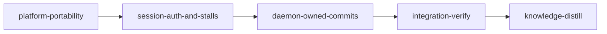

# Plan: Fix the six open GitHub issues (#19 to #24)

## Overview

Six issues are open on `cosmix/loom`, all filed on 2026-10-05 and 2026-10-06 against loom 1.1.1
(`ff3fe947`) on macOS 27. Each was investigated against the tree at `ff3fe947` by its own Opus
agent; the reports are summarised under "Root causes". Five break a first run on macOS outright.
The sixth (#22) blocks every operator who requires signed commits, on Linux too.

| Issue | Symptom | Root cause at `ff3fe947` | Stage |
| --- | --- | --- | --- |
| #21 | `loom run` prints its banner; the daemon never comes up | Daemon is a double `fork()` of a process that has already run threads (`run_bounded` reader threads); the grandchild touches CoreFoundation (reqwest's system-proxy lookup in the quota poller) and objc aborts it. The success byte is sent before the crash, so `loom run` exits 0 | `platform-portability` |
| #23 | Completion ends `verified_pending_ack` / `daemon_transport` | Every client joins `orchestrator.sock` onto the worktree's `.loom/work` symlink spelling; past 103 bytes (107 on Linux) the connect fails `InvalidInput` before the syscall, which is classified as a hard error, not "unreachable". The completion broker has its own copy of the connect | `platform-portability` |
| #24 | No review round is ever recorded; `loom subagents watch` exits 1 | BSD `wc -c` left-pads, and five hook sites test the raw value against `^[0-9]+$`; the same bug blocks every codex forward on macOS. Separately, the sandbox's `sysctl-read` allowlist has no `kern.bootsessionuuid` | `platform-portability` |
| #19 | Stage sessions start "Not logged in" | `USER`/`LOGNAME` are stripped twice: by `STAGE_HOST_ENV_ALLOWLIST` (native spawner and every tmux server) and by the wrapper's `env -i` list. The claude CLI finds its Keychain login by `$USER`. Loom's own Keychain probe runs in the daemon's environment, so it passes | `session-auth-and-stalls` |
| #20 | A stalled stage stays `executing` for hours with only a log line | Stall-recovery exhaustion `eprintln!`s and leaves the stage `Executing` with its agent alive, and the escalated latch then suppresses every later event. `stall_recoveries` is never reset. A session that never heartbeats is never reported | `session-auth-and-stalls` |
| #22 | A signed-commit operator commits every stage by hand | `~/.gnupg` is a mandatory read denial in every session sandbox (Linux too), and the session is the only party told to commit. Loom's own merge commits are unsigned even with `commit.gpgsign=true` (`commit-tree` without `-S`) | `daemon-owned-commits` |

## Goals and non-goals

- Every issue is fixed at its root cause, with a test that fails at `ff3fe947` and a
  behavioural contract wherever a public surface carries the behaviour.
- Signed commits: every stage session commits through a relayed `loom stage commit`; the daemon
  makes the commit outside the sandbox with the operator's git configuration, so a signing
  operator's commits are signed, and loom's merge commits are signed as well. The `~/.gnupg`
  read denial stays.
- macOS behaviour (BSD `wc`, `stat`, `date`) is exercised on Linux CI through a shim directory;
  the hook test suite joins CI in both modes.
- Non-goals: no macOS CI runner (the operator chose Linux plus shims); no forwarding of proxy,
  CA or `CLAUDE_CONFIG_DIR` variables to sessions (recorded as a concern by knowledge-distill);
  no "next loom command" banner (the existing desktop notification plus `loom status` cover
  it); `(stale)` keeps its fixed 300 s threshold. No backwards compatibility or migration code
  (the project is unreleased).

## Decisions this plan settles

The operator settled 1, 9, 10 and 11 when asked. The rest follow the investigators'
recommendations. YAML is authoritative where it and the prose differ.

1. **#22: one commit path.** Every stage, knowledge and merge session commits with
   `loom stage commit <stage-id> -m "<message>"` and then waits with
   `loom request status <id> --wait 120`. No session runs `git commit`. Completing a stage does
   not commit on the session's behalf: completion evidence binds HEAD, and merge sessions never
   complete.
2. **#22: the daemon commits with plumbing only.** It never reads the worktree and never runs
   repository hooks on the host. It runs `commit-tree` (with `-S` when
   `git config --type=bool commit.gpgsign` is true) and then a compare-and-swap `update-ref`.
   It refuses:
   - a HEAD other than the one the session saw, or a tree other than the one it wrote;
   - a staged path under `.loom/`, `.work/` or `.worktrees/`, or a gitlink;
   - the wrong branch;
   - a non-owner session, or a session kind the matrix refuses;
   - a `MERGE_HEAD` from anything but a merge session.

   The session runs `pre-commit` and `commit-msg` itself, inside its sandbox, with
   `git hook run`, then `git write-tree`. Staged paths are not checked against the stage's
   `files:`. Conventional Commit types stay doctrine.
3. **#22: signing failures block the stage.** Signing runs with a 30 s bound. A failure refuses
   the request with `signing failed: <stderr tail>`, leaves the ref unmoved, and blocks the stage
   through `handle_block_stage`, the transition the inbox drain applies for a relayed block
   (`loom/src/orchestrator/core/inbox_drain/apply.rs`), with the remedy and `loom stage retry`.
   `park_refused_relay` is not used: it skips every stage with a contract freeze.
   `loom run` refuses to start when `commit.gpgsign` is true and a probe signature fails. The
   probe signs an empty-tree `commit-tree -S` with the same signing environment the daemon will
   use, from the operator's terminal, so a terminal pinentry can prompt and the agent caches
   the passphrase.
4. **#21: the daemon is re-executed, never forked.** `loom run` spawns
   `current_exe() run --daemon-child <absolute work root>`, a hidden flag:
   - the process gets an allowlisted environment, null stdin, and stdout plus stderr on one
     pipe; it calls `setsid` itself;
   - the parent reads `0x01` as "ready" and `0x02` as "output now goes to orchestrator.log";
     any other bytes are diagnostics;
   - the deadline is 10 s and the post-ready grace is 1 s;
   - on the deadline, the parent sends SIGTERM and reaps the child;
   - failure exits 1, naming the child's exit status or signal and its captured text, plus the
     log tail once `0x02` was seen.

   The fork path is deleted on every platform. `RUST_LOG`, `SCCACHE_DIR` and
   `SCCACHE_CACHE_SIZE` join the daemon allowlist.
5. **#23: every client dials the resolved state root.** New `loom/src/daemon/socket.rs` holds:
   - `SOCKET_FILE`, `SUN_PATH_MAX = 104` (portable), `socket_path_fits`;
   - `socket_path(work_dir)`, which canonicalizes `work_dir` and falls back to the spelling it
     was given;
   - `socket_path_problem(work_dir)`.

   A path past the limit classifies as `DaemonReach::Unreachable`; other `InvalidInput` errors
   stay errors. The completion broker uses `crate::daemon::send_request`; its private connect
   is deleted. Completion is never spooled. `loom run` refuses, before spawning the daemon, a
   work root whose socket path does not fit (`loom run --foreground` binds no socket and is
   not refused); `loom init` warns about it.
6. **#24: portable shell helpers live in `loom-hooks/_lifecycle.sh`.**
   - `loom_lifecycle_file_bytes` strips whitespace before the numeric test (never `$(( ))`).
   - `loom_lifecycle_sha256` uses `sha256sum`, else `shasum -a 256`.
   - Every padded-`wc` site and every bare `sha256sum` goes through them.
   - The BSD epoch fallback accepts fractional seconds.
   - A skipped `loom-code-reviewer` stop writes one row to
     `.loom/work/subagents/<stage>/stop-skips.jsonl`. `loom stage review status` and the review
     gate's failure message print "N reviewer spawns, M rounds, K stop events not harvested"
     with the recorded reasons.
7. **#24: boot ID from the session environment.** The daemon computes the boot ID when it
   writes a session wrapper and exports it as `LOOM_BOOT_ID`. `loom::process::boot_id` resolves
   a UUID-shaped `LOOM_BOOT_ID` first, then the OS source (`/proc/sys/kernel/random/boot_id`,
   `sysctl kern.bootsessionuuid`).
8. **#19: `USER` and `LOGNAME` reach the agent at both layers.**
   - One constant, `AGENT_SESSION_ENV_NAMES`, generates the wrapper's forwarding list.
   - `USER` and `LOGNAME` join `STAGE_HOST_ENV_ALLOWLIST`.
   - New `loom/src/claude/auth.rs` runs `claude auth status --json` under exactly the
     environment a stage gets. `loom run` refuses a definite `NotLoggedIn` and warns on
     `Unknown`.
   - Remote Control eligibility uses the same probe. The Keychain and credentials-file
     heuristics are deleted.
9. **Signing environment (operator).** `GNUPGHOME` and `SSH_AUTH_SOCK` reach the daemon only to
   be captured into a private `SigningEnv` at daemon-child startup, before any thread exists,
   and are then removed from its process environment. They are passed only to the signing git
   invocation and never reach a session.
10. **CI (operator).** `loom-hooks/tests/run-all.sh` runs in the `hook-syntax` CI job twice:
    plain, and with `LOOM_HOOK_TEST_BSD=1`, which puts `loom-hooks/tests/bsd-shims/` (padded
    `wc`, BSD `stat`, BSD `date`) first on PATH. No macOS runner.
11. **Lanes (operator).** `platform-portability` and `daemon-owned-commits` list
    `["claude", "codex"]`; `session-auth-and-stalls` lists `["claude"]`.
12. **#20: stalls park in `NeedsHumanReview`.**
    - **Exhausted stall recovery.** Takes the agents down, writes the stall handoff, and parks
      the stage. The reason names the session, the silence, the budget, the last activity, the
      recovery count and the last pane line, then a blank line, `Last pane lines:` and the pane
      tail (`review_notes`, the web view's field, is derived from `review_reason`). The existing
      transition announcement sends the desktop notification (`loom/src/orchestrator/notify.rs`).
    - **A session that never worked.** That is, a stage session with no tool heartbeat since
      SessionStart and no context tokens recorded (SessionStart also fires on compaction and
      resume, so `context_tokens == 0` guards a session that compacted), or with no heartbeat at
      all past `created_at` plus its budget. It escalates at 1x its budget,
      captures its pane tail, runs the auth probe, and parks:
      - with the login remedy when the probe says `NotLoggedIn`;
      - with the never-worked reason otherwise.

      Neither charges `stall_recoveries` or re-queues.
    - **Reset.** `human-review --approve`, `stage reset` and `stage retry` reset
      `stall_recoveries` to 0.
    - **`loom run`** prints `loom status --live`, `loom status --web` and the absolute
      `orchestrator.log` path.

## Before `loom run`

- The operator commits this plan, its briefs (`doc/plans/briefs/open-issues-19-24/`) and the
  knowledge correction in `doc/loom/knowledge/mistakes/doctrine-and-acceptance.md` on
  `fix-macos-issues` before `loom init`. A stage worktree is cut from `HEAD`, so an uncommitted
  brief is missing there (`mistakes/verification-harness.md`, "Untracked Plan and Worker
  Briefs Leave a Worktree Stage Blind").
- Loom merges every stage into the branch checked out at `loom init`: `fix-macos-issues`.
- `~/.cargo/advisory-db` and `~/.bun/install/cache` exist on this host (checked 2026-10-06). The
  operator runs `cargo audit` once in `loom/` on the host first, so `cargo audit --no-fetch` in
  `platform-portability` reads a fresh database.

## HAZARD: this plan runs on the installed binary

Every stage runs under the loom binary installed before the plan (built from `ff3fe947`, on
Linux). The bugs this plan fixes are macOS-only or signing-only, so the plan's own run is not
affected by them. The hooks a stage session runs are the installed copies under
`~/.claude/hooks/loom/`; the tests drive the repository copies. `daemon-owned-commits` changes
the commit doctrine, but its own session (and the two bookends after it) still follow the
installed doctrine and commit with `git commit`. That is expected: the new path ships with the
binary built from this plan.

## Knowledge bootstrap: skipped

The tier-1 files describe this codebase. `loom knowledge check --strict --baseline
doc/loom/knowledge/check-baseline.txt` failed at `ff3fe947` on one issue: the checker's source-path
regex reads `` `AGENTS.md.template` `` as a reference to `AGENTS.md`. That was corrected on
2026-10-06, before this plan, by unquoting the two mentions in
`mistakes/doctrine-and-acceptance.md`, and the check now exits 0. The checker defect itself is
fixed in `platform-portability` (W4). The seams each stage changes are covered by the topics
its brief quotes.

## Execution diagram



The three code stages run in sequence because each edits files the next one edits (Q2 below).

## Stage necessity

- **platform-portability.** Q1: `session-auth-and-stalls` adds startup checks to
  `run_startup_preflights` in `loom/src/commands/run/mod.rs`, which this stage restructures for
  the re-executed daemon. `daemon-owned-commits` forwards the signing variables through
  `daemon/server/launch.rs`, which this stage creates. Q4: merged with
  `session-auth-and-stalls`, the work is six workers, a daemon state-machine change and two
  process-lifecycle redesigns, past 500,000 tokens in one session.
- **session-auth-and-stalls.** Q2 on `platform-portability` (`commands/run/mod.rs`,
  `process/mod.rs`, `daemon/server/environment.rs`, `loom/maintainability-baseline.txt`).
- **daemon-owned-commits.** Q2:
  - with `platform-portability`: `daemon/server/environment.rs`, `daemon/server/launch.rs`,
    `commands/run/daemon_child.rs`, `loom-hooks/tests/run-all.sh`, the maintainability ledger;
  - with `session-auth-and-stalls`: `commands/run/mod.rs` (the signing probe joins
    `run_startup_preflights`).

  Q4: the relay kind, daemon handler, signing, CLI and the doctrine sweep fill one session.

## Gate conventions (every code stage)

- **`working_dir: "loom"`.** Loom runs each contract as `cargo test <name> -- --exact` from
  `working_dir`.
  - YAML paths are package-relative; paths outside the package are written `../loom-hooks/...`,
    `../skills/...`, `../CLAUDE.md.template`, `../.github/...`.
  - Prose paths are repository-relative.
- **Warm-up.** `cargo build --all-targets` is the first acceptance entry. The main agent starts
  it in the background before briefing, and runs every acceptance command once in-session
  before `loom stage complete` (each acceptance command has a 300 s cap).
- **The full suite** (`cargo test --all-targets --no-fail-fast`) runs once, in
  integration-verify. A standard stage runs module filters and named `--exact` tests, plus
  build, clippy, fmt, rustdoc with warnings denied, and `cargo test --test maintainability`.
  Every module filter named here selected at least one test at `ff3fe947` (see Baseline);
  `orchestrator::core::loop_recovery` selects zero and is never used.
- **Workers do not run `cargo fmt`.** They share one crate mid-wave. After the last wave the
  main agent runs `cargo fmt --all` once, then the acceptance commands.
- **Contracts** live in one integration-test file per stage, `tests/<stage>_contracts.rs`.
  - Top-level `#[test]` functions, so each `test` value is the function name. Cargo discovers
    the file, so no harness file is needed.
  - A contract that spawns the loom binary does so only through `helpers::loom_cmd()`, declared
    as `#[path = "integration/helpers.rs"] #[allow(dead_code)] mod helpers;` (as
    `tests/map_cli.rs` does). `tests/integration/binary_spawn_guard.rs` fails any other spawn.
  - **Mutation check.** Before the final review round, the main agent applies the
    implementation each contract's `rejects:` names (or reverts the key line), confirms the
    contract fails, restores the tree, and records
    `loom memory note "mutation: <id> red under <mutation>"`.
- **Sockets.** No contract binds or dials a Unix socket: a Linux stage sandbox denies `AF_UNIX`
  socket creation, so such a contract would pass at the freeze for the wrong reason. Connect
  behaviour is proven by in-crate tests guarded with
  `process::sandbox_probe::skip_unless(unix_socket_bindable)` (`loom/src/daemon/rpc.rs` tests),
  which run unskipped in integration-verify's full suite only if that stage's sandbox allows it.
  This is a recorded trade: the behavioural proof of #23's connect fix is
  `socket_path` / `socket_path_problem` plus those in-crate tests.
- **The maintainability ledger** (`loom/maintainability-baseline.txt`, a ratchet file) is
  exact. Each code stage changes ledgered units: `remote_control.rs` (598),
  `lifecycle.rs` `start` and `run_server`, `cli/dispatch.rs` `dispatch`, and
  `orchestrator/signals/cache.rs` (524).
  - The main agent, never a worker, updates the ledger after the last wave so that
    `cargo test --test maintainability` passes.
  - It then files ONE `dispute-integrity` for `TI-ratchet-loom/maintainability-baseline.txt`
    after the final review round, with the reason "tightening only: <entries> lowered or
    removed by the refactors this plan prescribes".
  - A ledger line may only go down or disappear. A file this plan grows past 400 lines, or a
    function past 50, is split instead.
- **Test-integrity.** Existing assertion lines in test files are never edited (a `TI-edit`
  event); new assertions go in new lines or new tests. A moved test file keeps its assertion
  lines verbatim.
- **Anchors** are symbols; line numbers in this plan and the briefs were read at `ff3fe947`.

## Baseline evidence

Measured on the host at `ff3fe947` on 2026-10-06, not under a stage sandbox:

- **Gate commands.**
  - `cargo build --all-targets`: exit 0.
  - `cargo clippy --all-targets -- -D warnings`: exit 0.
  - `cargo fmt --all -- --check`: exit 0.
  - `loom knowledge check --strict --baseline doc/loom/knowledge/check-baseline.txt`: exit 0
    after the correction above.
- **Full suite** (`cargo test --all-targets --no-fail-fast`, 1 min 11 s): 7,689 passed and 1
  failed.
  - The failure was `commands::status::web::tests::errors::a_silent_client_is_answered_with_a_408`
    (an empty response), while six investigation agents were loading the machine.
  - The test passed 3 of 3 runs alone.
  - `scripts/flake-check.sh --runs 10 'commands::status::web::tests::errors::'` passed under
    load 8.
  - `platform-portability` owns the diagnosis (W4).
- **Hook scripts.**
  - `bash loom-hooks/tests/run-all.sh`: 95 passed, 0 failed (it has never run in CI).
  - `./scripts/check-hook-syntax.sh`: 147 scripts parse.
  - The investigator reproduced #24 on Linux: a `wc` function that pads to 8 columns makes
    `loom-hooks/tests/subagent-stop-review-harvest.sh` fail ("should invoke the delegate once,
    got 0").
- **Tests each module filter selects** (`cargo test --lib <filter> -- --list`):

  | Filter | Tests | Filter | Tests |
  | --- | --- | --- | --- |
  | `daemon::` | 157 | `commands::run::` | 60 |
  | `control_complete` | 12 | `commands::repair::` | 46 |
  | `commands::status::` | 436 | `commands::init::` | 47 |
  | `verify::review::` | 24 | `process::` | 26 |
  | `commands::subagents::` | 126 | `orchestrator::terminal::` | 236 |
  | `cli::` | 11 | `claude::` | 24 |
  | `remote_control` | 31 | `orchestrator::core::event_handler` | 67 |
  | `orchestrator::monitor::` | 101 | `commands::stage::state` | 10 |
  | `commands::stage::human_review` | 9 | `commands::stage::skip_retry` | 3 |
  | `relay::` | 138 | `orchestrator::core::inbox_drain` | 32 |
  | `git::` | 389 | `commands::request` | 8 |
  | `orchestrator::signals::` | 234 | `completions::` | 104 |

  The integration targets select `--test worker_evidence` 8, `--test codex_evidence` 20 and
  `--test maintainability` 8.
- **`claude auth status --json`** (claude 2.1.291), captured on 2026-10-06:
  - Logged in: exit 0, keys `analyticsDisabled, apiProvider, authMethod, configDirectory, email,
    loggedIn, orgId, orgName, projectsDirectory, subscriptionType`, with `loggedIn: true` and
    `authMethod: "claude.ai"`.
  - With an empty `HOME`: exit 1 and
    `{"loggedIn": false, "authMethod": "none", "apiProvider": "firstParty", "analyticsDisabled": false, "projectsDirectory": "<HOME>/.claude/projects", "configDirectory": "<HOME>/.claude"}`.
  - The probe parses only `loggedIn` and `authMethod`, and never logs `email`, `orgId` or
    `orgName`.

## Stages

### 1. platform-portability (#21, #23, #24)

Fixes the three bugs that stop a macOS run at the daemon, at completion and at the review gate,
and the boot-ID denial, and puts BSD tool behaviour under test.

Every worker reads `doc/plans/briefs/open-issues-19-24/common.md`, then its own brief. The
crate does not compile between the start and the end of the wave (W1 calls W2's socket API and
W4's boot-ID API), so no worker runs `cargo` except where its brief names one check.
Wave: W1, W2, W3 and W4 (background, one message) plus W5 (codex, foreground, same message).
After all return the main agent runs `cargo fmt --all`, updates the ledger, routes any compile
error to a fresh worker of the owning territory, then runs the gate.

| Worker | Role | Tier | Files owned | Shared context | Brief path |
| ------ | ---- | ---- | ----------- | -------------- | ---------- |
| W1 | Daemon re-exec launch and readiness (#21) | opus | src/daemon/server/lifecycle.rs; src/daemon/server/lifecycle/socket_limit.rs; src/daemon/server/lifecycle/tests.rs; src/daemon/server/launch.rs; src/daemon/server/launch/tests.rs; src/daemon/server/environment.rs; src/daemon/server/mod.rs; src/daemon/mod.rs; src/commands/run/mod.rs; src/commands/run/daemon_child.rs; src/cli/types.rs; src/cli/dispatch.rs; src/main.rs; src/orchestrator/terminal/native/detection.rs; src/fs/tmux_tmpdir.rs | common.md; W2 socket API | doc/plans/briefs/open-issues-19-24/platform-portability/w1-daemon-launch.md |
| W2 | Socket path resolution and classification (#23) | sonnet | src/daemon/socket.rs; src/daemon/rpc.rs; src/daemon/rpc_tests.rs; src/commands/stage/control_complete.rs; src/commands/stage/tests/control_complete.rs; src/daemon/server/core.rs; src/daemon/server/shutdown.rs; src/commands/status/ui/tui/daemon_client.rs; src/commands/status/web/broadcast.rs; src/commands/repair/daemon_checks.rs; src/verify/review/observer.rs; src/commands/init/execute.rs; src/commands/init/execute/tests.rs; src/commands/status/ui/tui/app.rs | common.md | doc/plans/briefs/open-issues-19-24/platform-portability/w2-socket-path.md |
| W3 | Portable hooks, BSD shims, CI (#24 shell) | sonnet | ../loom-hooks/_lifecycle.sh; ../loom-hooks/codex-forward-result.sh; ../loom-hooks/codex-forward-guard.sh; ../loom-hooks/subagent-stop.sh; ../loom-hooks/teammate-idle.sh; ../loom-hooks/tests/bsd-shims/wc; ../loom-hooks/tests/bsd-shims/stat; ../loom-hooks/tests/bsd-shims/date; ../loom-hooks/tests/_bsd_path.sh; ../loom-hooks/tests/run-all.sh; ../loom-hooks/tests/subagent-stop-review-harvest.sh; ../loom-hooks/tests/subagent-stop-heartbeat-lock.sh; tests/worker_evidence.rs; tests/worker_evidence/support.rs; tests/worker_evidence/setup.rs; tests/codex_evidence/fixture_runtime.rs; tests/codex_evidence/happy_path.rs; ../.github/workflows/ci.yml | common.md | doc/plans/briefs/open-issues-19-24/platform-portability/w3-hook-portability.md |
| W4 | Boot ID consumers, review-gate hint, checker regex, web flake (#24 Rust) | sonnet | src/commands/subagents/wait/lease.rs; src/commands/subagents/wait/lease_boot_tests.rs; src/commands/subagents/wait/mod.rs; src/orchestrator/terminal/native/wrapper/host_env.rs; src/orchestrator/terminal/native/launch/host.rs; src/commands/stage/review_status.rs; src/verify/review/gate.rs; src/verify/review/gate_tests.rs; src/fs/knowledge/chunker/references.rs; src/commands/status/web/head.rs; src/commands/status/web/tests/errors.rs; src/commands/status/web/mod.rs; src/commands/status/web/connection.rs; src/orchestrator/terminal/native/tests_wrapper_env.rs | common.md; W5 boot-ID API | doc/plans/briefs/open-issues-19-24/platform-portability/w4-boot-id-and-review-hint.md |
| W5 | Boot-ID resolver unit (#24) | codex terra | src/process/boot_id.rs | common.md | doc/plans/briefs/open-issues-19-24/platform-portability/w5-boot-id-unit.md |

The main agent also adds `pub mod boot_id;` to `loom/src/process/mod.rs` as its single foundation
line before the wave. Neither W4 nor W5 touches that file.

W5 is a `loom-codex-forwarder` unit:

- spawned in the FOREGROUND with `--model gpt-5.6-terra --effort xhigh` and an explicit Bash
  timeout of 600000 ms;
- one file with its inline tests, three steps;
- no `git`, and no `.loom/` path.

The main agent checks `git status --short` after it returns and runs
`cargo test --lib process::boot_id` itself.

**Contract surface** (the contract session writes `tests/platform_portability_contracts.rs`
from this, before any code):

- **`loom::daemon::socket_path(work_dir: &Path) -> PathBuf`.**
  - Returns `work_dir.canonicalize()`, joined with `"orchestrator.sock"`, when canonicalization
    succeeds.
  - Otherwise returns the given spelling joined with `"orchestrator.sock"`.
- **`loom::daemon::socket_path_problem(work_dir: &Path) -> Option<String>`.**
  - Returns `None` when `socket_path(work_dir)` is shorter than `loom::daemon::SUN_PATH_MAX`
    (104) bytes.
  - Otherwise returns a message containing the byte count, the text `104` and the path.
  - Also re-exported: `loom::daemon::SOCKET_FILE: &str`.
- **`loom::daemon::await_ready`.**
  - Signature: `await_ready(child: &mut std::process::Child, reader: std::io::PipeReader,
    log_path: &Path, timing: loom::daemon::ReadyTiming) -> anyhow::Result<()>`, with
    `ReadyTiming { pub deadline: Duration, pub grace: Duration }`.
  - The child's stdout and stderr are the writer half of one `std::io::pipe()`.
  - Byte `0x01` means ready, and byte `0x02` means output now goes to `log_path`. Any other
    bytes are diagnostic text, kept for the error.
  - Returns `Ok` only when `0x01` arrived and the child is still alive at the end of `grace`.
  - Otherwise returns an error whose text names the exit status or the signal (as `SIGABRT`,
    `SIGKILL`, and so on). The error also carries the diagnostic text, and the last 20 lines
    of `log_path` when `0x02` was seen.
  - At the deadline, the child is sent SIGTERM and reaped, and the error contains
    `did not become ready`.
- **`loom::process::boot_id`.**
  - `BOOT_ID_ENV: &str = "LOOM_BOOT_ID"`.
  - `resolve_boot_id(env_value: Option<&str>, os_boot_id: impl FnOnce() -> anyhow::Result<String>)
    -> anyhow::Result<String>`. It returns the trimmed env value when it is UUID-shaped (8-4-4-4-12
    hex digits, either case) without calling `os_boot_id`; otherwise it returns `os_boot_id()`.
  - `os_boot_id() -> anyhow::Result<String>`.
  - `current_boot_id() -> anyhow::Result<String>`.
- **`loom-hooks/_lifecycle.sh` functions.** They are sourced under `bash` with a TempDir
  `bin/` first on `PATH`. That directory holds a `wc` script that runs the real `wc` and
  re-emits every count right-aligned in 8 columns, as BSD `wc` does.
  - `loom_lifecycle_resolve_start <work> <stage> <parent> <loom_session> <agent>
    <expected_type> <observed> <hook>` must still resolve a single exact start row in
    `<work>/subagents/<stage>/starts.jsonl`.
  - The row fixture is copied from `loom-hooks/tests/subagent-stop-review-harvest.sh`.

**Risk checklist walk:**

| Area | Coverage |
| --- | --- |
| Filesystem paths and symlinks | `socket-path-resolves-the-worktree-spelling` |
| Configuration | `socket-problem-measures-the-resolved-path`, `boot-id-prefers-the-session-variable` |
| Lifecycle | `ready-then-abort-is-a-launch-failure`; named tests `launch::tests::a_silent_child_times_out_and_is_reaped` and `launch::tests::an_early_exit_reports_status_and_text` |
| Process I/O | the same `await_ready` tests (pipe reader, no unbounded read) |
| External data (BSD tool output) | `padded-wc-resolves-the-start-row`; both run-all modes |
| Reachability | wiring on `launch::spawn_daemon(` in `lifecycle.rs` and `daemon_child::execute(` in `commands/run/mod.rs`; wiring on `current_boot_id(` in `lease.rs` and `os_boot_id(` in `launch/host.rs` |
| Untrusted input | `LOOM_BOOT_ID` is shape-checked; a forged value only interrupts its own caller's wait, so no contract |

### 2. session-auth-and-stalls (#19, #20)

Makes stage sessions logged in on macOS, refuses to start a run whose sessions cannot log in,
and turns silent stalls into a parked stage with a reason, a remedy and a desktop notification.

Wave 1: E1, E2 and E3 in one message.

- E2 calls E1's `claude::auth::stage_auth_status` and E3's `orchestrator::terminal::session_tail`
  through the pinned signatures in the common brief.
- No worker runs `cargo` beyond the one check its brief names.
- Then the main agent runs `cargo fmt --all`, updates the ledger, and runs the gate.

| Worker | Role | Tier | Files owned | Shared context | Brief path |
| ------ | ---- | ---- | ----------- | -------------- | ---------- |
| E1 | Agent environment, auth probe, startup refusal, Remote Control, run guidance (#19, #20 C) | sonnet | src/process/environment.rs; src/process/mod.rs; src/orchestrator/terminal/native/wrapper/script_text.rs; src/orchestrator/terminal/native/wrapper.rs; src/orchestrator/terminal/native/wrapper/tests_exec_env.rs; src/claude.rs; src/claude/auth.rs; src/claude/auth_tests.rs; src/commands/run/mod.rs; src/commands/run/auth_preflight.rs; src/commands/run/guidance.rs; src/remote_control.rs; src/remote_control_tests.rs; src/quota/credentials.rs; src/daemon/server/environment.rs | common.md | doc/plans/briefs/open-issues-19-24/session-auth-and-stalls/e1-environment-and-auth.md |
| E2 | Stall parking and never-worked fail-fast (#20 A, B) | opus | src/orchestrator/core/event_handler/recover_hung.rs; src/orchestrator/core/event_handler/recover_hung_tests.rs; src/orchestrator/core/event_handler/recover_hung_park_tests.rs; src/orchestrator/core/event_handler.rs; src/orchestrator/core/loop_recovery/mod.rs; src/orchestrator/core/loop_recovery/park.rs; src/orchestrator/core/heartbeat_apply.rs; src/orchestrator/monitor/hung_latch.rs; src/orchestrator/monitor/never_worked.rs; src/orchestrator/monitor/events.rs; src/orchestrator/monitor/mod.rs; src/orchestrator/monitor/tests/mod.rs; src/orchestrator/monitor/tests/never_worked.rs | common.md; E1 auth API; E3 tail API | doc/plans/briefs/open-issues-19-24/session-auth-and-stalls/e2-stall-parking.md |
| E3 | Pane tail and stall-counter resets (#20) | sonnet | src/orchestrator/terminal/session_tail.rs; src/orchestrator/terminal/mod.rs; src/orchestrator/terminal/tmux/capture.rs; src/orchestrator/terminal/tmux/mod.rs; src/orchestrator/terminal/tmux/tests.rs; src/commands/stage/state.rs; src/commands/stage/state_tests.rs; src/commands/stage/human_review.rs; src/commands/stage/human_review_tests.rs; src/commands/stage/skip_retry.rs | common.md | doc/plans/briefs/open-issues-19-24/session-auth-and-stalls/e3-pane-tail-and-resets.md |

**Contract surface** (`tests/session_auth_and_stalls_contracts.rs`):

- **`loom::process::agent_session_environment_from`.**
  - Signature: `agent_session_environment_from<I, K, V>(source: I) -> Vec<(OsString, OsString)>`,
    where `I: IntoIterator<Item = (K, V)>`, `K: Into<OsString>` and `V: Into<OsString>`.
  - It is the pure mirror of the wrapper's forwarding loop. It keeps each name in
    `loom::process::AGENT_SESSION_ENV_NAMES` that has a non-empty value, plus `HOME`, and
    `PATH` (defaulting to `/usr/bin:/bin`).
  - It drops everything else.
- **`loom::process::apply_stage_environment_from(command: &mut std::process::Command,
  source: I)`.** The existing function is made `pub` and re-exported. It clears the
  environment and copies `STAGE_HOST_ENV_ALLOWLIST` names from `source`.
- **`loom::claude::auth`.**
  - `parse_auth_status(stdout: &str, exit_success: bool) -> AuthProbe`, with
    `pub enum AuthProbe { LoggedIn { method: String }, NotLoggedIn, Unknown(String) }`.
  - `loggedIn: false` gives `NotLoggedIn` whatever the exit status.
  - `loggedIn: true` gives `LoggedIn` with `authMethod`.
  - Unparseable output gives `Unknown`.
  - Also `stage_auth_status(claude_path: &Path) -> AuthProbe`, which runs
    `<claude_path> auth status --json` with `env_clear()` plus
    `agent_session_environment_from(std::env::vars_os())`, bounded at 30 s.
- **Stage persistence.**
  - Write: `loom::fs::work_dir::WorkDir::new(tmp)?` then `.initialize()?`, then
    `loom::verify::transitions::save_stage(&stage, wd.root())?`.
  - Read back: `loom::verify::transitions::load_stage(id, wd.root())?`.
  - `loom::models::stage::Stage { id, name, status: StageStatus::NeedsHumanReview,
    stall_recoveries: 2, ..Stage::default() }`.
  - The binary is driven with `helpers::loom_cmd().current_dir(tmp).args(["stage",
    "human-review", id, "--approve"])`.

**Risk checklist walk:**

| Area | Coverage |
| --- | --- |
| Configuration propagation | `agent-environment-keeps-user-and-logname`, `stage-host-layer-keeps-user` |
| External data | `logged-out-status-is-not-logged-in` (fixture from the captured output above) |
| Lifecycle | `approve-resets-stall-recoveries`. The in-crate tests below are named in acceptance: exhaustion parks and takes the agent down; never-worked parks without a charge; the auth probe routes the reason; `stage reset` and `stage retry` reset the counter |
| Reachability | wiring on `auth_preflight::` in `commands/run/mod.rs`, `stage_auth_status(` in `recover_hung.rs` and `remote_control.rs`, and `AGENT_SESSION_ENV_NAMES` in `script_text.rs` |
| Untrusted input | `claude auth status` output is parsed for two keys only; `email`, `orgId` and `orgName` are never stored or printed (named test `claude::auth::tests::probe_output_never_carries_identity`) |

### 3. daemon-owned-commits (#22)

Moves every session commit to a relayed `loom stage commit` that the daemon applies outside the
sandbox, signs daemon commits and merge commits when the operator signs, and rewrites the commit
doctrine on every surface.

Wave 1 runs C1, C2 and C3 in the background and U1 and U2 as codex in the foreground, all in one
message.

- Pinned interfaces between them are in the common brief.
- The crate does not compile until all five return.
- Then the main agent runs `cargo fmt --all`, updates the ledger, routes compile errors to a
  fresh worker of the owning territory, and runs the gate.

| Worker | Role | Tier | Files owned | Shared context | Brief path |
| ------ | ---- | ---- | ----------- | -------------- | ---------- |
| C1 | Git commit core, signing, merge signing, signing probe | opus | src/git/stage_commit.rs; src/git/stage_commit/tests.rs; src/git/stage_commit/checks.rs; src/git/signing.rs; src/git/signing/tests.rs; src/git/mod.rs; src/git/runner.rs; src/git/merge/tree.rs; src/daemon/server/environment.rs; src/daemon/server/launch.rs; src/commands/run/daemon_child.rs; src/commands/run/mod.rs; src/commands/run/signing_preflight.rs | common.md | doc/plans/briefs/open-issues-19-24/daemon-owned-commits/c1-commit-core-and-signing.md |
| C2 | Commit relay kind, daemon handler, CLI wiring | opus | src/relay/kind.rs; src/relay/payload.rs; src/relay/matrix.rs; src/relay/tests_matrix.rs; src/orchestrator/core/inbox_drain.rs; src/orchestrator/core/inbox_drain/apply.rs; src/orchestrator/core/inbox_drain/commit.rs; src/orchestrator/core/inbox_drain/commit_tests.rs; src/orchestrator/core/inbox_drain/tests_matrix.rs; src/commands/hook/relay.rs; src/cli/types_stage.rs; src/cli/dispatch_stage.rs; src/cli/types_ops.rs; src/cli/dispatch.rs; src/commands/stage/mod.rs; src/completions/dynamic/mod.rs; src/relay/mod.rs; src/orchestrator/core/inbox_drain/test_support.rs; src/completions/dynamic/tests/tests_commands.rs | common.md; U1, U2 signatures | doc/plans/briefs/open-issues-19-24/daemon-owned-commits/c2-relay-and-handler.md |
| C3 | Commit doctrine and hooks | sonnet | src/orchestrator/signals/helpers.rs; src/orchestrator/signals/cache.rs; src/orchestrator/signals/merge.rs; src/orchestrator/signals/format/helpers.rs; src/orchestrator/signals/format/codex.rs; src/orchestrator/signals/tests_commit_timing.rs; src/orchestrator/signals/tests_doctrine.rs; ../CLAUDE.md.template; ../AGENTS.md.template; ../skills/loom-orchestration/SKILL.md; ../loom-hooks/_subagent-preamble.txt; ../loom-hooks/commit-filter.sh; ../loom-hooks/commit-guard.sh; ../loom-hooks/post-tool-use.sh; ../loom-hooks/loom-relay.sh; ../loom-hooks/tests/commit-filter-session-git-commit.sh; ../loom-hooks/tests/post-tool-use-commit-reminder-tokenized.sh; ../loom-hooks/tests/loom-relay-kinds.sh; ../loom-hooks/tests/run-all.sh | common.md | doc/plans/briefs/open-issues-19-24/daemon-owned-commits/c3-doctrine-and-hooks.md |
| U1 | `loom stage commit` command module | codex terra | src/commands/stage/commit.rs | common.md | doc/plans/briefs/open-issues-19-24/daemon-owned-commits/u1-stage-commit-command.md |
| U2 | `loom request status --wait` | codex terra | src/commands/request/status.rs | common.md | doc/plans/briefs/open-issues-19-24/daemon-owned-commits/u2-request-wait.md |

U1 and U2 are `loom-codex-forwarder` units:

- spawned in the FOREGROUND with `--model gpt-5.6-terra --effort xhigh` and an explicit Bash
  timeout of 600000 ms;
- each is one file with its inline `#[cfg(test)] mod tests`, at most three steps;
- no `git`, and no `.loom/` path.

The main agent checks `git status --short` after each and runs that file's tests itself.
Hook files over 400 lines that C3 edits (`commit-filter.sh` 494, `commit-guard.sh` 649) must not
grow. A new sourced hook file would need registering in `loom/src/fs/permissions/constants.rs`
(`LOOM_HOOKS`), outside C3's row, so C3 trims or reuses existing code instead and reports if it
cannot.

**Contract surface** (`tests/daemon_owned_commits_contracts.rs`; every test builds its own git
repository in a TempDir with `GIT_CONFIG_GLOBAL` and `GIT_CONFIG_SYSTEM` pointed at missing
files, `GIT_CONFIG_NOSYSTEM=1`, and `user.name`/`user.email` set locally, as
`src/verify/impact_tests_tests.rs` does):

- **`loom::git::stage_commit::CommitRequest`:** `{ pub message: String, pub expected_head:
  String, pub expected_tree: String }`.
- **`loom::git::stage_commit::CommitScope`:** `StageBranch { stage_id: String }`,
  `Knowledge { target_branch: String, prefix: PathBuf }`, `Merge { stage_id: String }`.
- **`loom::git::stage_commit::commit_staged`:**
  - Signature: `commit_staged(repo: &Path, scope: &CommitScope, request: &CommitRequest) ->
    Result<String, CommitRefusal>`.
  - Returns the new commit id.
  - `CommitRefusal` implements `Display`.
  - It signs (`-S`) when `git -C repo config --type=bool commit.gpgsign` is true, using
    `loom::git::signing::installed()`.
  - It never runs a repository hook (`core.hooksPath=/dev/null`).
- **`loom::git::merge::commit_merge(repo, tree, [p1, p2], message) -> Result<String>`** is
  unchanged in signature. It signs under the same rule.
- **A fake signer.** `gpg.program` set repo-locally to a TempDir script that appends its argv
  to a log file. It prints `\n[GNUPG:] SIG_CREATED` on stderr and an ASCII-armored block on
  stdout, which is enough for git to write a `gpgsig` header.
- **`loom::relay::RequestKind::Commit`:**
  - `is_control()` is true.
  - `loom::relay::verdict(loom::models::session::SessionType::Contract, RequestKind::Commit)`
    is `MatrixVerdict::Refuse`.

**Risk checklist walk:**

| Area | Coverage |
| --- | --- |
| Untrusted input / filesystem paths | `staged-state-path-is-refused` |
| Configuration propagation | `stage-commit-is-signed-when-gpgsign`, `merge-commit-is-signed-when-gpgsign` |
| Lifecycle and concurrency | `moved-head-is-refused` |
| Trust boundary / process | `planted-hooks-never-run` |
| Reachability | `commit-kind-is-control-and-refused-for-contract`; integration-verify wiring test on `loom stage commit --help`; wiring on `RequestKind::Commit` in `inbox_drain/apply.rs` and `commit_staged(` in `inbox_drain/commit.rs` |

### Integration verification

Full suite and lints with zero tolerance, both hook-suite modes, the flake filters, parallel
code review (security on the commit handler, the signing environment and the daemon launch;
architecture on the stall parking and the readiness protocol; test coverage with contract
mutation spot-checks), every pending reviewer suggestion weighed, and wiring tests that drive
the built binary.

No acceptance criterion starts a daemon: a Linux stage sandbox cannot bind `AF_UNIX`. After the
plan merges, the operator smoke-tests on the host:

- `loom init` then `loom run` on a scratch repository: it prints the follow guidance, and
  `loom status` shows the daemon running.
- `loom stop`.
- A deep scratch path, where `loom run` refuses with the socket-path message.

The reporter is asked to confirm #19, #21, #23 and #24 on macOS.

### Knowledge distillation

Applies every `stale-knowledge:` memory first. Then it rewrites the sections the investigators
found stale, records the new mistakes, and updates the README: signed commits and
`loom stage commit`, the `loom run` startup checks, and stall parking.

---

<!-- loom METADATA -->

```yaml
loom:
  version: 2
  ratchet_files:
    - loom/maintainability-baseline.txt
    - doc/loom/knowledge/check-baseline.txt
  provision:
    - working_dir: "web"
      command: "test ! -e .npmrc && test ! -L .npmrc && bun install --frozen-lockfile --ignore-scripts --backend=copyfile --config=/dev/null"
  sandbox:
    enabled: true
    auto_allow: true
    filesystem:
      deny_read: ["~/.ssh/**", "~/.aws/**", "~/.config/gcloud/**", "~/.gnupg/**"]
      allow_write:
        - "~/.cargo/advisory-db..lock"
    network:
      allowed_domains: ["crates.io", "index.crates.io", "static.crates.io", "registry.npmjs.org"]
      allow_local_binding: false
      allow_unix_sockets: []
  stages:
    - id: platform-portability
      name: "Platform portability: daemon launch, socket path, portable hooks, boot ID"
      summary: "loom run re-executes the daemon instead of forking it and reports a daemon that dies at startup; every client reaches the daemon through the short resolved socket path; hooks stop rejecting BSD wc output, so review rounds and codex forwards are recorded on macOS; subagent waits work inside the macOS sandbox."
      stage_type: standard
      skills: ["loom-rust", "loom-ci-cd"]
      implementers: ["claude", "codex"]
      subagent_timeout_secs: 900
      working_dir: "loom"
      dependencies: []
      description: |
        Implement stage 1 of doc/plans/PLAN-open-issues-19-24.md ("platform-portability"; Decisions 4-7 and 10).
        Use parallel subagents and skills to maximize performance.
        Every worker first reads doc/plans/briefs/open-issues-19-24/common.md, then its own brief. Spawn every Claude worker BY AGENT TYPE (W1 loom-senior-software-engineer; W2, W3, W4 loom-software-engineer) in the background with the fixed prompt plus "Your brief: <path>. Read it in full before anything else." Territories are DISJOINT. Workers NEVER spawn subagents.
        FOUNDATION (main agent, before the wave): add pub mod boot_id; to src/process/mod.rs (one line; neither W4 nor W5 owns that file).
        WAVE: W1, W2, W3, W4 in the background and W5 in the FOREGROUND, all in ONE message. W5 is a loom-codex-forwarder unit: --model gpt-5.6-terra --effort xhigh, explicit Bash timeout 600000 ms; it never runs git and never touches a .loom/ path; after it returns, check git status --short and run cargo test --lib process::boot_id yourself. Wait for the Claude workers with one background loom subagents watch.
        The crate does not compile mid-wave (W1 calls W2's socket API and W4 calls W5's boot-ID API); no worker runs cargo beyond the one check its brief names.
        AFTER THE WAVE: cargo fmt --all once; update loom/maintainability-baseline.txt so cargo test --test maintainability passes (entries only go down or disappear); route any compile error to a fresh worker of the owning territory; run every acceptance command once.

        | Worker | Role | Tier | Files owned | Shared context | Brief path |
        | ------ | ---- | ---- | ----------- | -------------- | ---------- |
        | W1 | Daemon re-exec launch and readiness | opus | src/daemon/server/lifecycle.rs; src/daemon/server/lifecycle/socket_limit.rs; src/daemon/server/lifecycle/tests.rs; src/daemon/server/launch.rs; src/daemon/server/launch/tests.rs; src/daemon/server/environment.rs; src/daemon/server/mod.rs; src/daemon/mod.rs; src/commands/run/mod.rs; src/commands/run/daemon_child.rs; src/cli/types.rs; src/cli/dispatch.rs; src/main.rs; src/orchestrator/terminal/native/detection.rs; src/fs/tmux_tmpdir.rs | common.md | doc/plans/briefs/open-issues-19-24/platform-portability/w1-daemon-launch.md |
        | W2 | Socket path resolution and classification | sonnet | src/daemon/socket.rs; src/daemon/rpc.rs; src/daemon/rpc_tests.rs; src/commands/stage/control_complete.rs; src/commands/stage/tests/control_complete.rs; src/daemon/server/core.rs; src/daemon/server/shutdown.rs; src/commands/status/ui/tui/daemon_client.rs; src/commands/status/web/broadcast.rs; src/commands/repair/daemon_checks.rs; src/verify/review/observer.rs; src/commands/init/execute.rs; src/commands/init/execute/tests.rs; src/commands/status/ui/tui/app.rs | common.md | doc/plans/briefs/open-issues-19-24/platform-portability/w2-socket-path.md |
        | W3 | Portable hooks, BSD shims, CI | sonnet | ../loom-hooks/_lifecycle.sh; ../loom-hooks/codex-forward-result.sh; ../loom-hooks/codex-forward-guard.sh; ../loom-hooks/subagent-stop.sh; ../loom-hooks/teammate-idle.sh; ../loom-hooks/tests/bsd-shims/wc; ../loom-hooks/tests/bsd-shims/stat; ../loom-hooks/tests/bsd-shims/date; ../loom-hooks/tests/_bsd_path.sh; ../loom-hooks/tests/run-all.sh; ../loom-hooks/tests/subagent-stop-review-harvest.sh; ../loom-hooks/tests/subagent-stop-heartbeat-lock.sh; tests/worker_evidence.rs; tests/worker_evidence/support.rs; tests/worker_evidence/setup.rs; tests/codex_evidence/fixture_runtime.rs; tests/codex_evidence/happy_path.rs; ../.github/workflows/ci.yml | common.md | doc/plans/briefs/open-issues-19-24/platform-portability/w3-hook-portability.md |
        | W4 | Boot ID consumers, review-gate hint, checker regex, web flake | sonnet | src/commands/subagents/wait/lease.rs; src/commands/subagents/wait/lease_boot_tests.rs; src/commands/subagents/wait/mod.rs; src/orchestrator/terminal/native/wrapper/host_env.rs; src/orchestrator/terminal/native/launch/host.rs; src/commands/stage/review_status.rs; src/verify/review/gate.rs; src/verify/review/gate_tests.rs; src/fs/knowledge/chunker/references.rs; src/commands/status/web/head.rs; src/commands/status/web/tests/errors.rs; src/commands/status/web/mod.rs; src/commands/status/web/connection.rs; src/orchestrator/terminal/native/tests_wrapper_env.rs | common.md | doc/plans/briefs/open-issues-19-24/platform-portability/w4-boot-id-and-review-hint.md |
        | W5 | Boot-ID resolver unit | codex terra | src/process/boot_id.rs | common.md | doc/plans/briefs/open-issues-19-24/platform-portability/w5-boot-id-unit.md |

        CONTRACT SURFACE (the contract session writes tests/platform_portability_contracts.rs from this, before any code; top-level #[test] fns, so each contract's test value is its fn name; no contract binds or dials a unix socket):
        - loom::daemon::socket_path(work_dir: &Path) -> PathBuf: work_dir.canonicalize() joined with "orchestrator.sock" when canonicalisation succeeds, else the given spelling joined with it. loom::daemon::SOCKET_FILE: &str = "orchestrator.sock"; loom::daemon::SUN_PATH_MAX: usize = 104.
        - loom::daemon::socket_path_problem(work_dir: &Path) -> Option<String>: None when socket_path(work_dir) is shorter than SUN_PATH_MAX bytes; otherwise Some(message) containing the byte count, the text "104" and the path.
        - loom::daemon::await_ready(child: &mut std::process::Child, reader: std::io::PipeReader, log_path: &Path, timing: loom::daemon::ReadyTiming) -> anyhow::Result<()>; ReadyTiming { pub deadline: std::time::Duration, pub grace: std::time::Duration }. The child's stdout and stderr are the writer half of one std::io::pipe(). Byte 0x01 = ready; byte 0x02 = output now goes to log_path; any other bytes are diagnostic text kept for the error. Ok only when 0x01 arrived and the child is still alive at the end of grace; otherwise an error whose text names the exit status or the signal by name (SIGABRT, SIGKILL, ...), carries the diagnostic text, and carries the last 20 lines of log_path when 0x02 was seen. At the deadline the child is sent SIGTERM and reaped, and the error contains "did not become ready".
        - loom::process::boot_id::{BOOT_ID_ENV, resolve_boot_id, os_boot_id, current_boot_id}: BOOT_ID_ENV = "LOOM_BOOT_ID"; resolve_boot_id(env_value: Option<&str>, os_boot_id: impl FnOnce() -> anyhow::Result<String>) -> anyhow::Result<String> returns the trimmed env value when it is UUID-shaped (8-4-4-4-12 hex digits, either case) without calling the closure, and otherwise returns the closure's result.
        - loom-hooks/_lifecycle.sh, sourced under bash (path: Path::new(env!("CARGO_MANIFEST_DIR")).join("../loom-hooks/_lifecycle.sh")) with a TempDir bin/ first on PATH holding an executable wc script that runs the real wc (found via command -v before PATH is changed) and re-emits every count right-aligned in 8 columns, as BSD wc does: loom_lifecycle_resolve_start <work> <stage> <parent> <loom_session> <agent> <expected_type> <observed> <hook> resolves the one exact start row in <work>/subagents/<stage>/starts.jsonl (exit 0). Build the row exactly as loom-hooks/tests/subagent-stop-review-harvest.sh builds its start row.
        GATE: run every acceptance command once in-session before loom stage complete (each has a 300 s cap). cargo audit --no-fetch reads ~/.cargo/advisory-db (only its lock file is writable).
        CONTRACTS: before the final review round, prove each contract red by mutation (apply its rejects implementation, confirm it fails, restore) and record loom memory note "mutation: <id> red under <mutation>".
        EXPECTED INTEGRITY EVENTS: TI-ratchet-loom/maintainability-baseline.txt only. File ONE dispute-integrity for it after the final review round, reason "tightening only: lifecycle.rs start removed and run_server lowered by the re-exec refactor".
        MEMORY: record mistakes, decisions and surprises via loom memory immediately (subagents too), including every stale knowledge claim as loom memory note "stale-knowledge: <file>#<heading> claims X; the tree does Y"; never loom knowledge in this stage; never Claude Code auto-memory.
      acceptance:
        - "cargo build --all-targets"
        - "cargo clippy --all-targets -- -D warnings"
        - "cargo fmt --all -- --check"
        - "RUSTDOCFLAGS='-D warnings' cargo doc --workspace --all-features --no-deps"
        - "cargo audit --no-fetch"
        - "cargo test --test maintainability"
        - "cargo test --lib daemon::"
        - "cargo test --lib commands::run::"
        - "cargo test --lib control_complete"
        - "cargo test --lib commands::repair::"
        - "cargo test --lib commands::status::"
        - "cargo test --lib commands::init::"
        - "cargo test --lib verify::review::"
        - "cargo test --lib process::"
        - "cargo test --lib commands::subagents::"
        - "cargo test --lib orchestrator::terminal::"
        - "cargo test --lib cli::"
        - "cargo test --lib fs::knowledge::"
        - "cargo test --lib daemon::server::launch::tests::a_silent_child_times_out_and_is_reaped -- --exact"
        - "cargo test --lib daemon::server::launch::tests::an_early_exit_reports_status_and_text -- --exact"
        - "cargo test --test worker_evidence"
        - "cargo test --test codex_evidence"
        - "bash ../loom-hooks/tests/run-all.sh"
        - "env LOOM_HOOK_TEST_BSD=1 bash ../loom-hooks/tests/run-all.sh"
        - "../scripts/check-hook-syntax.sh"
        - "../scripts/flake-check.sh --runs 20 commands::status::web::tests::errors::"
        - command: "rg -q -F 'fork()' src/daemon"
          exit_code: 1
        - command: "rg -q -F 'UnixStream::connect' src/commands/stage"
          exit_code: 1
        - command: "rg -q -F 'kern.bootsessionuuid' src/commands/subagents"
          exit_code: 1
        - command: "rg -q -F 'sha256sum' ../loom-hooks/subagent-stop.sh ../loom-hooks/teammate-idle.sh"
          exit_code: 1
        - 'rg -q -F "LOOM_HOOK_TEST_BSD=1" ../.github/workflows/ci.yml'
      files:
        - "src/**"
        - "tests/**"
        - "maintainability-baseline.txt"
        - "../loom-hooks/**"
        - "../.github/workflows/ci.yml"
      wiring:
        - source: "src/daemon/server/lifecycle.rs"
          pattern: "launch::spawn_daemon("
          literal: true
          description: "DaemonServer::start launches the daemon through the re-exec path"
        - source: "src/commands/run/mod.rs"
          pattern: "daemon_child::execute("
          literal: true
          description: "loom run --daemon-child dispatches to the daemon child entry"
        - source: "src/commands/run/mod.rs"
          pattern: "socket_path_problem("
          literal: true
          description: "loom run refuses, before spawning the daemon, a work root whose socket path does not fit"
        - source: "src/daemon/rpc.rs"
          pattern: "socket_path("
          literal: true
          description: "the RPC client dials the resolved socket path"
        - source: "src/commands/subagents/wait/lease.rs"
          pattern: "current_boot_id("
          literal: true
          description: "the wait lease reads the boot ID through the session-variable resolver"
        - source: "src/orchestrator/terminal/native/launch/host.rs"
          pattern: "os_boot_id("
          literal: true
          description: "the daemon computes the boot ID for the session wrapper"
      contracts:
        - id: socket-path-resolves-the-worktree-spelling
          file: tests/platform_portability_contracts.rs
          test: socket_path_resolves_the_worktree_spelling
          scenario: "creates TempDir r with a real directory r/.loom/work and a symlink r/.worktrees/<80 'a' characters>/.loom/work pointing at it, then calls loom::daemon::socket_path on the symlink spelling"
          rejects: "a socket_path that joins orchestrator.sock onto the worktree spelling without resolving the symlink, giving a path past the sun_path limit"
        - id: socket-problem-measures-the-resolved-path
          file: tests/platform_portability_contracts.rs
          test: socket_problem_measures_the_resolved_path
          scenario: "with the same symlinked worktree spelling whose resolved socket path is short, calls socket_path_problem and expects None; with a real directory chain whose own socket path is 120 bytes, expects Some naming the byte count and 104"
          rejects: "a check that measures the given spelling, so every long stage id is refused although its resolved path fits"
        - id: ready-then-abort-is-a-launch-failure
          file: tests/platform_portability_contracts.rs
          test: ready_then_abort_is_a_launch_failure
          scenario: "spawns /bin/sh -c that writes byte 0x02, appends boom to $LOG, writes byte 0x01, then kill -ABRT $$, with stdout and stderr on one std::io::pipe writer, and calls await_ready with deadline 5 s and grace 500 ms"
          rejects: "an await_ready that returns Ok as soon as the ready byte arrives without watching the child through the grace window, so the #21 crash still exits 0"
        - id: boot-id-prefers-the-session-variable
          file: tests/platform_portability_contracts.rs
          test: boot_id_prefers_the_session_variable
          scenario: "calls resolve_boot_id(Some(\"3F2B1C4D-0A1B-4C2D-8E3F-123456789ABC\"), closure that panics)"
          rejects: "a resolver that ignores LOOM_BOOT_ID and calls the OS source, which the macOS sandbox denies"
        - id: padded-wc-resolves-the-start-row
          file: tests/platform_portability_contracts.rs
          test: padded_wc_resolves_the_start_row
          scenario: "sources loom-hooks/_lifecycle.sh with a BSD-style padding wc first on PATH and calls loom_lifecycle_resolve_start against a starts.jsonl holding one exact start row"
          rejects: "a hook that tests the raw wc -c output against ^[0-9]+$, so every macOS reviewer stop is skipped"

    - id: session-auth-and-stalls
      name: "Session login and stall handling"
      summary: "Stage sessions keep USER and LOGNAME, so the claude CLI finds the macOS Keychain login; loom run refuses to start when stage sessions would not be logged in; a stalled or never-working session parks its stage in needs-human-review with the reason, the pane tail and a desktop notification instead of sitting in executing."
      stage_type: standard
      skills: ["loom-rust"]
      implementers: ["claude"]
      subagent_timeout_secs: 600
      working_dir: "loom"
      dependencies: ["platform-portability"]
      description: |
        Implement stage 2 of doc/plans/PLAN-open-issues-19-24.md ("session-auth-and-stalls"; Decisions 8 and 12).
        Use parallel subagents and skills to maximize performance.
        Every worker first reads doc/plans/briefs/open-issues-19-24/common.md, then its own brief. Spawn every worker BY AGENT TYPE (E1, E3 loom-software-engineer; E2 loom-senior-software-engineer) with the fixed prompt plus "Your brief: <path>. Read it in full before anything else." Territories are DISJOINT. Workers NEVER spawn subagents.
        WAVE: E1, E2, E3 in ONE message; wait with one background loom subagents watch. E2 calls E1's crate::claude::auth::stage_auth_status and E3's crate::orchestrator::terminal::session_tail through the signatures pinned in common.md; the crate does not compile mid-wave.
        AFTER THE WAVE: cargo fmt --all once; update loom/maintainability-baseline.txt (src/remote_control.rs drops below 400 lines when E1 moves its tests to src/remote_control_tests.rs, so its file entry is removed); route compile errors to a fresh worker of the owning territory; run every acceptance command once.

        | Worker | Role | Tier | Files owned | Shared context | Brief path |
        | ------ | ---- | ---- | ----------- | -------------- | ---------- |
        | E1 | Agent environment, auth probe, startup refusal, Remote Control, run guidance | sonnet | src/process/environment.rs; src/process/mod.rs; src/orchestrator/terminal/native/wrapper/script_text.rs; src/orchestrator/terminal/native/wrapper.rs; src/orchestrator/terminal/native/wrapper/tests_exec_env.rs; src/claude.rs; src/claude/auth.rs; src/claude/auth_tests.rs; src/commands/run/mod.rs; src/commands/run/auth_preflight.rs; src/commands/run/guidance.rs; src/remote_control.rs; src/remote_control_tests.rs; src/quota/credentials.rs; src/daemon/server/environment.rs | common.md | doc/plans/briefs/open-issues-19-24/session-auth-and-stalls/e1-environment-and-auth.md |
        | E2 | Stall parking and never-worked fail-fast | opus | src/orchestrator/core/event_handler/recover_hung.rs; src/orchestrator/core/event_handler/recover_hung_tests.rs; src/orchestrator/core/event_handler/recover_hung_park_tests.rs; src/orchestrator/core/event_handler.rs; src/orchestrator/core/loop_recovery/mod.rs; src/orchestrator/core/loop_recovery/park.rs; src/orchestrator/core/heartbeat_apply.rs; src/orchestrator/monitor/hung_latch.rs; src/orchestrator/monitor/never_worked.rs; src/orchestrator/monitor/events.rs; src/orchestrator/monitor/mod.rs; src/orchestrator/monitor/tests/mod.rs; src/orchestrator/monitor/tests/never_worked.rs | common.md | doc/plans/briefs/open-issues-19-24/session-auth-and-stalls/e2-stall-parking.md |
        | E3 | Pane tail and stall-counter resets | sonnet | src/orchestrator/terminal/session_tail.rs; src/orchestrator/terminal/mod.rs; src/orchestrator/terminal/tmux/capture.rs; src/orchestrator/terminal/tmux/mod.rs; src/orchestrator/terminal/tmux/tests.rs; src/commands/stage/state.rs; src/commands/stage/state_tests.rs; src/commands/stage/human_review.rs; src/commands/stage/human_review_tests.rs; src/commands/stage/skip_retry.rs | common.md | doc/plans/briefs/open-issues-19-24/session-auth-and-stalls/e3-pane-tail-and-resets.md |

        CONTRACT SURFACE (tests/session_auth_and_stalls_contracts.rs; top-level #[test] fns):
        - loom::process::AGENT_SESSION_ENV_NAMES: &[&str] (the wrapper's forwarding list, including "USER" and "LOGNAME"); loom::process::agent_session_environment_from<I, K, V>(source: I) -> Vec<(std::ffi::OsString, std::ffi::OsString)> where I: IntoIterator<Item = (K, V)>, K: Into<OsString>, V: Into<OsString>: keeps HOME, PATH (default "/usr/bin:/bin" when absent) and every AGENT_SESSION_ENV_NAMES name with a non-empty value; drops everything else.
        - loom::process::apply_stage_environment_from<I, K, V>(command: &mut std::process::Command, source: I) with the same bounds (today a private fn in src/process/environment.rs; made pub and re-exported): clears the command's environment and copies the STAGE_HOST_ENV_ALLOWLIST names from source.
        - loom::claude::auth::{AuthProbe, parse_auth_status, stage_auth_status}: pub enum AuthProbe { LoggedIn { method: String }, NotLoggedIn, Unknown(String) } (Debug, PartialEq, Eq); parse_auth_status(stdout: &str, exit_success: bool) -> AuthProbe: "loggedIn": false gives NotLoggedIn whatever the exit status; "loggedIn": true gives LoggedIn { method } from "authMethod"; anything unparseable gives Unknown. Logged-out output captured from claude 2.1.291 with an empty HOME (exit 1): {"loggedIn": false, "authMethod": "none", "apiProvider": "firstParty", "analyticsDisabled": false, "projectsDirectory": "/home/u/.claude/projects", "configDirectory": "/home/u/.claude"}.
        - Stage files: loom::fs::work_dir::WorkDir::new(tmp)? then .initialize()?; loom::verify::transitions::save_stage(&stage, wd.root())? and load_stage(id, wd.root())?; loom::models::stage::Stage { id, name, status: loom::models::stage::StageStatus::NeedsHumanReview, stall_recoveries: 2, ..Stage::default() }. Spawn the binary only through helpers::loom_cmd(), declared as #[path = "integration/helpers.rs"] #[allow(dead_code)] mod helpers; exactly as tests/map_cli.rs does, with current_dir(tmp) and args ["stage", "human-review", id, "--approve"].
        GATE: run every acceptance command once in-session before loom stage complete (each has a 300 s cap).
        CONTRACTS: before the final review round, prove each contract red by mutation and record loom memory note "mutation: <id> red under <mutation>".
        EXPECTED INTEGRITY EVENTS: TI-ratchet-loom/maintainability-baseline.txt (src/remote_control.rs file entry removed after moving its tests out) and TI-edit-src/orchestrator/core/event_handler/recover_hung_tests.rs (the_third_stall_leaves_the_stage_for_an_operator asserted the stage stays Executing with its agent alive, the behaviour #20 removes; recover_hung_park_tests.rs pins the replacement). If moving the inline tests of src/remote_control.rs or src/commands/stage/human_review.rs raises any event, it is disputed with the rest: moved tests keep their assertion lines verbatim, and the only deletions are tests of deleted functions (keychain_probe_argv_is_exact, eligible_rejects_disqualifying_env_var). File ONE dispute-integrity covering every event after the final review round, naming each event's reason.
        MEMORY: record mistakes, decisions and surprises via loom memory immediately (subagents too), including stale knowledge as loom memory note "stale-knowledge: ..."; never loom knowledge in this stage; never Claude Code auto-memory.
      acceptance:
        - "cargo build --all-targets"
        - "cargo clippy --all-targets -- -D warnings"
        - "cargo fmt --all -- --check"
        - "RUSTDOCFLAGS='-D warnings' cargo doc --workspace --all-features --no-deps"
        - "cargo test --test maintainability"
        - "cargo test --lib process::"
        - "cargo test --lib claude::"
        - "cargo test --lib remote_control"
        - "cargo test --lib commands::run::"
        - "cargo test --lib daemon::"
        - "cargo test --lib orchestrator::terminal::"
        - "cargo test --lib orchestrator::core::event_handler"
        - "cargo test --lib orchestrator::monitor::"
        - "cargo test --lib commands::stage::state"
        - "cargo test --lib commands::stage::human_review"
        - "cargo test --lib commands::stage::skip_retry"
        - "cargo test --lib quota::"
        - "cargo test --lib orchestrator::core::event_handler::recover_hung_park_tests::exhausted_stall_parks_the_stage_and_takes_the_agent_down -- --exact"
        - "cargo test --lib orchestrator::core::event_handler::recover_hung_park_tests::never_worked_session_parks_without_a_recovery_charge -- --exact"
        - "cargo test --lib orchestrator::core::event_handler::recover_hung_park_tests::not_logged_in_session_parks_with_the_login_remedy -- --exact"
        - "cargo test --lib orchestrator::terminal::native::wrapper::tests_exec_env::wrapper_exec_environment_keeps_user_and_drops_secrets -- --exact"
        - "cargo test --lib claude::auth::tests::probe_output_never_carries_identity -- --exact"
        - command: "rg -q -F 'Leaving it exactly where it is' src"
          exit_code: 1
        - command: "rg -q -F 'macos_keychain_has_credentials' src"
          exit_code: 1
        - 'rg -q -F "\"USER\"" src/process/environment.rs'
      files:
        - "src/**"
        - "tests/**"
        - "maintainability-baseline.txt"
      wiring:
        - source: "src/commands/run/mod.rs"
          pattern: "auth_preflight::"
          literal: true
          description: "loom run runs the stage-environment login probe at startup"
        - source: "src/orchestrator/core/event_handler/recover_hung.rs"
          pattern: "stage_auth_status("
          literal: true
          description: "a never-worked session is probed for login before it is parked"
        - source: "src/remote_control.rs"
          pattern: "stage_auth_status("
          literal: true
          description: "Remote Control eligibility uses the stage-environment probe"
        - source: "src/orchestrator/terminal/native/wrapper/script_text.rs"
          pattern: "AGENT_SESSION_ENV_NAMES"
          literal: true
          description: "the wrapper's forwarding list is generated from the shared constant"
        - source: "src/commands/run/mod.rs"
          pattern: "guidance::"
          literal: true
          description: "loom run prints where to follow progress and the orchestrator log"
      contracts:
        - id: agent-environment-keeps-user-and-logname
          file: tests/session_auth_and_stalls_contracts.rs
          test: agent_environment_keeps_user_and_logname
          scenario: "calls agent_session_environment_from with HOME, PATH, USER=alice, LOGNAME=alice, GITHUB_TOKEN=canary and ANTHROPIC_API_KEY=canary"
          rejects: "an agent environment that forwards HOME and PATH and the terminal names only, so the claude CLI cannot find its macOS Keychain login"
        - id: stage-host-layer-keeps-user
          file: tests/session_auth_and_stalls_contracts.rs
          test: stage_host_layer_keeps_user
          scenario: "builds Command::new(\"env\"), calls apply_stage_environment_from with PATH, HOME, USER=alice, LOGNAME=alice and GITHUB_TOKEN=canary, runs it and reads stdout"
          rejects: "a fix that adds USER to the wrapper's list only, while the tmux server and native spawner still clear it away"
        - id: logged-out-status-is-not-logged-in
          file: tests/session_auth_and_stalls_contracts.rs
          test: logged_out_status_is_not_logged_in
          scenario: "calls parse_auth_status with the captured logged-out JSON and exit_success false"
          rejects: "a probe that maps a non-zero exit to Unknown, so loom run warns and starts sessions that cannot log in"
        - id: approve-resets-stall-recoveries
          file: tests/session_auth_and_stalls_contracts.rs
          test: approve_resets_stall_recoveries
          scenario: "saves a NeedsHumanReview stage with stall_recoveries 2 in a TempDir work dir, runs loom stage human-review <id> --approve through helpers::loom_cmd(), then loads the stage"
          rejects: "an approve that re-queues the stage but keeps stall_recoveries at 2, so the fresh session's first stall exhausts recovery at once"

    - id: daemon-owned-commits
      name: "Daemon-owned commits and signing"
      summary: "Stage, knowledge and merge sessions commit with loom stage commit, which the daemon applies outside the sandbox with the operator's git configuration, so signed-commit operators run unattended; loom's merge commits are signed too, and loom run refuses to start when signing would fail."
      stage_type: standard
      skills: ["loom-rust"]
      implementers: ["claude", "codex"]
      subagent_timeout_secs: 900
      working_dir: "loom"
      dependencies: ["session-auth-and-stalls"]
      description: |
        Implement stage 3 of doc/plans/PLAN-open-issues-19-24.md ("daemon-owned-commits"; Decisions 1-3, 9).
        Use parallel subagents and skills to maximize performance.
        Every worker first reads doc/plans/briefs/open-issues-19-24/common.md, then its own brief. Spawn every Claude worker BY AGENT TYPE (C1, C2 loom-senior-software-engineer; C3 loom-software-engineer) in the background with the fixed prompt plus "Your brief: <path>. Read it in full before anything else." Territories are DISJOINT. Workers NEVER spawn subagents.
        WAVE: C1, C2, C3 in the background and U1, U2 in the FOREGROUND, all in ONE message. U1 and U2 are loom-codex-forwarder units: --model gpt-5.6-terra --effort xhigh, explicit Bash timeout 600000 ms; they never run git and never touch a .loom/ path; after each returns, check git status --short and run that file's tests yourself. Wait for the Claude workers with one background loom subagents watch. The crate does not compile until all five return.
        AFTER THE WAVE: cargo fmt --all once; update loom/maintainability-baseline.txt (src/orchestrator/signals/cache.rs may only go down: C3 moves code out rather than grow it); route compile errors to a fresh worker of the owning territory; run every acceptance command once.
        INSTALLED DOCTRINE: this stage's own session still follows the installed doctrine and commits with git commit; the new path ships with the binary built from this plan.

        | Worker | Role | Tier | Files owned | Shared context | Brief path |
        | ------ | ---- | ---- | ----------- | -------------- | ---------- |
        | C1 | Git commit core, signing, merge signing, signing probe | opus | src/git/stage_commit.rs; src/git/stage_commit/tests.rs; src/git/stage_commit/checks.rs; src/git/signing.rs; src/git/signing/tests.rs; src/git/mod.rs; src/git/runner.rs; src/git/merge/tree.rs; src/daemon/server/environment.rs; src/daemon/server/launch.rs; src/commands/run/daemon_child.rs; src/commands/run/mod.rs; src/commands/run/signing_preflight.rs | common.md | doc/plans/briefs/open-issues-19-24/daemon-owned-commits/c1-commit-core-and-signing.md |
        | C2 | Commit relay kind, daemon handler, CLI wiring | opus | src/relay/kind.rs; src/relay/payload.rs; src/relay/matrix.rs; src/relay/tests_matrix.rs; src/orchestrator/core/inbox_drain.rs; src/orchestrator/core/inbox_drain/apply.rs; src/orchestrator/core/inbox_drain/commit.rs; src/orchestrator/core/inbox_drain/commit_tests.rs; src/orchestrator/core/inbox_drain/tests_matrix.rs; src/commands/hook/relay.rs; src/cli/types_stage.rs; src/cli/dispatch_stage.rs; src/cli/types_ops.rs; src/cli/dispatch.rs; src/commands/stage/mod.rs; src/completions/dynamic/mod.rs; src/relay/mod.rs; src/orchestrator/core/inbox_drain/test_support.rs; src/completions/dynamic/tests/tests_commands.rs | common.md | doc/plans/briefs/open-issues-19-24/daemon-owned-commits/c2-relay-and-handler.md |
        | C3 | Commit doctrine and hooks | sonnet | src/orchestrator/signals/helpers.rs; src/orchestrator/signals/cache.rs; src/orchestrator/signals/merge.rs; src/orchestrator/signals/format/helpers.rs; src/orchestrator/signals/format/codex.rs; src/orchestrator/signals/tests_commit_timing.rs; src/orchestrator/signals/tests_doctrine.rs; ../CLAUDE.md.template; ../AGENTS.md.template; ../skills/loom-orchestration/SKILL.md; ../loom-hooks/_subagent-preamble.txt; ../loom-hooks/commit-filter.sh; ../loom-hooks/commit-guard.sh; ../loom-hooks/post-tool-use.sh; ../loom-hooks/loom-relay.sh; ../loom-hooks/tests/commit-filter-session-git-commit.sh; ../loom-hooks/tests/post-tool-use-commit-reminder-tokenized.sh; ../loom-hooks/tests/loom-relay-kinds.sh; ../loom-hooks/tests/run-all.sh | common.md | doc/plans/briefs/open-issues-19-24/daemon-owned-commits/c3-doctrine-and-hooks.md |
        | U1 | loom stage commit command module | codex terra | src/commands/stage/commit.rs | common.md | doc/plans/briefs/open-issues-19-24/daemon-owned-commits/u1-stage-commit-command.md |
        | U2 | loom request status --wait | codex terra | src/commands/request/status.rs | common.md | doc/plans/briefs/open-issues-19-24/daemon-owned-commits/u2-request-wait.md |

        CONTRACT SURFACE (tests/daemon_owned_commits_contracts.rs; top-level #[test] fns; every test builds its own git repository in a TempDir with GIT_CONFIG_GLOBAL and GIT_CONFIG_SYSTEM pointed at missing files, GIT_CONFIG_NOSYSTEM=1, and user.name/user.email set locally, as src/verify/impact_tests_tests.rs does; the branch under test is loom/s1, checked out):
        - loom::git::stage_commit::{CommitRequest, CommitScope, CommitRefusal, commit_staged}: pub struct CommitRequest { pub message: String, pub expected_head: String, pub expected_tree: String }; pub enum CommitScope { StageBranch { stage_id: String }, Knowledge { target_branch: String, prefix: std::path::PathBuf }, Merge { stage_id: String } }; pub fn commit_staged(repo: &Path, scope: &CommitScope, request: &CommitRequest) -> Result<String, CommitRefusal>, returning the new commit id; CommitRefusal implements Display and Debug. commit_staged checks that HEAD is refs/heads/loom/<stage_id> (StageBranch), that HEAD equals expected_head and git write-tree equals expected_tree, that no staged path is under .loom/, .work/ or .worktrees/ and none is a gitlink, then runs commit-tree (adding -S when git config --type=bool commit.gpgsign is true in repo) and a compare-and-swap update-ref; every git call runs with core.hooksPath=/dev/null; a refusal leaves the branch ref unmoved.
        - loom::git::merge::commit_merge(repo: &Path, tree: &str, parents: [&str; 2], message: &str) -> anyhow::Result<String> keeps its signature and signs under the same commit.gpgsign rule.
        - Fake signer: set gpg.program repo-locally to a TempDir script that appends its argv to a log file, prints "[GNUPG:] SIG_CREATED " on a line of its own to the file descriptor given by its --status-fd argument (git passes --status-fd=2), and prints an ASCII-armored block (-----BEGIN PGP SIGNATURE----- / a base64 line / -----END PGP SIGNATURE-----) on stdout; a signed commit object then carries a gpgsig header (git cat-file commit <id>).
        - loom::relay::RequestKind::Commit with is_control() == true; loom::relay::verdict(loom::models::session::SessionType::Contract, loom::relay::RequestKind::Commit) == loom::relay::MatrixVerdict::Refuse.
        GATE: run every acceptance command once in-session before loom stage complete (each has a 300 s cap).
        CONTRACTS: before the final review round, prove each contract red by mutation and record loom memory note "mutation: <id> red under <mutation>".
        EXPECTED INTEGRITY EVENTS: TI-ratchet-loom/maintainability-baseline.txt (src/orchestrator/signals/cache.rs lowered by moving commit doctrine out) and TI-edit-src/completions/dynamic/tests/tests_commands.rs (test_complete_subcommands_stage_prefix asserted exactly one stage subcommand starting with "com"; loom stage commit is a second). The one-line insertion of RequestKind::Commit into the expected vec of is_control_matches_the_seven_control_kinds in src/relay/kind.rs adds a line and edits none; if it raises an event, include it. File ONE dispute-integrity covering every event after the final review round, naming each event's reason.
        MEMORY: record mistakes, decisions and surprises via loom memory immediately (subagents too), including stale knowledge as loom memory note "stale-knowledge: ..."; never loom knowledge in this stage; never Claude Code auto-memory.
      acceptance:
        - "cargo build --all-targets"
        - "cargo clippy --all-targets -- -D warnings"
        - "cargo fmt --all -- --check"
        - "RUSTDOCFLAGS='-D warnings' cargo doc --workspace --all-features --no-deps"
        - "cargo test --test maintainability"
        - "cargo test --lib git::"
        - "cargo test --lib relay::"
        - "cargo test --lib orchestrator::core::inbox_drain"
        - "cargo test --lib orchestrator::signals::"
        - "cargo test --lib commands::stage::"
        - "cargo test --lib commands::request"
        - "cargo test --lib commands::run::"
        - "cargo test --lib commands::hook::"
        - "cargo test --lib completions::"
        - "cargo test --lib daemon::"
        - "cargo test --lib cli::"
        - "bash ../loom-hooks/tests/run-all.sh"
        - "env LOOM_HOOK_TEST_BSD=1 bash ../loom-hooks/tests/run-all.sh"
        - "../scripts/check-hook-syntax.sh"
        - 'rg -q -F "loom stage commit" src/orchestrator/signals/helpers.rs'
        - 'rg -q -F "loom stage commit" ../CLAUDE.md.template'
        - 'rg -q -F "loom stage commit" ../skills/loom-orchestration/SKILL.md'
        - 'rg -q -F "merge --no-commit" src/orchestrator/signals/merge.rs'
      files:
        - "src/**"
        - "tests/**"
        - "maintainability-baseline.txt"
        - "../loom-hooks/**"
        - "../skills/loom-orchestration/SKILL.md"
        - "../CLAUDE.md.template"
        - "../AGENTS.md.template"
      wiring:
        - source: "src/orchestrator/core/inbox_drain/apply.rs"
          pattern: "RequestKind::Commit"
          literal: true
          description: "the inbox drain dispatches commit requests"
        - source: "src/orchestrator/core/inbox_drain/commit.rs"
          pattern: "commit_staged("
          literal: true
          description: "the commit handler applies the request through the plumbing core"
        - source: "src/cli/dispatch_stage.rs"
          pattern: "commit::execute("
          literal: true
          description: "loom stage commit is dispatched"
        - source: "src/commands/run/mod.rs"
          pattern: "signing_preflight::"
          literal: true
          description: "loom run probes signing at startup"
      contracts:
        - id: staged-state-path-is-refused
          file: tests/daemon_owned_commits_contracts.rs
          test: staged_state_path_is_refused
          scenario: "force-adds .loom/work/x to the index on loom/s1, computes write-tree, calls commit_staged with StageBranch s1 and matching expected_head/expected_tree"
          rejects: "a handler that commits whatever the index holds, letting a session commit loom state onto its branch"
        - id: stage-commit-is-signed-when-gpgsign
          file: tests/daemon_owned_commits_contracts.rs
          test: stage_commit_is_signed_when_gpgsign
          scenario: "sets commit.gpgsign=true and gpg.program to the fake signer repo-locally, stages a file, calls commit_staged, then reads git cat-file commit <id> and the signer's argv log"
          rejects: "a commit-tree call without -S, so the daemon's commits are unsigned for a signing operator"
        - id: merge-commit-is-signed-when-gpgsign
          file: tests/daemon_owned_commits_contracts.rs
          test: merge_commit_is_signed_when_gpgsign
          scenario: "with the fake signer and commit.gpgsign=true, builds two parent commits and calls loom::git::merge::commit_merge with the first parent's tree"
          rejects: "a commit_merge left as commit-tree without -S, so loom's merge commits stay unsigned"
        - id: moved-head-is-refused
          file: tests/daemon_owned_commits_contracts.rs
          test: moved_head_is_refused
          scenario: "records HEAD as expected_head, makes another commit on loom/s1, stages a change, calls commit_staged with the stale expected_head"
          rejects: "a commit that parents onto the current HEAD whatever the session saw, silently committing a tree the session never reviewed"
        - id: planted-hooks-never-run
          file: tests/daemon_owned_commits_contracts.rs
          test: planted_hooks_never_run
          scenario: "plants executable pre-commit, commit-msg, post-commit and reference-transaction hooks in .git/hooks that each create a marker file, then calls commit_staged"
          rejects: "a handler that runs git commit in the worktree on the host, executing repository-controlled hooks outside the sandbox"
        - id: commit-kind-is-control-and-refused-for-contract
          file: tests/daemon_owned_commits_contracts.rs
          test: commit_kind_is_control_and_refused_for_contract
          scenario: "checks RequestKind::Commit.is_control() and verdict(SessionType::Contract, RequestKind::Commit)"
          rejects: "a commit kind registered as a non-control kind, so a subagent's relayed commit is applied"

    - id: integration-verify
      name: "Integration verification"
      summary: "Confirms the re-executed daemon, the resolved socket path, the portable hooks, the login and stall handling, and daemon-owned signed commits are wired into the running program, and that the full suite, lints, both hook-suite modes and the docs build pass."
      stage_type: integration-verify
      skills: ["loom-rust", "loom-security-audit"]
      working_dir: "."
      dependencies: ["daemon-owned-commits"]
      description: |
        Final verification of doc/plans/PLAN-open-issues-19-24.md. Verify FUNCTIONAL INTEGRATION, not just tests passing. NEVER Claude Code auto-memory.
        Use parallel subagents and skills to maximize performance.
        CONTEXT: read the plan, loom memory show --all, and the knowledge sections the brief quotes.
        BUILD AND TEST (zero tolerance; fix every warning and failure through an engineer subagent, sonnet or opus by the rubric): the canonical gate of loom/.githooks/pre-push (the full suite, clippy with warnings denied, fmt, rustdoc with warnings denied, the markdown lint read-only, scripts/flake-check.sh with its four default filters), plus both hook-suite modes, the hook syntax check, and the web errors flake filter. cargo audit --no-fetch ran in platform-portability, whose working_dir holds Cargo.toml.
        CODE REVIEW: spawn parallel loom-code-reviewer subagents, each recording a loom-review block:
        - security: the commit handler and loom::git::stage_commit (plumbing only, no worktree read, no host hooks, path and branch checks, compare-and-swap, refusal leaves the ref unmoved, subagent and matrix refusals), SigningEnv (captured before threads, removed from the daemon's environment, passed only to the signing call, never to a session, criteria or provision), the auth probe (identity fields never logged), the daemon-child environment allowlist, LOOM_BOOT_ID shape check.
        - architecture: the readiness protocol (0x01/0x02, grace, deadline, SIGTERM and reap, no parent open of orchestrator.log, flock only in the child), the socket helper used by every client, stall parking against the takedown invariants (identity check, attempt time, release_session, graph status), never-worked detection against judges and subagent heartbeats, the counter resets.
        - test coverage: every contract; two stages' "mutation: <id> red" memories spot-checked by re-applying a rejects implementation and confirming the contract fails; the BSD-shim mode exercising every padded-wc site.
        Fix or dispute every finding; never defer one.
        SUGGESTIONS: weigh every pending reviewer suggestion the signal lists; resolve each implemented one with loom memory resolve <id> --outcome implemented --reason <what changed>.
        FUNCTIONAL: every stage's wiring checks re-run on the merged tree; the wiring tests below drive the built binary. No criterion starts a daemon (a stage sandbox cannot bind AF_UNIX); the operator's host smoke test is listed in the plan.
        Run every acceptance command once in-session before loom stage complete (each has a 300 s cap).
        Record discoveries to loom memory for knowledge-distill, including every knowledge file the tree now contradicts: loom memory note "stale-knowledge: <file>#<heading> claims X; the tree does Y".
      acceptance:
        - "cargo build --manifest-path loom/Cargo.toml --all-targets"
        - "cargo test --manifest-path loom/Cargo.toml --all-targets --no-fail-fast"
        - "cargo clippy --manifest-path loom/Cargo.toml --all-targets -- -D warnings"
        - "cargo fmt --manifest-path loom/Cargo.toml --all -- --check"
        - "RUSTDOCFLAGS='-D warnings' cargo doc --manifest-path loom/Cargo.toml --workspace --all-features --no-deps"
        - "git ls-files '*.md' | rg -v '^(doc/plans/|loom/tests/fixtures/)' | xargs bunx markdownlint-cli2"
        - "bash loom-hooks/tests/run-all.sh"
        - "env LOOM_HOOK_TEST_BSD=1 bash loom-hooks/tests/run-all.sh"
        - "./scripts/check-hook-syntax.sh"
        - "scripts/flake-check.sh quota::"
        - "scripts/flake-check.sh process::"
        - "scripts/flake-check.sh verdict_apply_tests::"
        - "scripts/flake-check.sh stalled_judge_tests::"
        - "scripts/flake-check.sh --runs 20 commands::status::web::tests::errors::"
      wiring_tests:
        - name: "loom stage commit is a command"
          command: "cargo run --manifest-path loom/Cargo.toml --quiet -- stage commit --help"
          success_criteria:
            exit_code: 0
            stdout_contains: ["--message"]
        - name: "loom request status can wait"
          command: "cargo run --manifest-path loom/Cargo.toml --quiet -- request status --help"
          success_criteria:
            exit_code: 0
            stdout_contains: ["--wait"]
        - name: "the daemon-child flag stays hidden"
          command: "cargo run --manifest-path loom/Cargo.toml --quiet -- run --help"
          success_criteria:
            exit_code: 0
            stdout_not_contains: ["daemon-child"]
      files:
        - "loom/**"
        - "loom-hooks/**"
        - "skills/**"
        - "CLAUDE.md.template"
        - "AGENTS.md.template"
        - ".github/workflows/ci.yml"

    - id: knowledge-distill
      name: "Distill knowledge"
      summary: "Records what this plan changed and learned in the knowledge base (daemon re-exec, the socket path rule, portable hooks, the login probe, stall parking, daemon-owned signed commits) and updates the README."
      stage_type: knowledge-distill
      working_dir: "."
      dependencies: ["integration-verify"]
      description: |
        Curate all stage memories into permanent knowledge, and update user docs. NEVER Claude Code auto-memory.
        SINGLE-AGENT: do NOT spawn subagents. Memories are compact summaries: lean on them and keep code spot-reads narrow.
        START with loom memory pending --group (corrections, mistakes, decisions, other, suggestions). Read this plan and the knowledge sections it touches.
        CORRECTIONS FIRST: apply every stale-knowledge: memory in place with loom knowledge replace-section <file> "<heading>" "<body>", never with loom knowledge update. Read each command's output: a non-matching heading appends and says so.
        CURRENT TRUTH: rewrite these to the merged tree (the investigation found each stale at ff3fe947):
        - architecture/execution-containment.md "The Host Environment Allowlist": the list's real extent, TERMINFO*/SCCACHE_*, USER/LOGNAME with the Keychain reason, AGENT_SESSION_ENV_NAMES as the wrapper's single source.
        - concerns/sandbox-and-confinement-gaps.md "Two Diverging Copies of the Stage Environment Allowlist (2026-08-17)": a dated heading; rewrite to what remains (three lists, one constant now drives the wrapper), retitled without the date.
        - architecture/remote-control.md and patterns/remote-control.md: eligibility is the stage-environment auth probe.
        - concerns/codex-heartbeat-starvation.md: "SessionHung is ADVISORY ONLY" is wrong; stalls recover, exhaust and park; fix its code pointers.
        - architecture/status-data-model.md and architecture/signal-generation.md "Soft Signals": the stall park and never-worked rules; remove the history paragraphs.
        - entry-points/orchestrator-daemon-and-sessions.md "Daemon", entry-points/remote-control.md, mistakes/daemon-singleton.md pointers: launch.rs and the daemon-child argv (loom run --daemon-child keeps the pgrep 'loom run' rule valid).
        - patterns/stage-daemon-channels.md "Three Routes", architecture/core-abstractions.md, patterns/orchestrator-daemon-loop.md: every client dials daemon::socket_path; a path past sun_path is Unreachable.
        - architecture/security-and-isolation.md: completion goes through the trusted PostToolUse broker and the socket (not a relay ticket); add the commit relay kind.
        - architecture/merge-flow.md: commit_merge signs under commit.gpgsign.
        - architecture/owned-waits.md: where the boot ID comes from.
        - entry-points/hooks.md SubagentStop row and architecture/hook-system.md: the portable helpers, the stop-skips ledger, the review-status hint.
        - mistakes/subagent-liveness-and-watch.md "SubagentStop Delivery Is Intermittent...": "hook logic is sound" held only for GNU tools; link the new entry.
        NEW MISTAKES (each with What happened / Why / Prevention / Fix): a readiness check run in the daemon's environment instead of the agent's, and the environment stripped at two layers (#19); stall exhaustion left a stage Executing with only a log line (#20); fork after threads with false SAFETY claims and a success byte sent before the crash (mistakes/daemon-fork-after-threads.md, #21); every client dialled the symlinked worktree spelling, and the issue blamed rpc.rs where control_complete.rs failed (#23); BSD wc padding and bare sha256sum, and the hook suite never ran in CI (mistakes/hooks-shell-portability.md, #24); the boot-ID sysctl the macOS sandbox denies (#24); loom's merge commits were unsigned under commit.gpgsign (#22); the knowledge checker read AGENTS.md.template as AGENTS.md.
        CONVENTIONS: conventions/git-and-build-workflow.md gets the signing prerequisites (gpg-agent with a cached passphrase or a GUI pinentry; SSH signing through the agent; GNUPGHOME honoured).
        CONCERNS: record the out-of-scope items: proxy, CA and CLAUDE_CONFIG_DIR are not forwarded to sessions; (stale) uses a fixed 300 s; no macOS CI runner, so BSD behaviour is emulated.
        Tier-route by size; INDEX.md regenerates on every write.
        README: a "Signed commits" passage under Sandbox Configuration (sessions commit with loom stage commit; the daemon signs with the operator's git configuration; the prerequisites; loom run refuses when a probe signature fails); the loom run startup checks (stage sessions must be logged in: claude auth status, run in the stage environment); stall handling (a stalled or never-working stage parks in needs-human-review with its reason and a desktop notification; approve after fixing the cause).
        SUGGESTIONS: record every unimplemented reviewer suggestion in concerns or its topic, then resolve it promoted, merged or discarded.
        RECEIPTS: every entry taken into knowledge gets loom memory resolve <id> --outcome promoted|merged|discarded|deferred right after the write that used it. Finish with loom memory pending --strict.
        MARKDOWN: acceptance runs the markdown lint read-only; run bunx markdownlint-cli2 --fix on the Markdown files you changed first, and fix by hand what it cannot.
        LAST, if this stage removed structural issues: loom knowledge check --write-baseline doc/loom/knowledge/check-baseline.txt
      acceptance:
        - "loom knowledge check --strict --baseline doc/loom/knowledge/check-baseline.txt"
        - "loom memory pending --strict"
        - "git ls-files '*.md' | rg -v '^(doc/plans/|loom/tests/fixtures/)' | xargs bunx markdownlint-cli2"
        - "rg -q -F 'loom stage commit' README.md"
        - "rg -q -F 'commit.gpgsign' README.md"
        - "rg -q -F 'claude auth status' README.md"
        - command: "rg -q -F 'SessionHung` is ADVISORY ONLY' doc/loom/knowledge/concerns/codex-heartbeat-starvation.md"
          exit_code: 1
        - command: "rg -q -F '(2026-08-17)' doc/loom/knowledge/concerns/sandbox-and-confinement-gaps.md"
          exit_code: 1
      files:
        - "doc/loom/knowledge/**"
        - "README.md"
```

<!-- END loom METADATA -->
