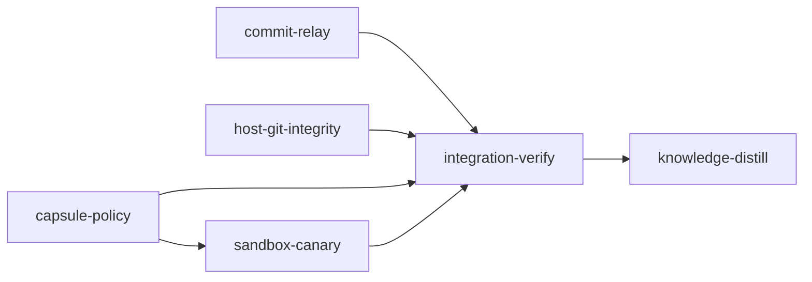

# Plan: Close the paths a sandboxed stage agent can still write or read outside its worktree

## Overview

A stage agent's Bash runs inside Claude Code's bubblewrap sandbox, built from loom's per-session
capsule. The worktree-isolation hook sees only the file tools, but the sandbox mounts everything
outside the write allow-list read-only, and loom refuses `sandbox.enabled: false`. The
allow-list still reaches the operator, and reads are barely confined. Every finding below was
verified from inside a live stage session on 2026-09-30 and reproduced on 2026-10-01 at
`3fc28031` (the brief, `security-hardening-worktree-hook.md`, holds the first probe):

- **H1: the shared git directory is writable.** Claude Code 2.1.286 adds the whole git common
  directory `R/.git` to `allowWrite` of any session whose cwd is a linked worktree; no setting
  turns it off. A stage can move `main`, swap a loose object that git then serves without
  re-hashing it, plant a `MERGE_HEAD` that turns the operator's next commit into a merge with
  its own history, rewrite the main checkout's index, and rewrite sibling stages' branch refs.
- **H2: package caches are writable, and the host builds from them.** An edited `build.rs`
  under `~/.cargo/registry/src` runs on the host at the operator's next build.
- **H3: credential reads are confined to five paths.** `~/.config/gh/hosts.yml`, `~/.netrc`
  and `~/.npmrc` read fine.
- **H4: sibling worktrees and the main checkout are readable from Bash.**
- **H5 (found while planning): the codex home is writable.** A codex-licensed capsule grants
  all of `~/.codex`: `AGENTS.md`, `rules/`, `skills/`, `plugins/` and `packages/`, which the
  operator's own codex sessions trust later, plus `auth.json`.
- **H6 (found while planning): host-side git follows the agent's `.git` pointer.** The daemon and
  the unsandboxed hooks run `git status` and friends in a worktree by discovery, through
  `T/.git`, a file the agent can rewrite to a git directory whose config sets `core.fsmonitor`;
  `git status` then runs that command on the host. The merge gate also proceeds when it cannot
  compute the diff.

This plan closes H1 by taking git writes away from worktree sessions (the daemon commits for
them), H2 with per-session caches layered over read-only views of the real ones, H3 with a
wider credential read list, H4 for sibling worktrees, H5 with a per-session codex home, and H6
by pinning every host-side git call. A canary test proves the result from inside a live stage
sandbox, the place the threat lives.

## Goals and non-goals

- A worktree session cannot write any path under the git common directory; it commits through
  `loom commit`, which the daemon applies with pinned git.
- No session can write any real package cache; every package manager still installs, into a
  cache private to the session.
- The credential read list covers the common developer credential files, including locations
  relocated by environment variables.
- A worktree session cannot read a sibling stage's worktree.
- A codex-licensed session writes only its own codex home, the companion's job directory and
  `auth.json`.
- Host-side git never discovers a git directory through a worktree's `.git` file; the merge gate
  fails closed.
- Checkout-rooted agent sessions (knowledge stages, merge resolution) keep write access to
  `R/.git` by design; the daemon detects tampering with anything outside their target branch.
- An in-session canary fails integration-verify if any of the above does not hold.
- Non-goal: `/tmp/claude-<uid>` stays writable (operator decision 2; the harness needs it).
- Non-goal: reads of the main checkout stay open (decision D5 below explains why).
- Non-goal: macOS enforcement of the new read rules is not verified here; the canary is
  Linux-only and skips on macOS.
- Non-goal: no backward-compatibility code.

## Why the brief's deny-list cannot close H1 (measured)

The brief proposed `denyWrite` entries over Claude Code's grant. Measured against the installed
Claude Code 2.1.286 (bundle source and live `claude -p` runs in a scratch repository):

| Fact | Consequence for a deny-list |
| --- | --- |
| The grant is the whole common dir, added by Claude Code itself (`xqn`/`ms` in the bundle); Claude Code also denies `hooks`, `config*`, `commondir`, `objects/info/alternates` and `worktrees/*/{config.worktree,commondir}` | Everything else under `R/.git` is writable |
| Denies are bound after all allows; an allow nested inside a deny does not reopen it | "`refs/` except the stage's own ref" cannot be expressed |
| `allowWrite`/`denyWrite` globs are skipped on Linux | Every deny must be an enumerated path |
| A deny on an absent path mounts a placeholder that the host sees as an empty file while each command runs | Denying `MERGE_HEAD`, `shallow` or a lock file shows the operator's checkout a merge in progress |
| Denying a packed-only ref (`refs/heads/main` after `pack-refs`) makes the ref unreadable | A deny-list breaks git for the stage |
| A linked-worktree commit creates `packed-refs.lock` at the top of `R/.git` | `R/.git` itself must stay writable, so `MERGE_HEAD`, `sequencer/` and `shallow` stay creatable |

The operator chose daemon-owned commits on 2026-10-01: one deny of the whole common directory
wins over the grant, and the daemon, which runs outside the sandbox, makes every commit.

## Findings the stages rest on (measured 2026-10-01)

Git 2.53, strace, temporary repositories with a linked worktree:

| Operation in the linked worktree | Writes outside its admin dir `W` |
| --- | --- |
| `status`, `diff`, `log`, `rev-parse`, `show`, `ls-files` | none |
| `add` | `objects/` |
| `commit`, `commit --amend`, `reset --soft` | `objects/`, `objects/maintenance.lock`, `refs/heads/loom/<id>` and its `.lock`, `logs/refs/heads/loom/<id>`, `packed-refs.lock` (created and removed) |
| `stash push/pop` | also `refs/stash`, `logs/refs/stash` (shared by every worktree) |
| auto-maintenance after a commit | repacks `objects/pack`, unlinks loose objects, rewrites `logs/HEAD` and other branches' reflogs |

Attacks, each shown in a temporary repository:

- A replaced loose object is served by `git show` and `git checkout` with exit 0; only a full
  `git fsck` detects it (`hash-path mismatch`); `fsck --connectivity-only` does not.
- A planted `MERGE_HEAD` makes the next plain `git commit` a two-parent merge with an unchanged
  tree.
- A rewritten `R/.git/index` is committed by the next plain `git commit` in `R`.
- `git status` and `git diff` in a repository whose config sets `core.fsmonitor` run it;
  `git fetch` from such a repository runs nothing (fsmonitor, `core.sshCommand`, repo-local
  `uploadpack.packObjectsHook`, hooks and filters all stayed silent).

Package caches: see the `capsule-policy` stage for the per-tool mechanism table, each measured
under bubblewrap with the real caches read-only. A full copy per session is impossible (bun
30 GB, npm 7.7 GB, uv 62 GB here; `/run/user/<uid>` is a 13 GB tmpfs, and ext4 has no
reflinks), so each session gets real directories of symlinks into the read-only real caches,
plus copies of the few index directories a tool writes into.

Codex: `codex-rs/login/src/auth/storage.rs` `FileAuthStorage::save` writes `auth.json` in place
(`truncate`, `write`, `create`), so a session's codex home can link to the real file and a token
refresh still reaches the operator.

## Decisions

`doc/plans/briefs/sandbox-escape-hardening/common.md` holds the full text every worker reads;
the YAML is authoritative where the two differ.

- **D1 Daemon-owned commits.** Stage, Contract and Adjudication sessions (a judge never writes
  git, whatever its cwd) deny the whole git common directory, resolved at spawn with
  `git rev-parse --path-format=absolute --git-common-dir`. Agents run
  `loom commit -m "<type(scope): description>" -- <files>` in one Bash call and
  `loom request status <id> --wait 90` in the next; the daemon applies the commit with pinned
  git after re-validating every path and checking that `HEAD` names `refs/heads/loom/<id>`.
  The daemon never runs `git add` on agent-written paths: git's `lstat`-then-`open` would let
  an agent swap a file for a symlink to a credential and have the daemon, outside the sandbox,
  commit its content. It opens each file itself with a no-follow walk (`O_NOFOLLOW`,
  `O_NONBLOCK`, size caps), hashes it with `git hash-object --path`, stages the blobs with
  `update-index`, and refuses FIFOs, devices, directories, nested repositories and gitlinks.
  Checkout-rooted sessions keep `git add`/`git commit`.
- **D2 Pinned host git.** Every host-side git call against a worktree runs with `GIT_DIR`,
  `GIT_COMMON_DIR` and `GIT_WORK_TREE` taken from `R/.git/worktrees/*/gitdir`, never from
  `T/.git`, and never recurses into a submodule; every loom git call sets
  `GIT_NO_REPLACE_OBJECTS=1`. A test pins the list of files that run git, so a new
  discovery-based call site fails the build.
- **D3 Per-session caches.** `C = <user cache dir>/loom/session-caches/<stage-id>-<kind>`, on
  disk. The path is stable across a stage's sessions, because cargo rebuilds every registry
  dependency when `CARGO_HOME` moves (measured: `cfg-if` rebuilt on each change). The content is
  per session: at spawn the daemon empties and re-creates `C`, writes an owner marker naming the
  session, and seeds it; retiring the session removes `C` only while the marker still names it.
  The real caches get no grant. Every cache variable points into `C`; the ecosystems the worktree
  uses are seeded from the real caches. `RUSTUP_HOME` stays read-only (no toolchain installs in
  a stage).
- **D4 Credential reads.** Plain paths (no globs) for the common credential files (36 more,
  shell histories and `~/.claude.json` among them), plus the locations their tools' environment
  variables name, plus the existing top-level `R/.env` and `R/.env.*` files.
- **D5 Sibling worktrees.** Worktree-rooted capsules deny reads of `R/.worktrees` and re-allow
  their own worktree. Reads of the main checkout stay open: in-session loom resolves its
  retrieval config, context store and knowledge through `main_project_root`
  (`context/retrieve.rs`, `context/store.rs`), and the checkout's tracked content is the stage's
  own base. The residual exposure, untracked operator files at `R`, is recorded in
  `concerns/`.
- **D6 Codex lane.** `CODEX_HOME=C/codex-home`, seeded with links to the operator's codex
  doctrine and config; grants shrink to `C`, `~/.codex/plugin-data` and `~/.codex/auth.json`.
  A codex-licensed session can still read and refresh `auth.json` (a credential the lane must
  read), and `~/.codex/plugin-data` stays shared between codex-licensed sessions.
- **D7 Checkout-session integrity.** Checkout-rooted capsules deny the entries of `R/.git` that
  exist at spawn and a commit never writes (`info`, `objects/info`, `worktrees`, `modules`,
  `refs/replace`). The daemon snapshots refs, pack files and git control files when it spawns a
  checkout-rooted agent session and verifies them before it accepts the session's result: refs
  outside the target branch and `refs/heads/loom/` (the daemon moves those meanwhile) unchanged,
  new packs passing `git verify-pack`, control files such as `commondir` and `shallow` still
  absent, no in-progress operation left behind (`MERGE_HEAD`, `CHERRY_PICK_HEAD`,
  `REVERT_HEAD`, `sequencer/`, `rebase-*`), no staged change in the main checkout's index beyond
  what was staged at the snapshot, and `git fsck --no-full` clean (every loose object re-hashed). Loom's own git runner
  refuses a main git directory holding a planted `commondir`, which would otherwise redirect
  every git call in `R`.

Object integrity at merge (brief item 1c): with D1 no worktree session writes an object or a
ref; the daemon hashes every stage commit from the worktree's files. No stage-branch re-hash is
needed at merge, and checkout sessions are covered by D7.

## Preconditions

Run `loom init` on this plan only after all of these hold, in order:

1. PLAN-stage-exits-and-environment has completed and merged to main. It edits the same
   doctrine, signal and skill files this plan rewrites (`CLAUDE.md.template`,
   `skills/loom-orchestration`, `skills/loom-usage`, `loom-hooks/commit-guard.sh`,
   `orchestrator/signals/format/*`, `skills/loom-plan-writer/references/sandbox.md`).
   Each root stage's acceptance fails fast when it has not merged (`struct ProvisionEntry`
   must exist in `loom/src`).
2. A loom built from that main has been installed with `bash dev-install.sh`.
3. `loom plan verify --strict doc/plans/PLAN-sandbox-escape-hardening.md` passes on that main.

The line numbers in the briefs were read at `3fc28031`; workers anchor every edit by symbol.

## Before `loom run`

- Commit on main: this plan and `doc/plans/briefs/sandbox-escape-hardening/**`. A worktree is
  cut from `HEAD`, and an untracked brief does not exist in it.
- `loom init doc/plans/PLAN-sandbox-escape-hardening.md`, then
  `loom stage hold integration-verify`, then `loom run`.

## HAZARD: the implementation stages run on the pre-plan binary; integration-verify must not

Every implementation stage is spawned by the loom installed per the Preconditions. Its capsule
has every hole this plan closes, its agents still commit with `git`, and nothing it builds takes
effect on its own session. Integration-verify is the stage that proves the plan, so it must run
under a capsule this plan's code built:

1. Wait until `commit-relay`, `host-git-integrity`, `capsule-policy` and `sandbox-canary` have
   merged.
2. On main: `bash dev-install.sh`.
3. Run the srt confinement suite outside any sandbox (the `sandbox-canary` section below gives
   the command) and confirm no test printed `SKIP`.
4. `loom stop`, then `loom run` (the new daemon builds the capsules from now on), then
   `loom stage release integration-verify`.

Integration-verify's first task checks its own capsule for the common-dir deny and blocks the
stage, naming these steps, when the deny is missing. If integration-verify was released before the reinstall and
blocked itself, do steps 2-4 and then `loom stage retry integration-verify` instead of the release.
`loom stage complete` runs acceptance through a confined environment that withholds
`LOOM_STAGE_ID`, `LOOM_SESSION_ID` and `LOOM_WORK_DIR`; `capsule-policy` exports copies under
`LOOM_ACCEPTANCE_*` names so the canary can find its capsule there.

## Knowledge bootstrap: skipped

The tier-1 files describe this codebase, and
`loom knowledge check --strict --baseline doc/loom/knowledge/check-baseline.txt` reported 0
issues on 2026-10-01. The seams this plan changes are covered by
`architecture/security-and-isolation.md`, `architecture/execution-containment.md`,
`concerns/sandbox-and-confinement-gaps.md` and `concerns/agent-rule-bending-hardening.md`, which
each stage's Knowledge Brief quotes.

## Execution diagram



`commit-relay`, `host-git-integrity` and `capsule-policy` start together; their file sets are
disjoint (the ownership map in `common.md`). `sandbox-canary` starts when `capsule-policy`
merges. `integration-verify` is held until the operator releases it.

## Stage necessity

- **commit-relay, host-git-integrity, capsule-policy.** Q4: together they are about eleven
  workers over some 60 files across the relay, the daemon, the capsule builder, the wrapper and
  four doctrine surfaces; one session holding all their briefs, reports and review rounds would
  pass 500,000 tokens. Split along the ownership map, they share no file and run in parallel.
- **sandbox-canary.** Q1 and Q3, in its own section.

## Stages

### 1. commit-relay

**Purpose.** Decision D1 makes the whole git common directory read-only in every worktree-rooted
session (`capsule-policy` adds the deny). This stage gives those sessions their only way to
commit: `loom commit -m "<message>" -- <paths>` writes a relay ticket of a new control kind
`commit`; the relay hook moves it into `W/inbox/<session-id>/`; the daemon's inbox drain applies
it at most once, with pinned git (`WorktreeGit::pinned`) in the worktree the stage record names,
on the stage branch, for the named paths only. The session confirms with
`loom request status <id> --wait 90`, and `loom stage complete` refuses while one of its commit
requests is unsettled. Every worktree-session surface (signals, `CLAUDE.md.template`, three
skills, the subagent preamble, three hooks) teaches common.md's D1 sentence; checkout sessions (a
knowledge stage in the main checkout, merge and base-conflict resolution) keep `git add` and
`git commit`. This closes finding H1's commit path and retires concern G1 ("commits are policed by
text matching rather than by who can commit"): a subagent commit becomes impossible, and path
policy applies where the commit happens.

**Stage necessity.** Q4. The stage shares no file with `host-git-integrity`, `capsule-policy` or
`sandbox-canary` (the ownership map), so Q2 does not hold; no other stage needs it merged before
it starts, because every change here takes effect only once the plan's binary is installed (Q1
does not hold); no later stage needs a checkpoint on it (Q3 does not hold). Merged with the other
D1-D7 code stages, one session would carry about twelve workers and twenty contracts across the
relay, the capsule builder and host git, well past 500,000 tokens; alone it has four workers and
eight contracts.

**Waves.**

1. W1 (opus): the `commit` kind, its matrix column, `CommitRequest`, the shared validator
   `relay::check_commit_request`, the daemon apply (`inbox_drain/commit.rs`), the daemon-side
   refusal of any control kind a subagent relayed, and the drain matrix's commit column.
   W3 (sonnet): the D1 doctrine on signals, template, skills and preamble. W4 (sonnet): the relay,
   commit-filter and post-tool-use hooks and their tests. All three in ONE message; only W4's
   files never touch the crate. W3 and W1 run no check if the crate does not compile yet.
2. W2 (sonnet): `loom commit`, `loom request status --wait`, the completion gate and the CLI
   routing. It needs W1's `RequestKind::Commit`, `CommitRequest` and `check_commit_request`
   (a compile-order dependency, not a stage boundary).
3. Main agent: `cargo fmt --all`, then the acceptance commands.

**Designed details the briefs fix** (within D1, not changes to it):

- Paths reach the daemon worktree-relative: the CLI resolves each against the current directory
  (`src/a.rs` from `<wt>/loom` becomes `loom/src/a.rs`), allows leading `..` that stays inside the
  worktree and refuses a `..` after a name.
- The daemon never runs `git add`, `git commit` or any git command that reads the worktree
  (security review, settled). `git add` lstat()s then open()s without `O_NOFOLLOW`, so a looping
  `rename(file, symlink to ~/.config/gh/hosts.yml)` would make the host daemon read and commit a
  credential the sandbox hides, and a FIFO or a huge sparse file would stall the poll tick; a
  nested repository would become a mode-160000 gitlink that later host-side `git status` recurses
  into. Instead the daemon resets the index (`read-tree HEAD`), walks each path from a descriptor
  of the canonical worktree root with `openat(..., O_DIRECTORY | O_NOFOLLOW)` per parent (a
  symlinked parent is refused by the kernel, race-free; a parent holding a `.git` entry is refused
  as a nested repository), opens a regular leaf `O_RDONLY | O_NOFOLLOW | O_NONBLOCK | O_CLOEXEC`
  and re-checks its type and size on the descriptor (64 MiB per file, 256 MiB and 256 paths per
  request), stores a symlink leaf as a blob of its target string (mode 120000, never followed),
  removes an absent path HEAD tracks, and refuses anything else (directory, FIFO, socket, device,
  absent and untracked). Blobs go in with pinned `hash-object -w --path=<p>` (attribute-driven
  conversion as `git add` would; filter drivers only from `R/.git/config`), entries with
  `update-index --add --cacheinfo`; a `160000` entry in `diff --cached --raw
  --ignore-submodules=none` refuses; the commit is `write-tree`, `commit-tree` and a
  compare-and-swap `update-ref` on the stage branch. `WorktreeGit::run` takes no stdin
  (`git/worktree/pinned.rs:97-107`, owned by `host-git-integrity`), so the bytes read through the
  descriptor reach `hash-object` through a temp file in the daemon's state directory, which no
  session can write, and `update-index` takes `--cacheinfo` arguments instead of
  `--index-info` on stdin. Every git call carries `-c commit.gpgsign=false -c gc.auto=0 -c
  maintenance.auto=false -c core.fsmonitor=false -c diff.ignoreSubmodules=all -c
  submodule.recurse=false -c status.submoduleSummary=false`, besides the runner's
  `core.hooksPath=/dev/null`. `symbolic-ref --quiet HEAD` exits 1 on a detached HEAD (checked on
  git 2.53).
- The CLI expands a directory argument inside the session into the changed, deleted and
  untracked-not-ignored files under it (`git ls-files -z --modified --others --deleted
  --exclude-standard`), refusing a nested repository it lists, so the ticket names files only.
- `.work` (the legacy state link `git-add-guard.sh` also refuses) joins the refused first
  components, and a `.git` component is refused at any depth.
- `loom request status` prints an applied request's ledger note (`applied: committed <sha>`);
  under `--wait` it exits 0 only when applied, 1 when refused, unknown, not found or never
  relayed, 2 on timeout.
- The completion gate sits in `cli/dispatch_stage.rs::dispatch_complete`, because
  `commands/stage/complete.rs` is ledgered (759 lines, `complete` 173).

**Accepted limits.** The daemon's git calls run inside its poll tick under `git/runner.rs`'s
15-second read deadline (every call's first argument is `-c`). The daemon's own killed git can
leave `W/index.lock`; agents cannot write `W`, so nothing else leaves one, and the next request
reports it through git's own message. `.gitattributes` in the worktree can still select a
filter driver the repository's `R/.git/config` or the operator's global config defines (for
example git-lfs), as for any host-side git in a worktree (`pinned.rs` module docs). The D1 sentence's
`--wait 90` stays under the Bash tool's default 120-second timeout; the daemon applies within one
tick (about five seconds), so a real wait ends far sooner.

**Risk walk.**

| Area | Contract or check |
| --- | --- |
| Untrusted input: paths (`..`, absolute, control roots) | `daemon-refuses-escaping-and-control-paths`; `relay::commit_paths::tests::*`; `commands::commit::tests::a_path_escaping_the_worktree_writes_no_ticket` |
| Filesystem: a symlinked parent reading outside the worktree | `daemon-refuses-a-symlinked-parent`; `commit_tests_files::a_symlinked_parent_is_refused_and_nothing_is_read_through_it` |
| TOCTOU: a leaf swapped for a symlink to a credential between check and read | `a-symlink-leaf-is-committed-as-a-link-never-its-target`; `commit_tests_files::the_regular_leaf_open_refuses_a_symlink`; the acceptance check that `"add"` never appears in the daemon's commit code |
| Filesystem: FIFO, directory, oversized or sparse file stalling the poll tick | `daemon-refuses-special-files-and-nested-repositories`; `commit_tests_files::an_oversized_file_is_refused_unread`, `a_directory_path_is_refused` |
| Nested repository: a gitlink and host git running the agent's filter | `daemon-refuses-special-files-and-nested-repositories`; `commit_tests_files::a_path_inside_a_nested_repository_is_refused`; `commands::commit::tests::a_nested_repository_under_a_directory_argument_is_refused` |
| Trust boundary: who may commit (subagent) | `a-subagent-commit-entry-is-refused`; `commands::hook::relay::tests::a_commit_ticket_from_a_subagent_is_refused`; W4's `commit-filter-quoted-payload.sh` cases |
| Git state: HEAD off the stage branch | `daemon-refuses-when-head-is-not-the-stage-branch`; `commit_tests::a_detached_head_is_refused` |
| Idempotency: a replayed request | `a-commit-request-applies-once` |
| Reachability: the CLI ticket from the binary, the hook's kind derivation | `commit-cli-writes-a-worktree-relative-ticket`; `loom-relay-kinds.sh`; wiring tests on `--help` |
| Host configuration: hooks, signing, auto-maintenance | `commit_tests::the_daemon_commit_ignores_repository_hooks_and_signing` |
| Process I/O: git's failure text (a stale `index.lock`), nothing staged | `commit_tests::a_stale_index_lock_is_reported`, `nothing_staged_is_recorded_as_nothing_to_commit` |
| Lifecycle: completing on an unapplied commit | `commands::commit::tests_pending::stage_complete_refuses_while_a_commit_is_unsettled` |
| Timeouts: `--wait` | `commands::request::wait::tests::a_wait_times_out_after_its_deadline`, `a_pending_relay_is_not_waited_on` |
| Doctrine agreement across surfaces | `tests_commit_timing::d1_commit_sentence_agrees_across_every_surface`, `the_knowledge_prefix_keeps_git_commits` |
| Test harness: a contract spawning the binary | `binary_spawn_guard::only_sanctioned_spawners_spawn_the_loom_binary_directly` by name |

**Expected integrity events: none.** `maintainability-baseline.txt` does not change: `cache.rs`
(524, and its two ledgered prefixes), `cli/dispatch.rs::dispatch` (86) and `complete.rs` stay
net-zero or untouched. No existing assertion line in a test file changes:
`relay/tests_matrix.rs` keeps `EXPECTED` and its `54`; `inbox_drain/tests_matrix.rs` changes
only its `SECTION_5` table rows and match arms; the renamed `is_control` test and its added vec
element sit in `relay/kind.rs`'s inline module, which the integrity profile does not count.

**Observed at HEAD** (`2908339a`, which leaves every file this stage names unchanged from
`3fc28031`; run on the host from `loom/`):

| Command | Result |
| --- | --- |
| `cargo build --all-targets` | exit 0 |
| `cargo clippy --all-targets -- -D warnings` | exit 0 |
| `cargo fmt --all -- --check` | exit 0 |
| `RUSTDOCFLAGS='-D warnings' cargo doc --workspace --all-features --no-deps` | exit 0 |
| markdown lint (read-only) | 266 files, 0 issues |
| `cargo test --lib relay::` | 137 passed |
| `cargo test --lib orchestrator::core::inbox_drain::` | 20 passed |
| `cargo test --lib commands::hook::` | 207 passed |
| `cargo test --lib commands::request::` | 8 passed |
| `cargo test --lib cli::` | 11 passed |
| `cargo test --lib fs::inbox::` | 30 passed |
| `cargo test --lib fs::permissions::` | 119 passed |
| `cargo test --lib orchestrator::signals::` | 222 passed |
| `cargo test --test integration relay_e2e` | 1 passed |
| `cargo test --test integration binary_spawn_guard::only_sanctioned_spawners_spawn_the_loom_binary_directly -- --exact` | 1 passed |
| `cargo test --test maintainability` | 8 passed |
| `bash ../scripts/check-hook-syntax.sh` | 146 scripts parse |
| `bash ../loom-hooks/tests/run-all.sh` | 95 passed, 0 failed (a first run failed 10 with ENOSPC on `/tmp`; rerun clean) |
| the four hook test scripts listed in acceptance | exit 0 each |
| `cargo test --lib commands::commit::`, `commands::request::wait::`, every new named test, `cargo test --test commit_relay_contracts`, the two `rg` checks | red at HEAD by design (the modules, tests and text do not exist yet); not run |

### 2. host-git-integrity

Purpose: every git command loom or a loom hook runs outside a session sandbox against a stage
worktree reads its git directory from loom's records, never from the worktree's
agent-writable `.git` file (D2); loom's own git refuses a main git directory that holds a
`commondir` redirect; the merge gate and the commits-ahead probe fail closed; and the daemon
verifies what a checkout-rooted session (knowledge stage, merge resolution) did to `R/.git`
before it accepts the session's result (D7). Every loom git call ignores replace refs, pinned
worktree runs never recurse into submodules, and a test keeps every host git call site on a
classified allowlist.

Facts this stage rests on (git 2.53, TempDir repositories, this session):

- A rewritten `T/.git` naming a directory whose config defines `filter.<x>.clean` makes a
  host `git status` in `T` run the filter (`verify/contracts/test_support.rs::
  plant_foreign_git_dir`). Since `2908339a` the runner adds `-c core.fsmonitor=false`
  (`git/runner.rs::NO_HOOKS_ARGS`), so the Rust side is exposed through filters,
  `core.worktree` and forged refs, not fsmonitor; the shell hooks run bare git and are exposed
  to both.
- A `commondir` file planted in the MAIN git directory redirects every discovery-based git
  call in `R`: with a foreign config defining a clean filter and a same-length rewrite of a
  tracked file, `git -c core.hooksPath=/dev/null -c core.fsmonitor=false status` in `R` ran
  the filter. `GIT_DIR=R/.git` alone does not stop it; `GIT_COMMON_DIR=R/.git` does. D1 puts
  the whole common directory in `denyWrite` for worktree sessions; checkout sessions can still
  plant it.
- `git fsck --no-full --no-dangling --no-reflogs` reports a swapped loose object
  (`hash-path mismatch`, `missing blob <oid>`, exit 3) in 0.09 s on this repository;
  `--connectivity-only` does not. `git verify-pack` rejects an `.idx` with one flipped byte
  ("validation error"); `git commit-graph verify` takes 0.02 s; SHA-256 of all 30 MB of packs
  takes 0.02 s.
- With a stage commit's tree object deleted, `git merge-base` still answers and `git diff
  --name-only` fails ("unable to read tree"): the merge gate's fail-open arm is reachable.
- Three more channels a checkout session holds, closed here without a new measurement:
  `refs/replace/*` written mid-session changes what the daemon's own merges and ancestry
  checks in `R` read (every runner call now sets `GIT_NO_REPLACE_OBJECTS=1`); a tracked
  gitlink in a worktree makes host `git status`/`git diff` recurse into an agent-written
  nested `.git` (pinned worktree runs carry `-c diff.ignoreSubmodules=all -c
  submodule.recurse=false -c status.submoduleSummary=false`); and a planted `MERGE_HEAD`
  (grafts history into the next plain `git commit` in that checkout, measured by the plan
  author on git 2.53) or a staged index entry (committed by that same `git commit`) survives acceptance
  unless D7 checks both, which it now does.

Answer to the brief's item 1c (object integrity at merge). With D1 no worktree-rooted session
writes objects or refs: the daemon writes them with pinned git when it applies a relayed
commit, so the stage branch's objects are the daemon's own and no re-hash of the stage branch
is needed at merge. The sessions that still write the shared object store are the
checkout-rooted ones, and D7 covers them: a snapshot at spawn, and before acceptance a
comparison plus `git fsck --no-full` (every loose object re-hashed), `git verify-pack` on every
new or changed pack, `git commit-graph verify`, a check that no merge, cherry-pick, revert,
bisect, sequencer or rebase state is left in `R/.git`, and a check that the index stages
nothing the snapshot did not. A per-stage object store would buy nothing
D1 does not already give.

Two deliberate departures from the D7 wording in `common.md`, both forced by what the daemon
itself does while a checkout session runs:

- Refs under `refs/heads/loom/` are not compared, and a removed pack is no difference: the
  daemon applies other stages' relayed commits (moving `refs/heads/loom/<id>`, running `gc
  --auto`, which repacks) and creates and removes stage branches during a merge-resolution
  session. A new or changed pack is verified with `git verify-pack` instead of being refused.
  A checkout session commits to its target directly, so moving a stage ref gives it no content
  path it lacks.
- Records are keyed by stage and session kind (`<work_dir>/checkout-integrity/<stage>-<kind>.
  json`) and the first one is kept, so a session that tampers and then crashes or hands off is
  judged against the state before it. `loom init` removes the work directory, so no record
  outlives the run. A missing record is itself a difference.

Stage Necessity: Q4. Merged with `commit-relay` or `capsule-policy`, the combined stage runs
more than seven workers plus ten codex units over roughly sixty-five files and two languages, and
one session passes 500,000 tokens. Q1 does not hold (no other stage needs this merged first:
`commit-relay` applies commits with the `WorktreeGit::pinned` that exists at HEAD), Q2 does not
hold (the ownership map is disjoint), and Q3 does not hold.

Waves (worker table in YAML):

1. Contract session: writes `tests/host_git_integrity_contracts.rs` from the CONTRACT
   SURFACE; five contracts name symbols that do not exist yet and freeze as `build_failed`.
2. Wave 1, three Claude workers in one message: A (opus) pinned `WorktreeGit` constructors,
   the runner's `commondir` guard and `GIT_NO_REPLACE_OBJECTS`, the pinned submodule flags,
   pinned branch helpers, in-progress merges; B (opus) the `checkout_integrity` module (with
   the in-progress-state and index checks), the fail-closed merge gate and their wiring; C
   (sonnet) the shell helper, the three hooks, the D1 commit sentence, and the host-git
   call-site guard test with its allowlist written for the stage's end state. A and B share no
   file and need nothing from each other to compile.
3. Wave 2, after A returns: codex units X1-X6 in one message, then X7-X10 (at most six
   foreground forwards at once), one file each, each over A's API. The main agent runs each
   unit's command after all return and routes a failure to a fresh Claude worker for that file.
4. Main agent: `cargo test --test host_git_call_sites`, reconciling the allowlist from its
   output (every missing or stale entry is named); `cargo fmt --all`; the acceptance commands;
   the maintainability test (every ledgered item this stage touches keeps its exact count).

Risk walk:

| Area | Contract or check |
| --- | --- |
| Untrusted input (an agent-written `.git` pointer, agent-written files and index in `R/.git`) | `host-status-ignores-a-repointed-git-file`, `planted-redirect-files-are-reported`, `runner-refuses-a-main-git-dir-naming-another-common-dir`, `a-planted-merge-head-or-staged-change-is-reported`; `runner::tests::a_planted_replace_ref_is_ignored_by_loom_git` by name |
| Filesystem paths and symlinks (pointer files, nested `.git` inside a worktree or behind a gitlink, symlinked admin dirs) | same four; `pinned::tests::a_directory_inside_a_stage_worktree_is_pinned_past_a_nested_git_dir` and `pinned::tests::a_pinned_status_does_not_recurse_into_a_gitlink` by name; `../loom-hooks/tests/pinned-git.sh` |
| Process I/O volume and scale (git output through pipes, fsck on a large object store) | `commit-guard-sigpipe-many-dirty-files.sh` (400 paths through the pinned status); `checkout_integrity::tests::fsck_output_is_capped_at_twenty_entries` |
| Configuration propagation (both `LOOM_WORK_DIR` layouts, `GIT_COMMON_DIR` pinning) | `pinned-git.sh` (legacy `.work` case); `runner-refuses-a-main-git-dir-naming-another-common-dir` |
| Lifecycle and concurrency (respawned resolvers, the daemon writing refs and packs meanwhile) | `a-ref-moved-outside-the-target-is-reported` (its rejects); `checkout_integrity::tests::a_second_record_keeps_the_first_snapshot`, `a_legitimate_new_pack_and_moved_stage_refs_pass` |
| Reachability (spawn records, finalize and knowledge completion verify, the gate refuses, no host call site left unpinned) | wiring entries; `merge_gate::tests::a_merge_session_that_moved_another_ref_is_not_finalized`, `control_complete::tests::a_knowledge_completion_after_a_moved_ref_needs_human_review`; `cargo test --test host_git_call_sites` (a new runner or `Command::new("git")` call site outside the classified allowlist fails) |
| External data (git's fsck, verify-pack, for-each-ref output) | `a-swapped-loose-object-is-reported`; `checkout_integrity::tests::a_forged_pack_index_is_reported` (fixtures built by real git) |
| The behaviour the stage exists for | `host-status-ignores-a-repointed-git-file`, `merge-gate-refuses-when-changed-paths-cannot-be-listed` |

Callers checked:

- Host git through `T/.git` converted: `orchestrator/monitor/parked.rs::finished_in_worktree`,
  `handoff/session_content.rs` (`current_branch`, `modified_files`; its caller
  `inbox_drain/apply.rs` belongs to `commit-relay` and is not edited),
  `verify/before_after.rs::find_prior_stage_work` (called by `stage_executor.rs`, which already
  passes `repo_root`, so `stage_executor.rs` is not edited),
  `orchestrator/merge_lifecycle/containment.rs::uncontained_worktree_head`,
  `git/cleanup/removal.rs`, `git/cleanup/worktree.rs` (`blocking_paths`,
  `tracked_scaffold_paths`), `git/merge/in_progress.rs` (hand-parsed `T/.git`, `git diff` in
  `T`), `verify/criteria/cache_fingerprint.rs`, `verify/wiring_detection.rs`,
  `verify/duplicate_detection.rs`, `context/worktree_graph.rs::build_for_worktree` (the last
  four run under an operator's host `loom stage complete` or `loom verify`).
- Outside `common.md`'s ownership map and claimed by this stage: `orchestrator/terminal/
  backend.rs`, `verify/wiring_detection.rs`, `verify/duplicate_detection.rs`,
  `context/worktree_graph.rs`, `daemon/server/completion_dispatch/tests.rs`,
  `orchestrator/core/inbox_drain/tests_merge.rs`, `../loom-hooks/codex-forward-guard.sh`,
  and the new `tests/host_git_call_sites.{rs,txt}`.
- Already pinned, untouched: `daemon/server/observer.rs`, `daemon/server/contracts.rs`,
  `orchestrator/adjudication/prompt/{integrity,findings}.rs`, `verify/review/observer.rs`,
  `verify/contracts/changes.rs`.
- Hooks: `commit-guard.sh`, `stage-terminal-guard.sh`, `codex-forward-guard.sh` run git;
  `poll-guard.sh`, `no-preexisting-failures.sh`, `_progress-classification.sh` only classify
  the agent's git command lines and run none (the knowledge entry
  `concerns/agent-rule-bending-hardening.md#G2` says otherwise and is stale).
- Every Merge and Knowledge spawn goes through
  `orchestrator/terminal/backend.rs::SessionBackend::spawn_main_repo_session`
  (`auto_merge.rs`, `merge_handler.rs::spawn_merge_resolution_session`,
  `stage_executor.rs::start_knowledge_stage`), so one `record` call covers them.
  `SessionType::BaseConflict` has no spawn site at `2908339a`; the choke point would record one.
- Acceptance: merge sessions through `finalize_merge_resolution` (reached from
  `handle_merge_session_completed` and the relayed `merge-resolved`,
  `inbox_drain/merge_resolved.rs`), knowledge sessions through
  `daemon/server/control_complete.rs::handle_complete_stage`.

Accepted gaps, named for the plan's gap list:

- Adjudication sessions are not recorded or verified here, because none can write `R/.git`:
  `capsule-policy` puts the whole common directory in `denyWrite` for every Adjudication
  session, whatever its cwd (a judge writes only its scratch verdict).
- The mid-session exposure: D7 detects a planted `commondir`, `gitdir`, `shallow`,
  `info/grafts` or nested repository in `R` only at acceptance. Those paths are absent at spawn,
  and a deny on an absent path puts an empty placeholder file on the host that breaks the
  operator's git, so the capsule cannot deny them. The runner guard stops loom's own git from
  following a `commondir` meanwhile; the operator's shell git in `R` is not protected until the
  session's result is checked. `capsule-policy` denies the entries that exist at spawn
  (`info`, `objects/info`, `worktrees`, `modules`, `refs/replace`) to checkout sessions.
- An operator's host `loom stage complete` of a knowledge stage
  (`commands/stage/complete.rs::complete_knowledge_stage`, which no stage of this plan edits) does not
  verify; like `loom stage merge`, it stays the operator's path.
- `for_dir` on a subdirectory of a repository that itself lives inside an outer stage
  worktree pins to the outer worktree (documented on the function); `for_checkout` is exact.

Expected integrity events: none. Every ledgered item this stage touches keeps its exact count
(`merge_handler.rs` file 1267, `try_auto_merge` 214, `finalize_merge_resolution` 97;
`wiring_detection.rs::collect_added_source_files` 56; `duplicate_detection.rs` file 436); the
briefs give the net-zero edits. Existing test files change only in setup lines
(`control_complete_tests.rs`, `completion_dispatch/tests.rs`, `inbox_drain/tests_merge.rs`,
`../loom-hooks/tests/commit-guard-sigpipe-many-dirty-files.sh`); no assertion line changes.
If rustfmt moves a ledgered count, the main agent restores the count; a lowered ledger line
would instead be one `dispute-integrity` for `TI-ratchet-loom/maintainability-baseline.txt`,
"tightening only".

Baseline at `2908339a`, run on the host from `loom/` (the tree moved from `3fc28031` only in
`git/runner.rs` and the new `git/runner/pinned.rs` among this stage's files):

| Command | Result |
| --- | --- |
| `cargo build --all-targets` | exit 0 |
| `cargo clippy --all-targets -- -D warnings` | exit 0 |
| `cargo fmt --all -- --check` | exit 0 |
| `RUSTDOCFLAGS='-D warnings' cargo doc --workspace --all-features --no-deps` | exit 0 |
| `cargo test --lib git::` | 187 passed |
| `cargo test --lib orchestrator::monitor::` | 99 passed |
| `cargo test --lib handoff::` | 114 passed |
| `cargo test --lib verify::before_after` | 12 passed |
| `cargo test --lib verify::criteria::` | 85 passed |
| `cargo test --lib verify::wiring_detection::` | 18 passed |
| `cargo test --lib verify::duplicate_detection::` | 16 passed |
| `cargo test --lib verify::review::` | 23 passed |
| `cargo test --lib verify::contracts::` | 29 passed |
| `cargo test --lib orchestrator::merge_lifecycle::` | 14 passed |
| `cargo test --lib orchestrator::merge_attribution` | 6 passed |
| `cargo test --lib orchestrator::core::merge_handler` | 36 passed |
| `cargo test --lib orchestrator::core::inbox_drain::` | 20 passed |
| `cargo test --lib orchestrator::terminal::` | 232 passed |
| `cargo test --lib daemon::server::control_complete` | 7 passed |
| `cargo test --lib daemon::server::completion_dispatch` | 14 passed |
| `cargo test --lib daemon::server::observer` | 10 passed |
| `cargo test --lib commands::stage::merge` | 19 passed |
| `cargo test --lib commands::stage::complete` | 13 passed |
| `cargo test --test integration merge_conflict_recovery` | 11 passed |
| `cargo test --test maintainability` | 8 passed |
| `bash ../loom-hooks/tests/run-all.sh` | 95 passed, 0 failed |
| `cargo test --test host_git_integrity_contracts` | exit 101, no such target: red at HEAD by design |
| the named `--exact` tests below | each matches no test at HEAD (cargo exits 0 with 0 passed); new tests, red by design until written |
| `cargo test --lib orchestrator::core::completion_handler` | not run at HEAD |
| `cargo test --lib context::worktree_graph` | not run at HEAD |
| `cargo test --test host_git_call_sites` | not run at HEAD; no such target, red by design |

### 3. capsule-policy

#### Purpose

This stage changes what a session's settings capsule grants and denies, and what environment the
session runs in. It closes H2 (package caches the host builds from), H3 (credential reads), H4
(sibling worktrees) and the capsule half of H1 (the shared git directory), and it brings the
codex lane to the same bar:

- **D1, capsule half.** The capsule of every Stage, Contract and Adjudication session denies
  writes to the whole git common directory, in both layers, whatever the session's cwd (a judge
  never writes git; one in the main checkout would otherwise hold `R/.git`). The checkout
  sessions that commit (Knowledge, Merge, BaseConflict) keep git writes, minus a deny on each of
  `info`, `objects/info`, `worktrees`, `modules` and `refs/replace` under the common directory
  that exists at spawn; an absent one is never denied (a deny on an absent path mounts an empty
  placeholder file that host git would then read; host-git-integrity's D7 check covers the
  absent-file cases `commondir`, `shallow`, `info/grafts`). The directory is resolved once per
  spawn with `git rev-parse --path-format=absolute --git-common-dir` in `R`; a spawn whose
  repository does not resolve fails.
- **D3.** Every session gets a cache directory `C = <user cache dir>/loom/session-caches/<key>`,
  where the key is `<stage-id>-<session-kind>` (a session without a stage uses its session id):
  the PATH is stable per stage and kind, the CONTENT is per session. At spawn the daemon removes
  any existing `C` (never following a symlink), recreates it 0700, writes the owner marker
  `C/.loom-session` holding the session id, and seeds it from the operator's caches for the
  ecosystems the session's directory uses. `C` is granted in `allowWrite` (its marker
  write-denied), pointed at by the session's environment, and removed at retirement only when
  the marker still names the retiring session, so a late retire never deletes a successor's
  cache. `PACKAGE_MANAGER_CACHE_WRITE_PATHS` and its module are
  deleted: the real caches have no grant left, so they are read-only in every session.
- **D4.** `CREDENTIAL_DENY_READ_PATHS` gains 36 literal home paths (shell histories and
  `~/.claude.json` included: the deny binds the sandboxed Bash only, while Claude Code and the
  hooks run outside the sandbox), and each capsule read-denies the credential locations the
  daemon's environment relocates (`DOCKER_CONFIG`, `KUBECONFIG`, ...) and the main checkout's
  existing top-level `.env` and `.env.*` regular files, enumerated at spawn (never a glob, never
  an absent path). `<codex home>/auth.json` is read-denied to every session the codex lane is
  not licensed for. `loom-hooks/credential-guard.sh` reads the session capsule, so the file tools honor the
  same list, including `allowRead`.
- **D5.** A worktree-rooted capsule read-denies `R/.worktrees` and re-allows its own worktree
  (`sandbox.filesystem.allowRead`).
- **D6.** The codex lane loses the `~/.codex` and `~/.claude/plugins/data/codex-openai-codex`
  grants and the `~/.claude/plugins` carve-out. A licensed session runs with
  `CODEX_HOME=C/codex-home`, seeded at spawn, and is granted `C`, `~/.codex/plugin-data` and the
  single file `<codex home>/auth.json`.

#### Stage Necessity

- **Q1 (merge order): YES.** `sandbox-canary` asserts this stage's policy end to end (real
  caches refused, `C` writable, git common directory and sibling worktrees closed, codex home
  relocated) and cannot be written against the old capsule, so it depends on this stage.
- **Q2 (file overlap): NO within the ownership map, with one granted exception.** Adding a
  field to `LaunchHost` breaks the struct literal in `tests_confinement_e2e.rs:85`, which
  `sandbox-canary` owns; this stage makes that one compile-only edit (see "Ownership beyond the
  stage row"). That overlap is a second reason the canary runs after this stage.
- **Q3 (verification checkpoint): NO** beyond Q1.
- **Q4 (context): YES** against merging with `commit-relay` or `host-git-integrity`: those
  change the commit path and host-side git, this stage changes the capsule and the launch; the
  union is well past one session's budget. This stage alone is about 30 files over four workers.

`dependencies: []`: it runs in parallel with `commit-relay` and `host-git-integrity`. Every stage
of this plan runs on the loom binary installed before the plan, so D1's refusal of `git commit`
in worktree sessions takes effect only once the merged binary is installed, by which time
`loom commit` exists.

#### Waves

1. C1 (session caches, opus), C2 (capsule policy, sonnet) and C4 (file-tool guard and guidance,
   sonnet) in ONE message. The crate does not compile after this wave (C2 removes items C3's
   files still name), so C1 and C2 run no check; C4's files are shell and markdown plus one Rust
   note, and C4 runs its hook test.
2. C3 (launch wiring, sonnet): wires C1 and C2 into the launch, the capsule, the wrapper, the
   confined-command environment and retirement, updates the test fixtures, runs one check.
3. Main agent: `cargo fmt --all` once, routes any compile error to a fresh worker of the owning
   territory, then the acceptance list, the contract mutations, review, one dispute-integrity.

#### Per-tool cache mechanisms

Seed only the ecosystems the session's directory uses (`Ecosystems::detect`: `Cargo.toml` ->
cargo, `go.mod` -> go, `bun.lock`/`bun.lockb` -> bun, `package-lock.json`/`npm-shrinkwrap.json`
-> npm, `pnpm-lock.yaml` -> pnpm, `uv.lock` -> uv, found at the checkout root or any detected
package directory). Every tool is relocated whether seeded or not. Symlinks into the real caches
are safe only because no grant reaches a real cache; a symlink found inside a real cache is
never reproduced.

| Tool | Session variables | Seed | Measured |
| --- | --- | --- | --- |
| cargo | `CARGO_HOME=C/cargo`, `RUSTUP_AUTO_INSTALL=0` | copy `registry/index`; one symlink per `registry/cache/<reg>/*.crate` and per `registry/src/<reg>/<crate-ver>` holding `.cargo-ok`; copy `config.toml`/`config`; symlink `advisory-db`, `advisory-dbs`, `bin`; `git/` empty; never `credentials*` | under 1 s, 80-133 MB (index copy 80 MB, 0.12 s this session); `cargo audit --no-fetch` exit 0 with `CARGO_HOME=C` under bwrap with the real `~/.cargo` read-only (this session; it fails on yanked checks without the index copy) |
| rustup | `RUSTUP_HOME` exported only when the daemon sets it; read-only | none | builds work read-only; an uninstalled toolchain fails cleanly with `RUSTUP_AUTO_INSTALL=0` |
| bun | `BUN_INSTALL_CACHE_DIR=C/bun` | one symlink per top-level cache entry | 0.8 s, 20,045 entries |
| npm | `npm_config_cache=C/npm` | copy `_cacache/index-v5`; replicate `_cacache/content-v2` as real directories of symlinked files (a directory symlink fails with EEXIST) | about 1 s, index 116 MB |
| pnpm | `npm_config_store_dir=C/pnpm-store` | per `v<N>`: copy `index/`, replicate `files/` with symlinked files | not timed (index 21 MB, 64,242 files, 2.0 GB here); pnpm 10.15.0 honors `npm_config_store_dir` (store path `<dir>/v10`) and ignores `pnpm_config_store_dir` (verified this session) |
| yarn v1 | `YARN_CACHE_FOLDER=C/yarn` | none | no real cache here |
| go | `GOPATH=C/go`, `GOMODCACHE=C/go/pkg/mod`, `GOCACHE=C/go-build`, `GOFLAGS=-modcacherw`, `GOPROXY=file://<real GOMODCACHE>/cache/download,<daemon GOPROXY or https://proxy.golang.org,direct>` | `GOCACHE`: replicate the real go-build tree with symlinked files; modules come through the file proxy | works; go.sum verification works through the file proxy (`GOPATH` is required: the sumdb cache lives at `$GOPATH/pkg/sumdb`) |
| uv | `UV_CACHE_DIR=C/uv`, `UV_LINK_MODE=copy` | copy `simple-v*`, `wheels-v*`, `interpreter-v*`; replicate `archive-v0` with symlinked files | 4.6 s, about 590 MB here |
| pip | `PIP_CACHE_DIR=C/pip` | none | |
| deno | `DENO_DIR=C/deno` | none | |
| XDG cache | `XDG_CACHE_HOME=C/xdg-cache` | one symlink per top-level entry of the real XDG cache except `loom` and the relocated tools' own names (`pnpm`, `go-build`, `yarn`, `deno`, `uv`, `pip`) | not timed (a few dozen entries); keeps read-mostly assets that tools find through `XDG_CACHE_HOME` (Playwright browsers, Hugging Face models, pre-commit) reachable |
| codex | `CODEX_HOME=C/codex-home`, codex lane only | copy `config.toml`, `hooks.json` (write-denied in the capsule); symlink `auth.json`, `AGENTS.md`, `hooks`, `installation_id`, `loom-skill-catalog`, `rules`, `vendor_imports`; real directories of per-entry symlinks for `packages`, `plugins`, `skills`; run state (sqlite, sessions, logs, caches, sockets) starts fresh | not timed |
| git | `GIT_CONFIG_COUNT=2`, `gc.auto=0`, `maintenance.auto=false` | none | keeps in-session git from trying to maintain the read-only common directory |

Sizes here: cargo registry 1.75 GB, bun 30 GB, npm 7.7 GB, uv 62 GB (58 GB of it `archive-v0`), so
a full copy is impossible. A session's installs of anything unseeded download into `C` (the
registry domain must be in the plan's allow-list).

**Why `C`'s path is stable per stage and kind.** Cargo's fingerprint hashes the source path of a
registry package, which lies under `CARGO_HOME`. Measured this session under bwrap with a
two-crate project: a build under `CARGO_HOME=c1`, then `c2`, then `c1` again recompiled `cfg-if`
every time the path changed, while a stable `CARGO_HOME` path whose content was replaced
between builds did not recompile. With `C` at `<stage-id>-<session-kind>`, handoffs and retries
of one stage session keep the same `CARGO_HOME` path and do not rebuild registry dependencies
(398 for `loom/`), while each session still starts from a freshly seeded `C`. Two costs remain:
the first build of the stage session after its contract session recompiles once (the two kinds
have different paths), and a host-side cargo run in the worktree with the real `CARGO_HOME`
flips the fingerprints once more.

#### Risk checklist walk

| Area | Applies | Covered by |
| --- | --- | --- |
| 1 Untrusted input | env values from the daemon (credential locations, `GOPROXY` userinfo), session ids | `env-relocated-credentials-are-read-denied` (empty, relative and home-equal values dropped); session ids go through `validate_id`; the hook validates `LOOM_SESSION_ID` before building a path from it |
| 2 Filesystem paths and symlinks | seeding writes symlinks to real caches; retirement deletes a tree full of them; a leftover or planted `C` at spawn | `removing-a-session-cache-leaves-the-real-cache-intact`, `session-env-and-seeding-follow-the-daemon-cargo-home` (index copied, never linked); unit tests on a planted symlink at `C` |
| 3 Process I/O volume and scale | seeding walks caches of 20,000 to millions of entries; one `git rev-parse` per spawn | by design: syscall-level copy and link loops, no subprocess per entry, no pipe; one bounded git call. No contract (a timing contract would be flaky); the measured-cost table and the canary cover it |
| 4 Configuration propagation | `CARGO_HOME` and every other tool override read from the daemon env; D4 env-relocated credentials | `session-env-and-seeding-follow-the-daemon-cargo-home` (a non-default `CARGO_HOME`), `env-relocated-credentials-are-read-denied` |
| 5 Lifecycle and concurrency | `C`'s path is shared by every session of one stage and kind: a late retire of a crashed session against its successor's cache; the previous session's files at spawn; retirement retried after a partial removal; a `0555` directory left by go; a git metadata entry absent at spawn (never denied, so no placeholder file appears on the host) | `retiring-a-session-spares-the-cache-its-successor-owns`, `removing-a-session-cache-leaves-the-real-cache-intact` (removal succeeds on a `0555` tree first time); `no-git-kinds-deny-the-resolved-git-common-dir` (absent `modules`, `refs/replace` not listed); unit tests `prepare_replaces_a_leftover_session_directory`, `a_running_session_keeps_its_session_cache` |
| 6 Reachability | the launch must seed and export, the capsule must merge, retirement must remove | `reachable` for `prepare_session_cache`, `session_cache_env`, `session_filesystem` from `prepare_session_launch` and `remove_session_cache` from `sweep_sessions`; wiring patterns; the launch test `a_stage_launch_grants_its_session_cache_and_exports_it` |
| 7 External data correctness | cargo, npm, pnpm, uv, bun and codex home layouts, owned by those tools | fixture names are taken from the layouts observed on this host (`registry/index/index.crates.io-1949cf8c6b5b557f`, `.cargo-ok`, `_cacache/index-v5`, `v10/index`, the `~/.codex` entry list in C1's brief), never from memory |

Every D-decision has a contract: D1 `no-git-kinds-deny-the-resolved-git-common-dir`, D3
`no-capsule-grant-reaches-a-real-package-cache`, D4 `env-relocated-credentials-are-read-denied`,
D5 `sibling-worktrees-are-read-denied-and-the-own-worktree-is-not`, D6
`codex-capsule-grants-its-session-home-and-not-the-real-codex-home`; the stable cache path's
ownership rule has `retiring-a-session-spares-the-cache-its-successor-owns`.

#### Expected integrity events

The plan removes grants that existing tests pin, so these assertion changes are the plan's, not
weakening. File ONE dispute-integrity after the final review round naming them, reason "the plan
removes the package-cache grants, the ~/.codex grant and the ~/.claude/plugins carve-out; these
assertions pinned those grants":

- `src/sandbox/package_caches.rs`: deleted with its five tests.
- `src/sandbox/settings/policy/tests.rs`: `grants_the_codex_lane_its_state_dirs` (the cache
  ordering block), `claude_only_allow_write_is_plan_paths_then_package_caches`,
  `codex_licensed_allow_write_appends_codex_state_paths`,
  `every_stage_gets_the_package_caches_even_with_no_plan_entries`.
- `src/sandbox/settings/tests.rs`: helper `allow_write_with_caches` renamed `plan_allow_write`
  and its four call sites (lines 268, 596, 649, 825 at `3fc28031`).
- `src/sandbox/control_surfaces/tests.rs`: `writable_roots_cover_every_input` (the four cache
  and codex entries), `writable_roots_omit_the_codex_paths_unless_the_lane_is_licensed`.
- `src/sandbox/control_surfaces/tests_session_denies.rs`: three plugin carve-out tests deleted,
  the helper's `plugin_entries` parameter dropped from every call.
- `src/orchestrator/terminal/native/tests_capsule.rs`:
  `the_codex_lane_capsule_keeps_its_grants_and_denies_every_plugin_entry_beside_them` replaced,
  and `every_kind_gets_exactly_the_section_10_write_denies_for_its_location` expects the git
  common directory in both layers for the Stage and Adjudication kinds at both locations.

Ledger (`TI-ratchet-loom/maintainability-baseline.txt`, tightening only): remove
`function src/sandbox/settings/policy.rs filesystem_settings 52` (the function drops under 50)
and lower `file src/sandbox/settings/tests.rs 1596` to its new exact count. No other ledgered
file or function is touched (`sandbox/settings.rs`, `sandbox/config.rs`, `signals/format/helpers.rs
format_structured_handoff` stay as they are). New files stay under 400 lines, new functions
under 50.

#### Ownership beyond the stage row

- `src/orchestrator/terminal/native/tests_confinement_e2e.rs` (owned by `sandbox-canary`)
  constructs `LaunchHost` literally (line 85). C3 adds one field, `session: SessionFacts`; this
  stage is granted the compile-only edit of that literal and its import:

      session: SessionFacts::resolve(&repo, base.join("session-caches"), &home, &|_| None).unwrap(),

- `src/orchestrator/core/inbox_drain/tests_sweep_cache.rs` (new) is carved out of
  `commit-relay`'s `inbox_drain` territory for this stage.
- `src/models/stage/types.rs`: the doc comment at line 258 only (C2).

The canary has to invert three probes this stage makes wrong: `tests_confinement_e2e.rs:263` and
`:287` expect `~/.cargo/registry/x` writable and `:305` expects `~/.codex/x` writable. They
self-skip inside a stage, so this stage's acceptance does not catch them.
`loom::sandbox::PACKAGE_MANAGER_CACHE_WRITE_PATHS` is deleted. The canary keeps its own
independent list of real cache locations as an oracle: a path dropped from both lists would go
unseen.

#### Accepted gaps this stage leaves

- Reads of the main checkout stay open (in-session loom resolves config, retrieval and knowledge
  state through `main_project_root`).
- `<codex home>/auth.json` is readable and writable to codex-licensed sessions: codex refreshes
  its token there in place. Such a session can therefore overwrite it, swapping the operator's
  token for another account's.
- `~/.codex/plugin-data` is shared by every codex-licensed session, and host receipt code
  (`models/forward_receipt/locator.rs`) reads it, so a codex-licensed session can read and write
  another stage's companion job state and forge that stage's forward receipts.
- `R/.git/config` stays readable (remote URLs with embedded tokens included), because in-session
  git reads it.
- Cargo git dependencies are not seeded: `C/cargo/git` starts empty, so a git dependency
  re-fetches and needs its host in the network allow-list (and never gets credentials).
- pnpm's `npm_config_store_dir` was verified on pnpm 10.15.0 only.
- macOS enforcement of the new `denyRead` entries, of `allowRead` inside a denied directory, and
  of a single-file `allowWrite` grant is unverified. If `allowRead` is not honored there, a macOS
  worktree session cannot read its own worktree; the first macOS stage shows it at once.
- Credential files relocated by `XDG_CONFIG_HOME` or `XDG_DATA_HOME` (gh, hub, glab, op,
  keyrings) are not mirrored; only the variables D4 lists are.
- The real caches stay readable (private package tarballs in an npm cache, for instance).
- A private registry configured only in `~/.npmrc`, `~/.yarnrc.yml` or `~/.pypirc` is invisible
  to sessions (those files are read-denied); a plan that needs one commits a project-level
  config.
- A spawn that fails after `C` is created leaves `C` behind when no session record exists to
  retire, as the scratch directory already does; the next spawn of the same stage and kind
  replaces it.
- Two live sessions of one stage and kind would share `C`, and the second spawn replaces the
  first's content; the tracking key allows one such session at a time.
- Codex run state (sessions, history, memories) lives and dies with the session.
- Another stage's cache directory is readable (a sibling codex session's run state included),
  as every session could read `~/.codex` before. A read deny on the session-cache
  root with the session's own `C` re-allowed would close it the way D5 closes `.worktrees`.
- Pre-existing, not introduced here: `session_denies` denies `R/.git/hooks` and `R/.git/config`
  by the literal `repo_root.join(".git")`. When `R/.git` is a gitfile (`--separate-git-dir`), a
  checkout session's real hooks directory is not denied. Stage, contract and adjudication
  sessions are covered by the whole-directory deny.
- The stage session's first build after its contract session recompiles Rust registry
  dependencies once, and so does the first session build after a host-side cargo run in the
  worktree (see "Why `C`'s path is stable per stage and kind").
- `/tmp/claude-<uid>` stays writable (operator decision 2).

#### Knowledge this stage makes stale (for knowledge-distill)

`architecture/execution-containment.md#Package-Manager Caches Are Granted To Every Stage`,
`architecture/codex-plugin.md#The sandbox must grant codex its state dirs (2026-08-10)`,
`architecture/security-and-isolation.md#Where a Session's Write Grants Come From` (the `~/.codex`
sentence), `concerns/sandbox-and-confinement-gaps.md#No Read(...) Deny Rule May Exist in Any
Settings File (2026-09-04)` (credential-guard rule (b) now reads the session capsule and honors
`allowRead`), `concerns/sandbox-and-confinement-gaps.md#Two Diverging Copies of the Stage
Environment Allowlist (2026-08-17)` (the confined allowlist now adds `SESSION_CACHE_VARIABLES`).

#### Acceptance observed at HEAD 3fc28031 (host, from `/home/dkaponis/src/loom/loom`)

| Command | Observed |
| --- | --- |
| `cargo build --all-targets` | exit 0 |
| `cargo clippy --all-targets -- -D warnings` | exit 0 |
| `cargo fmt --all -- --check` | exit 0 |
| `RUSTDOCFLAGS='-D warnings' cargo doc --workspace --all-features --no-deps` | exit 0 |
| `cargo test --lib sandbox::` | 125 passed |
| `cargo test --lib fs::permissions::` | 119 passed |
| `cargo test --lib codex::` | 23 passed |
| `cargo test --lib models::stage` | 116 passed |
| `cargo test --lib commands::repair::` | 42 passed |
| `cargo test --lib process::environment` | 2 passed |
| `cargo test --lib orchestrator::terminal::native::` | 147 passed |
| `cargo test --lib orchestrator::core::inbox_drain::` | 20 passed |
| `cargo test --lib orchestrator::signals::` | 222 passed |
| `cargo test --test integration capsule` | 3 passed |
| `cargo test --test maintainability` | 8 passed |
| `bash ../loom-hooks/tests/credential-guard-deny-read.sh` | exit 0, 5 PASS |
| `bash ../loom-hooks/tests/credential-guard-tokens.sh` | exit 0, 4 PASS |
| `bash ../loom-hooks/tests/credential-guard-dotdot.sh` | exit 0, 3 PASS |
| `bash ../loom-hooks/tests/run-all.sh` (not an acceptance line; recorded because C4 changes hooks) | 95 passed, 0 failed |
| `cargo test --test capsule_policy_contracts` | red at HEAD by design: no test target |
| the eleven exact-name unit tests in the acceptance list | red at HEAD by design: the tests do not exist |

### 4. sandbox-canary

Purpose: prove the capsule-policy decisions where the threat lives (operator brief, "What the
plan must settle" item 6). Two instruments:

1. **An in-session canary** (`loom/tests/sandbox_canary.rs`). It runs inside a live loom stage
   session and reads the session's own capsule (`$LOOM_WORK_DIR/capsules/$LOOM_SESSION_ID.settings.json`).
   It then proves, with a matched positive control beside each denial, that the git common
   directory, the admin directory `W`, every real package cache and the codex home refuse a
   fresh file, that every `denyRead` path reads masked, that `R/.worktrees` shows only the
   session's own worktree, and that no `allowWrite` entry reaches a real cache or the common
   dir. Outside a live stage sandbox it prints `SKIP` and passes.
   `LOOM_TEST_REQUIRE_STAGE_SANDBOX=1` turns every skip into a failure.
2. **The srt harness** (`tests_confinement_e2e.rs`, `tests_confinement_srt.rs`, new
   `tests_confinement_escape.rs`). It launches a session through the real launch path, so it
   runs the same capsule code the daemon runs, against a fake home and a repository with a real
   linked worktree. Six new srt tests cover D1, D3, D4, D5, D6 and D7's checkout-session denies. The translation moves into
   the library (`process::sandbox_probe::srt`) and gains the grant Claude Code makes and srt
   does not: a linked worktree's git common directory. Without that grant, `R/.git` is
   read-only under srt whatever the capsule says, and a D1 test would prove nothing.

The Rust canary replaces the operator brief's probe script. It is data-driven from the capsule,
where the script used literal paths. It attempts real writes, where the script relied on
`[ -w ]`, which reports `/dev/null` binds as writable. And it runs from `cargo test` in
integration-verify with the flag set.

Stage necessity:

- Q1 (merge order): the srt harness launches through capsule-policy's code
  (`prepare_session_launch_with`). Three of its existing grant lines (`~/.cargo/registry`
  twice, `~/.codex`) stop holding once D3 and D6 merge. The canary's live check reads D3's
  per-session `CARGO_HOME`. Neither can be written against a capsule that does not exist yet.
- Q3 (verification checkpoint): integration-verify checks this plan inside a live sandbox,
  and it needs this instrument merged first. Without the instrument, a capsule whose entries
  are right but mount wrong goes undetected, while every unit test on `build_settings` output
  stays green:
  - a D4 plain path that mounts nothing;
  - a common-dir deny that loses to the linked-worktree grant;
  - a D3 variable still pointing at a real cache;
  - a D5 re-allow that hides the session's own worktree.

Waves (worker table in YAML):

1. **One wave, K1 and K2 in one message.**
   - K1 (sonnet): the library surface in `sandbox_probe.rs` (`StageSandboxEvidence`,
     `stage_sandbox_live`, `skip_unless_stage_sandbox`, `capsule_path`,
     `real_package_cache_dirs`) and `sandbox_probe/srt.rs` (the translation, moved and
     extended). Then the canary target and its four probe-primitive tests. Runs
     `cargo test --test sandbox_canary` once. That builds only the library and the canary, so
     K2's parallel edits cannot break it.
   - K2 (sonnet): the fixture's real linked worktree, the translation moved to K1's module,
     `Confined.cache` and `Confined.capsule`, read and listing probes, three grant lines moved
     to the grants D3 and D6 leave, and six new srt tests. Codes against K1's pinned surface
     and runs no check: its files compile only under `cargo test --lib` with K1's module, and
     its tests self-skip inside a stage.
2. **Main agent:** `cargo fmt --all`, then the acceptance commands. Compile errors go to a
   fresh worker for the owner's territory.

Risk walk:

| Area | Contract or check |
| --- | --- |
| Untrusted input (capsule JSON and environment read from the session) | `stage-sandbox-detector-needs-every-piece-of-evidence`; `sandbox_probe::tests::capsule_path_reads_entries_the_way_claude_code_does` |
| Lifecycle (a skip that hides a regression) | `require-flag-turns-the-canary-skip-into-a-failure`; integration-verify runs the canary with the flag |
| Filesystem paths (no literal; git, `dirs::home_dir`, the environment, the capsule) | brief rules; canary check (g); srt fixture under `target/confinement-e2e-tmp`, never outside `f.base` |
| External processes (git, a nested cargo, srt) | `srt-translation-grants-a-linked-worktree-its-common-dir`; the `ALIVE` and RC sentinel on every srt probe; the nested cargo's output must name the test |
| Platform (bwrap evidence is Linux only) | the detector contract (`pid1_comm`); macOS sessions skip, an accepted gap |
| Reachability (the canary gates on the detector; the harness uses the library translation) | wiring entries |
| The behaviour the stage exists for | the canary in integration-verify with the flag; the operator's srt run below |

Callers checked:

- `sandbox_probe::skip_unless`: 18 call sites across `src/` and `tests/integration/`. K1
  refactors it into a shared private helper with identical text and behaviour. Its two
  existing tests and `confinement_status::` (acceptance) cover it.
- The srt translation: `tests_confinement_srt.rs` alone. `tests/integration/confinement_status.rs`
  keeps its own `srt_settings`, `diagnostics` and `srt_unavailable` copies (no stage owns that
  file); consolidating them is out of scope.
- `native::session_settings_path` (`pub(crate)`): reused by `StageSandboxEvidence::from_env`,
  not rebuilt.

Ownership map amendments this stage needs in `common.md`:

- `sandbox-canary` gains `loom/src/process/sandbox_probe/**` (the translation; `sandbox_probe.rs`
  would pass 400 lines holding it) and
  `loom/src/orchestrator/terminal/native/tests_confinement_escape.rs` (the new srt tests;
  `tests_confinement_e2e.rs` is 381 lines).
- `capsule-policy`'s exception list names that third file beside the two confinement e2e files.
- `capsule-policy` may make compile-only edits to `fixture()` in `tests_confinement_e2e.rs`
  when it adds fields to `LaunchHost`, `HostFacts` or `WritableRootInputs`. That file is
  `cfg(test)` library code, so `cargo test --lib` in capsule-policy's own stage fails to
  compile without them. The stages run in sequence, so no two sessions write the file at once.

Expected integrity events: none. K2 changes three grant-argument lines and one comment in
`tests_confinement_e2e.rs`. None matches the Rust assertion pattern
(`\bassert(?:_eq|_ne)?!\s*\(`, `testrun/languages.rs:27`). No ledger line changes:
`tests_confinement_e2e.rs` is 381 lines at `3fc28031` and stays at or under 400, because the
new tests and git helpers go in `tests_confinement_escape.rs`. `sandbox_probe.rs` grows from
196 lines, with the translation in `sandbox_probe/srt.rs`. Every new function stays under 50
lines.

Why the in-session canary skips in its own stage: the loom binary that spawned this stage
predates the plan. The session's capsule therefore has every hole the plan closes, and its
environment has no per-session `CARGO_HOME`. `stage_sandbox_live` requires `CARGO_HOME`'s
parent to hold the owner marker `.loom-session` naming this session (D3's `C/cargo`). This
session fails that test, so the
canary prints "predates the sandbox-escape-hardening policy" and passes. The same rule keeps
the canary quiet in any other session the old binary spawned. The flag turns the skip into a
failure, so a regression that drops D3 cannot hide in integration-verify. Every session the
new binary spawns runs the canary for real whenever its suite includes the canary target.

What integration-verify must carry (for that stage's author):

- An acceptance entry run from `loom/`:
  `LOOM_TEST_REQUIRE_STAGE_SANDBOX=1 cargo test --test sandbox_canary`.
- The stage stays held (`loom stage hold`) until the operator reinstalls loom and restarts the
  daemon, so the session's capsule is built by this plan's code.

Manual step (operator, after this stage merges and before releasing integration-verify): run
the srt suite in a plain terminal, outside any Claude Code sandbox. `srt` cannot bind its
socket inside one (`architecture/execution-containment.md`, "Confinement E2E Lives Outside the
Sandbox"). `bwrap` and `socat` must be on PATH:

```bash
shim="$(mktemp -d)"
printf '#!/bin/sh\nexec bunx @anthropic-ai/sandbox-runtime "$@"\n' > "$shim/srt"
chmod +x "$shim/srt"
cd loom && env -u LOOM_WORK_DIR PATH="$shim:$PATH" LOOM_TEST_REQUIRE_SANDBOX_FREE=1 \
  cargo test confinement
```

Expected: the ten srt tests under `tests_confinement_e2e::` (four existing, six in
`escape::`) and `confinement_status::` pass, and none prints `SKIP`. Until this run, both suites
have only taken their skip path; the stage report says so.

Knowledge follow-up for knowledge-distill:

- `concerns/sandbox-and-confinement-gaps.md`, "Sandbox Denial Has No End-to-End CI Canary":
  an in-session canary now exists and runs in integration-verify. CI still has no live
  runtime.
- `architecture/execution-containment.md`, "Confinement E2E Lives Outside the Sandbox": the
  translation lives in `process::sandbox_probe::srt` and grants a linked worktree its common
  directory; the new tests are listed there.

Observed at `3fc28031` on the host (from `loom/`, warm target directory, no Claude Code
sandbox: `/proc/1/comm` is `systemd`, `srt` not on PATH):

| Command | Result |
| --- | --- |
| `cargo build --all-targets` | exit 0, 33 s |
| `cargo clippy --all-targets -- -D warnings` | exit 0, 36 s |
| `cargo fmt --all -- --check` | exit 0 |
| `RUSTDOCFLAGS='-D warnings' cargo doc --workspace --all-features --no-deps` | exit 0, 10 s |
| `cargo test --lib process::sandbox_probe::` | 5 passed |
| `cargo test --lib orchestrator::terminal::native::launch::tests_confinement_e2e::` | 4 passed (skip path: `srt` not on PATH) |
| `cargo test --test integration confinement_status::` | 1 passed (skip path) |
| `cargo test --test maintainability` | 8 passed |
| `cargo test --test sandbox_canary` | exit 101, "no test target named `sandbox_canary`": red at HEAD by design |
| `cargo test --test sandbox_canary_contracts` | exit 101, no such target: red at HEAD by design |
| before_stage `rg -q -F 'skip_unless_stage_sandbox' src/process/sandbox_probe.rs` | exit 1, as the pair expects |

A nested `cargo test --test <other target>` run from inside a running test in the same target
directory works: a scratch crate proved it, with no build-lock wait, and the child target was
built on demand. The require-flag contract relies on this.

### Integration verification

Held with `loom stage hold` until the operator has reinstalled loom and restarted the daemon
(the HAZARD section above), so this is the first session of the plan whose capsule this plan's
code built. That makes it the end-to-end proof: its own commits go through `loom commit`, its
installs land in its session cache, and the in-session canary runs for real.

- First task: confirm the capsule is this plan's. The session's
  `$LOOM_WORK_DIR/capsules/$LOOM_SESSION_ID.settings.json` must list the git common dir
  (`git rev-parse --path-format=absolute --git-common-dir`) under `sandbox.filesystem.denyWrite`,
  and `$CARGO_HOME` must lie under a `loom/session-caches/` directory. If either fails, block the
  stage (`loom stage block integration-verify "<reason>"`, a positional reason) naming the HAZARD
  steps, and stop.
- The full gate from `loom/`: build, clippy with warnings denied, fmt, rustdoc with warnings
  denied, `cargo test --all-targets`, `LOOM_TEST_REQUIRE_STAGE_SANDBOX=1 cargo test --test
  sandbox_canary` (a skip is a failure here), the hook suite and the hook syntax check, the
  read-only markdown lint.
- Functional smokes, each recorded with `loom memory note`: `git add` of any file fails with
  `Read-only file system`, and every commit this stage makes goes through `loom commit` and
  `loom request status --wait 90`; in a scratch crate under `$TMPDIR`, `cargo add` of a crate
  absent from `~/.cargo/registry/cache` downloads into `$CARGO_HOME` and builds, while creating a
  file under `~/.cargo/registry` fails; `bun install --frozen-lockfile` in `web/` succeeds;
  `ls <R>/.worktrees` lists only this worktree.
- Review subagents: security (the daemon commit apply's path and symlink checks and its HEAD
  guard, relay authority and subagent refusal, seeding and removal never following a symlink,
  the owner marker, the credential and read rules, the codex home, D7's checks, and a sweep for
  any host-side git left unpinned), architecture (the two git-common-dir resolvers in
  `git/worktree/pinned.rs` and `sandbox/session_fs.rs`: consolidate them if the merged tree
  allows it cheaply; the canary's independent real-cache list agreeing with `RealCaches` for every
  tool D3 relocates), and test coverage (every
  contract's mutation memory spot-checked).
- Suggestions: weigh every pending reviewer suggestion; resolve each implemented one with
  `loom memory resolve <id> --outcome implemented --reason "<what changed>"`.
- Record discoveries for knowledge-distill, including `stale-knowledge:` notes.

### Knowledge distillation

Standard, runs under the new capsule too (it commits with `loom commit`). Rewrites to current
truth, besides the curated memories:

- `architecture/security-and-isolation.md`: `## Worktree Isolation (4-Layer Defense)` (commits
  go through the daemon) and `## Where a Session's Write Grants Come From` (the git common dir
  deny, the session cache grant, the codex grants, the sibling-worktree read rule, the
  checkout-session denies).
- `architecture/execution-containment.md`: `## Package-Manager Caches Are Granted To Every Stage`
  becomes the per-session cache model with the per-tool table; `## Confinement E2E Lives Outside
  the Sandbox` names `process::sandbox_probe::srt`, the new srt tests and the in-session canary.
- `architecture/codex-plugin.md`, `## The sandbox must grant codex its state dirs`: the session
  codex home and the three grants.
- `concerns/state-confinement-gaps.md`: the shared-cache gap is closed; remove or rewrite the
  file.
- `concerns/sandbox-and-confinement-gaps.md`: `## Sandbox Denial Has No End-to-End CI Canary`
  (an in-session canary runs in integration-verify; CI still has no live runtime),
  `## Accepted Gaps From the State-Confinement Work` (shared caches closed), plus this plan's
  accepted gaps: main-checkout reads, `auth.json` readable to codex-licensed sessions,
  `~/.codex/plugin-data` shared, cargo git dependencies not seeded, macOS read rules unverified,
  the mid-session exposure of checkout sessions to a planted `commondir`.
- `concerns/agent-rule-bending-hardening.md`: G1 (closed for worktree sessions), G2 (closed; its
  hook list was stale), G3 (the canary), G7 (shared caches closed).
- A new mistakes topic: Claude Code grants a linked-worktree session the whole git common dir,
  and why a deny-list cannot narrow it (deny wins, write globs skipped, host-visible
  placeholders, packed refs); and a session-keyed `CARGO_HOME` rebuilds every dependency.
- `conventions/git-and-build-workflow.md`: the worktree commit route.
- README and CONTRIBUTING: `loom commit`, `loom request status --wait`, per-session caches (a
  stage cannot install a toolchain; git dependencies need network), and the operator steps
  around integration-verify.

## After the plan (operator)

- The codex lane is not exercised by any stage's acceptance (it needs the operator's codex
  credentials and network). Run a one-stage scratch plan whose stage lists `implementers:
  ["codex", "claude"]` and forwards one small unit, and confirm the unit's file lands and the
  run writes nothing under `~/.codex` except `auth.json` and `plugin-data`.
- `dev-install.sh` also refreshes `~/.claude/CLAUDE.md` from `CLAUDE.md.template`, so interactive
  sessions see the new commit rule for stage worktrees.

---

<!-- loom METADATA -->

```yaml
loom:
  version: 2
  ratchet_files:
    - loom/maintainability-baseline.txt
    - doc/loom/knowledge/check-baseline.txt
  sandbox:
    enabled: true
    auto_allow: true
    filesystem:
      deny_read: ["~/.ssh/**", "~/.aws/**", "~/.config/gcloud/**", "~/.gnupg/**"]
      allow_write:
        - "loom/src/**"
        - "loom/tests/**"
        - "loom/target/**"
        - "loom/Cargo.toml"
        - "loom/Cargo.lock"
        - "loom/maintainability-baseline.txt"
        - "loom-hooks/**"
        - "CLAUDE.md.template"
        - "web/node_modules/**"
        - "doc/**"
        - "skills/**"
    network:
      allowed_domains: ["crates.io", "index.crates.io", "static.crates.io", "registry.npmjs.org"]
      allow_local_binding: false
      allow_unix_sockets: []
  stages:
    - id: commit-relay
      name: "Commit relay: daemon-owned commits for worktree sessions"
      summary: "loom commit relays a commit request the daemon applies once with pinned git on the stage branch; request status can wait for it; stage complete refuses while one is unapplied; every worktree-session surface teaches loom commit, checkout sessions keep git."
      stage_type: standard
      skills: ["loom-rust", "loom-security-audit"]
      implementers: ["claude"]
      subagent_timeout_secs: 900
      working_dir: "loom"
      dependencies: []
      description: |
        Implement stage commit-relay of doc/plans/PLAN-sandbox-escape-hardening.md (decision D1 in doc/plans/briefs/sandbox-escape-hardening/common.md).
        Use parallel subagents and skills to maximize performance.
        Every worker first reads doc/plans/briefs/sandbox-escape-hardening/common.md, then its own brief.
        Spawn every worker BY AGENT TYPE with the fixed prompt plus "Your brief: <path>. Read it in full before anything else."
        Territories are DISJOINT. Workers NEVER spawn subagents.
        Waves: W1, W3 and W4 in ONE message; then W2 (it needs W1's RequestKind::Commit, CommitRequest and check_commit_request). W1 and W3 skip their check when the crate does not compile because of a file they do not own and report it. After W2 the main agent runs cargo fmt --all once, routes any remaining compile error to a fresh worker for the file's owner territory, then builds and tests.

        | Worker | Role | Tier | Files owned | Shared context | Brief path |
        | ------ | ---- | ---- | ----------- | -------------- | ---------- |
        | W1 | Commit kind, shared path validator, daemon apply with descriptor-walk staging | opus | src/relay/kind.rs; src/relay/matrix.rs; src/relay/tests_matrix.rs; src/relay/payload.rs; src/relay/mod.rs; src/relay/commit_paths.rs; src/orchestrator/core/inbox_drain.rs; src/orchestrator/core/inbox_drain/apply.rs; src/orchestrator/core/inbox_drain/commit.rs; src/orchestrator/core/inbox_drain/commit_read.rs; src/orchestrator/core/inbox_drain/commit_tests.rs; src/orchestrator/core/inbox_drain/commit_tests_files.rs; src/orchestrator/core/inbox_drain/test_support.rs; src/orchestrator/core/inbox_drain/tests_matrix.rs; src/commands/hook/relay/tests.rs; src/commands/hook/relay/tests_sweep.rs | common.md | doc/plans/briefs/sandbox-escape-hardening/commit-relay/w1-relay-commit-apply.md |
        | W2 | loom commit with in-session directory expansion, request status --wait, completion gate | sonnet | src/commands/mod.rs; src/commands/commit/mod.rs; src/commands/commit/paths.rs; src/commands/commit/pending.rs; src/commands/commit/tests.rs; src/commands/commit/tests_pending.rs; src/commands/request/mod.rs; src/commands/request/status.rs; src/commands/request/wait.rs; src/cli/types.rs; src/cli/types_ops.rs; src/cli/dispatch.rs; src/cli/dispatch_stage.rs | common.md; W1's CommitRequest and check_commit_request | doc/plans/briefs/sandbox-escape-hardening/commit-relay/w2-commit-cli.md |
        | W3 | D1 doctrine on signals, template, skills, preamble | sonnet | src/orchestrator/signals/helpers.rs; src/orchestrator/signals/cache.rs; src/orchestrator/signals/tests_commit_timing.rs; ../CLAUDE.md.template; ../skills/loom-orchestration/SKILL.md; ../skills/loom-usage/SKILL.md; ../skills/loom-git-workflow/SKILL.md; ../loom-hooks/_subagent-preamble.txt | common.md | doc/plans/briefs/sandbox-escape-hardening/commit-relay/w3-commit-doctrine.md |
        | W4 | Relay, commit-filter, reminder and git-add hooks | sonnet | ../loom-hooks/loom-relay.sh; ../loom-hooks/commit-filter.sh; ../loom-hooks/post-tool-use.sh; ../loom-hooks/git-add-guard.sh; ../loom-hooks/tests/loom-relay-kinds.sh; ../loom-hooks/tests/commit-filter-quoted-payload.sh; ../loom-hooks/tests/post-tool-use-commit-reminder-tokenized.sh; ../loom-hooks/tests/git-add-guard-quoting.sh | common.md | doc/plans/briefs/sandbox-escape-hardening/commit-relay/w4-commit-hooks.md |

        CONTRACT SURFACE (the contract session writes tests/commit_relay_contracts.rs from this, before any code; top-level #[test] fns, so each contract's test value is its fn name; tests that set process environment variables are #[serial] from serial_test):
        - loom::relay::{RequestKind, InboxEntry, AgentRole, RelayLine, Ticket, CommitRequest, new_request_id}. RequestKind::Commit has wire name "commit" and RequestKind::Commit.is_control() is true. CommitRequest { message: String, paths: Vec<String> } serializes as {"message": ..., "paths": [...]} (unknown fields refused); paths are worktree-relative and /-separated. InboxEntry { v: 1, id: new_request_id(), kind, relayed_at: chrono::Utc::now(), session_id, stage_id, agent: AgentRole::Main or AgentRole::Subagent, tool_use_id: None, payload: serde_json::Value }; entry.encode() -> Vec<u8>. RelayLine::parse(line: &str) -> Option<RelayLine> with pub kind and id. Ticket::decode(bytes: &[u8]) -> anyhow::Result<Ticket> with pub kind and payload: serde_json::Value.
        - loom::fs::inbox::{write_entry, read_ledger, LedgerOutcome, WriteOutcome}: write_entry(work_dir: &Path, entry: &InboxEntry) -> anyhow::Result<WriteOutcome> writes <work_dir>/inbox/<session_id>/<id>.json and answers WriteOutcome::AlreadyRelayed once the ledger records the id; read_ledger(work_dir: &Path, session_id: &str) -> anyhow::Result<Vec<LedgerRecord>> with LedgerRecord { id, kind, state, outcome: Option<LedgerOutcome>, reason: Option<String>, at }. One id gets an applying row (outcome None) then an outcome row: read the LAST row for the id whose outcome is Some.
        - Records: loom::models::session::{Session, SessionType, SessionStatus}: let mut s = Session::new(); s.session_type = SessionType::Stage; s.stage_id = Some(stage_id); s.status = SessionStatus::Running; s.worktree_path = Some(worktree); loom::fs::session_files::save_session(&s, &work_dir); the session id is s.id. loom::verify::transitions::save_stage(&Stage { id, name, status: loom::models::stage::StageStatus::Executing, session: Some(s.id.clone()), worktree: Some(stage_id), ..Default::default() }, &work_dir).
        - The daemon pass: loom::orchestrator::{Orchestrator, OrchestratorConfig}. Orchestrator::new(OrchestratorConfig { work_dir, repo_root, manual_mode: true, enable_skill_routing: false, ..Default::default() }, loom::plan::graph::ExecutionGraph::build(vec![loom::plan::schema::StageDefinition { id, name, working_dir: ".".to_string(), ..Default::default() }])?)? with the process environment variable LOOM_TERMINAL=xterm set while it is constructed and restored afterwards (Orchestrator::new builds a terminal backend eagerly; tests/integration/relay_e2e.rs:373-376 does the same). orchestrator.drain_session_inboxes() applies every inbox entry once, as the daemon's poll tick does.
        - Git fixture: a TempDir R; git init -q -b main; user.name and user.email in R's own config (the daemon's git reads it); README.md committed; git worktree add -q -b loom/<stage> .worktrees/<stage>; work_dir = R/.loom/work (create_dir_all). The fixture's own git commands run with GIT_CONFIG_GLOBAL and GIT_CONFIG_SYSTEM pointed at missing files and GIT_CONFIG_NOSYSTEM=1. Every path comes from the TempDir.
        - Outcomes: an applied commit's latest ledger row is LedgerOutcome::Applied with reason "committed <sha>", sha the full hash of refs/heads/loom/<stage>; a refused request's is LedgerOutcome::Refused with a reason, the stage branch does not move, and nothing from the request is committed. A path refusal's reason names the refused path (so do refusals of a directory, a FIFO, a socket or a device path); a symlinked-parent refusal's reason contains "through a symlink"; a refusal of a path whose parent directory holds a .git entry contains "nested repository"; a HEAD refusal's reason contains "refs/heads/loom/<stage>"; a subagent refusal's reason contains "subagent". A symlink named as a path is committed as a link: mode 120000, its blob the link's target string; the target is never read.
        - The daemon stages without git add: it reads each file itself through a descriptor walk (openat with O_NOFOLLOW per component) and never runs a git command that reads the worktree. A request is refused whole when any path is a directory, a FIFO, a socket, a device, a file over 64 MiB, absent and untracked, behind a symlinked parent, or inside a nested repository. drain_session_inboxes returns within 5 s when a path is a FIFO.
        - The CLI: loom commit -m <MESSAGE> [--] <PATH>..., spawned ONLY through helpers::loom_cmd(), declared as #[path = "integration/helpers.rs"] #[allow(dead_code)] mod helpers; exactly as tests/map_cli.rs does (tests/integration/binary_spawn_guard.rs fails any other file that writes Command::new(env!("CARGO_BIN_EXE_loom")), and loom_cmd scrubs every inherited LOOM_* variable). Environment: LOOM_SESSION_ID=<sid>, LOOM_STAGE_ID=<stage>, LOOM_SESSION_TYPE=stage, LOOM_SCRATCH_DIR=<a TempDir>/<sid> (a directory named exactly the session id, mode 0700), LOOM_WORKTREE_PATH=<wt>, current_dir <wt>/loom, plus GIT_CONFIG_GLOBAL and GIT_CONFIG_SYSTEM at missing files and GIT_CONFIG_NOSYSTEM=1 (the CLI runs git ls-files to expand a directory argument). A directory argument becomes the files under it that differ from the index or are untracked and not ignored, sorted; the ticket never names a directory. On success it exits 0, its last stdout line parses with RelayLine::parse and has kind RequestKind::Commit, and <scratch>/<id>.req decodes with Ticket::decode to a payload that deserializes into CommitRequest with the paths resolved against the worktree root, in argument order. A refused path exits non-zero and leaves no .req file. Without LOOM_SESSION_ID it exits non-zero and its stderr contains "git commit".

        HAZARD (installed binary): this stage runs on the loom binary installed before this plan. Its sandbox still lets git write the shared git directory and it has no loom commit command, so this stage's own session commits with git add <specific-files> && git commit, never with the loom commit it builds; nothing built here changes this session. PLAN-stage-exits-and-environment edited CLAUDE.md.template, the skills, the preamble and signals before this plan: locate every edit by heading or symbol.
        EXPECTED INTEGRITY EVENTS: none. cache.rs (524 lines, generate_knowledge_distill_stable_prefix 74, generate_knowledge_stable_prefix 66) and cli/dispatch.rs::dispatch (86) stay net-zero; commands/stage/complete.rs is not edited; relay/tests_matrix.rs keeps EXPECTED and its 54; no existing assertion line in a test file changes.
        CONTRACTS: before the final review round, prove each contract red by mutation (Gate conventions) and record loom memory note "mutation: <id> red under <mutation>".
        MEMORY: record mistakes, decisions and surprises via loom memory immediately (subagents too); never loom knowledge in this stage; never Claude Code auto-memory.
      before_stage:
        - command: "rg -q 'Commit,' src/relay/kind.rs"
          exit_code: 1
          description: "BEFORE: the relay has no commit kind"
      after_stage:
        - command: "cargo test --test commit_relay_contracts a_commit_request_applies_once -- --exact"
          exit_code: 0
          stdout_contains: ["1 passed"]
          description: "AFTER: a relayed commit lands once on the stage branch"
      acceptance:
        - 'rg -q "pub struct ProvisionEntry" src/plan/schema'
        - "cargo build --all-targets"
        - "cargo clippy --all-targets -- -D warnings"
        - "cargo fmt --all -- --check"
        - "RUSTDOCFLAGS='-D warnings' cargo doc --workspace --all-features --no-deps"
        - "cd .. && git ls-files '*.md' | rg -v '^(doc/plans/|loom/tests/fixtures/)' | xargs bunx markdownlint-cli2"
        - "cargo test --lib relay::"
        - "cargo test --lib orchestrator::core::inbox_drain::"
        - "cargo test --lib commands::hook::"
        - "cargo test --lib commands::commit::"
        - "cargo test --lib commands::request::"
        - "cargo test --lib cli::"
        - "cargo test --lib fs::inbox::"
        - "cargo test --lib fs::permissions::"
        - "cargo test --lib orchestrator::signals::"
        - "cargo test --lib relay::matrix::tests::commit_is_relayed_only_by_a_stage_session -- --exact"
        - "cargo test --lib orchestrator::core::inbox_drain::commit_tests::the_daemon_commit_ignores_repository_hooks_and_signing -- --exact"
        - "cargo test --lib orchestrator::core::inbox_drain::commit_tests_files::a_symlinked_parent_is_refused_and_nothing_is_read_through_it -- --exact"
        - "cargo test --lib orchestrator::core::inbox_drain::commit_tests_files::a_fifo_is_refused_without_blocking -- --exact"
        - "cargo test --lib orchestrator::core::inbox_drain::commit_tests_files::a_path_inside_a_nested_repository_is_refused -- --exact"
        - "cargo test --lib orchestrator::core::inbox_drain::commit_tests_files::the_regular_leaf_open_refuses_a_symlink -- --exact"
        - "cargo test --lib commands::commit::tests::a_directory_argument_becomes_its_changed_files -- --exact"
        - command: "rg -q -F '\"add\"' src/orchestrator/core/inbox_drain/commit.rs src/orchestrator/core/inbox_drain/commit_read.rs"
          exit_code: 1
        - "cargo test --lib commands::hook::relay::tests::a_commit_ticket_from_a_subagent_is_refused -- --exact"
        - "cargo test --lib commands::commit::tests_pending::stage_complete_refuses_while_a_commit_is_unsettled -- --exact"
        - "cargo test --lib commands::request::wait::tests::a_wait_times_out_after_its_deadline -- --exact"
        - "cargo test --lib orchestrator::signals::tests::tests_commit_timing::d1_commit_sentence_agrees_across_every_surface -- --exact"
        - "cargo test --test integration relay_e2e"
        - "cargo test --test integration binary_spawn_guard::only_sanctioned_spawners_spawn_the_loom_binary_directly -- --exact"
        - "cargo test --test commit_relay_contracts"
        - "cargo test --test maintainability"
        - "bash ../scripts/check-hook-syntax.sh"
        - "bash ../loom-hooks/tests/loom-relay-kinds.sh"
        - "bash ../loom-hooks/tests/loom-relay-gates.sh"
        - "bash ../loom-hooks/tests/commit-filter-quoted-payload.sh"
        - "bash ../loom-hooks/tests/post-tool-use-commit-reminder-tokenized.sh"
        - "bash ../loom-hooks/tests/git-add-guard-quoting.sh"
        - 'rg -q -F "loom request status <id> --wait 90" ../CLAUDE.md.template'
        - 'rg -q -F "loom commit" ../loom-hooks/_subagent-preamble.txt'
        - 'rg -q -F ''commit:*) echo commit ;;'' ../loom-hooks/loom-relay.sh'
        - 'rg -q -F "loom_tokens_cmd_argv ''loom'' 1 ''commit''" ../loom-hooks/commit-filter.sh'
      files:
        - "src/relay/**"
        - "src/orchestrator/core/inbox_drain.rs"
        - "src/orchestrator/core/inbox_drain/apply.rs"
        - "src/orchestrator/core/inbox_drain/commit.rs"
        - "src/orchestrator/core/inbox_drain/commit_read.rs"
        - "src/orchestrator/core/inbox_drain/commit_tests.rs"
        - "src/orchestrator/core/inbox_drain/commit_tests_files.rs"
        - "src/orchestrator/core/inbox_drain/test_support.rs"
        - "src/orchestrator/core/inbox_drain/tests_matrix.rs"
        - "src/commands/mod.rs"
        - "src/commands/commit/**"
        - "src/commands/request/**"
        - "src/commands/hook/relay/**"
        - "src/cli/types.rs"
        - "src/cli/types_ops.rs"
        - "src/cli/dispatch.rs"
        - "src/cli/dispatch_stage.rs"
        - "src/orchestrator/signals/helpers.rs"
        - "src/orchestrator/signals/cache.rs"
        - "src/orchestrator/signals/tests_commit_timing.rs"
        - "tests/commit_relay_contracts.rs"
        - "../CLAUDE.md.template"
        - "../skills/loom-orchestration/SKILL.md"
        - "../skills/loom-usage/SKILL.md"
        - "../skills/loom-git-workflow/SKILL.md"
        - "../loom-hooks/_subagent-preamble.txt"
        - "../loom-hooks/loom-relay.sh"
        - "../loom-hooks/commit-filter.sh"
        - "../loom-hooks/post-tool-use.sh"
        - "../loom-hooks/git-add-guard.sh"
        - "../loom-hooks/tests/git-add-guard-quoting.sh"
        - "../loom-hooks/tests/loom-relay-kinds.sh"
        - "../loom-hooks/tests/commit-filter-quoted-payload.sh"
        - "../loom-hooks/tests/post-tool-use-commit-reminder-tokenized.sh"
      artifacts:
        - "src/relay/commit_paths.rs"
        - "src/orchestrator/core/inbox_drain/commit.rs"
        - "src/orchestrator/core/inbox_drain/commit_read.rs"
        - "src/commands/commit/mod.rs"
        - "src/commands/request/wait.rs"
      wiring:
        - source: "src/orchestrator/core/inbox_drain/apply.rs"
          pattern: "RequestPayload::Commit\\("
          description: "the drain dispatches a commit request to the daemon's commit"
        - source: "src/orchestrator/core/inbox_drain/apply.rs"
          pattern: "AgentRole::Subagent"
          literal: true
          description: "the drain refuses a control request a subagent relayed"
        - source: "src/orchestrator/core/inbox_drain/commit.rs"
          pattern: "WorktreeGit::pinned\\("
          description: "the daemon commits with git pinned to the stage's registered worktree"
        - source: "src/orchestrator/core/inbox_drain/commit.rs"
          pattern: "check_commit_request\\("
          description: "the daemon re-validates every path before git runs"
        - source: "src/orchestrator/core/inbox_drain/commit.rs"
          pattern: "symbolic-ref"
          literal: true
          description: "the daemon checks HEAD is the stage branch"
        - source: "src/orchestrator/core/inbox_drain/commit.rs"
          pattern: "core.fsmonitor=false"
          literal: true
          description: "every daemon git call in a commit carries the submodule and fsmonitor hardening"
        - source: "src/orchestrator/core/inbox_drain/commit.rs"
          pattern: "cacheinfo"
          literal: true
          description: "the daemon stages index entries itself instead of running git add"
        - source: "src/orchestrator/core/inbox_drain/commit.rs"
          pattern: "ignore-submodules=none"
          literal: true
          description: "the daemon refuses a staged gitlink"
        - source: "src/orchestrator/core/inbox_drain/commit_read.rs"
          pattern: "O_NOFOLLOW"
          literal: true
          description: "the daemon opens every path component without following a symlink"
        - source: "src/commands/commit/paths.rs"
          pattern: "exclude-standard"
          literal: true
          description: "loom commit expands a directory argument into files in the session"
        - source: "src/commands/commit/mod.rs"
          pattern: "RequestKind::Commit"
          literal: true
          description: "loom commit emits a commit ticket"
        - source: "src/cli/dispatch.rs"
          pattern: "Commands::Commit"
          literal: true
          description: "loom commit is routed from the top-level dispatch"
        - source: "src/cli/dispatch_stage.rs"
          pattern: "refuse_unsettled_commits\\("
          description: "loom stage complete refuses while a commit request is unsettled"
        - source: "src/orchestrator/signals/helpers.rs"
          pattern: "loom request status <id> --wait 90"
          literal: true
          description: "worktree signals carry the D1 commit sentence"
      wiring_tests:
        - name: "loom commit takes a message and paths"
          command: "cargo run --quiet -- commit --help"
          success_criteria:
            exit_code: 0
            stdout_contains: ["--message", "<PATH>"]
        - name: "request status can wait"
          command: "cargo run --quiet -- request status --help"
          success_criteria:
            exit_code: 0
            stdout_contains: ["--wait"]
      contracts:
        - id: commit-cli-writes-a-worktree-relative-ticket
          file: tests/commit_relay_contracts.rs
          test: commit_cli_writes_a_worktree_relative_ticket
          scenario: "with the git fixture (worktree <wt> of stage st) and a 0700 scratch directory named for session s1, writes <wt>/loom/src/a.rs, <wt>/loom/src/b.log, <wt>/docs/x.md and <wt>/.gitignore holding *.log, then runs loom commit -m \"feat(x): add a\" -- src ../docs/x.md from <wt>/loom with the stage-session environment; then loom commit -m \"x\" -- ../.loom/work/stages/x.md with the same environment; then loom commit -m \"x\" -- a.rs with no LOOM_* variable set"
          rejects: "a CLI that ships cwd-relative paths (the daemon would commit src at the worktree root) or unresolved ../ paths, ships a directory instead of its files (the daemon refuses a directory) or an ignored file, writes a ticket for a control-root path, or relays outside a stage session; expected: the first run exits 0 with a commit relay line and a ticket whose paths are exactly [loom/src/a.rs, docs/x.md]; the second exits non-zero with no new .req file; the third exits non-zero with stderr containing \"git commit\""
        - id: daemon-refuses-escaping-and-control-paths
          file: tests/commit_relay_contracts.rs
          test: daemon_refuses_escaping_and_control_paths
          scenario: "with the git fixture and an Executing stage st owned by a Running Stage session, writes a.txt and .claude/settings.json in the worktree, writes two commit inbox entries (paths [a.txt, ../escape.txt]; paths [.claude/settings.json]) with AgentRole::Main, and runs drain_session_inboxes"
          rejects: "a daemon that trusts the CLI's validation and hands the payload's paths to git, or commits the valid a.txt and drops only the bad path; expected: both entries Refused, the first reason naming ../escape.txt and the second naming .claude/settings.json, refs/heads/loom/st unchanged, a.txt still untracked"
        - id: daemon-refuses-a-symlinked-parent
          file: tests/commit_relay_contracts.rs
          test: daemon_refuses_a_symlinked_parent
          scenario: "with the git fixture, writes <TempDir>/outside/secret.txt holding a unique string and a symlink <worktree>/link pointing at <TempDir>/outside, writes a commit entry with paths [link/secret.txt], and runs drain_session_inboxes"
          rejects: "a daemon that checks paths only by name and then lets git or any path-based open follow the link, or that resolves symlinks before validating; expected: Refused with a reason containing \"through a symlink\", refs/heads/loom/st unchanged, and git cat-file -e <sha of secret.txt's content from git hash-object without -w> failing in R"
        - id: daemon-refuses-when-head-is-not-the-stage-branch
          file: tests/commit_relay_contracts.rs
          test: daemon_refuses_when_head_is_not_the_stage_branch
          scenario: "with the git fixture, runs git checkout -q -b other inside the worktree, writes a.txt there, writes a commit entry with paths [a.txt], and runs drain_session_inboxes"
          rejects: "a daemon that commits to whatever HEAD names (moving refs/heads/other) or checks the main checkout's branch instead of the worktree's; expected: Refused with a reason containing \"refs/heads/loom/st\", and both refs/heads/other and refs/heads/loom/st unchanged"
        - id: a-commit-request-applies-once
          file: tests/commit_relay_contracts.rs
          test: a_commit_request_applies_once
          scenario: "with the git fixture, writes a.txt = \"1\" in the worktree, writes one commit entry E (message \"feat(x): add a\", paths [a.txt]) and runs drain_session_inboxes; then sets a.txt = \"2\", calls write_entry with E again and also writes E's encoded bytes straight to <work_dir>/inbox/<sid>/<E.id>.json, and runs drain_session_inboxes again"
          rejects: "a commit applier outside the ledger's at-most-once protocol, or one that reports Applied without recording the commit; expected: after the first pass Applied with reason \"committed <sha of loom/st>\", the commit's message \"feat(x): add a\" and a.txt = \"1\" in it; the second write_entry answers AlreadyRelayed; after the second pass refs/heads/loom/st is unchanged, exactly one outcome row exists for E.id, and a.txt = \"2\" is still uncommitted"
        - id: a-subagent-commit-entry-is-refused
          file: tests/commit_relay_contracts.rs
          test: a_subagent_commit_entry_is_refused
          scenario: "with the git fixture, writes a.txt in the worktree and one commit entry with paths [a.txt] and agent AgentRole::Subagent, and runs drain_session_inboxes"
          rejects: "a commit kind that is not a control kind, or a daemon that relies on the relay hook alone to keep subagents from committing; expected: Refused with a reason containing \"subagent\" and refs/heads/loom/st unchanged"
        - id: daemon-refuses-special-files-and-nested-repositories
          file: tests/commit_relay_contracts.rs
          test: daemon_refuses_special_files_and_nested_repositories
          scenario: "with the git fixture, makes a FIFO <worktree>/pipe (libc::mkfifo or the mkfifo binary); runs git init -q <worktree>/sub, sets filter.x.clean in sub/.git/config to a command that touches <TempDir>/marker and then cats its input, writes sub/.gitattributes holding \"* filter=x\" and sub/a.txt; writes three commit entries (paths [pipe]; paths [sub/a.txt]; paths [sub]) and runs drain_session_inboxes while a watchdog thread, if the pass is still running after 5 s, records a timeout and opens pipe for writing to release a blocked reader"
          rejects: "a daemon that stages with git add or any open without O_NONBLOCK (the pass blocks on the FIFO), commits a path inside a nested repository or the repository itself as a gitlink, or lets host git run the nested repository's filter; expected: no recorded timeout, all three entries Refused (the first reason naming pipe, the second containing \"nested repository\", the third naming sub), no <TempDir>/marker, no mode-160000 entry in git ls-tree -r loom/st or git ls-files -s in the worktree, refs/heads/loom/st unchanged"
        - id: a-symlink-leaf-is-committed-as-a-link-never-its-target
          file: tests/commit_relay_contracts.rs
          test: a_symlink_leaf_is_committed_as_a_link_never_its_target
          scenario: "with the git fixture, writes <TempDir>/outside/secret.txt holding a unique string and a symlink <worktree>/link whose target is the absolute path of secret.txt, writes a commit entry with paths [link], and runs drain_session_inboxes"
          rejects: "a daemon that reads the named path with an open that follows symlinks, which commits the secret's content (the leaf swap an agent can race against a check-then-open); expected: Applied, git ls-tree loom/st -- link shows mode 120000, git cat-file -p of that blob equals the absolute target path string exactly, and git cat-file -e <sha of the secret's content from git hash-object without -w> fails in R"

    - id: host-git-integrity
      name: "Host git integrity: pinned host-side git, commondir guard, fail-closed merge gate, checkout-session integrity"
      summary: "Every git call loom or a hook runs outside the sandbox against a stage worktree reads its git directory from loom's records; loom's git refuses a main git directory that names another common directory; the merge gate and the commits-ahead probe fail closed; the daemon verifies what a knowledge or merge-resolution session did to R/.git before accepting its result."
      stage_type: standard
      skills: ["loom-rust"]
      implementers: ["claude", "codex"]
      subagent_timeout_secs: 900
      working_dir: "loom"
      dependencies: []
      description: |
        Implement the host-git-integrity stage of doc/plans/PLAN-sandbox-escape-hardening.md (decisions D2 and D7).
        Use parallel subagents and skills to maximize performance.
        Every worker first reads doc/plans/briefs/sandbox-escape-hardening/common.md, then its own brief.
        Spawn every Claude worker BY AGENT TYPE with the fixed prompt plus "Your brief: <path>. Read it in full before anything else."
        Territories are DISJOINT. Workers NEVER spawn subagents.
        Waves: A, B and C in ONE message (A and B share no file and need nothing from each other to compile; each runs its one check and reports errors in files it does not own). After A returns, codex units X1-X6 in ONE message, then X7-X10 in ONE message once those return (at most six foreground forwards run at once): one loom-codex-forwarder per unit, an explicit Bash timeout of 600000 ms, --model gpt-5.6-terra --effort xhigh, prompt "Read doc/plans/briefs/sandbox-escape-hardening/host-git-integrity/x-codex-units.md: the section Shared rules, then unit X<n> only. Change only the file that unit names." After all units return, run each unit's command from its brief; a unit that fails goes to a fresh loom-software-engineer for that one file with the unit text and the failure. Then run cargo test --test host_git_call_sites and reconcile tests/host_git_call_sites.txt from the entries it names (a new entry gets its class and reason from reading the call site; never add an entry to silence a discovery call against a stage worktree, convert the call instead). Then cargo fmt --all once, then every acceptance command.

        | Worker | Role | Tier | Files owned | Shared context | Brief path |
        | ------ | ---- | ---- | ----------- | -------------- | ---------- |
        | A | Pinned host git core | opus | src/git/worktree/pinned.rs; src/git/worktree/pinned_tests.rs; src/git/runner.rs; src/git/runner/pinned.rs; src/git/runner/pinned/tests.rs; src/git/branch/status.rs; src/git/branch/status_tests.rs; src/git/branch/ancestry.rs; src/git/branch/mod.rs; src/git/merge/in_progress.rs | common.md | doc/plans/briefs/sandbox-escape-hardening/host-git-integrity/a-pinned-host-git.md |
        | B | Checkout integrity and fail-closed merge gate | opus | src/git/checkout_integrity.rs; src/git/checkout_integrity/verify.rs; src/git/checkout_integrity/state.rs; src/git/checkout_integrity/store.rs; src/git/checkout_integrity/tests.rs; src/git/mod.rs; src/git/merge/control_paths.rs; src/git/merge/mod.rs; src/orchestrator/core/merge_handler.rs; src/orchestrator/core/merge_handler/merge_gate.rs; src/orchestrator/core/merge_handler/merge_gate_tests.rs; src/daemon/server/control_complete.rs; src/daemon/server/control_complete_tests.rs; src/daemon/server/completion_dispatch/tests.rs; src/orchestrator/core/inbox_drain/tests_merge.rs; src/orchestrator/terminal/backend.rs | common.md | doc/plans/briefs/sandbox-escape-hardening/host-git-integrity/b-checkout-integrity.md |
        | C | Pinned git in the shell hooks, the D1 commit sentence, the host-git call-site guard | sonnet | ../loom-hooks/_common.sh; ../loom-hooks/commit-guard.sh; ../loom-hooks/stage-terminal-guard.sh; ../loom-hooks/codex-forward-guard.sh; ../loom-hooks/tests/pinned-git.sh; ../loom-hooks/tests/commit-guard-pinned-status.sh; ../loom-hooks/tests/commit-guard-sigpipe-many-dirty-files.sh; ../loom-hooks/tests/run-all.sh; tests/host_git_call_sites.rs; tests/host_git_call_sites.txt | common.md | doc/plans/briefs/sandbox-escape-hardening/host-git-integrity/c-hook-pinning.md |
        | X | codex units X1-X10: one loom-codex-forwarder per file, one file each | codex gpt-5.6-terra | src/orchestrator/monitor/parked.rs; src/handoff/session_content.rs; src/verify/before_after.rs; src/verify/criteria/cache_fingerprint.rs; src/orchestrator/merge_lifecycle/containment.rs; src/verify/wiring_detection.rs; src/verify/duplicate_detection.rs; src/git/cleanup/worktree.rs; src/git/cleanup/removal.rs; src/context/worktree_graph.rs | common.md; A's API | doc/plans/briefs/sandbox-escape-hardening/host-git-integrity/x-codex-units.md |

        CONTRACT SURFACE (the contract session writes tests/host_git_integrity_contracts.rs from this, before any code; top-level #[test] fns, so each contract's test value is its fn name):
        - loom::verify::before_after::find_prior_stage_work(stage_branch: &str, base_branch: &str, repo_root: &Path, worktree_path: &Path) -> Option<String> (exists at HEAD).
        - loom::handoff::session_content::{build_session_content, SessionHandoff, CEILING_TRIGGER}: build_session_content(work_dir: &Path, handoff: &SessionHandoff<'_>) -> loom::handoff::generator::HandoffContent (pub fields current_branch: Option<String>, files_modified: Vec<String>); SessionHandoff { session: &loom::models::session::Session, stage: &loom::models::stage::Stage, checkout: &Path, trigger: &str, message: Option<&str>, ends_turn: bool }; Session::new() and Stage::default() suffice (exists at HEAD).
        - loom::git::merge::control_paths::merge_refusal(repo_root: &Path, target_branch: &str, stage_branch: &str) -> Option<String>: Some(reason naming stage_branch) when the branch's diff since its merge base with target_branch touches .claude/, .mcp.json, .loom/ or the tracked hooks directory, or when that diff cannot be computed; None otherwise.
        - loom::git::checkout_integrity::{snapshot, differences, GitDirSnapshot}: snapshot(repo_root: &Path) -> anyhow::Result<GitDirSnapshot> (Err when repo_root/.git holds commondir or gitdir); differences(repo_root: &Path, before: &GitDirSnapshot) -> anyhow::Result<Vec<String>>, one human-readable entry per difference: control files (commondir, gitdir, config.worktree, shallow, info/grafts, info/attributes, objects/info/alternates, objects/info/http-alternates) named by their path relative to .git; each of MERGE_HEAD, CHERRY_PICK_HEAD, REVERT_HEAD, BISECT_LOG, sequencer/, rebase-merge/, rebase-apply/ present in .git at verify, named by that name; every path staged in the index (git diff --cached --name-only) that the snapshot did not stage with an identical git ls-files -s row, named by the path; HEAD naming another ref; any ref other than the branch HEAD named at the snapshot and refs under refs/heads/loom/ created, deleted or moved, named by its full ref name; packs failing git verify-pack; git fsck --no-full error lines verbatim (a swapped loose object gives "missing blob <oid>" and a hash-path mismatch line naming its path). Empty when nothing changed.
        - loom::git::run_git(args: &[&str], repo_root: &Path) -> anyhow::Result<std::process::Output> (exists at HEAD): after this stage it returns Err, with "commondir" in the message, when the nearest .git at or above repo_root is a directory holding a commondir file.
        - Git in contracts runs with GIT_CONFIG_GLOBAL and GIT_CONFIG_SYSTEM pointed at missing files and GIT_CONFIG_NOSYSTEM=1, identity, commit.gpgsign=false and core.hooksPath=/dev/null through -c, as src/verify/contracts/test_support.rs::git does. The foreign-git-directory fixture mirrors test_support.rs::plant_foreign_git_dir (pub(crate), so the contract file writes its own copy). Every marker-based contract ends with a positive control (plain git creating the marker) placed LAST.

        HAZARD (installed binary and hooks): this stage runs under the old capsule and the loom binary and hooks installed before the plan. Your own session still commits with git add and git commit; the commit-guard sentence C writes (loom commit, loom request status) describes commit-relay's command, not yours. Hook edits land in the repository's loom-hooks/, never in the installed copies your session runs. Never test a change by observing your own session: the hook tests and TempDir repositories are the test.
        EXPECTED INTEGRITY EVENTS: none. merge_handler.rs stays at 1267 lines with try_auto_merge at 214 and finalize_merge_resolution at 97; wiring_detection.rs::collect_added_source_files stays at 56; duplicate_detection.rs stays at 436. Existing test files change in setup lines only. If formatting moves a ledgered count, restore it; never raise a ledger line.
        CONTRACTS: before the final review round, prove each contract red by mutation and record loom memory note "mutation: <id> red under <mutation>".
        MEMORY: record mistakes, decisions and surprises via loom memory immediately (subagents too); never loom knowledge in this stage; never Claude Code auto-memory. Record the stale knowledge entry concerns/agent-rule-bending-hardening.md#G2 (poll-guard.sh, no-preexisting-failures.sh and _progress-classification.sh run no git; the runner now also passes core.fsmonitor=false) as a stale-knowledge memory.
      before_stage:
        - command: "rg -q 'fn for_checkout' src/git/worktree/pinned.rs"
          exit_code: 1
          description: "BEFORE: host-side git has no checkout-level pin"
      after_stage:
        - command: "cargo test --test host_git_integrity_contracts"
          exit_code: 0
          stdout_contains: ["7 passed"]
          description: "AFTER: pinned host git, the commondir guard, the fail-closed gate and checkout integrity hold"
      acceptance:
        - 'rg -q "pub struct ProvisionEntry" src/plan/schema'
        - "cargo build --all-targets"
        - "cargo clippy --all-targets -- -D warnings"
        - "cargo fmt --all -- --check"
        - "RUSTDOCFLAGS='-D warnings' cargo doc --workspace --all-features --no-deps"
        - "cargo test --lib git::"
        - "cargo test --lib orchestrator::monitor::"
        - "cargo test --lib handoff::"
        - "cargo test --lib verify::before_after"
        - "cargo test --lib verify::criteria::"
        - "cargo test --lib verify::wiring_detection::"
        - "cargo test --lib verify::duplicate_detection::"
        - "cargo test --lib verify::review::"
        - "cargo test --lib verify::contracts::"
        - "cargo test --lib orchestrator::merge_lifecycle::"
        - "cargo test --lib orchestrator::merge_attribution"
        - "cargo test --lib orchestrator::core::merge_handler"
        - "cargo test --lib orchestrator::core::inbox_drain::"
        - "cargo test --lib orchestrator::core::completion_handler"
        - "cargo test --lib orchestrator::terminal::"
        - "cargo test --lib daemon::server::control_complete"
        - "cargo test --lib daemon::server::completion_dispatch"
        - "cargo test --lib daemon::server::observer"
        - "cargo test --lib commands::stage::merge"
        - "cargo test --lib commands::stage::complete"
        - "cargo test --lib context::worktree_graph"
        - "cargo test --lib git::worktree::pinned::tests::a_stage_checkout_is_pinned_and_the_main_checkout_is_discovered -- --exact"
        - "cargo test --lib git::worktree::pinned::tests::a_pinned_status_does_not_recurse_into_a_gitlink -- --exact"
        - "cargo test --lib git::runner::tests::a_planted_replace_ref_is_ignored_by_loom_git -- --exact"
        - "cargo test --lib git::checkout_integrity::tests::a_leftover_rebase_directory_is_reported -- --exact"
        - "cargo test --lib git::checkout_integrity::tests::a_change_staged_before_the_snapshot_and_left_alone_passes -- --exact"
        - "cargo test --lib git::worktree::pinned::tests::a_directory_inside_a_stage_worktree_is_pinned_past_a_nested_git_dir -- --exact"
        - "cargo test --lib git::runner::tests::a_main_git_dir_holding_commondir_is_refused -- --exact"
        - "cargo test --lib git::merge::in_progress::tests::a_worktree_merge_head_is_read_from_its_registered_git_dir -- --exact"
        - "cargo test --lib git::checkout_integrity::tests::a_forged_pack_index_is_reported -- --exact"
        - "cargo test --lib git::checkout_integrity::tests::a_second_record_keeps_the_first_snapshot -- --exact"
        - "cargo test --lib git::checkout_integrity::tests::a_legitimate_new_pack_and_moved_stage_refs_pass -- --exact"
        - "cargo test --lib orchestrator::core::merge_handler::merge_gate::tests::an_unreadable_branch_diff_routes_to_human_review -- --exact"
        - "cargo test --lib orchestrator::core::merge_handler::merge_gate::tests::a_merge_session_that_moved_another_ref_is_not_finalized -- --exact"
        - "cargo test --lib daemon::server::control_complete::tests::a_knowledge_completion_after_a_moved_ref_needs_human_review -- --exact"
        - "cargo test --test integration merge_conflict_recovery"
        - "cargo test --test host_git_integrity_contracts"
        - "cargo test --test host_git_call_sites"
        - "cargo test --test maintainability"
        - "bash ../loom-hooks/tests/run-all.sh"
        - 'test -f ../loom-hooks/tests/pinned-git.sh'
        - 'rg -q -F ''loom_pinned_git '' ../loom-hooks/commit-guard.sh'
        - 'rg -q -F ''loom commit -m "<type(scope): description>" -- <files>'' ../loom-hooks/commit-guard.sh'
        - 'rg -q -F ''loom_pinned_git '' ../loom-hooks/stage-terminal-guard.sh'
        - 'rg -q -F ''loom_checkout_root '' ../loom-hooks/codex-forward-guard.sh'
      files:
        - "src/git/worktree/pinned.rs"
        - "src/git/worktree/pinned_tests.rs"
        - "src/git/runner.rs"
        - "src/git/runner/**"
        - "src/git/branch/status.rs"
        - "src/git/branch/status_tests.rs"
        - "src/git/branch/ancestry.rs"
        - "src/git/branch/mod.rs"
        - "src/git/merge/in_progress.rs"
        - "src/git/merge/control_paths.rs"
        - "src/git/merge/mod.rs"
        - "src/git/mod.rs"
        - "src/git/checkout_integrity.rs"
        - "src/git/checkout_integrity/**"
        - "src/git/cleanup/worktree.rs"
        - "src/git/cleanup/removal.rs"
        - "src/orchestrator/core/merge_handler.rs"
        - "src/orchestrator/core/merge_handler/merge_gate.rs"
        - "src/orchestrator/core/merge_handler/merge_gate_tests.rs"
        - "src/orchestrator/core/inbox_drain/tests_merge.rs"
        - "src/orchestrator/terminal/backend.rs"
        - "src/orchestrator/monitor/parked.rs"
        - "src/orchestrator/merge_lifecycle/containment.rs"
        - "src/daemon/server/control_complete.rs"
        - "src/daemon/server/control_complete_tests.rs"
        - "src/daemon/server/completion_dispatch/tests.rs"
        - "src/handoff/session_content.rs"
        - "src/verify/before_after.rs"
        - "src/verify/criteria/cache_fingerprint.rs"
        - "src/verify/wiring_detection.rs"
        - "src/verify/duplicate_detection.rs"
        - "src/context/worktree_graph.rs"
        - "tests/host_git_integrity_contracts.rs"
        - "tests/host_git_call_sites.rs"
        - "tests/host_git_call_sites.txt"
        - "../loom-hooks/_common.sh"
        - "../loom-hooks/commit-guard.sh"
        - "../loom-hooks/stage-terminal-guard.sh"
        - "../loom-hooks/codex-forward-guard.sh"
        - "../loom-hooks/tests/pinned-git.sh"
        - "../loom-hooks/tests/commit-guard-pinned-status.sh"
        - "../loom-hooks/tests/commit-guard-sigpipe-many-dirty-files.sh"
        - "../loom-hooks/tests/run-all.sh"
      artifacts:
        - "src/git/checkout_integrity.rs"
        - "src/git/merge/control_paths.rs"
        - "tests/host_git_call_sites.rs"
        - "tests/host_git_call_sites.txt"
      wiring:
        - source: "src/orchestrator/terminal/backend.rs"
          pattern: "checkout_integrity::record\\("
          description: "every main-checkout session is snapshotted before it spawns"
        - source: "src/orchestrator/core/merge_handler.rs"
          pattern: "self\\.checkout_integrity_holds\\(stage_id\\)"
          description: "finalize_merge_resolution verifies the git directory before writing merged"
        - source: "src/orchestrator/core/merge_handler/merge_gate.rs"
          pattern: "verify_recorded\\("
          description: "the merge-session check compares against the recorded snapshot"
        - source: "src/orchestrator/core/merge_handler/merge_gate.rs"
          pattern: "merge_refusal\\("
          description: "merge_gate_blocks refuses through the fail-closed gate"
        - source: "src/daemon/server/control_complete.rs"
          pattern: "verify_recorded\\("
          description: "a knowledge completion verifies the git directory first"
        - source: "src/git/runner.rs"
          pattern: "commondir"
          literal: true
          description: "loom's own git refuses a main git directory that names another common directory"
        - source: "src/git/runner.rs"
          pattern: "GIT_NO_REPLACE_OBJECTS"
          literal: true
          description: "every loom git call ignores replace refs"
        - source: "src/git/worktree/pinned.rs"
          pattern: "diff.ignoreSubmodules=all"
          literal: true
          description: "pinned worktree runs never recurse into a submodule's git directory"
        - source: "src/context/worktree_graph.rs"
          pattern: "WorktreeGit::for_dir\\("
          description: "the worktree graph discovers its worktree and base through pinned git"
        - source: "src/verify/before_after.rs"
          pattern: "WorktreeGit::pinned\\("
          description: "the prior-work probe reads the worktree pinned"
        - source: "src/handoff/session_content.rs"
          pattern: "WorktreeGit::for_checkout\\("
          description: "a relayed handoff reads the checkout pinned"
        - source: "src/orchestrator/monitor/parked.rs"
          pattern: "WorktreeGit::for_checkout\\("
          description: "the parked-stage probe reads the worktree pinned"
        - source: "src/verify/criteria/cache_fingerprint.rs"
          pattern: "WorktreeGit::for_dir\\("
          description: "the acceptance cache fingerprint reads the checkout pinned"
        - source: "src/verify/wiring_detection.rs"
          pattern: "WorktreeGit::for_dir\\("
          description: "wiring detection diffs pinned"
        - source: "src/verify/duplicate_detection.rs"
          pattern: "WorktreeGit::for_dir\\("
          description: "duplicate detection diffs pinned"
        - source: "src/orchestrator/merge_lifecycle/containment.rs"
          pattern: "WorktreeGit::pinned\\("
          description: "the worktree HEAD containment check runs pinned"
        - source: "src/git/cleanup/removal.rs"
          pattern: "is_ancestor_of_in\\("
          description: "removal checks the worktree HEAD pinned"
        - source: "src/git/cleanup/worktree.rs"
          pattern: "WorktreeGit::for_checkout\\("
          description: "cleanup lists blocking and tracked paths pinned"
        - source: "src/git/merge/in_progress.rs"
          pattern: "WorktreeGit::for_checkout\\("
          description: "in-progress merges are read from the registered git directory"
      contracts:
        - id: host-status-ignores-a-repointed-git-file
          file: tests/host_git_integrity_contracts.rs
          test: host_status_ignores_a_repointed_git_file
          scenario: "in a TempDir, repository repo on main with committed README.md (\"one\\n\"), an empty repo/.loom/work, and worktree repo/.worktrees/s1 on loom/s1 (git worktree add); a bare clone foreign.git beside repo with core.bare=false, HEAD symbolic-ref refs/heads/loom/s1 and filter.evil.clean = \"touch <tmp>/filter-ran; cat\"; s1/.git rewritten to gitdir: <foreign.git>, git read-tree HEAD run in s1, s1/.gitattributes \"* filter=evil\", s1/README.md rewritten to \"two\\n\"; calls find_prior_stage_work(\"loom/s1\", \"main\", repo, s1) and build_session_content(<tmp>/work, &SessionHandoff { checkout: s1, trigger: CEILING_TRIGGER, message: None, ends_turn: false, .. }); then, last, plain git status --porcelain in s1"
          rejects: "a host-side status that still discovers the git directory through s1/.git (list_working_tree_changes on the worktree path, or the handoff's run_git in the checkout): git follows the pointer to the stage-made directory and runs its clean filter on the host, so <tmp>/filter-ran exists before the positive control"
        - id: merge-gate-refuses-when-changed-paths-cannot-be-listed
          file: tests/host_git_integrity_contracts.rs
          test: merge_gate_refuses_when_changed_paths_cannot_be_listed
          scenario: "in a TempDir repository on main with committed README.md, branch loom/s1 adds src/a.rs and branch loom/s2 adds src/b.rs; the loose tree object of loom/s1's commit (git rev-parse loom/s1^{tree}) is deleted from .git/objects; calls merge_refusal(root, \"main\", \"loom/s1\") and merge_refusal(root, \"main\", \"loom/s2\")"
          rejects: "a gate that proceeds when git diff fails (the fail-open warning merge_gate_blocks logs today) and returns None for loom/s1, or one that refuses every branch and returns Some for the intact loom/s2"
        - id: a-ref-moved-outside-the-target-is-reported
          file: tests/host_git_integrity_contracts.rs
          test: a_ref_moved_outside_the_target_is_reported
          scenario: "in a TempDir repository on main with one commit C1 and branch release at C1, calls snapshot(root); then commits C2 on main, moves refs/heads/release to C2, creates refs/replace/<C1> pointing at C2 and refs/heads/loom/s9 at C2; calls differences(root, &before)"
          rejects: "a check that compares only the target branch (no entry names refs/heads/release or refs/replace/<C1>), or one that flags every ref (an entry names refs/heads/main, which the session is expected to advance, or refs/heads/loom/s9, which the daemon writes while a checkout session runs)"
        - id: a-swapped-loose-object-is-reported
          file: tests/host_git_integrity_contracts.rs
          test: a_swapped_loose_object_is_reported
          scenario: "in a TempDir repository on main with committed README.md (\"one\\n\"), calls snapshot(root); then writes a blob \"evil\\n\" with git hash-object -w and copies its loose file over README.md's blob loose file (chmod u+w first); git show HEAD:README.md now prints evil; calls differences(root, &before)"
          rejects: "a check that trusts object names (refs, HEAD and the pack set are all unchanged) or runs git fsck --connectivity-only, which does not re-hash; at least one entry must name README.md's blob, by its object name or its objects/<2>/<38> path"
        - id: planted-redirect-files-are-reported
          file: tests/host_git_integrity_contracts.rs
          test: planted_redirect_files_are_reported
          scenario: "in a TempDir repository on main with one commit and a second repository other beside it, calls snapshot(root); then writes root/.git/commondir naming other/.git and root/.git/objects/info/alternates naming other/.git/objects; calls differences(root, &before) and snapshot(root) again"
          rejects: "a check that compares refs and objects only (both unchanged, so no entry names commondir or objects/info/alternates), or a snapshot that absorbs the planted commondir into a new baseline instead of returning Err"
        - id: runner-refuses-a-main-git-dir-naming-another-common-dir
          file: tests/host_git_integrity_contracts.rs
          test: runner_refuses_a_main_git_dir_naming_another_common_dir
          scenario: "in a TempDir, repository repo on main with committed README.md (\"one\\n\"); a bare clone foreign.git with core.bare=false and filter.evil.clean = \"touch <tmp>/filter-ran; cat\"; repo/.gitattributes \"* filter=evil\"; repo/README.md rewritten to \"two\\n\" (same length, so git must re-hash it); repo/.git/commondir naming foreign.git; calls loom::git::run_git(&[\"status\", \"--porcelain\"], repo); then, last, plain git status in repo"
          rejects: "a runner that lets git discover repo/.git and follow the planted commondir (run_git returns Ok and the foreign configuration's clean filter runs on the host, creating <tmp>/filter-ran before the positive control)"
        - id: a-planted-merge-head-or-staged-change-is-reported
          file: tests/host_git_integrity_contracts.rs
          test: a_planted_merge_head_or_staged_change_is_reported
          scenario: "in a TempDir repository on main with committed README.md and a.txt (\"a\\n\"), calls snapshot(root); then writes root/.git/MERGE_HEAD holding HEAD's object name, rewrites a.txt to \"planted\\n\" and runs git add a.txt; calls differences(root, &before)"
          rejects: "a check that compares refs, packs, objects and control files only: MERGE_HEAD is a pseudo-ref git for-each-ref never lists and the index is no ref, so no entry names MERGE_HEAD or a.txt, and the operator's next plain git commit in the main checkout commits the staged a.txt as a merge commit"

    - id: capsule-policy
      name: "Capsule policy: git directory, per-session caches, credential and sibling reads, codex home"
      summary: "Stage, contract and adjudication capsules deny writes to the whole git common directory and checkout capsules to its existing metadata entries; every session runs on its own seeded cache directory while the operator's real caches lose every grant; credential reads widen to literal and env-relocated paths; sibling worktrees become unreadable; the codex lane runs on a per-session CODEX_HOME with only plugin-data and auth.json granted."
      stage_type: standard
      skills: ["loom-rust"]
      implementers: ["claude"]
      working_dir: "loom"
      dependencies: []
      description: |
        Implement stage "capsule-policy" of doc/plans/PLAN-sandbox-escape-hardening.md: the capsule half of D1, and D3, D4, D5 and D6 of doc/plans/briefs/sandbox-escape-hardening/common.md.
        Use parallel subagents and skills to maximize performance.
        Every worker first reads doc/plans/briefs/sandbox-escape-hardening/common.md, then its own brief.
        Spawn every worker BY AGENT TYPE with the fixed prompt plus "Your brief: <path>. Read it in full before anything else."
        Territories are DISJOINT. Workers NEVER spawn subagents.
        Waves: C1, C2 and C4 in ONE message; then C3. The crate does not compile between the waves (C2 removes PACKAGE_MANAGER_CACHE_WRITE_PATHS, CODEX_PLUGIN_DATA_GRANT and DenyInputs.plugin_entries, which C3's files still name), so C1 and C2 run no check; C4 runs its hook test; C3 runs its one check and reports (never fixes) errors in files it does not own. After C3 the main agent runs cargo fmt --all once, routes any remaining compile error to a fresh worker of the owning territory, then builds and runs the acceptance list.

        | Worker | Role | Tier | Files owned | Shared context | Brief path |
        | ------ | ---- | ---- | ----------- | -------------- | ---------- |
        | C1 | Session caches: real-cache resolver, seeding, codex home, environment, removal | opus | src/sandbox/session_cache/mod.rs; src/sandbox/session_cache/real.rs; src/sandbox/session_cache/ecosystems.rs; src/sandbox/session_cache/tree.rs; src/sandbox/session_cache/seed.rs; src/sandbox/session_cache/codex_home.rs; src/sandbox/session_cache/env.rs; src/sandbox/session_cache/tests_real.rs; src/sandbox/session_cache/tests_seed.rs; src/sandbox/session_cache/tests_codex_home.rs; src/sandbox/session_cache/tests_env.rs | common.md | doc/plans/briefs/sandbox-escape-hardening/capsule-policy/c1-session-caches.md |
        | C2 | Capsule policy: session filesystem layer, grant removal, credential list, codex grants | sonnet | src/sandbox/mod.rs; src/sandbox/package_caches.rs (deleted); src/sandbox/session_fs.rs; src/sandbox/session_fs/tests.rs; src/sandbox/settings/policy.rs; src/sandbox/settings/policy/tests.rs; src/sandbox/settings/tests.rs; src/sandbox/grant_paths.rs; src/sandbox/control_surfaces.rs; src/sandbox/control_surfaces/session_denies.rs; src/sandbox/control_surfaces/tests.rs; src/sandbox/control_surfaces/tests_session_denies.rs; src/fs/permissions/state_root.rs; src/codex.rs; src/models/stage/types.rs (the doc comment at :258 only); maintainability-baseline.txt | common.md; C1's CODEX_HOME_DIR, CODEX_PROTECTED_FILES, SESSION_OWNER_MARKER | doc/plans/briefs/sandbox-escape-hardening/capsule-policy/c2-capsule-policy.md |
        | C3 | Launch wiring: host facts, capsule merge, wrapper env, confined env, retirement | sonnet | src/orchestrator/terminal/native/launch.rs; src/orchestrator/terminal/native/launch/host.rs; src/orchestrator/terminal/native/session_settings.rs; src/orchestrator/terminal/native/session_settings/contents.rs; src/orchestrator/terminal/native/wrapper/host_env.rs; src/orchestrator/terminal/native/tests_wrapper_env.rs; src/orchestrator/terminal/native/tests_launch_capsule.rs; src/orchestrator/terminal/native/tests_session_settings.rs; src/orchestrator/terminal/native/tests_capsule.rs; src/orchestrator/terminal/native/tests_capsule_contents.rs; src/orchestrator/terminal/native/tests_capsule_interpreters.rs; src/orchestrator/terminal/native/tests_confinement_e2e.rs (granted compile-only edit: the LaunchHost literal's one new field and its import); src/process/environment.rs; src/orchestrator/core/inbox_drain/sweep.rs; src/orchestrator/core/inbox_drain/tests_sweep_cache.rs | common.md; C1 and C2 signatures | doc/plans/briefs/sandbox-escape-hardening/capsule-policy/c3-launch-wiring.md |
        | C4 | File-tool credential guard, signal note, plan-writer guidance | sonnet | ../loom-hooks/credential-guard.sh; ../loom-hooks/tests/credential-guard-deny-read.sh; ../loom-hooks/tests/credential-guard-tokens.sh; ../loom-hooks/tests/credential-guard-dotdot.sh; src/orchestrator/signals/format/helpers.rs; ../skills/loom-plan-writer/references/sandbox.md | common.md | doc/plans/briefs/sandbox-escape-hardening/capsule-policy/c4-guard-and-guidance.md |

        CONTRACT SURFACE (the contract session writes tests/capsule_policy_contracts.rs from this, before any code; top-level #[test] fns, so each contract's test value is its fn name):
        - loom::sandbox::session_fs::resolve_git_common_dir(repo_root: &Path) -> anyhow::Result<PathBuf>: runs git rev-parse --path-format=absolute --git-common-dir in repo_root and returns the canonicalized directory; Err when git fails or the answer is not an existing directory.
        - loom::sandbox::session_fs::SessionFsInputs<'a> { kind: loom::models::session::SessionType, repo_root: &'a Path, worktree: Option<&'a Path>, git_common_dir: &'a Path, cache_dir: &'a Path, home: Option<&'a Path>, codex_home: &'a Path, codex_licensed: bool, credential_paths: &'a [PathBuf] } (all fields pub; worktree is Some when the session's cwd is a stage worktree).
        - loom::sandbox::session_fs::SessionFs { allow_write, deny_write, deny_read, allow_read, edit_deny: Vec<String> } (pub fields, Default, PartialEq). Paths are spelled as plain absolute strings (path.to_str()); an Edit rule is "Edit(/" + absolute path + ")" with "/**" appended for a directory, so the directory /x/y becomes Edit(//x/y/**).
        - loom::sandbox::session_fs::session_filesystem(inputs: &SessionFsInputs) -> anyhow::Result<SessionFs>: allow_write holds cache_dir, plus codex_home/auth.json when codex_licensed; deny_write and edit_deny hold cache_dir/.loom-session when it is a regular file. deny_write and edit_deny hold: for kind Stage, Contract or Adjudication (whatever the cwd) git_common_dir itself; for kind Knowledge, Merge or BaseConflict each of git_common_dir/info, objects/info, worktrees, modules and refs/replace that exists at the call (an absent one is never listed); and when codex_licensed each of cache_dir/codex-home/config.toml and cache_dir/codex-home/hooks.json that exists as a regular file. deny_read holds every credential_paths entry except one that is empty, relative, holds a glob character, or equals or is an ancestor of home, repo_root, worktree or cache_dir; plus, for every kind, each regular file directly in repo_root named .env or starting with .env. that exists at the call (never a glob, never a directory, never an absent path; a repo_root that does not exist lists none); plus codex_home/auth.json when not codex_licensed; plus repo_root/.worktrees when worktree is Some. allow_read holds the worktree when it is Some. Err when git_common_dir or cache_dir is not UTF-8 or holds a glob character.
        - loom::sandbox::session_fs::env_credential_paths(lookup: &dyn Fn(&str) -> Option<std::ffi::OsString>) -> Vec<PathBuf>: GH_CONFIG_DIR/hosts.yml, DOCKER_CONFIG/config.json, each ':'-separated KUBECONFIG entry, NPM_CONFIG_USERCONFIG and npm_config_userconfig, CARGO_HOME/credentials.toml and CARGO_HOME/credentials, GNUPGHOME, PASSWORD_STORE_DIR, AWS_SHARED_CREDENTIALS_FILE, AWS_CONFIG_FILE, CLOUDSDK_CONFIG, AZURE_CONFIG_DIR; empty or relative values are skipped; duplicates dropped.
        - loom::sandbox::session_cache::RealCaches { cargo_home, bun_cache, npm_cache, pnpm_store, yarn_cache, go_mod_cache, go_build_cache, uv_cache, pip_cache, deno_dir, xdg_cache, codex_home: PathBuf, rustup_home: Option<PathBuf>, go_proxy: Option<String> } (pub fields). RealCaches::from_lookup(home: &Path, lookup: &dyn Fn(&str) -> Option<OsString>) -> RealCaches reads each tool's override variable (CARGO_HOME, CODEX_HOME, ...) and otherwise takes the tool's default under home (cargo home/.cargo, codex home/.codex, npm home/.npm, ...). RealCaches::from_env() -> anyhow::Result<RealCaches>. cache_paths(&self) -> Vec<PathBuf>: cargo_home/registry, cargo_home/git and every other cache field, never cargo_home itself or codex_home.
        - loom::sandbox::session_cache::Ecosystems { cargo, bun, npm, pnpm, go, uv: bool } (pub fields, Default, Copy).
        - loom::sandbox::session_cache::session_cache_key(stage_id: Option<&str>, kind: loom::models::session::SessionType, session_id: &str) -> anyhow::Result<String>: "<stage-id>-<kind>" with kind as SessionType's Display (stage, contract, knowledge, merge, base_conflict, adjudication); the session id when stage_id is None; Err for a stage id validate_id refuses. The cache PATH is stable per stage and kind; its CONTENT is per session.
        - loom::sandbox::session_cache::SESSION_OWNER_MARKER: &str = ".loom-session".
        - loom::sandbox::session_cache::prepare_session_cache(root: &Path, key: &str, session_id: &str, uid: u32, real: &RealCaches, used: Ecosystems, codex_licensed: bool) -> anyhow::Result<PathBuf>: creates root 0700; removes any existing root/<key> without following a symlink; recreates it 0700; writes root/<key>/.loom-session holding exactly session_id; creates the per-tool subdirectories; seeds each used ecosystem and, when codex_licensed, root/<key>/codex-home; returns root/<key>.
        - loom::sandbox::session_cache::release_session_cache(dir: &Path, session_id: &str) -> anyhow::Result<bool>: removes dir (as remove_session_cache does) and answers Ok(true) only when dir/.loom-session is a regular file naming session_id; Ok(false) and nothing removed when dir is absent or the marker names another session or is not a regular file. session_cache_owner(dir: &Path) -> Option<String> reads the marker the same way.
        - Cargo seeding (prepare with used.cargo): C/cargo/registry/index is a real directory tree copied from real.cargo_home/registry/index; each registry/cache/<reg>/*.crate becomes a symlink to the real file; each registry/src/<reg>/<crate-ver> that holds a .cargo-ok file becomes a symlink to the real directory, one without .cargo-ok is not linked; config.toml is copied; credentials.toml and credentials are never created.
        - Codex seeding (prepare with codex_licensed): C/codex-home/config.toml and hooks.json are regular-file copies; auth.json, AGENTS.md and hooks are symlinks to the real entries; skills is a real directory holding one symlink per real entry; sessions/, *.sqlite, *.sqlite-wal, *.sqlite-shm and models_cache.json are not created.
        - loom::sandbox::session_cache::session_cache_env(dir: &Path, real: &RealCaches, codex_licensed: bool) -> Vec<(String, String)>: CARGO_HOME=dir/cargo, RUSTUP_AUTO_INSTALL=0, BUN_INSTALL_CACHE_DIR=dir/bun, npm_config_cache=dir/npm, npm_config_store_dir=dir/pnpm-store, YARN_CACHE_FOLDER=dir/yarn, GOPATH=dir/go, GOMODCACHE=dir/go/pkg/mod, GOCACHE=dir/go-build, GOFLAGS=-modcacherw, GOPROXY, UV_CACHE_DIR=dir/uv, UV_LINK_MODE=copy, PIP_CACHE_DIR=dir/pip, DENO_DIR=dir/deno, XDG_CACHE_HOME=dir/xdg-cache, the five GIT_CONFIG_* entries, RUSTUP_HOME only when real.rustup_home is Some, CODEX_HOME=dir/codex-home only when codex_licensed.
        - loom::sandbox::session_cache::remove_session_cache(dir: &Path) -> anyhow::Result<()>: restores owner rwx on every real directory under dir without following a symlink, then removes the tree without following one; a missing dir is Ok.
        - loom::sandbox::{generate_settings_json, merge_config}; loom::plan::schema::{SandboxConfig, StageSandboxConfig}; loom::models::stage::{Implementer, Implementers, StageType}: merge_config(&SandboxConfig::default(), &StageSandboxConfig::default(), StageType::Standard, &Implementers::new(lanes)) then generate_settings_json(&config)["sandbox"]["filesystem"]["allowWrite"]; a codex-licensed config emits "~/.codex/plugin-data" there and never "~/.codex".
        - In the contracts below, key means session_cache_key(Some("stage-1"), SessionType::Stage, "s1") ("stage-1-stage").
        - Git in tests runs with GIT_CONFIG_GLOBAL and GIT_CONFIG_SYSTEM pointed at missing files and GIT_CONFIG_NOSYSTEM=1, user.name/user.email set locally. The uid for prepare_session_cache is std::os::unix::fs::MetadataExt::uid of the test's own TempDir. Every path comes from a TempDir; no literal home, uid or repository path.

        HAZARD (installed binary): this stage runs on the loom binary installed before this plan, so its own session still has the old capsule: the real package caches and ~/.codex are writable and git commit works. Never verify the new policy by probing this session's sandbox; verify through session_filesystem, generate_settings_json, the capsule writer, the wrapper script text and the contracts. The confinement e2e tests self-skip inside the stage.
        EXPECTED INTEGRITY EVENTS: TI-edit in src/sandbox/package_caches.rs (deleted), src/sandbox/settings/policy/tests.rs, src/sandbox/settings/tests.rs, src/sandbox/control_surfaces/tests.rs, src/sandbox/control_surfaces/tests_session_denies.rs and src/orchestrator/terminal/native/tests_capsule.rs, as the briefs enumerate: each changed assertion pinned a grant this plan removes. TI-ratchet-loom/maintainability-baseline.txt: the filesystem_settings entry is removed and the src/sandbox/settings/tests.rs count lowered, tightening only. File ONE dispute-integrity after the final review round, reason "the plan removes the package-cache grants, the ~/.codex grant and the ~/.claude/plugins carve-out; the listed assertions pinned those grants; the ledger change is tightening only". No other existing assertion line changes.
        CONTRACTS: before the final review round, prove each contract red by mutation (Gate conventions) and record loom memory note "mutation: <id> red under <mutation>".
        MEMORY: record mistakes, decisions and surprises via loom memory immediately (subagents too). Record a stale-knowledge note for each of: architecture/execution-containment.md#Package-Manager Caches Are Granted To Every Stage; architecture/codex-plugin.md#The sandbox must grant codex its state dirs (2026-08-10); architecture/security-and-isolation.md#Where a Session's Write Grants Come From (the ~/.codex sentence); concerns/sandbox-and-confinement-gaps.md#No `Read(...)` Deny Rule May Exist in Any Settings File (2026-09-04) (rule (b) now reads the capsule); concerns/sandbox-and-confinement-gaps.md#Two Diverging Copies of the Stage Environment Allowlist (2026-08-17). Never loom knowledge in this stage; never Claude Code auto-memory.
      before_stage:
        - command: "rg -q -F 'session_cache_env' src"
          exit_code: 1
          description: "BEFORE: no session has a cache environment of its own"
      after_stage:
        - command: "cargo test --test capsule_policy_contracts no_git_kinds_deny_the_resolved_git_common_dir -- --exact"
          exit_code: 0
          stdout_contains: ["1 passed"]
          description: "AFTER: stage, contract and adjudication capsules deny the resolved git common directory"
        - command: "rg -q -F 'PACKAGE_MANAGER_CACHE_WRITE_PATHS' src"
          exit_code: 1
          description: "AFTER: no code grants the real package caches"
      acceptance:
        - 'rg -q "pub struct ProvisionEntry" src/plan/schema'
        - "cargo build --all-targets"
        - "cargo clippy --all-targets -- -D warnings"
        - "cargo fmt --all -- --check"
        - "RUSTDOCFLAGS='-D warnings' cargo doc --workspace --all-features --no-deps"
        - "cargo test --lib sandbox::"
        - "cargo test --lib fs::permissions::"
        - "cargo test --lib codex::"
        - "cargo test --lib models::stage"
        - "cargo test --lib commands::repair::"
        - "cargo test --lib process::environment"
        - "cargo test --lib orchestrator::terminal::native::"
        - "cargo test --lib orchestrator::core::inbox_drain::"
        - "cargo test --lib orchestrator::signals::"
        - "cargo test --lib sandbox::session_cache::tests_seed::seed_cargo_copies_the_index_and_links_crates_and_sources -- --exact"
        - "cargo test --lib sandbox::session_cache::tests_seed::remove_restores_owner_access_and_never_follows_links -- --exact"
        - "cargo test --lib sandbox::session_cache::tests_seed::release_removes_only_a_cache_the_session_owns -- --exact"
        - "cargo test --lib sandbox::session_fs::tests::no_git_kinds_deny_the_git_common_dir_in_both_layers -- --exact"
        - "cargo test --lib sandbox::session_fs::tests::checkout_kinds_deny_only_the_existing_git_metadata_entries -- --exact"
        - "cargo test --lib sandbox::session_fs::tests::top_level_env_files_are_read_denied_for_every_kind -- --exact"
        - "cargo test --lib sandbox::settings::policy::tests::no_stage_is_granted_a_package_cache -- --exact"
        - "cargo test --lib orchestrator::terminal::native::tests_wrapper_env::every_kind_exports_the_session_cache_env_it_is_given -- --exact"
        - "cargo test --lib orchestrator::terminal::native::launch::tests_launch_capsule::a_stage_launch_grants_its_session_cache_and_exports_it -- --exact"
        - "cargo test --lib process::environment::tests::git_config_is_fixed_and_never_forwarded_from_the_host -- --exact"
        - "cargo test --lib process::environment::tests::session_identity_reaches_acceptance_under_its_own_names -- --exact"
        - "cargo test --lib orchestrator::core::inbox_drain::sweep::tests_cache::retirement_removes_the_session_cache_and_leaves_linked_real_files -- --exact"
        - "cargo test --test integration capsule"
        - "cargo test --test capsule_policy_contracts"
        - "cargo test --test maintainability"
        - "bash ../loom-hooks/tests/credential-guard-deny-read.sh"
        - "bash ../loom-hooks/tests/credential-guard-tokens.sh"
        - "bash ../loom-hooks/tests/credential-guard-dotdot.sh"
        - 'rg -q -F ''/capsules/'' ../loom-hooks/credential-guard.sh'
        - 'rg -q -F ''.sandbox.filesystem.allowRead'' ../loom-hooks/credential-guard.sh'
        - 'rg -q -F ''Package-manager caches are per session'' ../skills/loom-plan-writer/references/sandbox.md'
      files:
        - "src/sandbox/**"
        - "src/fs/permissions/state_root.rs"
        - "src/codex.rs"
        - "src/models/stage/types.rs"
        - "src/process/environment.rs"
        - "src/orchestrator/terminal/native/launch.rs"
        - "src/orchestrator/terminal/native/launch/**"
        - "src/orchestrator/terminal/native/session_settings.rs"
        - "src/orchestrator/terminal/native/session_settings/**"
        - "src/orchestrator/terminal/native/wrapper/host_env.rs"
        - "src/orchestrator/terminal/native/tests_wrapper_env.rs"
        - "src/orchestrator/terminal/native/tests_launch_capsule.rs"
        - "src/orchestrator/terminal/native/tests_session_settings.rs"
        - "src/orchestrator/terminal/native/tests_capsule.rs"
        - "src/orchestrator/terminal/native/tests_capsule_contents.rs"
        - "src/orchestrator/terminal/native/tests_capsule_interpreters.rs"
        - "src/orchestrator/terminal/native/tests_confinement_e2e.rs"
        - "src/orchestrator/core/inbox_drain/sweep.rs"
        - "src/orchestrator/core/inbox_drain/tests_sweep_cache.rs"
        - "src/orchestrator/signals/format/helpers.rs"
        - "tests/capsule_policy_contracts.rs"
        - "maintainability-baseline.txt"
        - "../loom-hooks/credential-guard.sh"
        - "../loom-hooks/tests/credential-guard-deny-read.sh"
        - "../loom-hooks/tests/credential-guard-tokens.sh"
        - "../loom-hooks/tests/credential-guard-dotdot.sh"
        - "../skills/loom-plan-writer/references/sandbox.md"
      artifacts:
        - "src/sandbox/session_cache/mod.rs"
        - "src/sandbox/session_cache/seed.rs"
        - "src/sandbox/session_cache/codex_home.rs"
        - "src/sandbox/session_fs.rs"
        - "src/orchestrator/core/inbox_drain/tests_sweep_cache.rs"
      wiring:
        - source: "src/orchestrator/terminal/native/session_settings.rs"
          pattern: "session_filesystem\\("
          description: "every capsule builds its session filesystem layer"
        - source: "src/orchestrator/terminal/native/session_settings/contents.rs"
          pattern: "\"allowRead\""
          literal: true
          description: "the capsule emits sandbox.filesystem.allowRead"
        - source: "src/orchestrator/terminal/native/launch/host.rs"
          pattern: "resolve_git_common_dir\\("
          description: "the launch resolves the git common directory once per spawn"
        - source: "src/orchestrator/terminal/native/launch/host.rs"
          pattern: "prepare_session_cache\\("
          description: "the launch creates and seeds the session cache"
        - source: "src/orchestrator/terminal/native/launch/host.rs"
          pattern: "session_cache_env\\("
          description: "the wrapper exports the session cache environment"
        - source: "src/orchestrator/terminal/native/launch/host.rs"
          pattern: "Ecosystems::detect\\("
          description: "seeding covers only the ecosystems the session's directory uses"
        - source: "src/orchestrator/core/inbox_drain/sweep.rs"
          pattern: "release_session_cache\\("
          description: "retirement removes the session cache with the scratch directory, only while the session still owns it"
        - source: "src/process/environment.rs"
          pattern: "SESSION_CACHE_VARIABLES"
          literal: true
          description: "confined commands forward the session cache variables"
        - source: "src/process/environment.rs"
          pattern: "ACCEPTANCE_CONTEXT_VARIABLES"
          literal: true
          description: "confined commands get the session identity under the LOOM_ACCEPTANCE_* names the canary reads"
        - source: "src/process/environment.rs"
          pattern: "SESSION_GIT_CONFIG_ENV"
          literal: true
          description: "confined commands get the fixed git maintenance settings, never the host's GIT_CONFIG_*"
        - source: "src/orchestrator/signals/format/helpers.rs"
          pattern: "read-only"
          literal: true
          description: "the signal tells the agent the operator's caches are read-only"
      reachable:
        - symbol: prepare_session_cache
          from: prepare_session_launch
          description: "every spawn creates and seeds its session cache"
        - symbol: session_filesystem
          from: prepare_session_launch
          description: "every spawn's capsule carries the session filesystem layer"
        - symbol: release_session_cache
          from: sweep_sessions
          description: "retirement releases session caches"
      contracts:
        - id: no-git-kinds-deny-the-resolved-git-common-dir
          file: tests/capsule_policy_contracts.rs
          test: no_git_kinds_deny_the_resolved_git_common_dir
          scenario: "in a TempDir t runs git init --separate-git-dir t/store.git t/repo (isolated git config), commits README.md, runs git worktree add t/repo/.worktrees/s1 -b loom/s1 in t/repo and creates t/store.git/info if git did not; resolves common = resolve_git_common_dir(t/repo); builds session_filesystem (cache_dir t/c, home Some(t/home), codex_home t/codex, not licensed, no credential paths) for kind Stage with worktree Some(t/repo/.worktrees/s1), for kind Adjudication with worktree None (a judge in the checkout), and for kind Knowledge with worktree None; calls resolve_git_common_dir on a plain directory t/plain"
          rejects: "a deny of the literal t/repo/.git (a gitfile here, so t/store.git stays writable through Claude Code's linked-worktree grant), a deny keyed on the cwd instead of the kind (the checkout judge keeps the common directory writable), a checkout capsule that denies the whole directory (knowledge and merge sessions commit there), or one that lists absent entries (a deny on an absent path puts an empty placeholder file where host git reads); expected common == canonical t/store.git; the Stage and Adjudication layers holding common in deny_write and Edit(/<common>/**) in edit_deny; the Knowledge layer holding neither but holding common/info, common/objects/info and common/worktrees, and no common/modules or common/refs/replace entry; Err for t/plain"
        - id: no-capsule-grant-reaches-a-real-package-cache
          file: tests/capsule_policy_contracts.rs
          test: no_capsule_grant_reaches_a_real_package_cache
          scenario: "with home = TempDir/home, real = RealCaches::from_lookup(home, lookup answering None) and every real.cache_paths() entry created on disk, takes allowWrite from generate_settings_json of a claude-only merge_config (tilde entries expanded against home, relative ones against TempDir/repo, each cut at its first glob component) plus session_filesystem(...).allow_write for kind Stage, worktree Some(TempDir/repo/.worktrees/s1), git_common_dir TempDir/repo/.git, cache_dir TempDir/c; checks every entry against every cache path"
          rejects: "a policy that still emits PACKAGE_MANAGER_CACHE_WRITE_PATHS (~/.cargo/registry resolves to real.cargo_home/registry), one that grants a common ancestor such as ~/.cache (above the real uv, pip and go-build caches), or one that drops the session cache from allowWrite; expected no entry equal to, above or below any real cache path, and TempDir/c present"
        - id: session-env-and-seeding-follow-the-daemon-cargo-home
          file: tests/capsule_policy_contracts.rs
          test: session_env_and_seeding_follow_the_daemon_cargo_home
          scenario: "in a TempDir t, a default cargo home t/home/.cargo with registry/index/index.crates.io-1949cf8c6b5b557f/config.json {\"dl\":\"default\"}, and a custom one t/custom-cargo with that index file reading {\"dl\":\"custom\"} plus index .cache/3/s/se/serde, registry/cache/index.crates.io-1949cf8c6b5b557f/serde-1.0.0.crate, registry/src/index.crates.io-1949cf8c6b5b557f/serde-1.0.0/.cargo-ok and src/lib.rs, registry/src/index.crates.io-1949cf8c6b5b557f/half-0.1.0/src/lib.rs without .cargo-ok, config.toml and credentials.toml; real = RealCaches::from_lookup(t/home, lookup answering CARGO_HOME=t/custom-cargo); c = prepare_session_cache(t/root, &key, \"s1\", uid, &real, Ecosystems { cargo: true, ..Default::default() }, false); env = session_cache_env(&c, &real, false)"
          rejects: "a resolver that ignores CARGO_HOME and seeds from t/home/.cargo (the copied index reads {\"dl\":\"default\"}), an environment that exports the daemon's CARGO_HOME into the session instead of c/cargo, a seed that symlinks registry/index (cargo writes .cache and config.json there, so the link aims writes at the real index) or copies credentials.toml; expected real.cargo_home == t/custom-cargo, env holding CARGO_HOME=c/cargo and no CODEX_HOME, the index a real directory whose config.json reads {\"dl\":\"custom\"}, the crate and serde-1.0.0 symlinks to the custom paths, no half-0.1.0 and no credentials.toml under c/cargo, config.toml a regular file"
        - id: removing-a-session-cache-leaves-the-real-cache-intact
          file: tests/capsule_policy_contracts.rs
          test: removing_a_session_cache_leaves_the_real_cache_intact
          scenario: "in a TempDir t, a real cargo home t/real with registry/cache/<reg>/serde-1.0.0.crate (bytes crate) and registry/src/<reg>/serde-1.0.0/.cargo-ok plus lib.rs, the real serde-1.0.0 directory chmod 0555; c = prepare_session_cache(t/root, &key, \"s1\", uid, &RealCaches::from_lookup(t/home, lookup answering CARGO_HOME=t/real), Ecosystems { cargo: true, ..Default::default() }, false); then creates c/go/pkg/mod/example.com/m@v1.0.0/go.mod and chmods that directory and its parent 0555, as go's module cache does; calls remove_session_cache(&c) (the test restores 0755 on t/real before TempDir cleanup)"
          rejects: "a removal that follows the seeded symlinks (the real crate or sources disappear), one that restores owner write through a symlink (the real serde-1.0.0 directory's mode changes from 0555), or one that calls remove_dir_all without restoring owner access first and fails on the 0555 module directory, leaving c behind; expected Ok, c gone, the real crate reading crate, the real lib.rs present and the real directory still 0555"
        - id: retiring-a-session-spares-the-cache-its-successor-owns
          file: tests/capsule_policy_contracts.rs
          test: retiring_a_session_spares_the_cache_its_successor_owns
          scenario: "in a TempDir t with real = RealCaches::from_lookup(t/home, lookup answering None): k1 = session_cache_key(Some(\"stage-1\"), SessionType::Stage, \"s1\") and k2 = session_cache_key(Some(\"stage-1\"), SessionType::Stage, \"s2\"); c1 = prepare_session_cache(t/root, &k1, \"s1\", uid, &real, Ecosystems::default(), false); writes c1/cargo/planted.txt as session s1 would; c2 = prepare_session_cache(t/root, &k2, \"s2\", ...); then release_session_cache(&c2, \"s1\") (the late retire of s1), then release_session_cache(&c2, \"s2\"); also session_cache_key(Some(\"stage-1\"), SessionType::Contract, \"s3\") and session_cache_key(None, SessionType::Knowledge, \"s4\")"
          rejects: "a key that includes the session id (the path changes every session and cargo recompiles every registry dependency), a prepare that keeps the previous session's files (planted.txt reaches s2), or a retire that removes the cache by path alone (s1's late retire deletes s2's live cache); expected k1 == k2 == \"stage-1-stage\", c1 == c2, planted.txt absent after the second prepare, session_cache_owner(&c2) == Some(\"s2\"), Ok(false) with c2 still present for s1, Ok(true) with c2 gone for s2, \"stage-1-contract\" for the contract key and \"s4\" for the stage-less key"
        - id: env-relocated-credentials-are-read-denied
          file: tests/capsule_policy_contracts.rs
          test: env_relocated_credentials_are_read_denied
          scenario: "in a TempDir t with home t/home and repo t/repo, lookup answers DOCKER_CONFIG=t/docker, KUBECONFIG=t/k1:t/k2:relative/k3, GNUPGHOME=t/home, AWS_SHARED_CREDENTIALS_FILE=t/aws/creds, CARGO_HOME=t/cargo and GH_CONFIG_DIR empty; paths = env_credential_paths(&lookup); session_filesystem for kind Stage, worktree Some(t/repo/.worktrees/s1), git_common_dir t/repo/.git, cache_dir t/c, home Some(t/home), codex_home t/codex, credential_paths &paths, first with codex_licensed false, then true"
          rejects: "a literal-only list that ignores the daemon's DOCKER_CONFIG and KUBECONFIG, one that treats KUBECONFIG as one path, one that emits GNUPGHOME=t/home and so read-denies the whole home, or one that read-denies auth.json to the codex lane (codex refreshes its token there); expected deny_read holding t/docker/config.json, t/k1, t/k2, t/aws/creds, t/cargo/credentials.toml, t/cargo/credentials and t/codex/auth.json, and no entry equal to t/home, ending in relative/k3 or empty; with the lane licensed, no t/codex/auth.json in deny_read and t/codex/auth.json in allow_write"
        - id: sibling-worktrees-are-read-denied-and-the-own-worktree-is-not
          file: tests/capsule_policy_contracts.rs
          test: sibling_worktrees_are_read_denied_and_the_own_worktree_is_not
          scenario: "in a TempDir t with t/repo/.worktrees/s1 and t/repo/.worktrees/s2 created, builds session_filesystem for kind Stage with worktree Some(t/repo/.worktrees/s1), then for kind Merge with worktree None (the checkout), both with git_common_dir t/repo/.git, cache_dir t/c and no credential paths"
          rejects: "a policy that read-denies the main checkout (in-session loom reads config, knowledge and retrieval state through main_project_root), one that denies .worktrees without re-allowing the session's own worktree, or one that lists today's siblings one by one (a worktree created after the spawn stays readable); expected the worktree layer's deny_read holding t/repo/.worktrees and neither t/repo nor t/repo/.worktrees/s2, allow_read == [t/repo/.worktrees/s1], and the checkout layer with no .worktrees entry and an empty allow_read"
        - id: codex-capsule-grants-its-session-home-and-not-the-real-codex-home
          file: tests/capsule_policy_contracts.rs
          test: codex_capsule_grants_its_session_home_and_not_the_real_codex_home
          scenario: "in a TempDir t, a real codex home t/home/.codex with auth.json, config.toml, hooks.json, hooks/loom/x.sh, AGENTS.md, skills/a/SKILL.md, sessions/2026/x.jsonl, state_5.sqlite, logs_2.sqlite-wal and models_cache.json; real = RealCaches::from_lookup(t/home, lookup answering None); c = prepare_session_cache(t/root, &key, \"s1\", uid, &real, Ecosystems::default(), true); fs = session_filesystem for kind Stage, worktree Some(t/repo/.worktrees/s1), git_common_dir t/repo/.git, cache_dir c, home Some(t/home), codex_home real.codex_home, codex_licensed true; gen = generate_settings_json of merge_config with Implementers::new(vec![Implementer::Claude, Implementer::Codex])"
          rejects: "a lane that keeps the whole ~/.codex grant, one that symlinks hooks.json or config.toml into c/codex-home (the session could replace the link and drop loom's codex hooks), or one that links the real sessions or sqlite state (codex writes them, so a run fails with EROFS through the link); expected c/codex-home/auth.json a symlink to t/home/.codex/auth.json, config.toml and hooks.json regular files with the real bytes, skills a real directory holding a symlink a, no sessions, state_5.sqlite, logs_2.sqlite-wal or models_cache.json under c/codex-home; fs.allow_write holding c and t/home/.codex/auth.json and not t/home/.codex; fs.deny_write holding c/codex-home/config.toml and c/codex-home/hooks.json; gen's allowWrite holding ~/.codex/plugin-data and not ~/.codex; session_cache_env(&c, &real, true) holding CODEX_HOME=c/codex-home"

    - id: sandbox-canary
      name: "Sandbox canary: in-session escape probes and the srt harness"
      summary: "A test that runs inside a live stage sandbox and proves, from the session's own capsule, that every write and read this plan closes is refused while the session's worktree and cache stay open (skipping loudly anywhere else, failing under LOOM_TEST_REQUIRE_STAGE_SANDBOX=1); srt tests for the git common dir, a checkout session's git control dirs, real caches, credential reads, sibling worktrees and the codex home."
      stage_type: standard
      skills: ["loom-rust"]
      implementers: ["claude"]
      working_dir: "loom"
      dependencies: ["capsule-policy"]
      description: |
        Implement the "sandbox-canary" stage of doc/plans/PLAN-sandbox-escape-hardening.md (decisions D1 and D3-D6 as the capsule-policy stage merged them; operator brief item 6).
        Use parallel subagents and skills to maximize performance.
        Every worker first reads doc/plans/briefs/sandbox-escape-hardening/common.md, then its own brief.
        Spawn every worker BY AGENT TYPE with the fixed prompt plus "Your brief: <path>. Read it in full before anything else."
        Territories are DISJOINT. Workers NEVER spawn subagents.
        Waves: K1 and K2 in ONE message. K2 codes against K1's surface pinned below and runs no check (its files compile only in cargo test --lib with K1's src/process/sandbox_probe/srt.rs, and its srt tests self-skip in a stage). K1 runs its one check. After both return the main agent runs cargo fmt --all once, routes any compile error to a fresh worker for the file's owner territory, then runs the acceptance commands.

        | Worker | Role | Tier | Files owned | Shared context | Brief path |
        | ------ | ---- | ---- | ----------- | -------------- | ---------- |
        | K1 | In-session canary and the stage-sandbox probe surface | sonnet | src/process/sandbox_probe.rs; src/process/sandbox_probe/srt.rs; tests/sandbox_canary.rs; tests/sandbox_canary/probes.rs; tests/sandbox_canary/layout.rs; tests/sandbox_canary/checks.rs; tests/sandbox_canary/probe_tests.rs | common.md | doc/plans/briefs/sandbox-escape-hardening/sandbox-canary/k1-in-session-canary.md |
        | K2 | srt harness: fixture, translation call, escape tests | sonnet | src/orchestrator/terminal/native/tests_confinement_e2e.rs; src/orchestrator/terminal/native/tests_confinement_srt.rs; src/orchestrator/terminal/native/tests_confinement_escape.rs | common.md; K1's surface below | doc/plans/briefs/sandbox-escape-hardening/sandbox-canary/k2-srt-harness.md |

        CONTRACT SURFACE (the contract session writes tests/sandbox_canary_contracts.rs from this, before any code; top-level #[test] fns, so each contract's test value is its fn name):
        - loom::process::sandbox_probe::StageSandboxEvidence { pub stage_id: Option<String>, pub session_id: Option<String>, pub work_dir: Option<PathBuf>, pub capsule: Option<String>, pub pid1_comm: Option<String>, pub cargo_home: Option<PathBuf>, pub cache_owner: Option<String> }, deriving Debug, Clone, Default. StageSandboxEvidence::from_env() -> StageSandboxEvidence reads LOOM_STAGE_ID, LOOM_SESSION_ID, LOOM_WORK_DIR (each falling back to LOOM_ACCEPTANCE_STAGE_ID, LOOM_ACCEPTANCE_SESSION_ID, LOOM_ACCEPTANCE_WORK_DIR when unset: spawn_confined withholds the LOOM_* names and exports these copies, capsule-policy), the capsule text at <LOOM_WORK_DIR>/capsules/<LOOM_SESSION_ID>.settings.json, /proc/1/comm trimmed (None off Linux or unreadable), CARGO_HOME, and the trimmed content of <CARGO_HOME's parent>/.loom-session when that is a regular file (decision D3's owner marker); an empty variable counts as unset.
        - loom::process::sandbox_probe::stage_sandbox_live(evidence: &StageSandboxEvidence) -> Result<(), String>: Ok only when stage_id, session_id and work_dir are present, capsule parses as JSON with an object at sandbox.filesystem, pid1_comm is Some("bwrap"), cargo_home is present and cache_owner equals session_id (decision D3: C/cargo, with C/.loom-session naming the session; C's directory name is <stage-id>-<kind> and is never compared); otherwise Err naming the first missing piece. It never touches the filesystem.
        - loom::process::sandbox_probe::skip_unless_stage_sandbox(test_name: &str, evidence: &StageSandboxEvidence) -> bool: false when stage_sandbox_live is Ok. Otherwise it prints "SKIP <test_name>: <reason> (set LOOM_TEST_REQUIRE_STAGE_SANDBOX=1 to fail instead)" to stderr and returns true, or, when LOOM_TEST_REQUIRE_STAGE_SANDBOX=1, panics with "<test_name>: <reason> (LOOM_TEST_REQUIRE_STAGE_SANDBOX=1 demands a run inside a loom stage sandbox)".
        - loom::process::sandbox_probe::capsule_path(entry: &str, cwd: &Path, home: &Path) -> Option<PathBuf>: ~/x under home, //x and /x absolute, anything else under cwd; a trailing /** cut; None for any other glob (*, ?, [, {).
        - loom::process::sandbox_probe::real_package_cache_dirs(home: &Path) -> Vec<PathBuf>: the default locations under home of every cache D3 relocates, Linux and macOS spellings, existing or not.
        - loom::process::sandbox_probe::srt::linked_worktree_common_dir(cwd: &Path) -> Option<PathBuf>: the canonicalized git rev-parse --path-format=absolute --git-common-dir of cwd when it differs from --git-dir (cwd lies in a linked worktree); None in a main checkout, outside git, or when git fails.
        - loom::process::sandbox_probe::srt::srt_settings(capsule: &serde_json::Value, cwd: &Path, home: &Path) -> serde_json::Value: {"filesystem": {"denyRead", "allowRead", "allowWrite", "denyWrite"}, "network": {"allowedDomains": [], "deniedDomains": []}}. Each list is the capsule's sandbox.filesystem list mapped through capsule_path as display strings, with None entries dropped and a missing list empty. allowWrite is cwd, then linked_worktree_common_dir(cwd) when Some, then the capsule's entries, in that order.
        - The canary: tests/sandbox_canary.rs holds #[test] fn a_live_stage_sandbox_enforces_its_capsule, which builds StageSandboxEvidence::from_env() and returns on skip_unless_stage_sandbox("a_live_stage_sandbox_enforces_its_capsule", &evidence) before anything else.
        - Git in tests runs with GIT_CONFIG_GLOBAL and GIT_CONFIG_SYSTEM pointed at missing files and GIT_CONFIG_NOSYSTEM=1, user.name/user.email set locally, as src/verify/impact_tests_tests.rs does.

        HAZARD (pre-plan capsule): this session was spawned by the loom installed before this plan, so its capsule has every hole the plan closes and its environment has no per-session CARGO_HOME. The live canary therefore prints SKIP here ("predates the sandbox-escape-hardening policy"), and the srt tests skip (srt cannot bind its socket inside the sandbox). Never set LOOM_TEST_REQUIRE_STAGE_SANDBOX=1 or LOOM_TEST_REQUIRE_SANDBOX_FREE=1 in this stage, and never report a skip as a pass: both suites are unverified until integration-verify and the operator's srt run.
        EXPECTED INTEGRITY EVENTS: none. K2 changes three grant-argument lines and one comment in tests_confinement_e2e.rs, none an assert line; every touched or new file stays under 400 lines (tests_confinement_e2e.rs is 381 at 3fc28031) and every new function under 50, so no ledger line changes.
        CONTRACTS: before the final review round, prove each contract red by mutation (Gate conventions) and record loom memory note "mutation: <id> red under <mutation>". Mutations: drop the cargo_home check; make skip_unless_stage_sandbox ignore the flag; drop the linked_worktree_common_dir entry.
        MEMORY: record mistakes, decisions and surprises via loom memory immediately (subagents too); never loom knowledge in this stage; never Claude Code auto-memory.
      before_stage:
        - command: "rg -q -F 'skip_unless_stage_sandbox' src/process/sandbox_probe.rs"
          exit_code: 1
          description: "BEFORE: no test can tell whether it runs inside a live loom stage sandbox"
      after_stage:
        - command: "cargo test --test sandbox_canary_contracts the_stage_sandbox_detector_needs_every_piece_of_evidence -- --exact"
          exit_code: 0
          stdout_contains: ["1 passed"]
          description: "AFTER: the stage-sandbox detector needs the environment, the capsule, bwrap and the session's own cache"
      acceptance:
        - "cargo build --all-targets"
        - "cargo clippy --all-targets -- -D warnings"
        - "cargo fmt --all -- --check"
        - "RUSTDOCFLAGS='-D warnings' cargo doc --workspace --all-features --no-deps"
        - "cargo test --lib process::sandbox_probe::"
        - "cargo test --lib orchestrator::terminal::native::launch::tests_confinement_e2e::"
        - "cargo test --test integration confinement_status::"
        - "cargo test --test sandbox_canary"
        - "cargo test --test sandbox_canary_contracts"
        - "cargo test --test maintainability"
      files:
        - "src/process/sandbox_probe.rs"
        - "src/process/sandbox_probe/**"
        - "src/orchestrator/terminal/native/tests_confinement_e2e.rs"
        - "src/orchestrator/terminal/native/tests_confinement_srt.rs"
        - "src/orchestrator/terminal/native/tests_confinement_escape.rs"
        - "tests/sandbox_canary.rs"
        - "tests/sandbox_canary/**"
        - "tests/sandbox_canary_contracts.rs"
      artifacts:
        - "src/process/sandbox_probe/srt.rs"
        - "src/orchestrator/terminal/native/tests_confinement_escape.rs"
        - "tests/sandbox_canary.rs"
        - "tests/sandbox_canary/probes.rs"
        - "tests/sandbox_canary/checks.rs"
      wiring:
        - source: "tests/sandbox_canary.rs"
          pattern: "skip_unless_stage_sandbox\\("
          description: "the live canary gates itself on the stage-sandbox detector"
        - source: "tests/sandbox_canary.rs"
          pattern: "StageSandboxEvidence::from_env\\(\\)"
          description: "the live canary reads its evidence from the session environment"
        - source: "src/process/sandbox_probe/srt.rs"
          pattern: "linked_worktree_common_dir\\(cwd\\)"
          description: "srt_settings grants a linked worktree its git common dir, as Claude Code does"
        - source: "src/process/sandbox_probe/srt.rs"
          pattern: "\"allowRead\""
          literal: true
          description: "srt_settings passes the capsule's allowRead through (D5's re-allowed worktree)"
        - source: "src/orchestrator/terminal/native/tests_confinement_srt.rs"
          pattern: "sandbox_probe::srt::"
          description: "the srt harness translates capsules through the library translation"
        - source: "src/orchestrator/terminal/native/tests_confinement_e2e.rs"
          pattern: "#[path = \"tests_confinement_escape.rs\"]"
          literal: true
          description: "the escape probes compile with the confinement e2e"
        - source: "src/orchestrator/terminal/native/tests_confinement_e2e.rs"
          pattern: "init_repo_with_linked_worktree\\("
          description: "the fixture's stage worktree is a real linked worktree"
      contracts:
        - id: stage-sandbox-detector-needs-every-piece-of-evidence
          file: tests/sandbox_canary_contracts.rs
          test: the_stage_sandbox_detector_needs_every_piece_of_evidence
          scenario: "builds a complete StageSandboxEvidence (stage_id s1, session_id session-1, work_dir a TempDir, capsule the text {\"sandbox\":{\"filesystem\":{}}}, pid1_comm bwrap, cargo_home <TempDir>/s1-stage/cargo, cache_owner Some(\"session-1\")) and calls stage_sandbox_live on it; then on eleven variants of it: each of the seven fields None in turn, pid1_comm Some(\"systemd\"), capsule Some(\"not json\"), cache_owner Some(\"session-2\"), and StageSandboxEvidence::default()"
          rejects: "a detector that takes the environment alone as a live sandbox (any shell exporting LOOM_STAGE_ID would run the probes), that skips the capsule or bwrap evidence, or that accepts a CARGO_HOME that is not the session's own D3 cache (no marker, or a marker naming another session: a session spawned by the pre-plan loom would run the canary and fail in the stage that builds it); the complete evidence must be Ok and each variant Err"
        - id: require-flag-turns-the-canary-skip-into-a-failure
          file: tests/sandbox_canary_contracts.rs
          test: the_require_flag_turns_the_canary_skip_into_a_failure
          scenario: "runs env!(\"CARGO\") test --offline --test sandbox_canary a_live_stage_sandbox_enforces_its_capsule -- --exact --nocapture with current_dir env!(\"CARGO_MANIFEST_DIR\") twice, with LOOM_STAGE_ID, LOOM_SESSION_ID, LOOM_WORK_DIR, LOOM_ACCEPTANCE_STAGE_ID, LOOM_ACCEPTANCE_SESSION_ID, LOOM_ACCEPTANCE_WORK_DIR and LOOM_TEST_REQUIRE_STAGE_SANDBOX removed from the child's environment; the second run sets LOOM_TEST_REQUIRE_STAGE_SANDBOX=1; each run's stdout and stderr are read together"
          rejects: "a canary that runs its probes, or passes without a word, outside a stage sandbox (the first run must exit 0 and print SKIP a_live_stage_sandbox_enforces_its_capsule), or one that ignores the flag (the second run must exit non-zero and print both a_live_stage_sandbox_enforces_its_capsule and LOOM_TEST_REQUIRE_STAGE_SANDBOX=1 demands a run inside a loom stage sandbox, which a build failure cannot print)"
        - id: srt-translation-grants-a-linked-worktree-its-common-dir
          file: tests/sandbox_canary_contracts.rs
          test: srt_translation_grants_a_linked_worktree_its_common_dir
          scenario: "in a canonicalized TempDir: a git repository repo on main with one commit of README.md and a linked worktree repo/.worktrees/s on branch loom/s, and a directory home; a capsule whose sandbox.filesystem holds allowWrite [src/**], allowRead [the worktree's absolute path with one more leading slash], denyWrite [repo/.git written the same way] and denyRead [repo/.worktrees written the same way, ~/.ssh/**]; calls srt_settings(&capsule, &worktree, &home), then srt_settings(&capsule, &repo, &home)"
          rejects: "a translation that leaves out the linked worktree's common dir (srt then keeps repo/.git read-only with no capsule rule, so a D1 refusal proves nothing), that adds it for the main checkout (whose allowWrite must be exactly [repo, repo/src]), that drops allowRead (D5's re-allowed worktree turns unreadable under srt), or that keeps /** on a directory entry; for the worktree, allowWrite must be exactly [worktree, repo/.git, worktree/src], allowRead [repo/.worktrees/s], denyRead [repo/.worktrees, home/.ssh] and denyWrite [repo/.git]"

    - id: integration-verify
      name: "Integration verification under the new capsule"
      summary: "Runs the full gate inside a session whose capsule this plan built: the in-session canary must pass, commits go through loom commit, installs land in the session cache; security, architecture and test-coverage reviews."
      stage_type: integration-verify
      skills: ["loom-rust", "loom-security-audit"]
      working_dir: "loom"
      dependencies: ["commit-relay", "host-git-integrity", "capsule-policy", "sandbox-canary"]
      description: |
        Final verification of doc/plans/PLAN-sandbox-escape-hardening.md. Decisions: doc/plans/briefs/sandbox-escape-hardening/common.md.
        Use parallel subagents and skills to maximize performance.
        FIRST: confirm your capsule is this plan's. Read "$LOOM_WORK_DIR/capsules/$LOOM_SESSION_ID.settings.json"; sandbox.filesystem.denyWrite must hold the output of git rev-parse --path-format=absolute --git-common-dir, and $CARGO_HOME must lie under a loom/session-caches/ directory. If either fails, run loom stage block integration-verify "capsule predates the plan: reinstall with dev-install.sh, loom stop, loom run, then loom stage retry integration-verify" (the reason is positional) and stop.
        COMMITS: your git directory is read-only. Commit with loom commit -m "<type(scope): description>" -- <files> in one Bash call, then loom request status <id> --wait 90 in the next. Every commit you make is part of the end-to-end proof.
        BUILD AND TEST (zero tolerance, fix every warning and failure): the acceptance list, from loom/. LOOM_TEST_REQUIRE_STAGE_SANDBOX=1 makes a canary skip a failure: a skip here means the capsule or the session cache is wrong, never a harness problem to route around. loom stage complete runs acceptance in a confined environment that withholds the LOOM_* names; the canary reads the LOOM_ACCEPTANCE_* copies capsule-policy exports.
        FUNCTIONAL SMOKES (record each result with loom memory note): git add of any file fails with Read-only file system; in a scratch crate under $TMPDIR, cargo add of a crate absent from ~/.cargo/registry/cache downloads into $CARGO_HOME and cargo build succeeds, while touch ~/.cargo/registry/x fails; cd ../web && bun install --frozen-lockfile succeeds; ls of the main checkout's .worktrees directory lists only this worktree.
        CODE REVIEW: spawn parallel loom-code-reviewer subagents: security (load loom-security-audit; the daemon commit apply's path, symlink and HEAD checks; relay authority and the subagent refusal; session-cache seeding and removal never following a symlink and the owner marker; the credential and sibling-worktree read rules; the codex home and grants; the checkout-integrity checks; rg for any host-side git against a worktree that still discovers its git dir), architecture (the git-common-dir resolvers in src/git/worktree/pinned.rs and src/sandbox/session_fs.rs: consolidate when cheap; the canary's independent real-cache list agreeing with RealCaches for every tool D3 relocates), test coverage (spot-check each contract's mutation memory). Fix every finding with an engineer agent or dispute it; never defer one.
        SUGGESTIONS: weigh every pending reviewer suggestion the signal lists; resolve each one you implement with loom memory resolve <id> --outcome implemented --reason "<what changed>".
        MEMORY: record discoveries for knowledge-distill, including loom memory note "stale-knowledge: <file>#<heading> claims X; the tree does Y" for every knowledge section the plan made wrong. Never loom knowledge here; never Claude Code auto-memory.
      acceptance:
        - "cargo build --all-targets"
        - "cargo clippy --all-targets -- -D warnings"
        - "cargo fmt --all -- --check"
        - "RUSTDOCFLAGS='-D warnings' cargo doc --workspace --all-features --no-deps"
        - "cargo test --all-targets"
        - "LOOM_TEST_REQUIRE_STAGE_SANDBOX=1 cargo test --test sandbox_canary"
        - "bash ../loom-hooks/tests/run-all.sh"
        - "bash ../scripts/check-hook-syntax.sh"
        - "cd .. && git ls-files '*.md' | rg -v '^(doc/plans/|loom/tests/fixtures/)' | xargs bunx markdownlint-cli2"
      wiring_tests:
        - name: "loom commit is registered"
          command: "cargo run --quiet -- commit --help"
          success_criteria:
            exit_code: 0
            stdout_contains: ["--message"]
        - name: "request status can wait"
          command: "cargo run --quiet -- request status --help"
          success_criteria:
            exit_code: 0
            stdout_contains: ["--wait"]

    - id: knowledge-distill
      name: "Distill knowledge"
      summary: "Records the new commit route, per-session caches, read rules and checkout integrity in the knowledge base, retires the closed concerns, and updates README and CONTRIBUTING."
      stage_type: knowledge-distill
      working_dir: "."
      dependencies: ["integration-verify"]
      description: |
        Curate all stage memories of doc/plans/PLAN-sandbox-escape-hardening.md into permanent knowledge; update user docs. NEVER Claude Code auto-memory.
        SINGLE-AGENT: do NOT spawn subagents; lean on the memories and keep code spot-reads narrow.
        COMMITS: your git directory is read-only. Commit with loom commit -m "docs(knowledge): <description>" -- <files> in one Bash call, then loom request status <id> --wait 90 in the next.
        START with loom memory pending --group; read the plan's "Knowledge distillation" section, which lists the sections to rewrite to current truth.
        CORRECTIONS FIRST: apply every stale-knowledge memory in place with loom knowledge replace-section <file> "<heading>" "<body>", never with loom knowledge update.
        Then curate mistakes (prevention rules), patterns, decisions and conventions via loom knowledge update. TIER ROUTING: findings of about 40 lines or fewer go inline in the tier-1 file; larger ones go to loom knowledge update <category>/<slug> with a 2-4 line tier-1 summary and link. INDEX.md regenerates on every knowledge write; then loom review prunes stale entries.
        Update README.md and CONTRIBUTING.md for the changed behaviour (loom commit, loom request status --wait, per-session caches, the operator steps around integration-verify); relevant sections only.
        SUGGESTIONS: record every unimplemented reviewer suggestion (loom memory pending --group lists them under suggestions) in concerns or the topic it belongs to, then resolve it promoted, merged or discarded.
        RECEIPTS: every Note/Decision/Question taken into knowledge gets loom memory resolve <id> --outcome promoted|merged|discarded|deferred right after the write that used it; finish with loom memory pending --strict and resolve whatever it lists.
        LAST, if this stage removed structural issues: loom knowledge check --write-baseline doc/loom/knowledge/check-baseline.txt
      acceptance:
        - "loom knowledge check --strict --baseline doc/loom/knowledge/check-baseline.txt"
        - "loom memory pending --strict"
      files: ["doc/loom/knowledge/**", "README.md", "CONTRIBUTING.md"]
```

<!-- END loom METADATA -->
