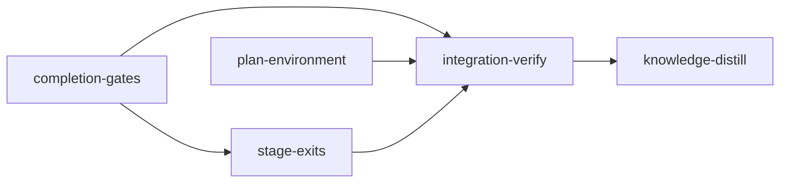

# Plan: Stage exits and the stage environment

## Overview

Stage agents in PLAN-source-graph-mechanism avoided disputes, filed them late with work
uncommitted, and stopped to ask the operator for things a plan could have granted up front.
Four causes sit in the code:

- Completion's impact-selected tests pick the wrong tests: they diff against the nearest
  published base layer, which pulled `web/` vitest files into Rust-only stages. A runner
  that cannot start (no `node_modules`, a 403 from the npm registry) then reads as a failing
  test.
- Only acceptance criteria can be disputed. A wrong wiring check or wiring test has no
  route, and the doctrine frames a dispute as a cost.
- `loom stage block` by a stage agent leaves the agent's session alive. Its later exit is
  filed as a crash, which overwrites the block reason, charges the retry budget and
  auto-retries the stage into the same wall.
- Plans learn about network and install needs at run time. No lint knows which registry
  `bunx`, `uv` or `go get` reach, nothing reads the repository's git hooks, and a worktree
  has no way to install JS dependencies before a session starts.

This plan fixes each cause and states one doctrine for how a stage ends when it cannot
finish (BLOCK-F): a wrong check gets a dispute, a need only a person can meet gets a block,
and neither ends in a turn that asks the operator to act.

## Goals and non-goals

- Impact-selected tests run on the stage's own diff, and a runner that cannot start is a
  note.
- `loom stage dispute-criteria --field acceptance|wiring|wiring-tests`, end to end.
- A contract freeze refuses files that fail the stage's formatter check.
- A refused dispute leaves no open request; `loom stage reset` closes open disputes.
- A stage agent's `loom stage block` retires its session, the exit is not a crash, and
  `loom status` shows the reason.
- Plan-level `provision` commands install worktree dependencies before each session.
- `loom plan verify` errors on missing registry domains, on repository hooks the sandbox
  cannot serve, and on JS packages no `provision` entry covers.
- The plan-writer skill carries an environment inventory, so a person is rarely needed.
- Non-goal: impact-selected tests get no dispute route (settled). Once environment failures
  are notes, a failure there is a regression the stage fixes.
- Non-goal: no backward-compatibility code. The dispute `field` is required on the wire and
  on disk (see Choices).

## Preconditions

Run `loom init` on this plan only after all three of these hold, in order:

1. PLAN-source-graph-mechanism has completed and merged to main.
2. `./finish-eval-fix.sh` has been worked through on that main.
3. A loom built from that main has been installed with `bash dev-install.sh`.

That fresh binary still predates this plan's impact-selection fix and its `provision` support,
so the installed-binary hazard below applies to every standard stage. It bites
`stage-exits` hardest: that stage branches only after `completion-gates` merges, so the
nearest published base layer can predate its branch point by a whole stage's work.

The baselines, byte counts and line numbers in this plan were measured at `b9aaea21`, before
these steps. Workers anchor every edit by symbol. Re-run
`loom plan verify --strict doc/plans/PLAN-stage-exits-and-environment.md` on the new main
before `loom init`.

## Before `loom run`

- Commit on main: this plan, `doc/plans/briefs/stage-exits-and-environment/**`, and the four
  modified knowledge files (`doc/loom/knowledge/{INDEX.md, concerns/agent-rule-bending-hardening.md,
  conventions.md, mistakes/subagent-orchestration.md}`). A stage worktree is cut from
  `HEAD`; the section `concerns/agent-rule-bending-hardening.md#Stage Agents Stop and Report
  Instead of Disputing or Blocking` exists only in the working tree today, and knowledge-distill
  rewrites it. An untracked brief does not exist in a worktree and its worker starts blind
  (`mistakes/verification-harness.md`, "Untracked Plan and Worker Briefs Leave a Worktree
  Stage Blind").
- `~/.bun/install/cache` exists on this host (checked 2026-09-30), so a first `bunx` or
  `bun install` in a worktree does not fail with `EROFS`.

## HAZARD: this plan runs on the installed binary

Every stage runs under the loom binary installed per the Preconditions, built from main
after PLAN-source-graph-mechanism. That binary still diffs impact selection against the
nearest published base and has no `provision` support; a binary built from this plan is
installed only after the plan completes (`mistakes/verification-harness.md`,
"The PATH Binary Can Lag `main` MID-PLAN, Not Just Behind Your Build"). If `loom stage
complete`'s impact-selected step picks `web/` vitest files, the stage agent runs
`cd web && bun install --frozen-lockfile` in its worktree and completes again:
`registry.npmjs.org` is allowed and the bun cache is pre-granted. Every standard stage's
description repeats this.

This plan declares no `provision` entry: the installed `loom plan verify` and `loom init`
reject the unknown field.

## Knowledge bootstrap: skipped

The tier-1 files already describe this codebase, and `loom knowledge check` reported 0
issues on 2026-09-30. The seams this plan changes are covered by
`architecture/adjudication-lifecycle.md`, `concerns/runtime-and-session-safety.md`,
`concerns/agent-rule-bending-hardening.md` and
`mistakes/computed-values-and-hidden-couplings.md` ("StageSummary Is a Wire Type"), which
each stage's Knowledge Brief quotes.

## Execution diagram



`completion-gates` and `plan-environment` start together. `stage-exits` starts once
`completion-gates` has merged and runs beside `plan-environment` if that is still going.

## Stage necessity

- **completion-gates.**
  - Q1: `stage-exits` teaches `dispute-criteria --field` in its doctrine, its failure
    guidance and the usage skill, so that syntax must be merged first.
  - Q2: `stage-exits` also edits `dispute_transport.rs`, `dispute_criteria_tests.rs` and
    `daemon/wire_tests.rs` after this stage.
  - Q4: merged with `plan-environment` (seven workers, fourteen contracts, about 65 files)
    one session passes 500,000 tokens.
- **plan-environment.** Q4, as above. It shares no file with the other two stages, the
  maintainability ledger included: its edits to ledgered files are net-zero, so only
  `completion-gates` edits `loom/maintainability-baseline.txt`.
- **stage-exits.** Q1 and Q2 on `completion-gates`, as above.

## Gate conventions (every code stage)

- `working_dir: "loom"`. Loom runs each contract as `cargo test <name> -- --exact` from the
  stage's `working_dir`, and the repository root has no `Cargo.toml`. YAML paths in `files`,
  `acceptance`, `artifacts`, `wiring`, contract `file` and the worker tables are
  package-relative; paths outside the package are written `../skills/...`, `../loom-hooks/...`
  or `../CLAUDE.md.template`. Prose paths are repository-relative (`loom/src/...`).
- Warm-up: `cargo build --all-targets` is the first acceptance entry. The main agent starts it
  in the background before briefing wave 1 and runs every acceptance command once in-session
  before `loom stage complete` (each simple acceptance command has a 300 s cap).
- A standard stage's acceptance proves its own modules with filters plus the build, clippy
  and fmt; the full suite runs once, in integration-verify.
- Contracts live in one integration-test file per stage (`tests/<stage>_contracts.rs`,
  discovered by cargo, so no harness file is needed). Several name symbols the stage has not
  written, so they freeze as `build_failed`. Before the final review round the main agent
  takes each contract, applies the implementation its `rejects:` names (or reverts the key
  line), confirms the contract fails, restores the tree, and records
  `loom memory note "mutation: <contract-id> red under <mutation>"`.
- The maintainability ledger (`loom/maintainability-baseline.txt`, a ratchet file): a stage
  that removes or lowers a ledger line files ONE `dispute-integrity` for
  `TI-ratchet-loom/maintainability-baseline.txt` after its final review round, with the reason
  "tightening only: <entry> removed after the refactor this plan prescribes". The briefs mark
  each ledgered item "net-zero" or "remove".
- Existing assertion lines in test files are never edited (a `TI-edit` event); new
  assertions go in new lines or new tests. `common.md` in the briefs directory states this
  and the other worker rules.
- Anchors: edits are anchored by symbol; line numbers in this plan were read at `b9aaea21`.

## Baseline evidence

Measured on the host at `b9aaea21`, not under a stage sandbox:

- `cargo test --all-targets --no-fail-fast` in the main checkout (`loom/`): exit 0, 28
  targets, 6,936 tests passed, 1 min 44 s.
- In a clean `git archive HEAD` copy: `cargo build --all-targets` (37 s warm),
  `cargo clippy --all-targets -- -D warnings`, `cargo fmt --all -- --check`,
  `RUSTDOCFLAGS='-D warnings' cargo doc --workspace --all-features --no-deps`,
  `cargo test --test maintainability` (8 passed), `cargo test --test adjudication_e2e` (13
  passed), the three `loom-hooks/tests/commit-guard-*.sh` scripts, and every `--lib` module
  filter this plan's acceptance names that exists at HEAD all exit 0 with at least one
  test selected (`verify::impact_tests::` 2, `verify::review::fingerprint` 7,
  `skills::project::` 21, `orchestrator::adjudication::` 105, `daemon::server::dispute` 16,
  `daemon::server::self_service` 8, `daemon::wire::` 13, `verify::goal_backward::` 51,
  `verify::contracts::` 29, `commands::stage::` 185, `completions::` 103,
  `fs::stage_request::` 18, `orchestrator::core::inbox_drain::` 20, `relay::` 137,
  `orchestrator::signals::` 222, `plan::schema::` 249, `commands::plan::` 5,
  `orchestrator::core::stage_executor` 7, `orchestrator::core::event_handler::` 61,
  `orchestrator::monitor::` 99, `commands::status::` 422, `fs::permissions::` 119,
  `models::` 254). The full suite in that copy failed 10 tests for reasons of the copy's
  location only (a path containing `claude`, a scratch root under `/tmp`, and a build commit
  of `unknown`); the main-checkout run above is the baseline.
- `daemon::server::stage_control` selects zero tests at HEAD, so no acceptance entry filters
  on it.
- `generate_stable_prefix()` is 6,720 bytes against a 7,168-byte ceiling
  (`orchestrator/signals/tests_size.rs`), the standard signal's stable plus semi-stable floor
  is 8,513 of 10,240, and `CLAUDE.md.template` is 18,734 of 20,480 bytes. BLOCK-F is 835 bytes.

## Choices this plan settles

Where the brief left a detail open, the plan takes one value:

1. The dispute `field` is required in `DisputeKind::Criterion`, `Request::DisputeCriteria` and
   `StageRequest::Dispute`, with no serde default; the CLI flag defaults to `acceptance`.
   `DisputeKind::criterion(field, index)` is the constructor every call site uses.
2. An accepted verdict on an acceptance dispute may still amend `acceptance` or `wiring`
   (unchanged). A wiring dispute's verdict must amend `wiring`, and a wiring-tests dispute's
   `wiring-tests`; any other field is a `needs-more-evidence` question.
3. Goal-backward gaps print `[wiring n]` and `[wiring_tests n]`, 0-based, the index
   `--criterion-index` takes with `--field wiring` or `--field wiring-tests`.
4. The impact selection set is every path changed since `git merge-base HEAD <target>`, the
   set the test-integrity fingerprint uses; the graph is still built on the nearest published
   base.
5. A JS adapter is one whose `language()` is `javascript` (vitest, jest, mocha, bun-test,
   node-test). It is ready when a `node_modules` directory exists in its package directory or
   an ancestor up to and including the checkout root. Exit status 127 is a note for every
   runner.
6. Fixture directories: detection skips every directory named `fixtures` below the scan root.
7. The freeze runs each recognised formatter check with the stage's `setup` prefix, from the
   stage's working directory, 300 s each, under the stage's command confinement.
8. `provision` is a `version: 2` field, like `ratchet_files`. The daemon reads it from the
   live plan file at each spawn, so an operator who adds an entry and runs `loom stage retry`
   gets it. It runs synchronously in the daemon's scheduling pass, like `before_stage`: a
   slow install delays the daemon's tick by up to 600 s per entry.
9. A failed provision sets `failure_info` (`InfrastructureError`, the reason's lines as
   evidence) as well as `close_reason`, so attention never labels it an agent block. The
   reason keeps the last 10 non-blank lines of stderr.
10. The registry lint scans acceptance, setup, wiring tests, after-stage checks and the
    dead-code check. It skips `before_stage`, which runs on the host.
11. `*.x` matches any host ending in `.x`, `*` matches every host, anything else matches
    exactly.
12. The JS provision lint runs on `version: 2` plans only (`provision` is v2-only); the
    registry and hook lints report warnings on v1 plans.
13. BLOCK-F is emitted by `append_completion_rules`, which serves the standard,
    integration-verify and knowledge-distill prefixes: `cache.rs` is ledgered at 524 lines,
    so no new call line can go there, and the rule holds for knowledge-distill too.
    `STABLE_PREFIX_MAX_BYTES` rises from 7,168 to 8,192 (about 7,560 bytes after BLOCK-F),
    documented in `tests_size.rs` as the BLOCK-D raise was.
14. A relayed dispute's notice tells the agent to end its turn, as a relayed block's does.
15. Attention for an agent block keeps `retry_guidance`'s command (`loom stage retry <id>`,
    or `--force` at the retry limit).
16. The sandbox drops the source-graph plan's `~/.cargo/advisory-db..lock` grant (no stage
    runs `cargo audit`) and adds `loom/maintainability-baseline.txt` (`completion-gates`
    removes one ledger line).
17. `plan/schema/types.rs` (ledgered at 416 lines) stays net-zero: the three lines of the
    `provision` field replace the four-line `PermissionMode` re-export comment, cut to one.

## Stages

### 1. completion-gates

Waves (worker table in YAML):

1. **Wave 1, three workers in one message.**
   - G1 (sonnet): impact selection on the stage's own diff, JS runner readiness, exit 127,
     fixture directories.
   - G2 (sonnet): `CriterionField` and `DisputeKind::Criterion.field` first, then the CLI,
     transport, wire, daemon handlers, spool and relay drains, dynamic completion, dispute
     bookkeeping (check the transition before writing `request.md`), `reset` closing open
     disputes, the `handle_dispute_criteria` refactor, and every `DisputeKind::Criterion`
     literal outside `src/orchestrator/adjudication/`.
   - G4 (sonnet): the formatter gate of `loom stage contracts freeze` and the contract-session
     rule.
2. **Wave 2: G3 (opus).** The adjudication side of `--field`: the prompt shows the right entry,
   the verdict validator checks the amended field, `plan_patch` accepts `wiring-tests`, the
   apply path resyncs `wiring_tests`, gap labels, and the literals under
   `src/orchestrator/adjudication/`. The crate does not compile between the waves.

Risk walk:

| Area | Contract or check |
| --- | --- |
| Untrusted input (index and field from the wire) | `wiring-dispute-indexes-the-wiring-list` |
| Lifecycle (a refused filing, a reset) | `refused-dispute-writes-no-request`; `state_tests::reset_closes_open_disputes` by name |
| Configuration (what detection counts as a package) | `fixture-directories-hold-no-packages` |
| External data (a runner's environment, a formatter's verdict) | `js-runner-without-node-modules-is-a-note`, `freeze-refuses-unformatted-contract-files` |
| Reachability (`--field` reaches the amendment) | `wiring-tests-verdict-must-amend-wiring-tests`; wiring test on `--help` |
| The behaviour the stage exists for | `impact-selection-uses-the-stage-merge-base` |

Filesystem paths and process scale do not apply beyond the unit tests the briefs name: the
readiness lookup never walks above the checkout root, and the change listing is NUL-separated
git output.

Callers checked:

- `WorktreeGraph.changed`: read only by `impact_tests.rs:78` and one test assertion
  (`impact_tests_tests.rs:110`). `build_for_worktree` also serves reachable checks
  (`verify/goal_backward/mod.rs:95`) and integration-verify re-verification
  (`complete_verification_v2.rs:97`); neither reads `changed`, and `worktree_graph.rs` is not
  edited.
- Project detection: `verify/contracts/mod.rs` (a contract's runner), `verify/impact_tests.rs`,
  `skills/recommend.rs`, `commands/hook/project_types.rs` and `commands/project.rs`
  (`loom project detect`). All five want fixture manifests left out. `loom map --eval-edges`
  and the labelled corpora never call detection.
- SILENT sites: `verdict.rs:58` `Criterion { .. }` must pass the field (G3). `verdict_kinds.rs`
  `(_, other)` is never reached by a criterion dispute (`parse_and_validate_for` routes it to
  `classify_and_validate`), so it is a NO-OP. The `apply_kinds.rs` `_ =>` arms send every
  criterion verdict to `apply_accept`/`apply_reject`, which read the field from the amendment:
  NO-OP. `loom-hooks/loom-relay.sh:64-65` maps the subcommand to the `dispute` kind and relays
  the serialized `StageRequest::Dispute`, which now carries the field: NO-OP.
  `completions/dynamic/mod.rs:281` completes stage ids; the flag list comes from clap, and G2
  adds value completion for `--field`.
- `persist_verdict_result` and `resync_after_amendment` (`apply.rs:140-257`) copy
  `acceptance` and `wiring` but not `wiring_tests`; G3 adds it to both.

Expected integrity events: `TI-ratchet-loom/maintainability-baseline.txt` (G2 removes
`function src/daemon/server/dispute.rs handle_dispute_criteria 91` after refactoring the
function under 50 lines). `tests/adjudication_e2e.rs` stays at exactly 525 lines. No existing
assertion line changes.

### 2. plan-environment

1. **Wave 1, two workers in one message.**
   - P1 (sonnet): the `provision` schema and v2 rules, the executor
     (`orchestrator/provision.rs`) and the spawn gate
     (`orchestrator/core/provision_gate.rs`).
   - P3 (sonnet): the plan-writer skill: the environment inventory, `provision`, the
     `loom repair` fix, and the Section 9 and reference wording that agrees with BLOCK-F.
2. **Wave 2: P2 (sonnet).** The registry, hook and JS-provision lints, the fixture plan, and
   the one-line `plan verify` fix that gives the lints an absolute repository root.

Risk walk:

| Area | Contract or check |
| --- | --- |
| Untrusted input / filesystem paths (a `working_dir` that escapes) | `provision-working-dir-cannot-escape`, `provision-refuses-a-symlinked-escape` |
| Process I/O (a failing install's output) | `failed-provision-names-command-and-dir` |
| Configuration (the entry reaches the right directory) | `provision-runs-in-its-working-dir` |
| Lifecycle (retry re-runs provisioning) | commands are idempotent by rule; `provision_gate::tests::a_failing_provision_blocks_the_stage_with_its_reason` by name |
| Reachability (lints registered in `loom plan verify`) | `js-package-without-provision-is-an-error`, `registry-tool-without-registry-domain-is-an-error`, `pre-commit-hook-registry-need-is-an-error` (all drive the binary) |
| External data (the repository's hook path and script) | `pre-commit-hook-registry-need-is-an-error` |

Found while grounding: `loom plan verify <relative path>` passes an empty repository root to
the lints (`find_repo_root` walks the parent of a relative path, and `"".join(".git")` exists
at the checkout root), so `git` runs with `current_dir("")` and fails. Today that is why
`loom plan verify doc/plans/X.md` notes "the repository has no HEAD commit". P2 passes an
absolute path (net-zero line change in the ledgered `verify.rs`), which the new lints need.

Expected integrity events: none. `plan/schema/types.rs` (416 lines), `stage_executor.rs`
(597 lines, `start_stage` 149, `before_stage_gate_passed` 62), `plan/schema/validation.rs`
(`validate` 357, untouched) and `commands/plan/verify.rs` (555) stay net-zero.

### 3. stage-exits

All three workers in one message:

- S1 (opus): block lifecycle. On `StageBlocked` with no `failure_info`, the daemon retires the
  live stage session through the disputing-agent takedown (handoff, kill, confirm, clear
  `stage.session` while still Blocked), and `exited_after_stage_finished` forgives an exit on
  such a stage.
- S2 (sonnet): `StageSummary.close_reason` on the wire, flattened, stripped before the browser
  snapshot, and the attention note.
- S3 (sonnet): BLOCK-F and every surface that must agree with it.

Where 0499aa3d's retire-before-status ordering applies: the block status is written before
the daemon learns of it, so the handler retires while the stage is Blocked and clears
`stage.session` only if the stage is still Blocked; a stage retried in between keeps its new
session. `loom stage retry` already refuses a live `stage.session` without `--force`
(`commands/stage/skip_retry.rs:54-69`).

Risk walk:

| Area | Contract or check |
| --- | --- |
| Untrusted input (an agent-written reason in terminal output) | `sanitize.rs` flattens `close_reason` (S2 unit test) |
| Lifecycle (the retired session's exit, a crash on a blocked stage) | `session_events::tests::an_agent_blocked_stage_session_exit_is_not_a_crash`, `verdict_retirement_tests::an_agent_block_retires_the_live_session` by name |
| Reachability (the reason reaches a TUI over the wire) | `agent-block-reason-reaches-attention-over-the-wire` |
| The behaviour the stage exists for | `crash-blocked-stage-is-not-an-agent-block` |

Attention wording follows the brief. It also shows for an operator's `loom stage block` and a
`human-review --reject`, which are Blocked with no `failure_info` too.

Expected integrity events: none. `handle_one_event` (116 lines) stays net-zero; `cache.rs`
is not edited.

### Integration verification

- The full suite, clippy with warnings denied, fmt, rustdoc with warnings denied.
- Review subagents: security (the provision executor runs plan commands on the host; the
  hook reader; `close_reason` in terminal output), architecture (the block lifecycle against
  the takedown invariants, the selection set against the fingerprint), and test coverage
  (every contract's mutation memory spot-checked).
- Functional smoke (wiring tests): `loom stage dispute-criteria --help` lists `--field` and
  `wiring-tests`; `loom plan verify --json` on `loom/tests/fixtures/plans/v2-environment-lints.md`
  exits 1 naming `registry.npmjs.org`, the pre-commit hook and a missing `provision` entry;
  `loom project detect` lists no `tests/fixtures` package.

### Knowledge distillation

Standard, plus these rewrites to current truth:

- `concerns/runtime-and-session-safety.md#Dispute Bookkeeping Gaps Around Escalation`: both
  gaps are closed; rewrite or remove the section.
- `concerns/agent-rule-bending-hardening.md#Stage Agents Stop and Report Instead of Disputing
  or Blocking`: the doctrine is BLOCK-F and the block lifecycle is enforced; keep only what
  remains open.
- `skills/loom-plan-writer/references/v2-contracts.md`, the gate table row for impact-selected
  tests and its bullet: the selection is the stage's diff since its merge base; a runner that
  cannot start is a note.
- README: the `dispute-criteria` syntax with `--field`, `provision` in the Plan Version 2
  table, and what `loom stage block` does to a stage agent's session.

---

<!-- loom METADATA -->

```yaml
loom:
  version: 2
  ratchet_files:
    - loom/maintainability-baseline.txt
    - doc/loom/knowledge/check-baseline.txt
  sandbox:
    enabled: true
    auto_allow: true
    filesystem:
      deny_read: ["~/.ssh/**", "~/.aws/**", "~/.config/gcloud/**", "~/.gnupg/**"]
      allow_write:
        - "loom/src/**"
        - "loom/tests/**"
        - "loom/eval/**"
        - "loom/target/**"
        - "loom/Cargo.toml"
        - "loom/Cargo.lock"
        - "loom/maintainability-baseline.txt"
        - "loom-hooks/**"
        - "CLAUDE.md.template"
        - "web/node_modules/**"
        - "doc/**"
        - "skills/**"
    network:
      allowed_domains: ["crates.io", "index.crates.io", "static.crates.io", "registry.npmjs.org"]
      allow_local_binding: false
      allow_unix_sockets: []
  stages:
    - id: completion-gates
      name: "Completion gates: impact selection, criterion disputes, contract freeze"
      summary: "Impact-selected tests run on the stage's own diff and treat a runner that cannot start as a note; fixture manifests stop counting as packages; wiring checks and wiring tests become disputable; a contract freeze refuses unformatted files; a refused dispute leaves no open request."
      stage_type: standard
      skills: ["loom-rust"]
      subagent_timeout_secs: 900
      working_dir: "loom"
      dependencies: []
      description: |
        Implement stage 1 of doc/plans/PLAN-stage-exits-and-environment.md ("completion-gates", and "Choices this plan settles" 1-7).
        Use parallel subagents and skills to maximize performance.
        Every worker first reads doc/plans/briefs/stage-exits-and-environment/common.md, then its own brief.
        Spawn every worker BY AGENT TYPE with the fixed prompt plus "Your brief: <path>. Read it in full before anything else."
        Territories are DISJOINT. Workers NEVER spawn subagents.
        Waves: G1, G2 and G4 in ONE message; then G3. The crate does not compile between the waves (G2 changes DisputeKind; G3 migrates src/orchestrator/adjudication/), so no wave-1 worker runs a check; G3 runs its one check, and the main agent builds and tests after G3.

        | Worker | Role | Tier | Files owned | Shared context | Brief path |
        | ------ | ---- | ---- | ----------- | -------------- | ---------- |
        | G1 | Impact selection and fixtures | sonnet | src/verify/impact_tests.rs; src/verify/impact_tests/runs.rs; src/verify/impact_tests_tests.rs; src/verify/review/fingerprint.rs; src/commands/stage/complete_verification_v2.rs; src/skills/project/scan.rs; src/skills/project/tests.rs | common.md | doc/plans/briefs/stage-exits-and-environment/completion-gates/g1-impact-selection.md |
        | G2 | Dispute field plumbing and bookkeeping | sonnet | src/models/dispute.rs; src/models/dispute_tests.rs; src/models/stage/dispute_budgets.rs; src/cli/types_stage.rs; src/cli/types_stage_disputes.rs; src/cli/dispatch_stage.rs; src/commands/stage/dispute_criteria.rs; src/commands/stage/dispute_criteria_tests.rs; src/commands/stage/dispute_transport.rs; src/commands/stage/state/loop_recovery/mod.rs; src/commands/stage/state_tests.rs; src/daemon/protocol.rs; src/daemon/protocol_debug.rs; src/daemon/wire_tests.rs; src/daemon/server/dispute.rs; src/daemon/server/dispute_kinds.rs; src/daemon/server/dispute_kinds_tests.rs; src/daemon/server/stage_control.rs; src/daemon/server/self_service_tests.rs; src/daemon/server/tests/self_service_client.rs; src/fs/stage_request/types.rs; src/fs/stage_request/apply.rs; src/fs/stage_request/tests/apply.rs; src/fs/stage_request/tests/spool.rs; src/orchestrator/core/inbox_drain/apply.rs; src/orchestrator/core/inbox_drain/test_support.rs; src/orchestrator/core/verdict_apply_tests.rs; src/orchestrator/signals/adjudication.rs; src/relay/payload.rs; src/completions/dynamic/mod.rs; src/completions/dynamic/commands.rs; src/completions/dynamic/tests/tests_stage.rs; tests/adjudication_e2e.rs; maintainability-baseline.txt | common.md | doc/plans/briefs/stage-exits-and-environment/completion-gates/g2-dispute-field-plumbing.md |
        | G3 | Dispute field adjudication and gap labels | opus | src/orchestrator/adjudication/prompt.rs; src/orchestrator/adjudication/prompt/criterion.rs; src/orchestrator/adjudication/prompt/criterion_entry.rs; src/orchestrator/adjudication/prompt/tests.rs; src/orchestrator/adjudication/prompt/tests_kinds.rs; src/orchestrator/adjudication/prompt/tests_golden.rs; src/orchestrator/adjudication/verdict.rs; src/orchestrator/adjudication/verdict_tests.rs; src/orchestrator/adjudication/plan_patch.rs; src/orchestrator/adjudication/apply.rs; src/orchestrator/adjudication/tests.rs; src/orchestrator/adjudication/record_tests.rs; src/orchestrator/adjudication/mod.rs; src/orchestrator/adjudication/tests_criterion_field.rs; src/verify/goal_backward/mod.rs | common.md; G2's CriterionField | doc/plans/briefs/stage-exits-and-environment/completion-gates/g3-dispute-field-adjudication.md |
        | G4 | Contract freeze formatter gate | sonnet | src/verify/contracts/format_gate.rs; src/verify/contracts/mod.rs; src/commands/stage/contracts/freeze.rs; src/orchestrator/signals/contract.rs; src/orchestrator/signals/contract_tests.rs | common.md | doc/plans/briefs/stage-exits-and-environment/completion-gates/g4-freeze-format-gate.md |

        CONTRACT SURFACE (the contract session writes tests/completion_gates_contracts.rs from this, before any code; top-level #[test] fns, so each contract's test value is its fn name):
        - loom::verify::impact_tests::stage_changes(worktree: &Path, target_branch: &str) -> anyhow::Result<Vec<PathBuf>>: worktree-relative paths changed since git merge-base HEAD <target_branch>, committed on the branch, staged, unstaged or untracked and not ignored; sorted, no duplicates. worktree is the worktree root.
        - loom::verify::impact_tests::run(stage: &Stage, working_dir: &Path, criteria_config: &loom::verify::criteria::CriteriaConfig, target_branch: &str) -> anyhow::Result<ImpactOutcome>; ImpactOutcome { ran: Vec<String>, notes: Vec<String> }. A JS package with no node_modules gives the note "`<package>` has no node_modules in this worktree (a plan `provision` entry installs it); the full suite runs in integration-verify" and runs nothing. Stage is loom::models::stage::Stage (Stage::default() works).
        - loom::skills::project::ProjectProfile::discover(dir).package_details() -> Vec<PackageDetail { path: PathBuf (relative to the checkout root), kinds, runner, skills }>. No package has a path component named `fixtures`.
        - loom::models::dispute::{CriterionField, DisputeKind, DisputeRequest, DisputeVerdict, request_file}: CriterionField::{Acceptance, Wiring, WiringTests} (serde "acceptance", "wiring", "wiring-tests"); DisputeKind::criterion(field: CriterionField, criterion_index: usize) -> DisputeKind builds DisputeKind::Criterion { criterion_index, field }. request.md is YAML frontmatter between the first two "---" lines, parsed into DisputeRequest with serde_yaml.
        - loom::daemon::handle_dispute_criteria(work_dir: &Path, stage_id: &str, field: CriterionField, criterion_index: usize, reason: String, evidence_commit: Option<String>, failure_output: Option<String>) -> anyhow::Result<loom::daemon::Response>. A filed dispute answers Response::DisputeCreated { id }; a refusal answers Response::Error { message } and writes no request.md (an out-of-range index's message contains "out of range"). Stage setup mirrors daemon/server/dispute.rs tests::setup: loom::fs::work_dir::WorkDir::new(tmp) then .initialize(), then loom::verify::transitions::save_stage(&stage, wd.root()); request.md is loom::models::dispute::request_file(&wd.root().join("disputes"), stage_id, id). Stage fields: id, name, status (loom::models::stage::StageStatus), acceptance (Vec<loom::plan::schema::AcceptanceCriterion>, Simple(String)), wiring (Vec<loom::plan::schema::WiringCheck { source, pattern, description, literal }>), wiring_tests, dispute_count; ..Stage::default().
        - loom::orchestrator::adjudication::verdict::{parse_and_validate_for, ValidationOutcome}: parse_and_validate_for(raw: &str, kind: &DisputeKind) -> ValidationOutcome; ValidationOutcome::Verdict(DisputeVerdict::Accept { plan_patch, citations, reasoning }) with plan_patch.inner a serde_json::Value holding "field"; an accept needs "reasoning" and one citation {"file","line","excerpt","claim"}; plan_patch is {"field": ..., "patch": {"op": "replace", "index": 0, "value": "<YAML>"}, "reason": "..."}.
        - loom::verify::contracts::format_gate::format_problems(acceptance: &[loom::plan::schema::AcceptanceCriterion], setup: &[String], working_dir: &Path, confinement: loom::models::stage::CommandConfinement) -> anyhow::Result<Vec<String>>: runs only the criteria that are formatter checks (cargo fmt with --check, rustfmt --check, prettier --check, oxfmt --check, biome format, biome check, gofmt -l, ruff format --check, black --check, a format:check script) and returns one problem per failing one, naming its command.
        - Git in tests runs with GIT_CONFIG_GLOBAL and GIT_CONFIG_SYSTEM pointed at missing files and GIT_CONFIG_NOSYSTEM=1, user.name/user.email set locally, as src/verify/impact_tests_tests.rs does.

        HAZARD (installed binary): this plan runs on the loom binary installed before it (built from main after PLAN-source-graph-mechanism), which still selects impact tests from the nearest published base layer. If loom stage complete's impact-selected step picks web/ vitest files, run cd web && bun install --frozen-lockfile in this worktree (registry.npmjs.org is allowed; the bun cache is pre-granted), then run loom stage complete again.
        EXPECTED INTEGRITY EVENTS: TI-ratchet-loom/maintainability-baseline.txt only (G2 removes the handle_dispute_criteria line). File ONE dispute-integrity for it after the final review round, reason "tightening only: handle_dispute_criteria refactored under 50 lines as the plan prescribes". No other ledger line and no existing assertion line changes; tests/adjudication_e2e.rs stays at 525 lines.
        CONTRACTS: before the final review round, prove each contract red by mutation (Gate conventions) and record loom memory note "mutation: <id> red under <mutation>".
        MEMORY: record mistakes, decisions and surprises via loom memory immediately (subagents too); never loom knowledge in this stage; never Claude Code auto-memory.
      before_stage:
        - command: "rg -q -F 'stage_changes' src/verify/impact_tests.rs"
          exit_code: 1
          description: "BEFORE: impact selection has no stage-diff selection set"
      after_stage:
        - command: "cargo test --test completion_gates_contracts impact_selection_uses_the_stage_merge_base -- --exact"
          exit_code: 0
          stdout_contains: ["1 passed"]
          description: "AFTER: impact selection uses the stage's diff since its merge base"
      acceptance:
        - "cargo build --all-targets"
        - "cargo clippy --all-targets -- -D warnings"
        - "cargo fmt --all -- --check"
        - "cargo test --lib verify::impact_tests::"
        - "cargo test --lib verify::review::fingerprint"
        - "cargo test --lib verify::goal_backward::"
        - "cargo test --lib verify::contracts::"
        - "cargo test --lib skills::project::"
        - "cargo test --lib models::"
        - "cargo test --lib daemon::server::dispute"
        - "cargo test --lib daemon::server::self_service"
        - "cargo test --lib daemon::wire::"
        - "cargo test --lib commands::stage::"
        - "cargo test --lib fs::stage_request::"
        - "cargo test --lib orchestrator::core::inbox_drain::"
        - "cargo test --lib orchestrator::core::verdict_apply"
        - "cargo test --lib orchestrator::adjudication::"
        - "cargo test --lib orchestrator::signals::"
        - "cargo test --lib relay::"
        - "cargo test --lib completions::"
        - "cargo test --lib verify::impact_tests::tests::exit_127_is_a_note -- --exact"
        - "cargo test --lib verify::goal_backward::tests::gaps_name_their_wiring_and_wiring_tests_index -- --exact"
        - "cargo test --lib commands::stage::state::state_tests::reset_closes_open_disputes -- --exact"
        - "cargo test --test adjudication_e2e"
        - "cargo test --test completion_gates_contracts"
        - "cargo test --test maintainability"
      files:
        - "src/verify/impact_tests.rs"
        - "src/verify/impact_tests/**"
        - "src/verify/impact_tests_tests.rs"
        - "src/verify/review/fingerprint.rs"
        - "src/verify/goal_backward/mod.rs"
        - "src/verify/contracts/mod.rs"
        - "src/verify/contracts/format_gate.rs"
        - "src/commands/stage/complete_verification_v2.rs"
        - "src/commands/stage/dispute_criteria.rs"
        - "src/commands/stage/dispute_criteria_tests.rs"
        - "src/commands/stage/dispute_transport.rs"
        - "src/commands/stage/state/**"
        - "src/commands/stage/state_tests.rs"
        - "src/commands/stage/contracts/freeze.rs"
        - "src/skills/project/**"
        - "src/models/dispute.rs"
        - "src/models/dispute_tests.rs"
        - "src/models/stage/dispute_budgets.rs"
        - "src/cli/types_stage.rs"
        - "src/cli/types_stage_disputes.rs"
        - "src/cli/dispatch_stage.rs"
        - "src/daemon/protocol.rs"
        - "src/daemon/protocol_debug.rs"
        - "src/daemon/wire_tests.rs"
        - "src/daemon/server/dispute.rs"
        - "src/daemon/server/dispute_kinds.rs"
        - "src/daemon/server/dispute_kinds_tests.rs"
        - "src/daemon/server/stage_control.rs"
        - "src/daemon/server/self_service_tests.rs"
        - "src/daemon/server/tests/self_service_client.rs"
        - "src/fs/stage_request/**"
        - "src/orchestrator/core/inbox_drain/**"
        - "src/orchestrator/core/verdict_apply_tests.rs"
        - "src/orchestrator/adjudication/**"
        - "src/orchestrator/signals/adjudication.rs"
        - "src/orchestrator/signals/contract.rs"
        - "src/orchestrator/signals/contract_tests.rs"
        - "src/relay/payload.rs"
        - "src/completions/dynamic/**"
        - "tests/adjudication_e2e.rs"
        - "tests/completion_gates_contracts.rs"
        - "maintainability-baseline.txt"
      artifacts:
        - "src/verify/contracts/format_gate.rs"
        - "src/orchestrator/adjudication/prompt/criterion_entry.rs"
      wiring:
        - source: "src/verify/impact_tests.rs"
          pattern: "stage_changes\\("
          description: "run selects tests from the stage's diff since its merge base"
        - source: "src/verify/impact_tests/runs.rs"
          pattern: "missing_node_modules\\("
          description: "run_group checks a JS runner's node_modules before it runs a selection"
        - source: "src/skills/project/scan.rs"
          pattern: "\"fixtures\""
          literal: true
          description: "project detection skips fixture directories"
        - source: "src/commands/stage/contracts/freeze.rs"
          pattern: "format_problems\\("
          description: "the freeze runs the stage's formatter checks before running contracts"
        - source: "src/commands/stage/state/loop_recovery/mod.rs"
          pattern: "close_open_disputes\\("
          description: "loom stage reset closes the stage's open disputes"
      wiring_tests:
        - name: "dispute-criteria takes --field"
          command: "cargo run --quiet -- stage dispute-criteria --help"
          success_criteria:
            exit_code: 0
            stdout_contains: ["--field", "wiring-tests"]
        - name: "project detect lists no fixture package"
          command: "cargo run --quiet -- project detect"
          success_criteria:
            exit_code: 0
            stdout_contains: ["runner=cargo-test"]
            stdout_not_contains: ["tests/fixtures"]
      contracts:
        - id: impact-selection-uses-the-stage-merge-base
          file: tests/completion_gates_contracts.rs
          test: impact_selection_uses_the_stage_merge_base
          scenario: "in a TempDir git repo on branch main, commits A (src/lib.rs, src/other.rs, web/a.test.ts), then B editing web/a.test.ts on main; checks out branch loom/s from B, commits C editing src/lib.rs, edits src/other.rs without committing and writes an untracked src/new.rs; calls stage_changes(root, \"main\")"
          rejects: "a selection that diffs from an older base than the stage's merge base (it lists web/a.test.ts, changed by work merged before the stage branched) or from HEAD (it misses the committed src/lib.rs); expected exactly [src/lib.rs, src/new.rs, src/other.rs]"
        - id: js-runner-without-node-modules-is-a-note
          file: tests/completion_gates_contracts.rs
          test: js_runner_without_node_modules_is_a_note
          scenario: "in a TempDir git repo on main with one committed README.md, writes untracked web/package.json {\"devDependencies\":{\"vitest\":\"^3.2.0\"}} and web/src/a.test.ts (import { test } from \"vitest\"; function boom() { throw new Error(\"boom\") } test(\"x\", boom)), with no node_modules anywhere; calls run(&Stage::default(), root, &CriteriaConfig::default(), \"main\")"
          rejects: "a selection that runs npx vitest run with no node_modules, so a missing install, a refused registry or a missing npx reads as a failing test (run returns Err), instead of Ok with a note containing \"has no node_modules\" and an empty ran list"
        - id: fixture-directories-hold-no-packages
          file: tests/completion_gates_contracts.rs
          test: fixture_directories_hold_no_packages
          scenario: "in a TempDir git repo writes Cargo.toml at the root, tests/fixtures/labeled/rust/Cargo.toml, tests/fixtures/labeled/go/go.mod, fixtures/app/package.json and tests/fixtures-extra/pkg/Cargo.toml, each a minimal manifest; calls ProjectProfile::discover(root).package_details()"
          rejects: "a detection that still lists a package below a directory named fixtures, or one that matches the substring and also drops tests/fixtures-extra/pkg"
        - id: wiring-dispute-indexes-the-wiring-list
          file: tests/completion_gates_contracts.rs
          test: wiring_dispute_indexes_the_wiring_list
          scenario: "saves stage s1 (Executing, one acceptance criterion, two wiring checks, no wiring tests) and stage s2 (Executing, one acceptance criterion, no wiring tests); files handle_dispute_criteria for s1 with CriterionField::Wiring index 1, then for s2 with CriterionField::WiringTests index 0"
          rejects: "a daemon that still range-checks every field against the acceptance list (it refuses wiring index 1 on s1, or files wiring-tests index 0 on s2), or that drops the field so s1's request.md does not read back as DisputeKind::criterion(CriterionField::Wiring, 1); s2 must answer an Error containing \"out of range\" and leave no request.md"
        - id: wiring-tests-verdict-must-amend-wiring-tests
          file: tests/completion_gates_contracts.rs
          test: wiring_tests_verdict_must_amend_wiring_tests
          scenario: "for kind DisputeKind::criterion(CriterionField::WiringTests, 0), validates an accept verdict whose plan_patch is {\"field\": \"wiring-tests\", \"patch\": {\"op\": \"replace\", \"index\": 0, \"value\": \"name: t\\ncommand: \\\"true\\\"\\nsuccess_criteria:\\n  exit_code: 0\\n\"}, \"reason\": \"r\"}, then the same verdict with \"field\": \"acceptance\""
          rejects: "a validator that still admits only acceptance|wiring (the wiring-tests accept becomes needs-more-evidence), or that lets a wiring-tests dispute's verdict amend the acceptance list (the second verdict must be DisputeVerdict::NeedsMoreEvidence)"
        - id: refused-dispute-writes-no-request
          file: tests/completion_gates_contracts.rs
          test: refused_dispute_writes_no_request
          scenario: "saves stage s3 with status Completed and one acceptance criterion; calls handle_dispute_criteria(wd, \"s3\", CriterionField::Acceptance, 0, ...)"
          rejects: "a handler that writes request.md before it learns the stage cannot move to NeedsAdjudication, leaving disputes/s3/1/request.md as an open dispute with no verdict, or that counts the refused filing in dispute_count; the answer must not be DisputeCreated"
        - id: freeze-refuses-unformatted-contract-files
          file: tests/completion_gates_contracts.rs
          test: freeze_refuses_unformatted_contract_files
          scenario: "in a TempDir crate (Cargo.toml for package probe, src/lib.rs containing \"pub fn  add(a:u32,b:u32)->u32{a+b}\\n\"), calls format_problems with acceptance [Simple(\"cargo fmt --check\"), Simple(\"false\")], no setup, the crate dir and CommandConfinement::Confined"
          rejects: "a freeze that runs no formatter check (no problem) or runs every acceptance command (the non-formatter false also becomes a problem); expected exactly one problem, containing \"cargo fmt --check\""

    - id: plan-environment
      name: "Plan environment: provision and plan-time checks"
      summary: "Plans can declare provision commands the daemon runs in each worktree before a session starts; loom plan verify errors on registry domains a stage's sandbox lacks, on a git hook the sandbox cannot serve, and on JS packages nothing provisions; the plan-writer skill gains an environment inventory."
      stage_type: standard
      skills: ["loom-rust"]
      subagent_timeout_secs: 900
      working_dir: "loom"
      dependencies: []
      description: |
        Implement stage 2 of doc/plans/PLAN-stage-exits-and-environment.md ("plan-environment", and "Choices this plan settles" 8-12).
        Use parallel subagents and skills to maximize performance.
        Every worker first reads doc/plans/briefs/stage-exits-and-environment/common.md, then its own brief.
        Spawn every worker BY AGENT TYPE with the fixed prompt plus "Your brief: <path>. Read it in full before anything else."
        Territories are DISJOINT. Workers NEVER spawn subagents.
        Waves: P1 and P3 in ONE message; then P2 (its JS lint reads the provision field P1 adds).

        | Worker | Role | Tier | Files owned | Shared context | Brief path |
        | ------ | ---- | ---- | ----------- | -------------- | ---------- |
        | P1 | Provision schema, executor and spawn gate | sonnet | src/plan/schema/types.rs; src/plan/schema/types_v2.rs; src/plan/schema/mod.rs; src/plan/schema/validation/v2_fields.rs; src/plan/schema/tests/v2_tests.rs; src/orchestrator/provision.rs; src/orchestrator/mod.rs; src/orchestrator/core/provision_gate.rs; src/orchestrator/core/provision_gate_tests.rs; src/orchestrator/core/mod.rs; src/orchestrator/core/stage_executor.rs | common.md | doc/plans/briefs/stage-exits-and-environment/plan-environment/p1-provision.md |
        | P2 | Environment lints | sonnet | src/plan/schema/validation/v2_lints/mod.rs; src/plan/schema/validation/v2_lints/registry_domains.rs; src/plan/schema/validation/v2_lints/repo_hooks.rs; src/plan/schema/validation/v2_lints/js_provision.rs; src/plan/schema/validation/v2_lints/sandbox_capability.rs; src/plan/schema/tests/mod.rs; src/plan/schema/tests/v2_lint_environment_tests.rs; src/commands/plan/verify.rs; tests/fixtures/plans/v2-environment-lints.md | common.md; P1's ProvisionEntry | doc/plans/briefs/stage-exits-and-environment/plan-environment/p2-environment-lints.md |
        | P3 | Plan-writer skill | sonnet | ../skills/loom-plan-writer/SKILL.md; ../skills/loom-plan-writer/references/sandbox.md; ../skills/loom-plan-writer/references/v2-contracts.md; ../skills/loom-plan-writer/references/authoring-detail.md; ../skills/loom-plan-writer/references/grounding-protocols.md | common.md; BLOCK-F text | doc/plans/briefs/stage-exits-and-environment/plan-environment/p3-plan-writer-skill.md |

        CONTRACT SURFACE (the contract session writes tests/plan_environment_contracts.rs from this, before any code; top-level #[test] fns):
        - loom::plan::schema::ProvisionEntry { working_dir: String, command: String } (serde, deny_unknown_fields); loom::plan::schema::LoomConfig gains provision: Vec<ProvisionEntry> (YAML key loom.provision).
        - loom::orchestrator::provision::run_provision(entries: &[ProvisionEntry], worktree: &Path) -> Result<(), String>: runs each command with sh -c in worktree.join(working_dir), in order, stopping at the first failure. Err is the stage's block reason: "provision `<command>` in `<working_dir>` failed: <detail>", where detail is the last 10 non-blank stderr lines joined by newlines (or "exit <code>" when stderr is empty). A working_dir that resolves outside the worktree (a symlink) is an Err and runs nothing.
        - loom::plan::schema::validate(&LoomMetadata) -> Result<(), Vec<ValidationError>> (ValidationError has message: String); LoomMetadata parses from YAML text with serde_yaml. A provision working_dir that is absolute or contains `..` is an error whose message contains "provision".
        - loom plan verify --json <plan>: run the binary env!("CARGO_BIN_EXE_loom") with args ["plan", "verify", "--json", "PLAN.md"] and current_dir set to the TempDir git repo that holds PLAN.md (a RELATIVE plan path); stdout is one JSON object whose "errors" is an array of {"stage_id": string|null, "message": string}; the exit status is 1 when errors is non-empty. For the plan text, copy the YAML of tests/fixtures/plans/v2-valid.md (every stage with a summary), wrapped in the <!-- loom METADATA --> markers and a yaml code fence as that file is. A sandbox block goes under loom: as sandbox: { network: { allowed_domains: [...] } }; provision goes under loom: as provision: [{ working_dir: web, command: "bun install --frozen-lockfile" }].
        - Lint message fragments the contracts may match: a JS package lint names the package in backticks and the word "provision" (for web: "`web`"); a registry lint names the missing domain ("registry.npmjs.org"); a hook lint names "pre-commit" and the missing domain.
        - Git in tests, and the loom binary the tests run, get GIT_CONFIG_GLOBAL and GIT_CONFIG_SYSTEM pointed at missing files and GIT_CONFIG_NOSYSTEM=1, as src/verify/impact_tests_tests.rs does, so a user's global core.hooksPath never leaks in; a repo-local core.hooksPath is set with git config inside the TempDir repo.

        HAZARD (installed binary): this plan runs on the loom binary installed before it (built from main after PLAN-source-graph-mechanism), which still selects impact tests from the nearest published base layer and rejects a plan-level provision key. If loom stage complete's impact-selected step picks web/ vitest files, run cd web && bun install --frozen-lockfile in this worktree (registry.npmjs.org is allowed; the bun cache is pre-granted), then run loom stage complete again.
        EXPECTED INTEGRITY EVENTS: none. Never edit loom/maintainability-baseline.txt in this stage: plan/schema/types.rs (416 lines), stage_executor.rs (597; start_stage 149, before_stage_gate_passed 62) and commands/plan/verify.rs (555) stay net-zero, and a new file or function stays under its limit.
        CONTRACTS: before the final review round, prove each contract red by mutation (Gate conventions) and record loom memory note "mutation: <id> red under <mutation>".
        MEMORY: record mistakes, decisions and surprises via loom memory immediately (subagents too); never loom knowledge in this stage; never Claude Code auto-memory.
      before_stage:
        - command: "rg -q -F 'provision' src/plan/schema/types.rs"
          exit_code: 1
          description: "BEFORE: the plan schema has no provision field"
      after_stage:
        - command: "cargo test --test plan_environment_contracts provision_runs_in_its_working_dir -- --exact"
          exit_code: 0
          stdout_contains: ["1 passed"]
          description: "AFTER: a provision entry runs in its working directory"
      acceptance:
        - "cargo build --all-targets"
        - "cargo clippy --all-targets -- -D warnings"
        - "cargo fmt --all -- --check"
        - "cargo test --lib plan::schema::"
        - "cargo test --lib orchestrator::provision::"
        - "cargo test --lib orchestrator::core::provision_gate"
        - "cargo test --lib orchestrator::core::stage_executor"
        - "cargo test --lib commands::plan::"
        - "cargo test --lib orchestrator::signals::tests_doctrine"
        - "cargo test --lib orchestrator::core::provision_gate::tests::a_failing_provision_blocks_the_stage_with_its_reason -- --exact"
        - "cargo test --test plan_environment_contracts"
        - "cargo test --test maintainability"
        - 'rg -q -F "loom.provision" ../skills/loom-plan-writer/SKILL.md'
        - 'rg -q -F "loom stage block" ../skills/loom-plan-writer/SKILL.md'
        - 'rg -q -F "provision" ../skills/loom-plan-writer/references/sandbox.md'
      files:
        - "src/plan/schema/types.rs"
        - "src/plan/schema/types_v2.rs"
        - "src/plan/schema/mod.rs"
        - "src/plan/schema/validation/v2_fields.rs"
        - "src/plan/schema/validation/v2_lints/**"
        - "src/plan/schema/tests/**"
        - "src/orchestrator/provision.rs"
        - "src/orchestrator/mod.rs"
        - "src/orchestrator/core/provision_gate.rs"
        - "src/orchestrator/core/provision_gate_tests.rs"
        - "src/orchestrator/core/mod.rs"
        - "src/orchestrator/core/stage_executor.rs"
        - "src/commands/plan/verify.rs"
        - "tests/fixtures/plans/v2-environment-lints.md"
        - "tests/plan_environment_contracts.rs"
        - "../skills/loom-plan-writer/**"
      artifacts:
        - "src/orchestrator/provision.rs"
        - "src/orchestrator/core/provision_gate.rs"
        - "src/plan/schema/validation/v2_lints/registry_domains.rs"
        - "src/plan/schema/validation/v2_lints/repo_hooks.rs"
        - "src/plan/schema/validation/v2_lints/js_provision.rs"
        - "tests/fixtures/plans/v2-environment-lints.md"
      wiring:
        - source: "src/orchestrator/core/stage_executor.rs"
          pattern: "pre_spawn_gates_passed\\("
          description: "start_stage provisions the worktree before the before-stage gate"
        - source: "src/orchestrator/core/provision_gate.rs"
          pattern: "run_provision\\("
          description: "the spawn gate runs the plan's provision entries"
        - source: "src/plan/schema/validation/v2_lints/mod.rs"
          pattern: "registry_domains::check\\("
          description: "plan verify runs the registry-domain lint"
        - source: "src/plan/schema/validation/v2_lints/mod.rs"
          pattern: "repo_hooks::check\\("
          description: "plan verify runs the repository-hook lint"
        - source: "src/plan/schema/validation/v2_lints/mod.rs"
          pattern: "js_provision::check\\("
          description: "plan verify runs the JS provision lint"
      wiring_tests:
        - name: "plan verify reports the environment lints"
          command: "cargo run --quiet -- plan verify --json tests/fixtures/plans/v2-environment-lints.md"
          success_criteria:
            exit_code: 1
            stdout_contains: ["registry.npmjs.org", "pre-commit", "provision"]
      contracts:
        - id: provision-runs-in-its-working-dir
          file: tests/plan_environment_contracts.rs
          test: provision_runs_in_its_working_dir
          scenario: "creates a TempDir worktree with a web/ directory and calls run_provision(&[ProvisionEntry { working_dir: \"web\", command: \"pwd > provisioned.txt\" }], worktree)"
          rejects: "an executor that runs the command in the worktree root or the daemon's own cwd; expected Ok and worktree/web/provisioned.txt holding the canonical path of worktree/web"
        - id: failed-provision-names-command-and-dir
          file: tests/plan_environment_contracts.rs
          test: failed_provision_names_command_and_dir
          scenario: "creates a TempDir worktree with web/ and calls run_provision with [{web, \"echo registry refused >&2; exit 7\"}, {web, \"touch ran-after\"}]"
          rejects: "an executor that ignores the exit status, drops stderr from the reason, or keeps running later entries; expected Err starting \"provision `echo registry refused >&2; exit 7` in `web` failed: \" and containing \"registry refused\", and no web/ran-after"
        - id: provision-refuses-a-symlinked-escape
          file: tests/plan_environment_contracts.rs
          test: provision_refuses_a_symlinked_escape
          scenario: "creates a TempDir worktree whose web is a symlink to a second TempDir outside it, and calls run_provision with [{web, \"touch escaped\"}]"
          rejects: "an executor that follows the symlinked working_dir out of the worktree and runs the host command there; expected Err and no escaped file in the outside directory"
        - id: provision-working-dir-cannot-escape
          file: tests/plan_environment_contracts.rs
          test: provision_working_dir_cannot_escape
          scenario: "parses a version 2 plan YAML (one standard stage with one contract, as src/plan/schema/tests/mod.rs create_valid_metadata_v2 builds) whose loom.provision is [{working_dir: \"../elsewhere\", command: \"true\"}], calls validate; then the same with working_dir \"/abs/web\""
          rejects: "validation that accepts a working_dir with a .. component or an absolute path, which would run a host command outside the worktree; each case must give an error whose message contains \"provision\""
        - id: js-package-without-provision-is-an-error
          file: tests/plan_environment_contracts.rs
          test: js_package_without_provision_is_an_error
          scenario: "in a TempDir git repo commits web/package.json {\"devDependencies\":{\"vitest\":\"^3.2.0\"}} and PLAN.md (the v2-valid plan, no provision), runs loom plan verify --json PLAN.md from the repo; then rewrites PLAN.md with provision [{working_dir: web, command: \"bun install --frozen-lockfile\"}] and runs it again"
          rejects: "a lint never registered in loom plan verify, one that reads the repository through the empty root a relative plan path gives (it reports nothing), or one that still errors when an entry covers web; the first run must list an error containing \"`web`\" and \"provision\", the second none"
        - id: registry-tool-without-registry-domain-is-an-error
          file: tests/plan_environment_contracts.rs
          test: registry_tool_without_registry_domain_is_an_error
          scenario: "in a TempDir git repo, PLAN.md is the v2-valid plan with \"bunx tsc --noEmit\" added to the standard stage's acceptance and sandbox network allowed_domains [crates.io]; runs loom plan verify --json PLAN.md; then with allowed_domains [crates.io, \"*.npmjs.org\"]"
          rejects: "a lint that only knows the old curl/wget/gh/install list (bunx passes silently) or that ignores wildcard patterns; the first run must list an error containing \"registry.npmjs.org\", the second none"
        - id: pre-commit-hook-registry-need-is-an-error
          file: tests/plan_environment_contracts.rs
          test: pre_commit_hook_registry_need_is_an_error
          scenario: "in a TempDir git repo runs git config core.hooksPath hooks and writes an executable hooks/pre-commit containing the line git ls-files -z -- '*.md' | xargs -0 bunx markdownlint-cli2 --fix || true; PLAN.md is the v2-valid plan with sandbox network allowed_domains [crates.io]; runs loom plan verify --json PLAN.md"
          rejects: "a lint that reads only .git/hooks and ignores core.hooksPath, or that does not see bunx behind xargs; expected an error whose message contains \"pre-commit\" and \"registry.npmjs.org\""

    - id: stage-exits
      name: "Stage exits: block lifecycle, attention and doctrine"
      summary: "A stage agent's loom stage block retires its session without a crash, loom status shows the block reason, and every doctrine surface tells a stage to dispute a wrong check, block for a need only a person can meet, and never stop to ask the operator."
      stage_type: standard
      skills: ["loom-rust"]
      subagent_timeout_secs: 900
      working_dir: "loom"
      dependencies: ["completion-gates"]
      description: |
        Implement stage 3 of doc/plans/PLAN-stage-exits-and-environment.md ("stage-exits", and "Choices this plan settles" 13-15).
        Use parallel subagents and skills to maximize performance.
        Every worker first reads doc/plans/briefs/stage-exits-and-environment/common.md, then its own brief.
        Spawn every worker BY AGENT TYPE with the fixed prompt plus "Your brief: <path>. Read it in full before anything else."
        Territories are DISJOINT. Workers NEVER spawn subagents. S1, S2 and S3 go in ONE message.

        | Worker | Role | Tier | Files owned | Shared context | Brief path |
        | ------ | ---- | ---- | ----------- | -------------- | ---------- |
        | S1 | Block lifecycle | opus | src/orchestrator/core/event_handler.rs; src/orchestrator/core/event_handler/stage_takedown.rs; src/orchestrator/core/event_handler/blocked.rs; src/orchestrator/core/event_handler/verdict_retirement_tests.rs; src/orchestrator/monitor/session_events.rs; src/orchestrator/monitor/session_events/tests.rs | common.md | doc/plans/briefs/stage-exits-and-environment/stage-exits/s1-block-lifecycle.md |
        | S2 | Block reason in status | sonnet | src/commands/status/data/mod.rs; src/commands/status/data/collector.rs; src/commands/status/data/sanitize.rs; src/commands/status/web/model.rs; src/commands/status/web/model_tests_stages.rs; src/commands/status/render/attention_model.rs; src/commands/status/render/attention_model_guidance_tests.rs; src/commands/status/render/attention_model_tests.rs; src/commands/status/render/attention_tests.rs; src/commands/status/render/graph_tests.rs; src/commands/status/ui/tui/ledger/tests.rs; src/commands/status/ui/tui/ledger/rows.rs; src/commands/status/ui/tui/state_tests.rs; src/daemon/wire_tests.rs | common.md | doc/plans/briefs/stage-exits-and-environment/stage-exits/s2-block-attention.md |
        | S3 | BLOCK-F and agreeing surfaces | sonnet | src/orchestrator/signals/helpers.rs; src/orchestrator/signals/tests_doctrine_v2.rs; src/orchestrator/signals/tests_doctrine_blocks.rs; src/orchestrator/signals/tests_size.rs; src/orchestrator/signals/v2_section_review.rs; src/orchestrator/signals/format/sandbox_section.rs; src/orchestrator/signals/format/helpers.rs; src/commands/stage/acceptance_runner.rs; src/commands/stage/complete_verification.rs; src/commands/stage/dispute_transport.rs; src/commands/stage/dispute_criteria_tests.rs; ../CLAUDE.md.template; ../loom-hooks/commit-guard.sh; ../skills/loom-orchestration/SKILL.md; ../skills/loom-usage/SKILL.md | common.md; BLOCK-F text | doc/plans/briefs/stage-exits-and-environment/stage-exits/s3-stage-exit-doctrine.md |

        BLOCK-F, verbatim (S3 places it; the plan's prose and every surface use these exact bytes):
        **When the stage cannot finish.** Fix what the stage can fix. A criterion, wiring check, contract, review finding or test-integrity event that is wrong gets a dispute: `loom stage dispute-criteria` (with `--field` for wiring and wiring-tests entries), `dispute-contract`, `dispute-findings` or `dispute-integrity`. Commit your work first. Filing ends this session by design: the daemon starts a fresh session with the verdict, so waiting gains nothing. Never revert, weaken or postpone correct work to avoid a dispute. A need only a person can meet (a credential, a host install, a network domain or path the plan does not grant) gets `loom stage block <stage-id> "<what is needed and why>"`: the daemon retires the session and shows the reason to the operator. Never end a turn asking the operator to act while the stage is executing.

        CONTRACT SURFACE (the contract session writes tests/stage_exits_contracts.rs from this, before any code; top-level #[test] fns):
        - loom::commands::status::data::StageSummary (every field pub; build it as src/commands/status/render/attention_model_tests.rs make_stage_summary does) gains close_reason: Option<String>, serialized under the key "close_reason" when Some.
        - loom::commands::status::render::attention_entries(&[StageSummary]) -> Vec<AttentionEntry { id, label, command: Option<String>, note: Option<String>, automatic: bool, .. }>.
        - A Blocked stage with failure_info None and close_reason Some(r) has one entry: label "BLOCKED", note Some("blocked: " + r) (the same note whether the stage agent, the operator's loom stage block or human-review --reject set the reason), command Some("loom stage retry <id>") while retry_count < max_retries (default 3), automatic false.
        - loom::models::failure::{FailureInfo { failure_type, detected_at, evidence }, FailureType::SessionCrash}.

        HAZARD (installed binary): this plan runs on the loom binary installed before it (built from main after PLAN-source-graph-mechanism), which still selects impact tests from the nearest published base layer. This stage branches after completion-gates merges, so that base can predate its branch point by a whole stage's work, and completion-gates' fix is not in the running binary. If loom stage complete's impact-selected step picks web/ vitest files, run cd web && bun install --frozen-lockfile in this worktree (registry.npmjs.org is allowed; the bun cache is pre-granted), then run loom stage complete again.
        EXPECTED INTEGRITY EVENTS: none. handle_one_event stays at 116 lines; cache.rs is not edited; no existing assertion line in a test file changes (the sandbox_section.rs assertion S3 rewrites sits in a production file's inline test module, which the integrity profile does not count).
        CONTRACTS: before the final review round, prove each contract red by mutation (Gate conventions) and record loom memory note "mutation: <id> red under <mutation>".
        MEMORY: record mistakes, decisions and surprises via loom memory immediately (subagents too); never loom knowledge in this stage; never Claude Code auto-memory.
      before_stage:
        - command: "rg -q -F 'close_reason' src/commands/status/data/mod.rs"
          exit_code: 1
          description: "BEFORE: status summaries do not carry the block reason"
      after_stage:
        - command: "cargo test --test stage_exits_contracts agent_block_reason_reaches_attention_over_the_wire -- --exact"
          exit_code: 0
          stdout_contains: ["1 passed"]
          description: "AFTER: an agent block's reason reaches the attention note over the wire"
      acceptance:
        - "cargo build --all-targets"
        - "cargo clippy --all-targets -- -D warnings"
        - "cargo fmt --all -- --check"
        - "cargo test --lib orchestrator::signals::"
        - "cargo test --lib orchestrator::core::event_handler::"
        - "cargo test --lib orchestrator::monitor::"
        - "cargo test --lib commands::status::"
        - "cargo test --lib commands::stage::"
        - "cargo test --lib daemon::wire::"
        - "cargo test --lib fs::permissions::"
        - "cargo test --lib orchestrator::monitor::session_events::tests::an_agent_blocked_stage_session_exit_is_not_a_crash -- --exact"
        - "cargo test --lib orchestrator::core::event_handler::verdict_retirement_tests::an_agent_block_retires_the_live_session -- --exact"
        - "cargo test --lib orchestrator::signals::tests_doctrine_v2::block_f_agrees_across_every_surface -- --exact"
        - "cargo test --test stage_exits_contracts"
        - "cargo test --test maintainability"
        - "bash ../loom-hooks/tests/commit-guard-contract-session.sh"
        - "bash ../loom-hooks/tests/commit-guard-nested-worktree.sh"
        - "bash ../loom-hooks/tests/commit-guard-sigpipe-many-dirty-files.sh"
        - 'rg -q -F "loom stage block" ../CLAUDE.md.template'
        - 'rg -q -F "or a dispute or block is filed" ../loom-hooks/commit-guard.sh'
        - 'rg -q -F -- "--field wiring" ../skills/loom-usage/SKILL.md'
      files:
        - "src/orchestrator/core/event_handler.rs"
        - "src/orchestrator/core/event_handler/**"
        - "src/orchestrator/monitor/session_events.rs"
        - "src/orchestrator/monitor/session_events/**"
        - "src/commands/status/**"
        - "src/daemon/wire_tests.rs"
        - "src/orchestrator/signals/**"
        - "src/commands/stage/acceptance_runner.rs"
        - "src/commands/stage/complete_verification.rs"
        - "src/commands/stage/dispute_transport.rs"
        - "src/commands/stage/dispute_criteria_tests.rs"
        - "tests/stage_exits_contracts.rs"
        - "../CLAUDE.md.template"
        - "../loom-hooks/commit-guard.sh"
        - "../skills/loom-orchestration/SKILL.md"
        - "../skills/loom-usage/SKILL.md"
      artifacts:
        - "src/orchestrator/core/event_handler/blocked.rs"
      wiring:
        - source: "src/orchestrator/core/event_handler.rs"
          pattern: "on_stage_blocked\\("
          description: "the StageBlocked event retires an agent-blocked stage's session"
        - source: "src/orchestrator/signals/helpers.rs"
          pattern: "STAGE_EXIT_RULES"
          description: "the completion rules emit BLOCK-F"
        - source: "src/commands/status/web/model.rs"
          pattern: "close_reason = None"
          literal: true
          description: "the browser snapshot drops close_reason, which the strict web schema does not know"
        - source: "src/commands/stage/complete_verification.rs"
          pattern: "print_acceptance_failure_guidance\\("
          description: "a goal-backward failure prints the dispute and block guidance"
      contracts:
        - id: agent-block-reason-reaches-attention-over-the-wire
          file: tests/stage_exits_contracts.rs
          test: agent_block_reason_reaches_attention_over_the_wire
          scenario: "builds a StageSummary for stage s1 with status Blocked, failure_info None, retry_count 0, max_retries None and close_reason Some(\"needs registry.npmjs.org for bunx vitest\"), serializes it with serde_json and deserializes it back (what a TUI does with a daemon frame), then calls attention_entries on the result"
          rejects: "a close_reason that is not serialized, so the deserialized frame loses it, or an attention rule that still shows only loom stage retry with no note; expected one entry with label BLOCKED, note Some(\"blocked: needs registry.npmjs.org for bunx vitest\"), command Some(\"loom stage retry s1\") and automatic false"
        - id: crash-blocked-stage-is-not-an-agent-block
          file: tests/stage_exits_contracts.rs
          test: crash_blocked_stage_is_not_an_agent_block
          scenario: "builds a StageSummary for stage s2 with status Blocked, failure_info Some(FailureInfo { failure_type: SessionCrash, evidence: [\"boom\"] }), retry_count 0 and close_reason Some(\"Session crashed\"), round-trips it through serde_json and calls attention_entries"
          rejects: "an attention rule that labels every Blocked stage with a close_reason as an agent block; expected automatic true and a note that does not start with \"blocked: \""

    - id: integration-verify
      name: "Integration verification"
      summary: "Confirms the new dispute field, block lifecycle, provisioning and plan-time lints are wired into the running program, and that the full suite, lints and docs build pass."
      stage_type: integration-verify
      skills: ["loom-rust", "loom-security-audit"]
      working_dir: "."
      dependencies: ["completion-gates", "plan-environment", "stage-exits"]
      description: |
        Final verification of doc/plans/PLAN-stage-exits-and-environment.md. Verify FUNCTIONAL INTEGRATION, not just tests passing. NEVER Claude Code auto-memory.
        Use parallel subagents and skills to maximize performance.
        CONTEXT: read the plan, loom memory show --all, and the knowledge sections the brief quotes.
        HAZARD (installed binary): this stage runs on the loom binary installed before the plan. If a web/ vitest step needs dependencies, run cd web && bun install --frozen-lockfile in this worktree (registry.npmjs.org is allowed).
        BUILD AND TEST (zero tolerance; fix every warning and failure through an engineer subagent, sonnet or opus by the rubric): the full suite, clippy with warnings denied, fmt, rustdoc with warnings denied.
        CODE REVIEW: spawn parallel loom-code-reviewer subagents, each recording a loom-review block:
        - security: loom/src/orchestrator/provision.rs runs plan-authored commands on the host (confinement, working_dir canonicalisation, symlink refusal, the reason's size); the pre-commit hook reader (bounded read, the git call); close_reason flattening before terminal output; the dispute field and index from the wire.
        - architecture: the block retirement against the takedown invariants (no second writer, session cleared only while Blocked, adjudication sessions untouched); the impact selection set against the fingerprint helper both now share; the lints' repository root.
        - test coverage: every contract, and two stages' "mutation: <id> red" memories spot-checked by re-applying a rejects implementation and confirming the contract fails.
        Fix or dispute every finding; never defer one.
        SUGGESTIONS: weigh every pending reviewer suggestion the signal lists; resolve each implemented one with loom memory resolve <id> --outcome implemented --reason <what changed>.
        FUNCTIONAL: every stage's wiring checks re-run on the merged tree; the wiring tests below drive the built binary: dispute-criteria --help lists --field, plan verify reports all three environment lints on the fixture plan, and project detect lists no fixture package.
        Run every acceptance command once in-session before loom stage complete (each has a 300 s cap).
        Record discoveries to loom memory for knowledge-distill, including every knowledge file the tree now contradicts: loom memory note "stale-knowledge: <file>#<heading> claims X; the tree does Y".
      acceptance:
        - "cargo build --manifest-path loom/Cargo.toml --all-targets"
        - "cargo test --manifest-path loom/Cargo.toml --all-targets --no-fail-fast"
        - "cargo clippy --manifest-path loom/Cargo.toml --all-targets -- -D warnings"
        - "cargo fmt --manifest-path loom/Cargo.toml --all -- --check"
        - "RUSTDOCFLAGS='-D warnings' cargo doc --manifest-path loom/Cargo.toml --workspace --all-features --no-deps"
      wiring_tests:
        - name: "dispute-criteria lists --field"
          command: "cargo run --manifest-path loom/Cargo.toml --quiet -- stage dispute-criteria --help"
          success_criteria:
            exit_code: 0
            stdout_contains: ["--field", "wiring-tests"]
        - name: "plan verify reports the environment lints"
          command: "cargo run --manifest-path loom/Cargo.toml --quiet -- plan verify --json loom/tests/fixtures/plans/v2-environment-lints.md"
          success_criteria:
            exit_code: 1
            stdout_contains: ["registry.npmjs.org", "pre-commit", "provision"]
        - name: "project detect lists no fixture package"
          command: "cargo run --manifest-path loom/Cargo.toml --quiet -- project detect"
          success_criteria:
            exit_code: 0
            stdout_contains: ["runner=cargo-test"]
            stdout_not_contains: ["tests/fixtures"]
      files:
        - "loom/**"
        - "loom-hooks/**"
        - "skills/**"
        - "CLAUDE.md.template"
        - "doc/**"

    - id: knowledge-distill
      name: "Distill knowledge"
      summary: "Records what this plan changed and learned in the knowledge base (stage exits, the block lifecycle, disputable wiring, provisioning, plan-time environment checks) and updates the README's dispute, block and plan-format passages."
      stage_type: knowledge-distill
      working_dir: "."
      dependencies: ["integration-verify"]
      description: |
        Curate all stage memories into permanent knowledge, and update user docs. NEVER Claude Code auto-memory.
        SINGLE-AGENT: do NOT spawn subagents. Memories are compact summaries: lean on them and keep code spot-reads narrow.
        START with loom memory pending --group (corrections, mistakes, decisions, other, suggestions). Read this plan and the knowledge sections it touches.
        CORRECTIONS FIRST: apply every stale-knowledge: memory in place with loom knowledge replace-section <file> "<heading>" "<body>", never with loom knowledge update. Read each command's output: a non-matching heading appends and says so.
        CURRENT TRUTH: rewrite these to the merged tree:
        - concerns/runtime-and-session-safety.md#Dispute Bookkeeping Gaps Around Escalation: a filing checks the transition before request.md is written and a reset closes open disputes; rewrite the section to what stays open, or remove it if nothing does.
        - concerns/agent-rule-bending-hardening.md#Stage Agents Stop and Report Instead of Disputing or Blocking: BLOCK-F is the doctrine, a stage agent's block retires its session, and plan verify checks the environment; keep only what remains open.
        - architecture/adjudication-lifecycle.md ("Dispute Kinds: Criterion, Findings, Contract, Integrity") and entry-points/orchestrator-daemon-and-sessions.md (the Request::DisputeCriteria shape): DisputeKind::Criterion and the request carry field; the verdict must amend that field (an acceptance dispute's may still amend wiring).
        - the section on impact-selected tests wherever knowledge describes them: the selection set is the stage's diff since its merge base; a JS runner without node_modules and exit 127 are notes.
        Tier-route by size; INDEX.md regenerates on every write.
        SKILL TABLE: in skills/loom-plan-writer/references/v2-contracts.md Section 5, rewrite the gate-table row and the bullet for impact-selected tests to the same truth.
        MISTAKES: every mistake memory becomes a prevention rule in the right mistakes topic.
        README: in the Stage Commands block, the dispute-criteria line becomes loom stage dispute-criteria <stage-id> [--field acceptance|wiring|wiring-tests] --criterion-index N --reason <text> [--evidence-commit <sha>] [--failure-output <path>]; add a provision row to the Plan Version 2 table, and say in the Disputes section that a stage agent's loom stage block retires its session and shows the reason in loom status. Skip CONTRIBUTING unless a memory says it changed.
        SUGGESTIONS: record every unimplemented reviewer suggestion in concerns or its topic, then resolve it promoted, merged or discarded.
        RECEIPTS: every entry taken into knowledge gets loom memory resolve <id> --outcome promoted|merged|discarded|deferred right after the write that used it. Finish with loom memory pending --strict.
        LAST, if this stage removed structural issues: loom knowledge check --write-baseline doc/loom/knowledge/check-baseline.txt
      acceptance:
        - "loom knowledge check --strict --baseline doc/loom/knowledge/check-baseline.txt"
        - "loom memory pending --strict"
        - "rg -q -F 'dispute-criteria <stage-id> [--field acceptance|wiring|wiring-tests]' README.md"
        - "rg -q -F '`provision`' README.md"
      files:
        - "doc/loom/knowledge/**"
        - "README.md"
        - "CONTRIBUTING.md"
        - "skills/loom-plan-writer/references/v2-contracts.md"
```

<!-- END loom METADATA -->
